# 从零开始使用快速 AI API 通过 RNNs 预测未来的医疗诊断

> 原文：<https://towardsdatascience.com/predicting-future-medical-diagnoses-with-rnns-using-fast-ai-api-from-scratch-ecf78aaf56a2?source=collection_archive---------6----------------------->

## *全面 pytorch 实现医生 AI 论文使用电子健康档案*

在本教程的第一篇[第一部分](https://sparalic.github.io/post/gated-recurrent-units-explained-using-matrices-part-1/)中，我们创建了 Edward Choi 等人的[医生 AI:通过递归神经网络预测临床事件论文(2016)](https://arxiv.org/abs/1511.05942) 的粗略模板。在本教程中，我们使用 Fast.ai 自下而上方法对其进行了进一步处理。该代码功能齐全，有关数据处理的详细信息可在[第一部分](https://sparalic.github.io/post/gated-recurrent-units-explained-using-matrices-part-1/)中获取。

详细代码: [Github](https://github.com/sparalic/Predicting-future-medical-diagnoses-with-RNNs-using-Fast-AI-API-from-scratch)

## 加载数据

## 关于数据集:

本研究将利用 [MIMIC III](https://mimic.physionet.org/) 电子健康记录(EHR)数据集，该数据集包含 38，645 名成人和 7，875 名新生儿的 58，000 多份住院记录。该数据集是从 2001 年 6 月至 2012 年 10 月在贝斯以色列女执事医疗中心的去识别重症监护病房住院病人的集合。在[第一部分](https://sparalic.github.io/post/using-electronic-health-records-to-predict-future-diagnosis-codes-with-gated-recurrent-units/)中可以找到所使用的数据预处理步骤的详细演练。

数据预处理数据集将被加载，并按`75%:15%:10%`比率分成训练、测试和验证集。

Data loading function

## 填充序列:处理可变长度序列

使用在第一部分中创建的人工 EHR 数据，我们将序列填充到每个小批量中最长序列的长度。为了帮助更深入地解释这一点，让我们看一看在第一部分中创建的`Artificial EHR data`。

## 使用人工生成的 EHR 数据进行详细解释

在这里，您可以看到我们有一个包含两个列表数组，每个列表代表一个独特的患者。现在，在每个列表中有一系列列表，每个列表代表一次独特的访问。最后，编码的数字代表每次就诊时分配的诊断代码。值得注意的是，鉴于每位患者病情的独特性，指定的就诊和诊断代码都有`variable length`序列。因为 EHR 数据本质上是纵向，我们通常对了解患者的风险或随时间的进展感兴趣。当使用表格数据处理时，这些嵌套的依赖于时间的`variable length`序列会很快变得复杂。回想第一部分的下图，详细描述了每次就诊日期与就诊期间指定的诊断代码之间的映射关系。

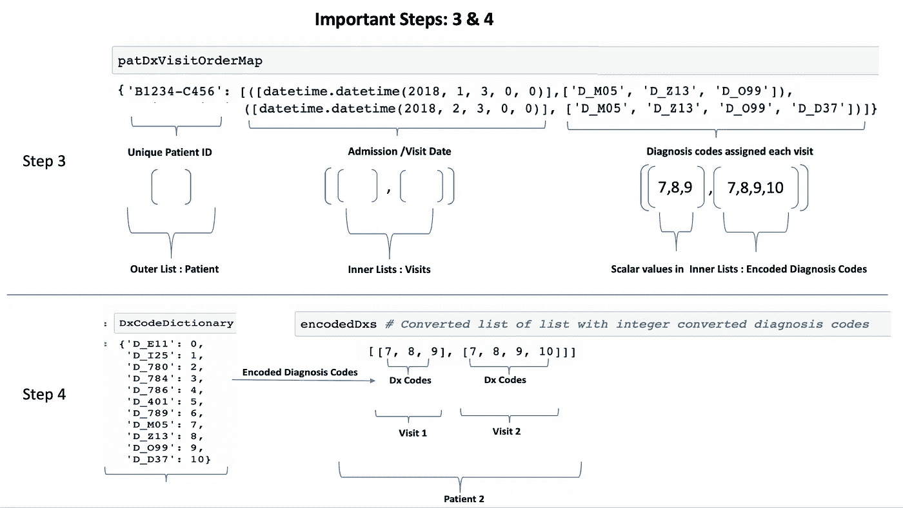

Patient Sequence Encodings

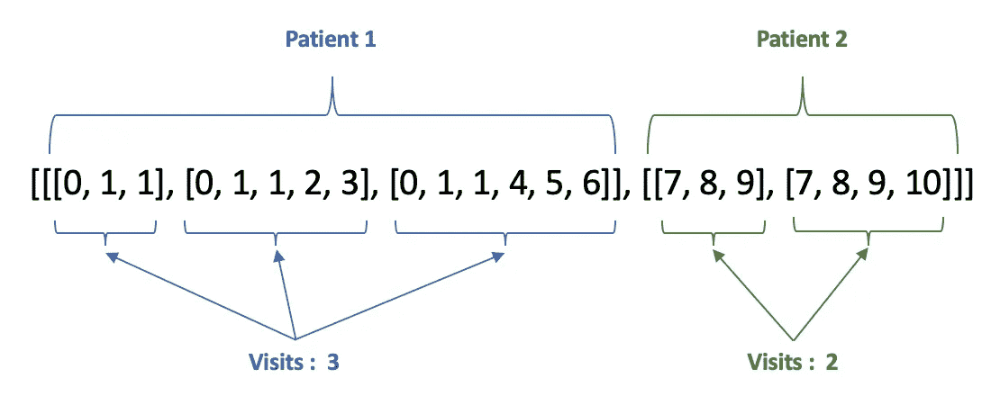

Python Pickled List of List containing patient visits and encoded diagnosis codes

## 那么我们到底用这个嵌套列表填充什么呢？

让我们分解填充函数:

1.  `lenghts = np.array([len(seq) for seq in seqs]) - 1`这里神秘地从长度中减去 1，在作者的笔记中，他提到`visit`和`label`文件必须匹配，因为算法会考虑推理时间的时间延迟。

这是什么意思？考虑到数据的结构，每个患者记录中的最后一次就诊将被删除。如此处所示:

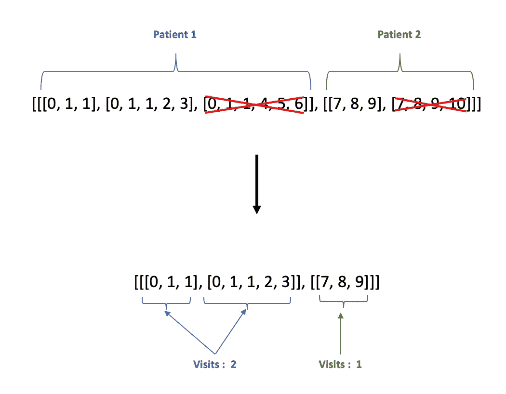

Removing the last visit for inference

## 旁白:在字符级 RNN 中处理可变长度序列

如果这是一个角色级别的问题，我们就说[ `Sparkle`、`Dorian`、`Deep`、`Learning`。这些序列首先按长度降序排列，并用零(红色)填充，其中每个字母代表一个令牌。如下所示:

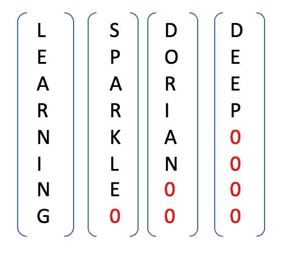

Variable length sequence padding

## EHR 数据:

然而，对于这种形式的 EHR 数据，给出了我们当前的问题，而不是每个编码的诊断代码代表一个唯一的令牌。在这种情况下，每次访问代表一个令牌/序列。因此，使用与字符级 RNNs 相同的方法，我们首先按照患者就诊降序排列每个小批量。在这种情况下，患者 1 具有最长的就诊历史，共有两次就诊，而患者 2 的就诊将被填充到最大长度 2，因为它是最长的序列。如下所示:

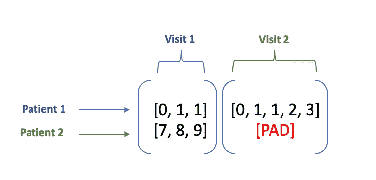

Padding EHR data

现在，我们已经解决了可变长度问题，我们可以继续对我们的序列进行多一热编码。这将产生所需的 S x B x I 尺寸(序列长度、批量大小、输入尺寸/vocab)。

在这里，我们可以很容易地看到，序列将代表每个小批量中就诊历史最长的患者，而所有其他人将被填充到这个长度(红色)。根据所需的批次大小，批次大小将代表每个时间步输入多少患者序列。最后，内部列表将被编码为词汇表的长度，在本例中是整个数据集中唯一诊断代码的数量。

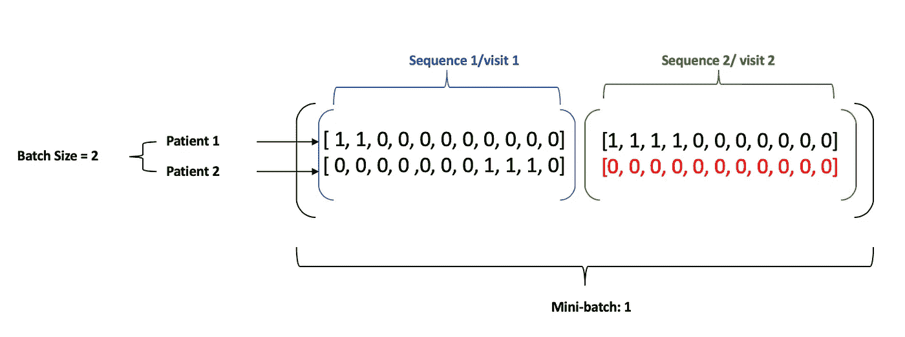

Multi-one hot encoded sequences

## 标签

以确保标签被移位一个序列，以便算法可以准确地预测下一个时间步长。作者通过确保训练数据排除每个患者历史中的最后一次就诊来解决这一问题，使用这种逻辑`for xvec, subseq in zip(x[:, idx, :], seq[:-1]):`，其中我们采用每个患者就诊记录`seq[:-1]`中除最后一次就诊之外的所有就诊。对于标签，这意味着序列将从患者的第二次就诊开始，或者按照 python 的索引风格，第一个索引`for yvec, subseq in zip(y[:, idx, :], label[1:])`，其中标签`label[1:]`移动一位。

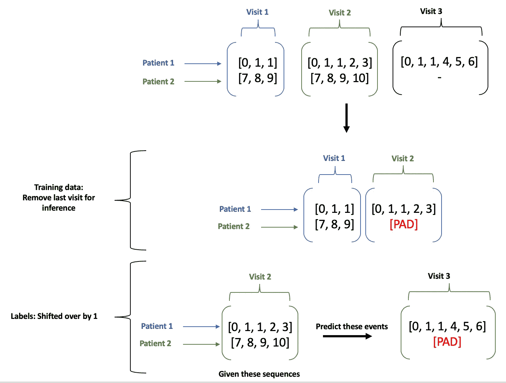

Label time step lag

## 什么是掩蔽，它有什么作用？

屏蔽允许算法知道真正的序列在 one-hot 编码数据中的位置，简单地说就是忽略/过滤掉填充值，在我们的例子中填充值为零。这使我们能够轻松处理 RNNs 中的可变长度序列，它需要固定长度的输入。是怎么做到的？还记得`lengths`变量吗？该变量以降序存储每个患者序列的有效长度(**回忆**:在移除每个记录中的最后一个序列以进行推断后，例如，患者 1 有 3 次就诊，但长度将仅反映 2 次)。然后，代码`mask[:lengths[idx], idx] = 1.`中的逻辑用 1 沿着行填充我们的归零张量，以匹配从最大到最小的每个患者序列的长度。

`lenghts_artificial → array([2, 1])`

`mask_artificial → tensor([[1., 1.], [1., 0.]])`

## 数据加载器和采样器

`Dataset`类是一个抽象类，表示 x 和 y 对中的数据。

`Sampler`类随机打乱训练集的顺序(验证集不会被随机化)。此外，它保留创建完整批次所需的准确序列数量。

`DataLoader`类结合了数据集和数据采样器，后者遍历数据集并抓取批处理。

## 嵌入层

在将输入数据呈现给 GRU 之前，`Custom_Embedding`类用于将高维多热点编码向量投影到低维空间。在这一步中，作者使用了两种方法

1.  随机初始化，然后在反向推进期间学习适当的 W(emb)W(emb)权重

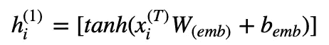

2.使用 Skip-gram 算法初始化预训练嵌入，然后在 back-prop 期间优化权重

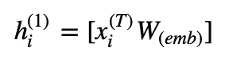

在本文的实现中，我们使用了第一种方法。因此，创建了`Custom Embedding`类来在嵌入层上应用 tanh 激活。

Custom embedding Layer

## 脱落层

在本文中，作者使用了由 [Srivastava (2014)](http://jmlr.org/papers/volume15/srivastava14a.old/srivastava14a.pdf) 首次引入的辍学的简单应用。虽然这种方法效果很好，但它影响了 RNNs 保持长期相关性的能力，因为我们没有在每个时间步长保持相同的掩码。为什么这很重要？很简单，如果我们在每个时间步随机采样一个新的掩码，它会干扰我们的 RNNs 连接，使网络难以确定哪些信息可能是长期相关的。在这种方法中，我测试了 Gal & Ghahramani (2016)提出并由 [Merity (2017)](https://arxiv.org/pdf/1708.02182.pdf) 进一步开发的 LSTMs 技术。在这里，他们提出通过在 LSTMs 中的多个时间步长上使用相同的漏失掩码来克服上述与随机采样相关的问题。在这里，我将应用相同的方法在每层(两层)之间的 GRU 上。

Dropout Layer

## 艾医生:通过递归神经网络预测临床事件

尽管 LSTMs 很受欢迎，也很受青睐。本文使用了 GRU 架构，因为它简单并且能够获得与 LSTMs 相似的性能。本文中使用的数据集包含`263, 706 patients`，而我们的数据集(MIMIC III)总共包含`7537 patients`。然而，作者证明了在一个医院系统缺乏训练像 AI 博士这样的深度学习模型所需的大规模数据集的情况下，迁移学习可能是一个可行的选择。使用以下架构，我的兴趣在于对患者未来诊断代码的预测。然而，人们可以很容易地推断出该算法来预测诊断和就诊间隔时间。

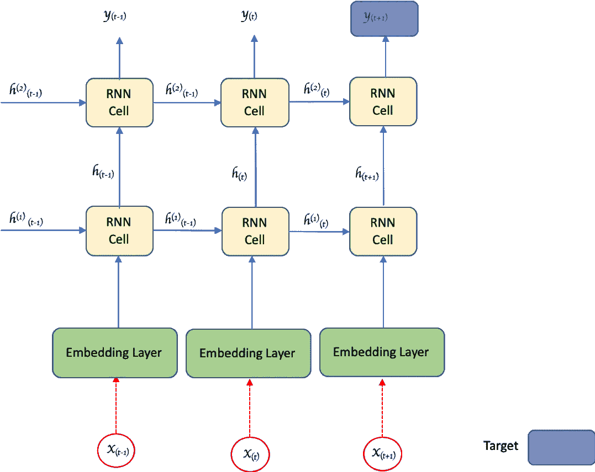

Model Architecture

## GRU 层:

这个类使用了`EHR_GRU`单元格类，并允许在期望的层数上迭代。

## 损失函数:

用于评估模型性能的损失函数包含交叉熵的组合。每个小批量的预测损失被标准化为序列长度。最后，L2 范数正则化应用于所有的权重矩阵。

## 模型参数:

这里使用的参数选自 AI 博士论文中使用的参数。这种方法和我在这里介绍的方法之间的主要区别是，我对 RNNs 使用了更新的 drop out 方法。

num class = 4894
input dimsize = 4894
embSize = 200
hiddenDimSize = 200
batch size = 100 num layers = 2

## 加载数据:

需要注意的是，您希望将序列和标签的同一个文件传递到`load_data`函数中，因为模型会在内部负责调整预测的时间步长。

## 训练和验证循环

## 我的实现与论文算法的比较:

我在论文的算法上运行了相同的序列，这是用 theano 和 python 2.7 编写的，这里可以看到 10 个时期后的最佳交叉熵分数约为 86.79，而 my 为 107。虽然，通过一些超参数调整和优化，我并没有表现得更好，但算法肯定会表现得更好。

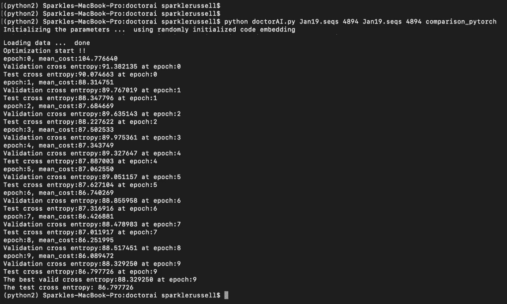

Dr. Algorithm results for comparison

## 观察结果:

正如你所看到的，我们的训练和验证损失几乎是一样的，实际论文中使用的数据是如此之少。如果不过度拟合，可能很难获得更好的性能。然而，本教程的目的是提供一个如何使用 EHR 数据驱动洞察力的详细演练！

## 完整脚本

## 后续步骤:

1.  使用 Fast 添加回调。人工智能的回调方法来跟踪训练数据
2.  尝试不同的初始化方法

## 致谢:

1.  Fast.ai(雷切尔·托马斯、杰瑞米·霍华德和令人惊叹的 fast.ai 社区)
2.  多里安·普勒里