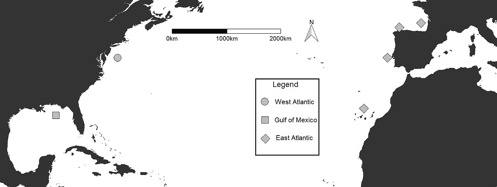
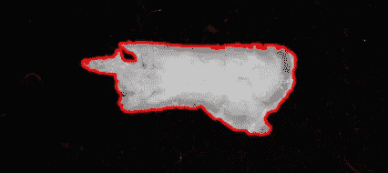
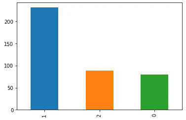
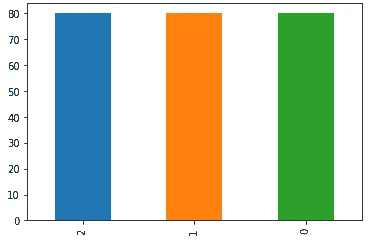
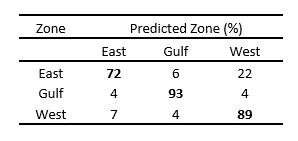

# 使用随机森林模型预测鱼类样本的地理来源

> 原文：<https://towardsdatascience.com/predicting-geographic-origin-for-fish-samples-using-random-forest-models-3a0f791d0f5c?source=collection_archive---------24----------------------->

## 机器学习概念如何支持渔业管理



**问题**

我试图展示一种分析的效用，这种分析根据鱼的耳骨形状，对来自特定物种的鱼样本进行分组。基本概念是，特定种类的鱼，比如鳕鱼，有独特的耳骨形状，可以用来识别它们来自哪个地理区域。我想展示我设计的特征能多好地预测每个样本的地理来源；本质上，这项技术有合适的预测能力吗？

**数据收集**

你可能会问，如何量化耳骨的形状？我用离散小波变换(类似于常用的傅立叶变换)用余弦波来描述每块骨头的轮廓形状(图 1)。这种转换给了我 64 个系数来描述每条鱼耳骨的形态差异，这是我们的特征。



Figure 1: Ear bone and the derived outline using a Wavelet transformation

*回应:地理起源*

*特征:描述骨骼形状的小波系数*

**数据处理**

我在不同的人群中进行了不平等的抽样调查；在不涉及生物学细节的情况下，我需要在没有人口统计学细节(如长度、年龄等)的情况下，分离出地理来源对骨骼形状的影响。)促成关系。我使用重复的 ANCOVAs 来消除人口统计变量随地理区域显著变化的特征，并应用 Bonferonni 调整来最小化重复分析中第一类错误的累积。

```
# function that will derive the p value for covariates
ancova.pvalues <- function(resp, pred, cov){
  return(unlist(summary(aov(resp~pred*cov)))['Pr(>F)3'])
}# apply to each feature (given predictor of region (pops) and covariate of length)
p.values<-0 # stores values
for (i in 1:length(colnames(Wavecoefs))){
  p.values[i]<-ancova.pvalues(unlist(Wavecoefs[i]), pops, length_cm)
}
which(p.values<0.05) # which features should we omit
```

有些特征是偏斜的，所以我对那些偏斜度大于 0.75 的特征应用了 box cox 变换。

很少功能包含 NAs 我用每个特性的平均值代替了 NAs。

我使用方便的方法“train_test_split”将数据集分为训练集和测试集，分别使用 80%和 20%的数据。

```
from sklearn.model_selection import train_test_split
train_X, test_X, train_y, test_y = train_test_split(df, resp, random_state = 0, test_size=.2)
```

我的响应变量——地理区域——是不均衡抽样的(图 2)。我想展示我设计的功能可以预测来自多个不同地区的鱼的原产地，并且我想最小化样本大小的变化对模型预测的影响。为此，我随机对最常见的类(海湾，蓝色)进行欠采样。



Figure 2: Sample size for each geographic region (1-Gulf of Mexico, 2-West Atlantic, 0-East Atlantic)

包不平衡学习为此提供了一些有用的方法；我使用“RandomUnderSampler”来创建一个更加平衡的训练数据集，以便在其上拟合我的模型(图 3)。

```
from imblearn.under_sampling import RandomUnderSamplerrus = RandomUnderSampler(return_indices=True)
X_rus, y_rus, id_rus = rus.fit_sample(train_X, train_y)
```



Figure 3: Sample size for each geographic region after undersampling

**建模**

鉴于描述骨骼形状的特征，我使用随机森林分类器来预测样本来自的区域。首先，我确定了最佳超参数值:

*max_features* :每次分割要考虑的最大特征数

*max_depth* :任意树的最大分割数

*min_samples_split* :分割一个节点所需的最小样本数

*min_samples_leaf* :每个叶节点所需的最小样本数

*自举*:数据集是自举还是整个数据集用于每棵树

*标准*:用于评估每次分割质量的函数

```
max_features = [‘auto’, ‘sqrt’, ‘log2’]
max_depth = [int(x) for x in np.linspace(10, 110, num = 11)]
max_depth.append(None)
min_samples_split = [2, 5, 10]
min_samples_leaf = [1, 2, 4]
bootstrap = [True, False]
criterion= ['gini', 'entropy']
grid_param = {'max_features': max_features,
               'max_depth': max_depth,
               'min_samples_split': min_samples_split,
               'min_samples_leaf': min_samples_leaf,
               'bootstrap': bootstrap,
               'criterion':criterion }
```

sci-kit 学习模块有一个简便方法“GridSearchCV ”,可以通过交叉验证找到最佳的超参数值。我用了 5 折的 k 折交叉验证。

```
from sklearn.model_selection import GridSearchCVgd_sr = GridSearchCV(estimator=RFC, param_grid=grid_param, scoring=’accuracy’, cv=5,n_jobs=-1)gd_sr.fit(X_rus, y_rus)  
print(gd_sr.best_params_)
```

在确定了最佳超参数之后，我用我的机器可以在相对较短的时间内计算的最大数量的树来拟合模型。

```
Best_RFC=RandomForestClassifier(n_estimators=8000,max_features=
’auto’, max_depth=20,min_samples_split=5, min_samples_leaf=1, bootstrap=True, criterion=’gini’)# fit best model to training dataset
Best_RFC.fit(X_rus, y_rus)
```

最后，我从测试集中预测了鱼样本的来源，并计算了模型的准确性:

```
# predict test Y values
ypred=Best_RFC.predict(test_X)from sklearn import metricsprint(“Accuracy:”,metrics.accuracy_score(test_y, ypred))
```

该模型以 89%的准确率预测了测试集中每个样本的地理来源。我的预测准确率高于对相似鱼类物种起源进行分类的研究。这项工作受到样本量小的限制；我研究的物种不常被捕获。

分类矩阵让我们深入了解模型预测如何与观察到的类别相关联。



随机森林模型预测来自墨西哥湾的鱼类样本比来自东大西洋和西大西洋的样本更准确。这表明墨西哥湾的骨骼形状比其他地区更独特。

这个练习展示了机器学习概念在渔业科学中的价值，以及它们使用我建议的技术预测鱼类样本来源的能力。鉴于样本量较小，我认为我设计的特征提供了很强的预测能力。

我感谢任何反馈和建设性的批评。与该分析相关的代码可在[github.com/njermain](https://github.com/njermain)上找到