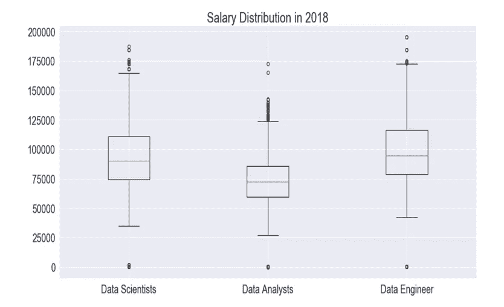
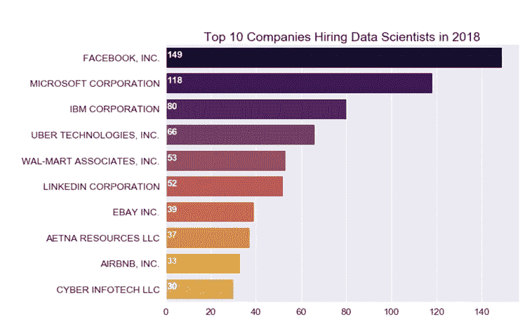
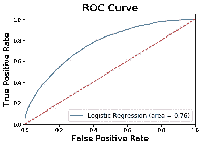
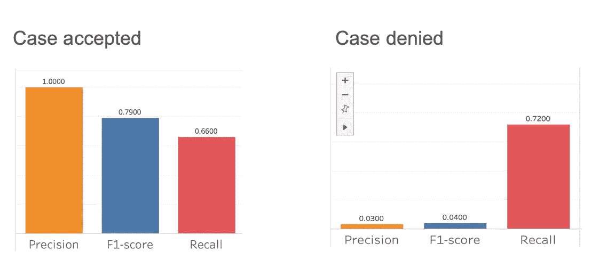
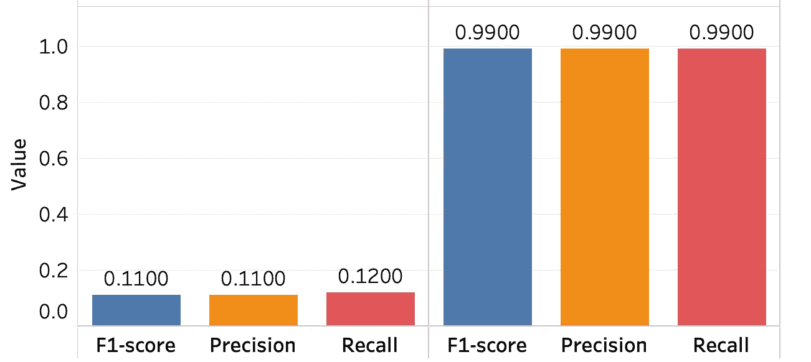
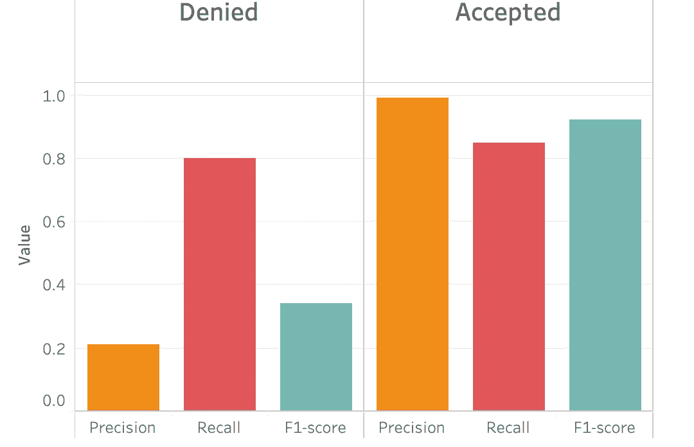
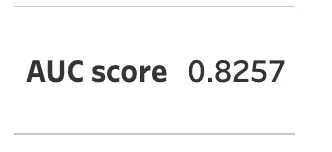

# 使用随机森林预测 H-1B 状态

> 原文：<https://towardsdatascience.com/predicting-h-1b-status-using-random-forest-dc199a6d254c?source=collection_archive---------20----------------------->

当我在做这个项目的时候，我很惊讶我数据科学课程的很多同学都不知道什么是 H-1B 签证。我的简单解释是——H-1B 签证项目允许外国工人在有限的时间内为美国的公司工作。为了让一些从未办理过签证的技术发烧友更感兴趣，我补充道，塞特亚·纳德拉、桑德尔·皮帅和埃隆·马斯克曾持 H-1B 签证移居美国。我希望这个项目能给美国人带来更多的意识，这只是签证的一种。

**项目背后的故事**

我经常想，是什么让我在其他数据科学家中成为一名优秀的数据科学家。我意识到我的优势在于我的多元化背景，我可以提出正确的问题，并对不同背景、性别和种族的人深表同情。这是我想带到现场的东西，这样数据可以代表每个人，对每个人都有益。

我做这个项目的主要原因是，三年前我持 H-1B 签证从哈萨克斯坦来到西雅图。这是一个极其不确定、漫长且昂贵的过程，我甚至不打算在这里解释所有的步骤。相反，我决定采取行动帮助其他 H-1B 申请人。我用机器学习(ML)预测了签证被接受的概率。利用创建的 ML 模型，我创建了一个应用程序，申请者可以输入信息并立即获得结果。

# **这不是你的模型，这是你的数据集**

***第一个数据集***

这个项目最困难的部分是选择数据集。我使用的初始数据集存储在 Kaggle 中。

让我们回顾一下我是如何发现我的第一个数据集不起作用的几个步骤。

**我的目标:**确定申请是否被拒绝/接受。

我的第一个数据集包括以下特征:

*   提交的完整日期(包括日/月/年)
*   工资
*   雇主信息
*   行业信息
*   依赖性(丈夫/妻子)
*   违规历史

我收集了 2016 年至 2018 年的 H-1B 申请。

***EDA***

在开始预测建模之前，我做了一些有趣的 EDA，这与技术行业的数据科学家有关。

Graph 1

*图 1* :数据科学的工作岗位主要有三种:数据科学家、数据分析师、数据工程师。根据这三个职位的 H-1B 申请人的工资分布，数据工程师的年收入最高。

Graph 2

图表 2:上面的柱状图代表了 2018 年雇佣数据科学家最多的十家公司。这是一个很好的求职数据科学家指南。

**特征工程**

我的数据集有许多分类变量，因此在将我的数据拟合到模型中之前，我总结了几个步骤:

*   创建虚拟变量
*   创建工资类别(非常低、低、中、高、非常高)
*   至于工业，我划分了科技和非科技工业
*   分开的年、日和月

**分类建模**

在探索了逻辑回归、XGBoost 分类和随机森林之后。我的首选是随机森林，原因如下:

*   我的数据集有很多例子和特征
*   与其他模型相比，随机森林通常会给出更准确的结果
*   对于不平衡类学习有一个包-平衡随机森林分类，自动平衡类。
*   我能够通过调整最大深度和估计器的数量来改进我的模型。

AUC = 0.76 for Random Forest

随机森林模型给我的 AUC 值是 0.76。 **AUC** 的取值范围从 0 到 1。AUC 值越高，模型越准确。

除了高 AUC 分数，即使在使用平衡随机森林分类器后，我对该数据集的精度和召回率也是不平衡的。

我试图改变接受和拒绝类的阈值，但它似乎不起作用。但这是我拿到的最高 f1 分。

在仔细评估我的模型后，我意识到问题出在我的特征上，我需要更多关于每个申请人的信息。

***第二数据集***

在对一个数据集做了更多的研究后，我发现在 https://www.foreignlaborcert.doleta.gov/performancedata.cfm[上，OFLC(外国劳工认证办公室)提供了 H-1B 申请人的完整披露数据。](https://www.foreignlaborcert.doleta.gov/performancedata.cfm)

我添加了以下功能:

*   职称
*   教育专业
*   教育水平
*   国籍
*   多年的经验

我使用与第一个数据集中相同的参数运行了平衡随机森林分类器，结果显著改善:

AUC 评分也有所改善:

***汇总***

使用第二个数据集，我能够提高我的分数，但是被接受的类的精度和 F1 分数仍然没有被接受的类高。我在 Flask 应用程序中实现了该模型，并将其部署到 Heroku 中。我有一个演示版本，我还在努力使它对人们更有用。你可以通过输入你的信息来尝试一下。

赫尔库 App:[https://afternoon-sea-49094.herokuapp.com/](https://afternoon-sea-49094.herokuapp.com/)

GitHub 库:[https://github.com/AisOmar/H1B_predict](https://github.com/AisOmar/H1B_predict)