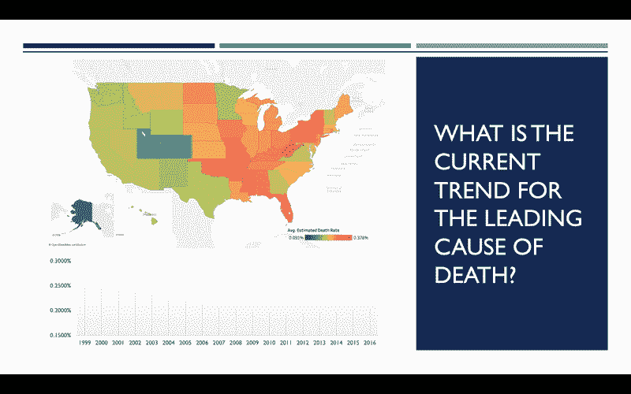

# 预测心脏病死亡率

> 原文：<https://towardsdatascience.com/predicting-heart-disease-mortality-2320fa759f81?source=collection_archive---------29----------------------->

## 构建可以识别 2019 年高危状态的机器学习模型。

根据疾病控制中心的数据，“美国每年大约有 610，000 人死于心脏病，也就是说每 4 个人中就有一个。”阅读这篇文章的人不可能没有受到这种疾病的影响。今年早些时候，年仅 57 岁的我失去了一位家人。其原因已被很好地记录和理解，但它仍然是美国的主要死亡原因。在这方面，公共政策的改变有可能有助于拯救生命吗？

通过建立一个机器学习模型来预测各州的心脏病死亡率，我们应该能够确定哪些州已经有效地降低了这些死亡率。如果是这样的话，我们就有希望将这些政策原则推广到其他国家。

## 史料

自 1999 年以来，疾病控制和预防中心每年都会公布心脏死亡率和其他 T2 主要死因的数据。通过跟踪每个州相对于人口的死亡人数，我们可以看到死亡率在过去的 20 年中一直呈下降趋势。

正如我们所见，这一趋势似乎在 2011 年趋于平稳，可能是由于人口老龄化。

## 心脏病的主要原因

在进行了一些一般性研究后，确定了对心脏病有重大影响的四个主要因素:

*   [年龄](https://www.cdc.gov/nchs/nvss/bridged_race.htm)
*   [性别](https://www.cdc.gov/nchs/nvss/bridged_race.htm)
*   [酒精消耗](https://pubs.niaaa.nih.gov/publications/surveillance110/tab4-1_16.htm)
*   [吸烟率](https://www.americashealthrankings.org/explore/annual/measure/Smoking/)

通过对每个预测变量与目标进行简单的线性回归，我们可以开始了解哪些因素具有最显著的影响。

从这里，我们可以看到人口统计学似乎对心脏病有最大的影响，75-79 岁年龄段是主要的预测因素。也许更令人惊讶的是，随着男性在人口中所占比例的增加，心脏病死亡率下降了。这是否意味着男性不易患心脏病？不一定，但它似乎表明女性更有可能死于它。疾病预防控制中心认为意识是这方面的首要因素，

> 尽管在过去几十年中人们的意识有所提高，但只有大约一半(56%)的女性认识到心脏病是她们的头号杀手。

此外，女性往往会经历更广泛的症状，这可能会导致她们意识不到自己患有心脏病。

另一个令人惊讶的结果是，饮酒似乎与心脏病死亡率没有预期的那么大关联。事实上，对数据的初步审查似乎表明，葡萄酒消费量的增加与死亡率的降低相关。然而，这里有一个警告，葡萄酒消费也被发现与吸烟率呈负相关。由于吸烟确实与心脏病有很强的正相关性，因此有理由认为不是酒，而是较低的吸烟率导致了较低的死亡率。

## 定义变量

自然，对心脏病的预测需要建立在前期数据的基础上，并有充分的准备时间。换句话说，如果我们想预测 2019 年的结果，需要基于 2018 年及之前的数据。为了分析的目的，使用了 3-5 年的时滞。换句话说，如果预测 2016 年，我们使用 2011-2013 年的数据。

风险水平是基于历史心脏病发病率的总和。如果预测的比率在所有观察到的比率的 33%以下，我们将其标记为低风险。反之，如果是在 33%以上，就是高风险。

## 构建机器学习模型

有了这些信息，我们现在可以开始构建模型了。总的来说，六种模型架构的 1413 个变体应用于使用 5 重交叉验证的数据的 80%子集。将每个模型应用到测试数据中，我们可以测量准确性并比较不同架构的有效性。

这里，我们可以看到支持向量机模型能够实现 91.7%的 f1 得分。下面是一张显示 2019 年预测的地图，其中九个州被确定为高风险。

最引人注目的是该国中部高风险州的聚集，尽管不能确定这是否是巧合。

值得注意的是，该模型预测，从 2016 年到 2019 年，六个州的风险水平将发生变化，如下图所示。

正如我们所看到的，俄克拉荷马州、密歇根州和宾夕法尼亚州不再被预测为高风险州。然而，田纳西州却反其道而行之，从中等风险到高风险。但是有一种状态特别有趣。

## 俄克拉何马州

2016 年，俄克拉荷马州观察到的心脏病死亡率将其归入高风险类别，但我们的模型预测它在 2019 年是低风险的。当我第一次看到这个的时候，我认为这是一个错误。一个国家如何能在如此短的时间内如此大幅度地降低其风险水平？事实证明，有强有力的证据支持这一预测。

经过更仔细的检查，很明显这一变化的原因是吸烟率从 2010 年的 25.5%下降到 2015 年的 19%左右，创历史新低。

该州卫生与公众服务部部长特里·克莱恩将这一下降归因于该州的禁烟令。结合认证健康俄克拉荷马计划，激励商业地产做同样的事情，结果成为焦点。

## 推荐

这项研究的发现为想要降低心脏病死亡率的州指出了两个简单的策略。

*   效仿俄克拉荷马州，在公共场所实施禁烟令。
*   开展针对女性和退休人员的心脏病宣传活动。

城市中的提高认识运动可能最有效，因为妇女往往占人口的较高比例。虽然还有更多的事情可以做，但我希望这一分析能够为今后的一些初步步骤提供一些思路。

## 资源

这篇文章改编自我几个月前写的一篇关于这个话题的技术文章。如果你想知道更多关于准则和策略的细节，请参考它。

该分析是使用 Jupyter 笔记本和相关库进行的。包含所有代码和数据的库可以在 [GitHub](https://github.com/rwilleynyc/heart_disease_mortality) 上找到。