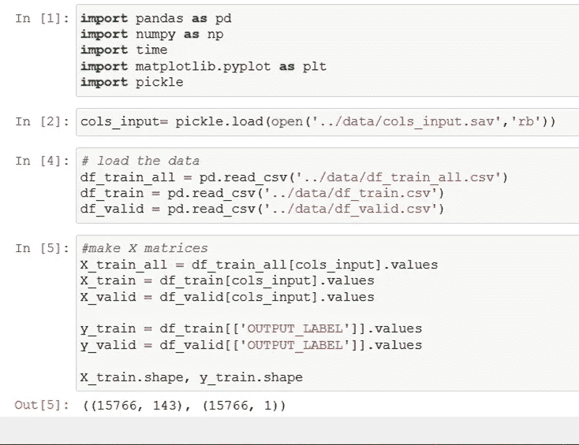
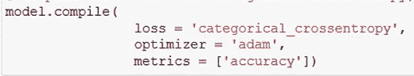

# 从零开始利用深度学习和 Keras 预测医院再入院

> 原文：<https://towardsdatascience.com/predicting-hospital-readmission-with-deep-learning-from-scratch-and-with-keras-309efc0f75fc?source=collection_archive---------27----------------------->

## 让我们使用深度学习来识别有再次入院风险的患者！

# 介绍

最近，我看了我的朋友 [Eric Ma](https://www.linkedin.com/in/ericmjl/) 关于深度学习基础的视频。为了教授深度学习，他将其分为 3 个关键部分:模型、损失函数和优化例程。在整个教程中，他使用了一个自动微分工具箱。然而，我发现自己做导数是非常令人满意的(至少对于简单的情况)。今天，我想按照 Eric 的方法从头开始构建一个 2 层神经网络，但使用代数导数(来自吴恩达的 Coursera [class](https://www.coursera.org/learn/neural-networks-deep-learning) )，然后使用 Keras(一个深度学习框架)再次实现它。

# 数据集

对于这个项目，我们将使用与我上一篇关于预测医院入院的文章相同的数据集，该数据集来自 UCI 的糖尿病医院数据集([https://archive . ics . UCI . edu/ml/datasets/diabetes+130-us+hospitals+for+years+1999-2008](https://archive.ics.uci.edu/ml/datasets/diabetes+130-us+hospitals+for+years+1999-2008))。关于这个项目和功能工程的回顾，请参见我之前的帖子[https://towards data science . com/predicting-hospital-re-admission-for-patients-with-diabetes-using-scikit-learn-a 2e 359 b 15 f 0](/predicting-hospital-readmission-for-patients-with-diabetes-using-scikit-learn-a2e359b15f0)

# 项目定义

预测糖尿病患者是否会在 30 天内再次入院。

# 特征工程

我们将开始这篇文章，就好像我们已经完成了我上一篇文章的特性工程部分，其中包括创建数字、分类(一键编码)和顺序特性。这些功能方便地保存在以前的笔记本中，并包含在我的 [github repo](https://github.com/andrewwlong/diabetes_readmission_deep) 中。

对于深度学习来说，重要的是填充缺失值并对数据进行归一化。我们将从 scikit-learn 中使用 SimpleImputer 和 StandardScaler 来做这件事。

# 从头做起

这里，我们将使用 Eric Ma 介绍的结构从头开始构建一个简单的两层神经网络:

*   模型
*   损失函数
*   优化程序

我会尽量坚持吴恩达在他的 Coursera specialization([https://www.coursera.org/specializations/deep-learning](https://www.coursera.org/specializations/deep-learning))中介绍的符号。

# 模型

我们将使用的模型是一个双层神经网络，如下所示:

这里我们将有 n_x 个输入变量、n_1 个隐藏节点和一个包括 m 个样本的输出节点。对于这个模型，我们将对隐藏层节点和输出层中的激活函数使用逻辑回归。

这里，我们的激活函数将具有以下形式

为了更有效地计算，我们将使用矢量化记号。在这种表示法中，X 的第一列将是第一个样本的所有特征(注意，这与 Python 中此时加载的内容相反，因此我们需要转置 X 矩阵)。

我们将用于该模型的参数将具有以下维度

为了简单起见，让我们选择 n1 = 64 个节点来近似地将输入变量的数量减半。按照 Eric 的符号，让我们将所有这些参数保存在一个字典中。我们将随机初始化这些，因为设置为 0 将不起作用，因为节点与节点之间的权重都是相同的。

为了计算我们的`m`示例中 y_hat 的估计值，我们可以使用下面的等式通过模型向前馈送信息(注意维度在花括号中)。

我们可以用下面的前馈函数来编写代码。这里我们将隐藏层的激活函数作为函数的变量。

# 损失函数

现在我们有了一个给定一些参数计算 y_hat 的方法，我们需要找到“最佳”参数。为了定义“最佳”，我们需要一个成本函数来定义参数有多好。我们用于二元分类的损失函数是:

很明显这是从哪里来的，对吗？

我更愿意看看这是从哪里来的，所以让我们绕一小段路，推导出这个方程。如果我们把我们模型的输出看作给定 x 的 y 的概率，我们可以为一个例子写如下:

可以更巧妙的写成:

如果我们假设所有样本都是独立的，那么看到所有数据的可能性就是个体概率的乘积:

现在我们要做的就是找到最大化这种可能性的参数。这听起来很复杂，因为有产品术语。幸运的是，最大化似然函数的对数也最大化了似然函数(因为对数是单调增加的)。在我们这样做之前，让我们提醒自己关于日志的属性:

应用于我们的似然函数，我们得到:

这已经接近我们的成本函数了！唯一的区别是我们乘以-1，然后除以 m(样本数)。负乘法将它从最大化问题转换到最小化问题。

对于我们的优化程序，我们将需要这个成本函数`J`的导数。Eric 用 python 包 jax.grad 完成了这个任务

`dlogistic_loss = grad(logistic_loss)`

但是我想把它明确地写出来，以便更好地理解数学。

为了做这个导数，我们实际上在我们的神经网络中从右向左工作，这个过程被称为反向传播。我们可以用导数的基本原理做到这一点:链式法则！

在我们深入研究这个之前，让我们先来看一些我们将要用到的函数导数

和线性

由于我们的成本是对每个样本求和的，现在让我们从计算中去掉每个样本的符号(和 1/m 乘数)。这里我们将使用吴恩达的简写符号和定义

现在，我们可以对输出层中的参数求导(并适当考虑矩阵数学):

在网络中向后移动并考虑任何激活功能`g^[layer](Z[layer])`。这里`*`代表元素级乘法，因为我们对单个样本使用链规则，所以它开始起作用。

正如你在这里看到的，有一个清晰的模式，允许我们将其扩展到任意数量的隐藏层。

现在让我们编写反向传播函数，它将参数、激活函数的导数函数、前馈值和输出值作为输入。

这里`d_logistic`是逻辑函数相对于`z`的导数。

此时，最好验证我们的参数和 d_params 对于每个参数集具有相同的形状。

# 优化程序

我们将使用梯度下降来更新我们的参数。梯度下降基本上通过将梯度的相反方向移动学习量`alpha`来迭代更新参数。我们可以在 for 循环中运行这个函数，并记录损失。注意 tqdmn 允许我们用一个进度条来查看进度(有点整洁，谢谢 Eric！).

我们可以验证损耗随着迭代而减少:

然后，我们可以计算训练集和验证集的预测值:

使用 scikit-learn 指标，我们可以绘制 ROC 曲线:

这种临时模型的训练非常缓慢。让我们使用 Keras，它有额外的更有效的优化例程，如 Adam。Keras 也非常适合用几行代码构建更复杂的网络。

# 克拉斯

首先让我们导入一些包

我们需要稍微调整一下 Keras 的输出标签，使每个标签都有一列:

现在我们可以使用序列来构建我们的模型。在这里，我将使用 ReLu 激活函数，而不是逻辑函数，因为 ReLu 往往工作得更好。我还会添加辍学，这是一种正规化的形式，有助于减少过度拟合。

这里，最终的输出层有两个节点(每个标签一个)。使用 softmax 函数将这些输出标准化，以将分数转换为概率。

然后，我们用指定的损失函数和优化器来编译模型。这里‘分类交叉熵’是上面定义的损失函数的公式。这也可以扩展到包括任意数量的结果

现在我们用这个模型

这里有两个输入参数`batch_size`和`epochs`包含在拟合中。批量大小表示每次迭代中使用的样本数量。在我们的临时实现中，我们在每次迭代中包含了所有的样本，这需要更多的时间来计算。如果您用较小的批处理运行计算，您就能够更快地迭代。Epoch 被定义为在将整个数据集分成更小的批次后迭代整个数据集的次数。

与 scikit-learn 类似，我们使用 predict proba 获得预测，并只获取第二列:

我在隐藏层、丢弃率和附加层中试验了不同数量的节点。最终模型的验证 AUC = 0.66，如以下 ROC 所示:

不幸的是，这与我们在前一篇文章中训练的所有其他模型具有相同的性能！

# 结论

在这篇文章中，我们用 Keras 从头开始训练了一个 2 层神经网络。如果你有任何问题，请在下面评论。代码在我的 github 回购上:【https://github.com/andrewwlong/diabetes_readmission_deep 