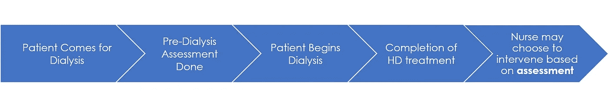
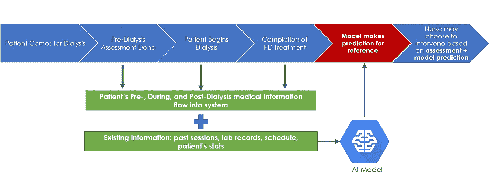
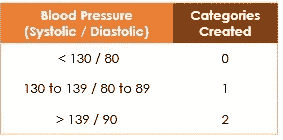
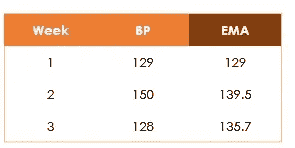
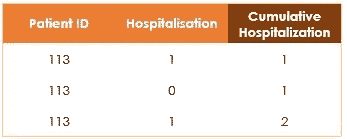

# 人工智能预测肾透析患者的住院情况

> 原文：<https://towardsdatascience.com/predicting-hospitalisation-of-kidney-dialysis-patients-with-ai-88e57007193d?source=collection_archive---------34----------------------->

Photo by [Robina Weermeijer](https://unsplash.com/@averey?utm_source=medium&utm_medium=referral) on [Unsplash](https://unsplash.com?utm_source=medium&utm_medium=referral)

在 AI Singapore (AISG)的 100 个实验项目中，我和我的徒弟被分配到一家区域性肾透析公司工作，开发一个可以预测病人住院情况的人工智能模型。这是我们[人工智能学徒计划(AIAP)](https://www.aisingapore.org/industryinnovation/aiap/) 的一个关键组成部分，在那里我们着手解决现实世界的人工智能行业问题。我们的模型作为决策支持工具，帮助肾透析公司的医疗团队实现了 36%的更高精确度(即更少的假阳性)。它目前部署在他们的透析中心。

在这篇文章中，我将分享开发我的第一个医疗人工智能模型的关键挑战、过程和见解。

## 好的……你为什么对预测透析患者的住院率感兴趣？

接受透析的患者具有更高的发病率和住院的高风险。当他们住院时，他们的健康状况通常已经完全恶化，他们的死亡风险也会增加。预测住院风险的能力将允许早期医疗干预。

尽管对住院治疗的关键预测因素进行了研究，但目前的过程是模糊的，并且依赖于医务人员的经验。

The current process of hospitalisation prediction

由于从每个患者透析之前、期间和之后收集了大量数据，因此有可能使用这些数据来训练一个预测患者住院情况的人工智能模型。该模型的预测可用于医疗团队的决策支持。

Envisioned future of hospitalisation prediction, with AI-model as decision-making support

## 你只需要把那些医疗数据输入到模型中？

不。我们需要把原始的医学数据预处理成对模型有用的东西。

我们站在医学专业人士的角度，问自己:医生如何评估病人的住院风险？从这个思考过程中，我们了解到我们可以教授医学知识，并向模型提供病人的病史。

我们可以通过将医学研究整合到我们的数据中，将医学知识传授给我们的模型。

对于患者的病史，我们必须找到在不丢失过多信息的情况下聚合患者医疗参数的方法。如果病人的医疗参数正在恶化，通常预示着一个严峻的前景。这也是我们希望我们的模型知道的。

## 酷…你是怎么把医学知识教给模特的？

在给我们的原始数据集中，大多数医疗参数读数只是数字，没有任何数值意义。

大多数医疗参数都有健康范围指南。例如，患有高血压的个体的血压高于 140/90 mmHg。为了给原始血压数据赋予意义，我们将其转换为 0、1、2 或 3 类，分别代表低血压、健康血压、高血压前期血压和高血压。

Features Engineering: Categorising medical information to embed medical domain knowledge

我们通过将其他医学参数转换成已建立的类别来做同样的事情。

## 以及合并患者医疗信息的历史？

我们根据数据类型采取了不同的方法。

对于连续变量，如患者的血压，我们使用了 12 个周期的指数移动平均(EMA)。这是一个滑动窗口，取 12 个最近的读数并计算平均值，较新的数据权重较高。

Feature Engineering: Using exponential moving average to aggregate time-series data

为什么是 12？在透析治疗中，每位患者每周将接受 3 次治疗。周期 12 意味着取过去 1 个月透析数据的平均值。

对于离散变量，如过去的住院次数，我们创建了一个“累积计数”栏，记录患者住院的次数。患者每住院一次，我们就将累计计数增加 1。

Features Engineering: Calculating the cumulative sum of events to embed patient’s history

这是基于[医学文献](https://academic.oup.com/ndt/article/29/2/442/1910911)的发现，过去的住院次数是未来住院的一个强有力的预测因素(一个经常住院的患者意味着他的病情更严重，因此未来住院的可能性更大)。

## 你的项目有什么有趣的发现吗？

我们尝试使用 NLP(自然语言处理)从医生写的病人出院笔记中提取信息。我们认为向模型提供这些额外的信息会提高它的性能，但是我们错了，模型的性能并没有提高。

我们的假设是，患者出院记录中包含的任何信息都已经存在于患者的医疗参数中。例如，如果医生要在出院记录中注明“高血压”，他必须参考病人的血压读数。

此外，由于需要额外的数据处理，将 NLP 添加到模型中会显著降低模型性能。我们最终决定在最终的人工智能模型中排除病人的出院记录。

## 怎么知道自己的模型够不够好？

我们没有。每个人都想要一个完美的模型，尤其是医学专业人士。这是理所当然的。他们担心假阴性和假阳性结果。这些错误的结果将对患者的医疗结果产生负面影响。

## 你是如何说服医疗团队实施你的模型的？

我们很有创意。我们没有设定一个任意的基准，而是与医疗团队一起提出了一个模型验证练习。如果我们的模型可以让医疗团队做出更好的预测，那么部署我们的模型将有助于患者。

在一个月的时间里，医疗小组评估病人并预测哪个病人将住院。我们对我们的模型做了同样的事情。然后，我们将我们的预测与患者的实际住院情况进行了比较。

统计结果后，我们的人工智能模型的精确度提高了 36%。这意味着使用我们的模型作为决策支持工具将有助于肾透析公司的医疗团队做出更少的假阳性预测。

## 哦不！有什么不好的事情发生吗？

不。相反，在模型验证期间，一些积极的事情发生在病人身上。

与模型验证期之前的平均住院率相比，患者的住院率显著下降。这是即使医疗团队不知道我们的 AI 模型的预测。

在模型验证期之后，平均住院率会回升到原来的平均住院率。因此，该事件不太可能是由于随机性或其他混杂因素造成的。

## 你如何解释住院率的下降？

这种现象被称为社会促进，当与他人合作时，个人表现会有所改善。

有趣的是，似乎只要知道一个人工智能模型在住院预测方面与他们竞争，医疗团队的整体表现就会提高。

我们怀疑这可能是由于医疗团队在此期间对患者进行了更仔细的观察。一点良性竞争不会有坏处。

## 有趣…我应该开始告诉我的同事一个 AI 模型正在后台运行(即使没有)以提高他们的性能吗？

我将让你来决定。一个更好的选择是联系 AISG，让我们为贵公司开发一个人工智能模型。😊

本文首发于 [AI 新加坡创客空间](https://makerspace.aisingapore.org/2019/11/predicting-hospitalisation-of-kidney-dialysis-patients-with-ai/)。