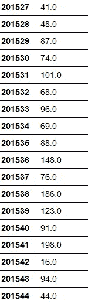
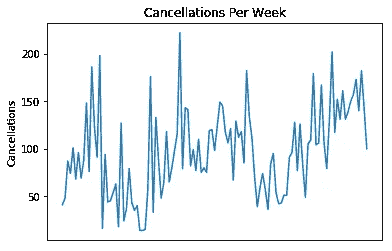
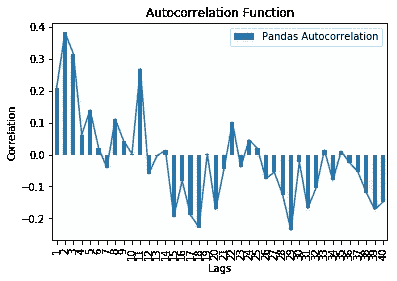
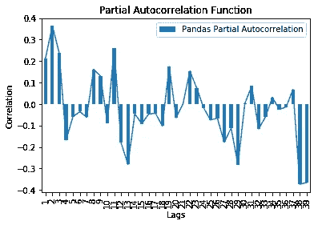
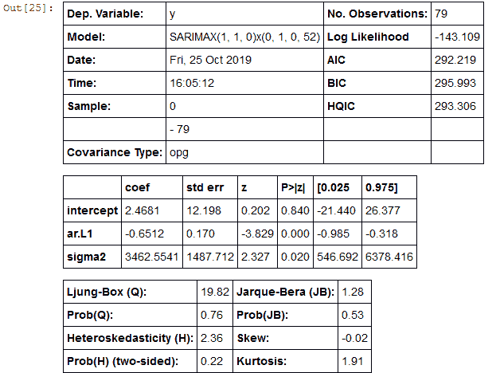
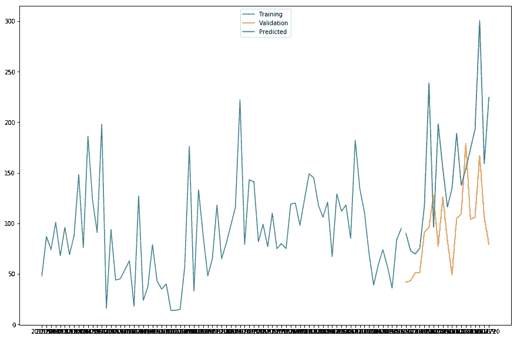
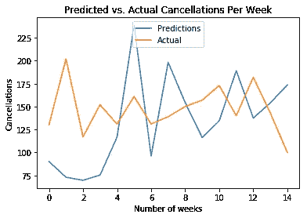
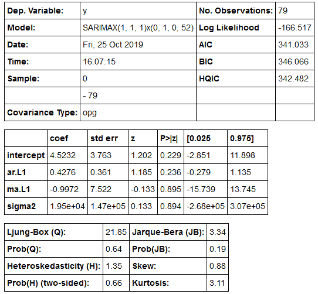
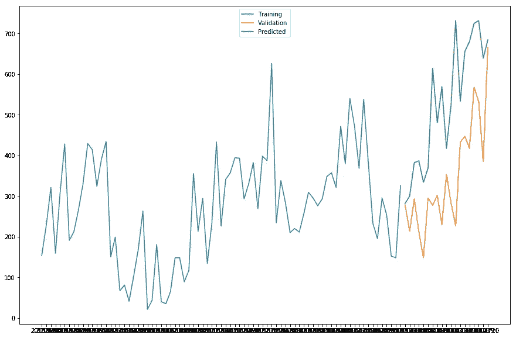
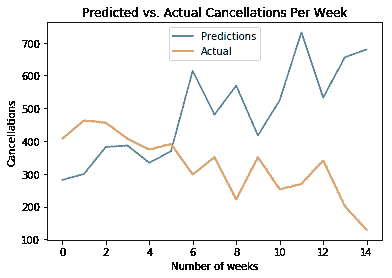

# 与 ARIMA 预测每周酒店取消

> 原文：<https://towardsdatascience.com/predicting-hotel-cancellations-with-extratreesclassifier-and-logistic-regression-fb9229a95d1e?source=collection_archive---------20----------------------->

## 使用 ARIMA 进行时间序列预测，此模型用于预测每周酒店取消。

酒店取消预订会给业内许多企业带来问题。不仅会因为客户取消而损失收入，而且还会给协调预订和调整收入管理实践带来困难。

数据分析可以帮助解决这个问题，因为它可以识别最有可能取消预订的客户，从而让连锁酒店相应地调整营销策略。

以下示例基于 Antonio、Almeida 和 Nunes (2019)的[酒店预订需求数据集](https://www.sciencedirect.com/science/article/pii/S2352340918315191)。

ARIMA 模型用于确定酒店取消预订是否也可以提前预测。这将首先使用阿尔加维酒店数据集(H1full.csv)来完成。由于我们现在寻求预测时间序列趋势，所有观测值现在都包含在该数据集中(取消和未取消，不管数据集整体是否不均匀)。

为此，每周对取消情况进行分析(即汇总给定一周的取消数量)。

首先，使用 pandas 执行数据操作程序，以汇总每周取消的数量并正确排序。

在配置 ARIMA 模型时，前 80 个观察值用作**训练数据**，随后 20 个用作**验证数据**。

一旦模型配置完毕，最后 15 次观察结果将被用作**测试数据**来衡量模型对未知数据的准确性。

以下是输出的一个片段:



将时间序列可视化，并生成自相关和偏自相关图:

**时间序列**



**自相关**



**偏自相关**



```
#Dickey-Fuller Test
result = ts.adfuller(train)
result
print('ADF Statistic: %f' % result[0])
print('p-value: %f' % result[1])
print('Critical Values:')
for key, value in result[4].items():
    print('\t%s: %.3f' % (key, value))
```

当运行 Dickey-Fuller 检验时，会生成小于 0.05 的 p 值，表明非平稳性的零假设被拒绝(即数据是平稳的)。

```
ADF Statistic: -2.677149
p-value: 0.078077
Critical Values:
	1%: -3.519
	5%: -2.900
	10%: -2.587
```

然后使用**金字塔**库中的 auto_arima 运行 ARIMA 模型。这用于为 ARIMA 模型选择最佳(p，d，q)坐标。

```
from pyramid.arima import auto_arima
Arima_model=auto_arima(train, start_p=0, start_q=0, max_p=10, max_q=10, start_P=0, start_Q=0, max_P=10, max_Q=10, m=52, seasonal=True, trace=True, d=1, D=1, error_action='warn', suppress_warnings=True, random_state = 20, n_fits=30)
```

将生成以下输出:

```
Fit ARIMA: order=(0, 1, 0) seasonal_order=(0, 1, 0, 52); AIC=305.146, BIC=307.662, Fit time=0.139 seconds
Fit ARIMA: order=(1, 1, 0) seasonal_order=(1, 1, 0, 52); AIC=nan, BIC=nan, Fit time=nan seconds
Fit ARIMA: order=(0, 1, 1) seasonal_order=(0, 1, 1, 52); AIC=nan, BIC=nan, Fit time=nan seconds
Fit ARIMA: order=(0, 1, 0) seasonal_order=(1, 1, 0, 52); AIC=nan, BIC=nan, Fit time=nan seconds
Fit ARIMA: order=(0, 1, 0) seasonal_order=(0, 1, 1, 52); AIC=nan, BIC=nan, Fit time=nan seconds
Fit ARIMA: order=(0, 1, 0) seasonal_order=(1, 1, 1, 52); AIC=nan, BIC=nan, Fit time=nan seconds
Fit ARIMA: order=(1, 1, 0) seasonal_order=(0, 1, 0, 52); AIC=292.219, BIC=295.993, Fit time=0.590 seconds
Fit ARIMA: order=(1, 1, 1) seasonal_order=(0, 1, 0, 52); AIC=293.486, BIC=298.518, Fit time=0.587 seconds
Fit ARIMA: order=(2, 1, 1) seasonal_order=(0, 1, 0, 52); AIC=294.780, BIC=301.070, Fit time=1.319 seconds
Fit ARIMA: order=(1, 1, 0) seasonal_order=(0, 1, 1, 52); AIC=nan, BIC=nan, Fit time=nan seconds
Fit ARIMA: order=(1, 1, 0) seasonal_order=(1, 1, 1, 52); AIC=nan, BIC=nan, Fit time=nan seconds
Fit ARIMA: order=(2, 1, 0) seasonal_order=(0, 1, 0, 52); AIC=293.144, BIC=298.176, Fit time=0.896 seconds
Total fit time: 3.549 seconds
```

基于最低的 AIC， **SARIMAX(1，1，0)x(0，1，0，52)** 配置被确定为时间序列建模的最佳配置。

下面是模型的输出:



序列的 **90%** 作为训练数据建立 ARIMA 模型，剩余的 **10%** 现在用于测试模型的预测。以下是预测与实际数据的对比:



我们可以看到，虽然预测值低于实际测试值，但两个序列的方向似乎是相互跟随的。

从商业角度来看，酒店可能更感兴趣的是预测取消的程度在特定的一周内会增加/减少，而不是准确的取消数量，这无疑会更容易出错并受外部因素的影响。

在这方面，[平均方向准确度](https://gist.github.com/bshishov/5dc237f59f019b26145648e2124ca1c9)用于确定模型准确预测每周取消频率方向变化的程度。

```
def mda(actual: np.ndarray, predicted: np.ndarray):
    """ Mean Directional Accuracy """
    return np.mean((np.sign(actual[1:] - actual[:-1]) == np.sign(predicted[1:] - predicted[:-1])).astype(int))
```

产生了 89%的 MDA:

```
>>> mda(val, predictions)0.8947368421052632
```

在这方面，ARIMA 模型在测试集上预测酒店取消的方向变化时显示了相当高的精确度。

还预测了 RMSE(均方根误差):

```
>>> import math
>>> from sklearn.metrics import mean_squared_error>>> mse = mean_squared_error(val, predictions)
>>> rmse = math.sqrt(mse)
>>> print('RMSE: %f' % rmse)RMSE: 77.047252
```

在这种情况下，RMSE 为 77。请注意，RMSE 的单位与响应变量相同，在本例中是酒店取消。验证数据中所有周的平均取消值为 94，RMSE 77 在技术上是未解释方差的标准偏差。在其他条件相同的情况下，该值越低越好。

# 针对看不见的数据进行测试

尽管 ARIMA 模型已经被训练过，并且通过验证数据验证了准确性，但是仍然不清楚该模型将如何针对看不见的数据(或测试数据)执行。

在这点上，使用 ARIMA 模型来生成 n=15 的预测，使用 test.index 来指定看不见的数据。

```
>>> test = np.array([[130,202,117,152,131,161,131,139,150,157,173,140,182,143,100]])
```

首先，对数组进行相应的整形:

```
>>> test=test.reshape(-1)
>>> testarray([130, 202, 117, 152, 131, 161, 131, 139, 150, 157, 173, 140, 182,
       143, 100])
```

现在，进行预测，并计算 RMSE(均方根误差)、MDA(平均方向精度)和平均预测误差:

```
>>> predictionnew=pd.DataFrame(Arima_model.predict(n_periods=15), index=test.index)
>>> predictionnew.columns = ['Unseen_Predicted_Cancellations']
>>> predictionsnew=predictionnew['Unseen_Predicted_Cancellations']>>> mse_new = mean_squared_error(test, predictionsnew)
>>> rmse_new = math.sqrt(mse_new)
>>> print('RMSE: %f' % rmse_new)RMSE: 57.955865>>> mda(test, predictionsnew)0.8666666666666667>>> forecast_error_new = (predictionsnew-test)
>>> forecast_error_new0     -39.903941
1    -128.986739
2     -47.325146
3     -76.683169
4     -14.237713
5      77.591519
6     -34.782635
7      59.277972
8       4.404317
9     -40.860982
10    -38.522419
11     49.074094
12    -44.497360
13     11.040560
14     73.507259
dtype: float64>>> mean_forecast_error_new = np.mean(forecast_error_new)
>>> mean_forecast_error_new-12.726958780163237
```

RMSE 略有改善(降至 57)，而 MDA 降至 86%，平均预测误差为-12，这意味着该模型有轻微低估取消的趋势，因此预测偏差为负。

下面是预测取消与实际取消的对比图:



# 基于 H2 数据的 ARIMA 模型

应用了相同的过程——这次使用第二个数据集。

以下是使用 pyramid-arima 获得的 ARIMA 配置:



**预测与验证**



**预测与实际**



*   **RMSE 上测试数据:** 274
*   平均定向精度: 0.8666
*   **平均预测误差:** 156.329

# 结论

在本例中，ARIMA 模型用于预测每周的酒店取消率。在 H1 数据集上 RMSE 为 57 的测试集上，MDA 展示了 86%的准确性，并且在 RMSE 为 274 的 H2 数据集上再次产生了 86%的 MDA(测试集中 15 周的平均取消为 327)。

当然，这些发现的局限性在于，研究中的两家酒店都位于葡萄牙。在其他国家的酒店中测试该模型将有助于进一步验证该模型的准确性。

本例的数据集和笔记本可从 MGCodesandStats GitHub 库获得，以及对该主题的进一步研究。

你也可以在 michael-grogan.com 的[找到更多我的数据科学内容。](https://www.michael-grogan.com/)

*免责声明:本文是在“原样”的基础上编写的，没有担保。本文旨在提供数据科学概念的概述，不应以任何方式解释为专业建议。*