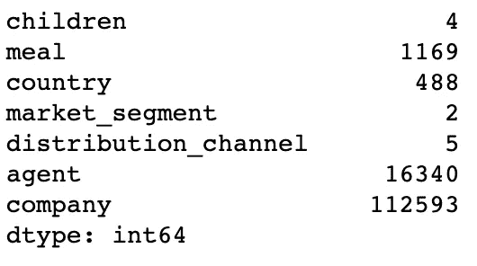
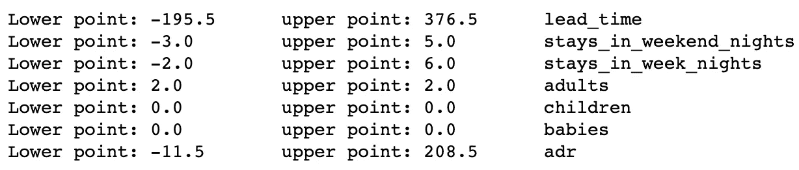
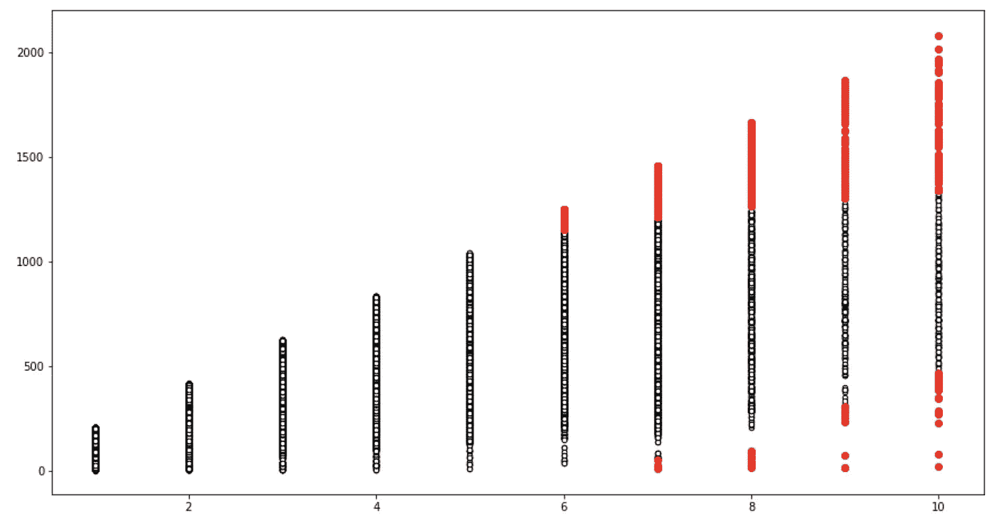
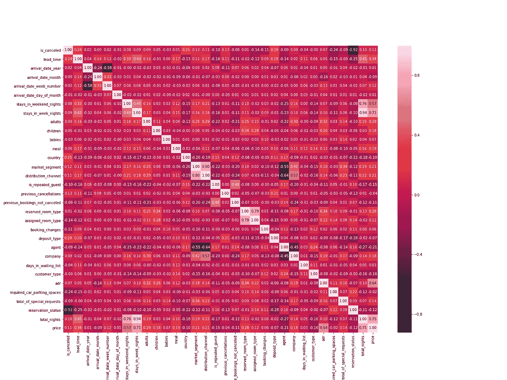
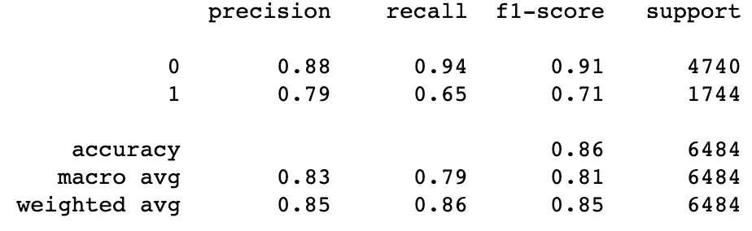
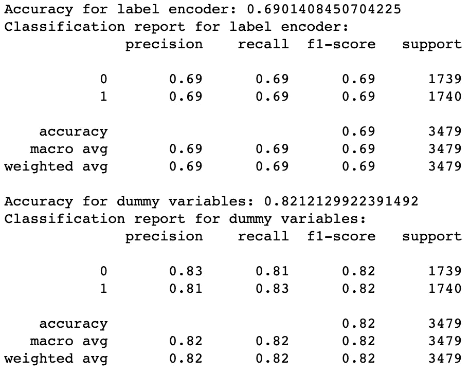
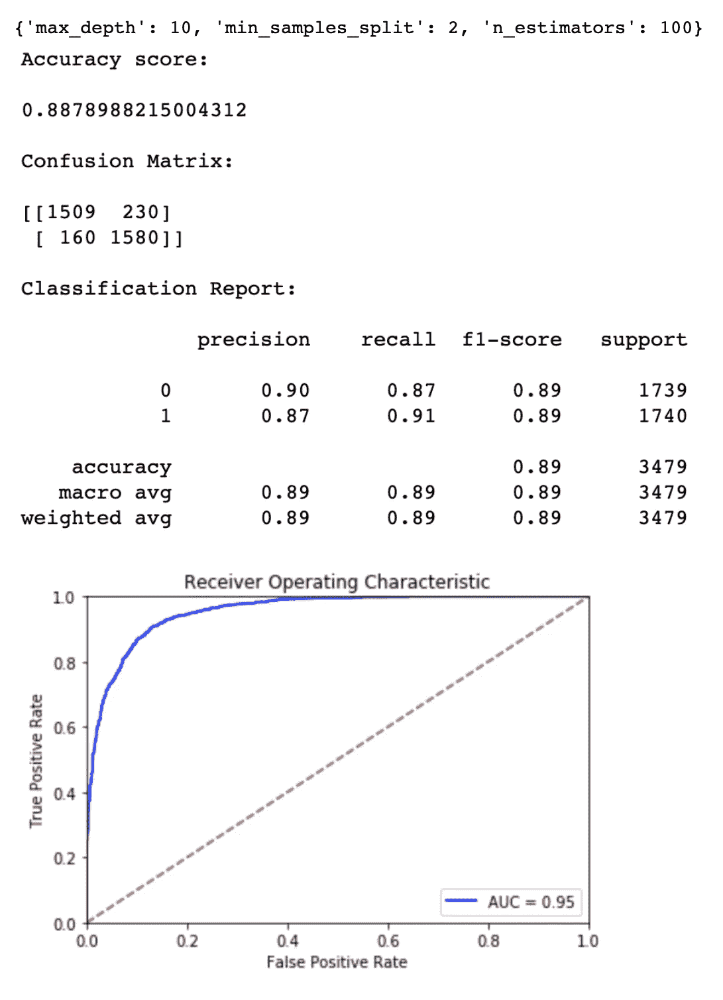
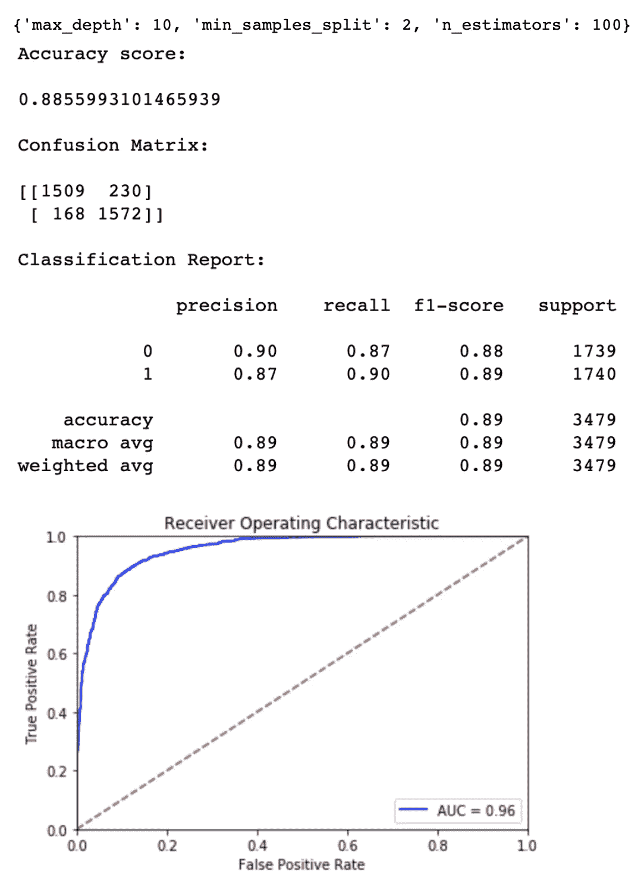

# 用机器学习预测酒店预订取消

> 原文：<https://towardsdatascience.com/predicting-hotel-cancellations-with-machine-learning-fa669f93e794?source=collection_archive---------8----------------------->


Image by [Alexas_Fotos](https://pixabay.com/users/Alexas_Fotos-686414/?utm_source=link-attribution&utm_medium=referral&utm_campaign=image&utm_content=897419) from [Pixabay](https://pixabay.com/?utm_source=link-attribution&utm_medium=referral&utm_campaign=image&utm_content=897419)

可想而知，在线预订行业的预订取消率相当高。一旦预订被取消，几乎没有什么可做的。这让许多机构感到不安，并产生了采取预防措施的愿望。因此，预测可以取消的预订并防止这些取消将为机构创造剩余价值。

在这篇文章中，我将尝试解释如何通过机器学习方法提前预测未来取消的预订。先说预处理！

# 预处理

首先，我应该说，您可以访问我的存储库中使用的数据，我将在我的文章结尾分享这些数据。我还想分享一下，这是一篇论文的主题。[1]

我们有两个独立的数据集，因为我们要对它们进行预处理，所以将它们组合起来是有意义的。但是在建模阶段，我们需要分别获得这两组数据。所以，为了区分这两者，我创建了`id`字段。

```
import pandas as pdh1 = pd.read_csv('data/H1.csv')
h2 = pd.read_csv('data/H2.csv')h1.loc[:, 'id'] = range(1, len(h1) + 1)

start = h1['id'].max() + 1
stop = start + len(h2)
h2.loc[:, 'id'] = range(start, stop)df = pd.concat([h1, h2], ignore_index=True, sort=False)
```

以下是该项目的预处理步骤:

*   将字符串`NULL`或`Undefined` 值转换为 np.nan
*   从具有少量`NULL`值的列中删除缺失的观察值
*   根据规则填充缺失值
*   删除不正确的值
*   离群点检测

## **步骤 1 —将** `NULL` **或未定义的值串到** `**np.nan**`

```
import numpy as npfor col in df.columns:
    if df[col].dtype == 'object' and col != 'country':
        df.loc[df[col].str.contains('NULL'), col] = np.nan
        df.loc[df[col].str.contains('Undefined', na=False), col] = np.nannull_series = df.isnull().sum()
print(null_series[null_series > 0])
```

使用上面的代码，我们将字符串`NULL`和`Undefined`值转换为`np.nan`值。然后，我们打印每一列的`NULL`值的计数。这是结果的样子，



Null values

## 步骤 2-删除一些缺失的值

我们可以删除*国家*、*子*、*市场 _ 细分*、*分销 _ 渠道*中的`NULL`值，因为这些字段的`NULL`值很少。

```
subset = [
    'country',      
    'children',      
    'market_segment',      
    'distribution_channel'
] 
df = df.dropna(subset=subset)
```

## 步骤 3-通过规则集填充缺失值

为数据指定了许多规则。[2]例如，值为`Undefined/SC`意味着它们为`no meal type.`，因为我们之前已经用`NULL`替换了`Undefined`值，我们可以用`SC`填充*餐*字段中的`NULL`值。

a*agent*字段为`NULL`的事实意味着预订不是来自任何代理。因此，这些预订可以被认为是由顾客直接购买的，不需要任何中介组织，如代理等。这就是为什么我们没有删除`NULL`值，而是抛出一个像 999 这样的随机值。这同样适用于 c*company*字段。

更详细的信息可以在参考资料的第二个链接中找到。

```
df.loc[df.agent.isnull(), 'agent'] = 999 
df.loc[df.company.isnull(), 'company'] = 999 df.loc[df.meal.isnull(), 'meal'] = 'SC'
```

## 步骤 4-删除错误的值

*ADR* 字段指的是预订的每晚平均价格。因此，它取小于零的值是不正常的。你可以使用`df.describe().T`来查看这种情况。对于 *ADR* 字段，我们删除小于零的值。

```
df = df[df.adr > 0]
```

## 步骤 5—异常值检测

对于`integer`和`float`字段，我们使用下面的代码来确定低点和高点。如果在低点和高点之间有等式，我们不做任何滤波。如果不相等，我们从数据集中移除大于上点的观测值和小于下点的观测值。

Outlier detection with IQR

田地的低点和高点似乎在下面，



IQR results

最后，我们将讨论多元异常值检测。[3]这是我们多做一点工作的特殊推论，并不适用于每一个企业。一晚 5 美元或 10 美元的费用可以正常支付，但 10 晚的费用就不正常了。因此，从数据集中删除这些被认为是相反的值将有助于我们的模型进行学习。所以我已经尝试了`LocalOutlierFactor`和`EllipticEnvelope`，我只检查`EllipticEnvelope`是因为它产生了更好的结果，但是如果你想检查这两个，你可以看看我的资源库。

```
from sklearn.covariance import EllipticEnvelope
import matplotlib.pyplot as plt
import numpy as np# create new features: total price and total nights
cleaned.loc[:, 'total_nights'] = \
cleaned['stays_in_week_nights'] + cleaned['stays_in_weekend_nights']
cleaned.loc[:, 'price'] = cleaned['adr'] * cleaned['total_nights']# create numpy array
X = np.array(cleaned[['total_nights', 'price']])*# create model* 
ee = EllipticEnvelope(contamination=.01, random_state=0)*# predictions* 
y_pred_ee = ee.fit_predict(X)*# predictions (-1: outlier, 1: normal)*
anomalies = X[y_pred_ee == -1]*# plot data and outliers*
plt.figure(figsize=(15, 8))
plt.scatter(X[:, 0], X[:, 1], c='white', s=20, edgecolor='k')
plt.scatter(anomalies[:, 0], anomalies[:, 1], c='red');
```

图表如下。红点显示异常值。



EllipticEnvelope result

如您所见，在数据集之外保留小值是有意义的，尤其是在 6 个晚上之后。通过应用这个过程，我们可以保存数据集。

```
df_cleaned = cleaned[y_pred_ee != -1].copy()h1_cleaned = df_cleaned[df_cleaned.id.isin(h1.id.tolist())]
h2_cleaned = df_cleaned[df_cleaned.id.isin(h2.id.tolist())]h1_cleaned = h1_cleaned.drop('id', axis=1)
h2_cleaned = h2_cleaned.drop('id', axis=1)h1_cleaned.to_csv('data/H1_cleaned.csv', index=False)
h2_cleaned.to_csv('data/H2_cleaned.csv', index=False)
```

# 特征工程

在建立模型之前，另一个重要的问题是特征工程。添加或删除功能可能对我们的模型更有效。

## 步骤 1—相关性

首先，我将使用`LabelEncoder`将分类数据转换为`integer`，然后我将查看相关性。[4]下面的代码可以做到这一点，

```
from sklearn.preprocessing import LabelEncoder
import matplotlib.pyplot as plt
import pandas as pd
import seaborn as snstrain = pd.read_csv('./data/H1_cleaned.csv')
test = pd.read_csv('./data/H2_cleaned.csv')df_le = train.copy()
le = LabelEncoder()

categoricals = [
    'arrival_date_month',
    'meal',
    'country',
    'market_segment',
    'distribution_channel',
    'reserved_room_type',
    'assigned_room_type',
    'deposit_type',
    'agent',
    'company',
    'customer_type',
    'reservation_status',
]

for col in categoricals:
    df_le[col] = le.fit_transform(df_le[col])plt.figure(figsize=(20, 15))
sns.heatmap(df_le.corr(), annot=True, fmt='.2f');
```

这段代码给了我们一个如下所示的相关矩阵，



Correlation matrix

在该矩阵中，在 *reservation_status* 和*is _ cancelled*特征之间似乎存在负的高相关性。在 *total_nights* 和 *stays_in_week_nights* 和*stays _ in _ weekend _ nights*字段之间也有很高的相关性。因此，我们从数据集中删除了 *reservation_status* 和 *total_nights* 特性。由于*reservation _ status _ date*和 *reservation_status* 之间存在关联，我们将删除此功能。

```
columns = [
    'reservation_status_date',
    'total_nights',
    'reservation_status',
]

train = train.drop(columns, axis=1)
test = test.drop(columns, axis=1)
df_le = df_le.drop(columns, axis=1)
```

## 步骤 2—虚拟变量与标签编码器

机器学习模型需要数字数据来运行。因此，在我们可以建模之前，我们需要将分类变量转换为数字变量。我们可以使用两种方法来做到这一点:`Dummy variables`和`LabelEncoder`。通过下面你看到的代码，我们使用`LabelEncoder`和`dummy variables`创建特征。

```
import pandas as pdnew_categoricals = [col for col in categoricals if col in train.columns]df_hot = pd.get_dummies(data=train, columns=new_categoricals)
test_hot = pd.get_dummies(data=test, columns=new_categoricals)X_hot = df_hot.drop('is_canceled', axis=1)
X_le = df_le.drop('is_canceled', axis=1)
y = train['is_canceled']
```

然后，我们用`dummy variables`构建一个`logistic regression`模型，并检查分类报告，作为对数据的初步观察。

```
from sklearn.linear_model import LogisticRegression
from sklearn.metrics import accuracy_score, classification_report
from sklearn.model_selection import train_test_splitX_train, X_test, y_train, y_test = train_test_split(X_hot, y, test_size=.2, random_state=42)

log = LogisticRegression().fit(X_train, y_train)
y_pred = log.predict(X_test)print(accuracy_score(y_test, y_pred))
print(classification_report(y_test, y_pred))
```

准确性分数看起来是 0.8584，但是当查看分类报告时，已经取消的预订的准确性非常低。因为我们的数据包含 23720 个成功案例和 8697 个取消案例。在这种情况下，优选的是稀释加权类或增加较少采样类的样本数量。我们将首先使用特征选择算法选择特征，然后使用稀释的数据比较虚拟变量和标签编码器。



First classification report

## 步骤 3—特征选择

特征选择是特征工程中最重要的问题之一。这里我们将使用`SelectKBest`，这是一种用于分类问题的流行特征选择算法。我们的评分函数将是 *chi* 。[5]

Feature selection

利用上述函数，我们为`LabelEncoder`和`dummy variables`选择最佳特征。

```
selects_hot = select(X_hot)
selects_le = select(X_le)
```

然后我们用一种简单的方式来比较这些特征。

Dummy variables vs label encoder

比较结果如下:



Dummy variables vs label encoder classification reports

我们选择这些字段是因为我们用虚拟变量创建的特征能给出更好的结果。

```
from sklearn.model_selection import train_test_split
from sklearn.utils import resample
import pandas as pdlast = test_hot[selects_hot + ['is_canceled']]

X_last = last.drop('is_canceled', axis=1)
y_last = last['is_canceled']*# separate majority and minority classes*
major = selected[selected['is_canceled'] == 0]
minor = selected[selected['is_canceled'] == 1]

*# downsample majority class*
downsampled = resample(major, replace=False, n_samples=len(minor), random_state=123) 

*# combine minority class with downsampled majority class*
df_new = pd.concat([downsampled, minor])

*# display new class counts*
print(df_new['is_canceled'].value_counts())X = df_new.drop('is_canceled', axis=1)
y = df_new['is_canceled']X_train, X_test, y_train, y_test = train_test_split(X, y, test_size=.2, random_state=42)
```

使用上面的代码，我们将成功预订的数量和取消预订的数量平均化了 8697，并将数据集分为 train 和 test。然后，我们将通过创建以下类来度量模型的性能。

Report class

我们到最后一步，对比一下我们的车型！

# 系统模型化

这里尝试了很多模型，你可以在我的知识库里看到。但在这里，我将分享前 2 个模型的结果和一些代码，展示我们如何做`hyperparameter tuning`。事情是这样的，

```
from sklearn.model_selection import GridSearchCV
from xgboost import XGBClassifierreport = Report(X_test, y_test)
xgb = XGBClassifier().fit(X_train, y_train)xgb_params = {
    'n_estimators': [100, 500, 1000],     
    'max_depth': [3, 5, 10],     
    'min_samples_split': [2, 5, 10]
}params = {
    'estimator': xgb,
    'param_grid': xgb_params,
    'cv': 5,
    'refit': False,
    'n_jobs': -1,
    'verbose': 2,
    'scoring': 'recall',
}xgb_cv = GridSearchCV(**params)
_ = xgb_cv.fit(X_train, y_train)print(xgb_cv.best_params_)
xgb = XGBClassifier(**xgb_cv.best_params_).fit(X_train, y_train)report.metrics(xgb)
report.plot_roc_curve(xgb, save=True)
```

XGBoost 结果如下:



XGB results

如果我们使用上面的代码将 XGBoost 替换为 GBM，结果如下:



GBM results

# 结论

首先，我想在本文中强调预处理和特征选择步骤在模型构建过程中的重要性。创建成功模型的方法是获得干净的数据。

之后建立的模型的优化，尤其是分类问题不应该忽视召回值的重要性。分类的准确性是分类问题中最关键的问题之一。

希望这是一篇有用的文章！

感谢您的阅读！如果你想了解更多，想看看 H2 文件的结果，请访问我的知识库！

[](https://github.com/egemenzeytinci/cancellation-prediction) [## egemenzeytinci/取消-预测

### 这个项目的目的是预测将被取消的预订。它包括两个步骤:预处理和…

github.com](https://github.com/egemenzeytinci/cancellation-prediction) 

# 参考

[1]努诺·安东尼奥、安娜·德·阿尔梅达和路易斯·努涅斯，[预测酒店预订取消，以减少不确定性并增加收入](https://pdfs.semanticscholar.org/0f5f/3a506360b9be0a7ab52d77974695f1c48a4d.pdf) (2017)

[2]努诺·安东尼奥，安娜·德·阿尔梅达和路易斯·努内斯，[酒店预订需求数据集](https://www.sciencedirect.com/science/article/pii/S2352340918315191) (2019)

[3]克里斯托弗·何塞，[Python 中的异常检测技术](https://medium.com/learningdatascience/anomaly-detection-techniques-in-python-50f650c75aaf) (2019)

[4] Vishal R，[特征选择—相关性和 P 值](/feature-selection-correlation-and-p-value-da8921bfb3cf) (2018)

[5] [使用选择测试](https://www.kaggle.com/jepsds/feature-selection-using-selectkbest/notebook)进行特征选择(2018)