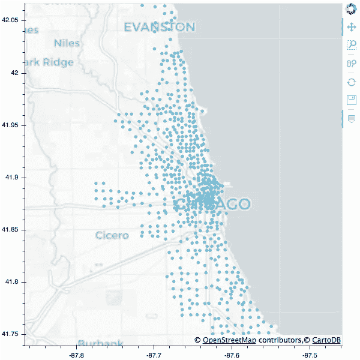
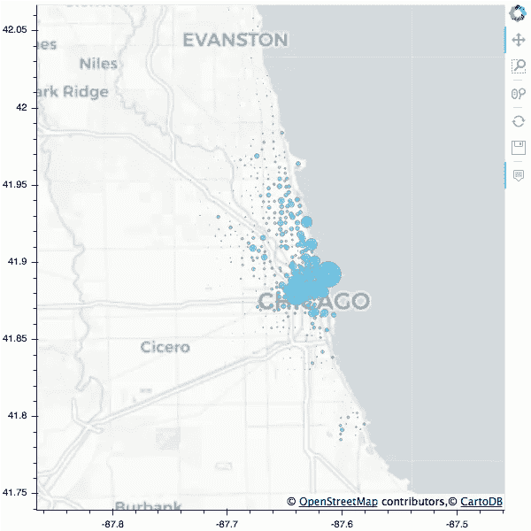
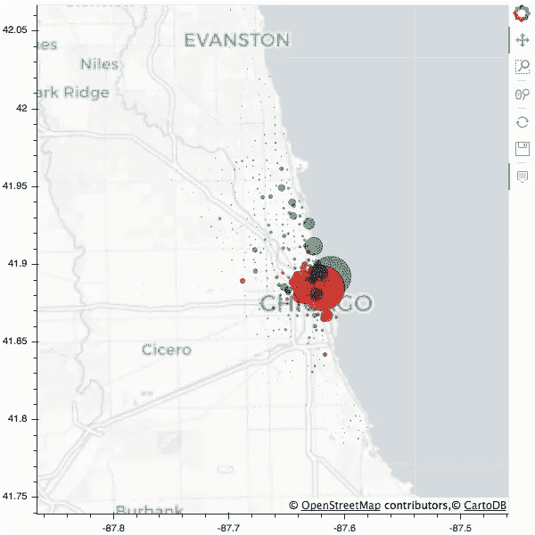

# 使用机器学习来预测每个站点每小时的共享单车检出量

> 原文：<https://towardsdatascience.com/predicting-hourly-divvy-bike-sharing-checkouts-per-station-65b1d217d8a4?source=collection_archive---------20----------------------->

问题是

这个项目的目标是试图预测在一个给定的小时内有多少辆自行车将被检查出一个特定的车站。如果可以提前知道借出的自行车数量，那么 Divvy 将知道何时何地重新装载自行车，以便客户可以继续使用该站。这对 Divvy 很重要，因为它将为他们的客户创造一种能力和便利的文化。能够做出准确的预测对客户来说是未知的，但如果做得不好，可能会导致问题。如果忽视这一点，就会对业务造成不利影响。一个例子是，如果客户因为早上去车站查看自行车而没有自行车，导致他们经常感到不方便，他们就会停止使用这项服务。这将导致他们不得不步行到另一个车站，并希望这些车站有自行车。这可能是一个巨大的不便，而且由于步行到另一个车站的时间损失，客户可能会想为什么不乘坐 El(芝加哥的地铁系统)，它每天在同一时间总是有相同的车站。

数据

Divvy 在其网站([https://www.divvybikes.com/system-data](https://www.divvybikes.com/system-data))上公开了他们的数据，供任何人使用。季度数据以 csv 格式提供，可追溯至 2013 年。Divvy bike 的每次旅行都记录了以下信息:

*   行程开始日期和时间
*   行程结束日期和时间
*   行程起始站(id 和名称)
*   行程终点站(id 和名称)
*   骑手类型(会员、单人骑行和探索通行证)
*   如果成员旅行，它还将包括成员的性别和出生年份

除了几个例外，数据非常清晰。每年至少有一个季度的列标题略有不同，例如“开始时间”与“开始时间”这是一个简单的列重命名修复。另一种情况是，在 2015 年，第二季度的数据被拆分为 4 月、5 月和 6 月的数据。这是一个小小的不便，但是各个文件只需要连接成一个文件。最后，年份的日期格式各不相同，但熊猫的。to_datetime()函数能够读取多种格式并将它们转换成相同的格式。

任何去过中西部，尤其是芝加哥的人都知道，天气一天之内变化很大。天气对某人是否想在芝加哥市中心骑自行车有很大的影响。随着 Weather Underground 在 2019 年 2 月停止提供免费 API，历史天气以批量格式从黑暗天空(【https://darksky.net/dev】)下载。有各种各样的功能可供选择，但本项目使用了以下功能:

-温度(开尔文，后转换为摄氏度)

-降雨量(每小时总量)

-雪(每小时总量)

-风速

探索性数据分析

该项目从一些探索性数据分析开始，分析仅在最近完整的数据年份 2018 年完成。全年完成了 3603082 次旅行，图 1 显示了这些旅行的每日分布情况。考虑到芝加哥的天气模式，夏季的出行次数远远高于冬季也就不足为奇了。在图 2 中，旅行次数是按一天中的某个小时来计算的。显而易见，通过 Divvy 上班的人有早上和下午的高峰。有趣的是，下午的通勤比早上的通勤多了不少。这里也有多种影响没有生效，首先，这是所有的短途旅行，不仅仅是订户，顾客可能不会在早上 8 点起床观光。此外，在下午 5 点左右，更多的人可能会去买食物或与他人见面共度欢乐时光，这在早上不会做得太多。

Figure 1: Number of trips by day (2018)

Figure 2: Number of trips broken down by hour of the day (2018)

有两种类型的乘客，订户和顾客。订阅者每年支付 99 美元，可以在 45 分钟内无限制乘坐；这些人经常通勤上班。顾客可以付费，他们可以花 15 美元买一张日卡，当天可以无限次乘车，或者花 3 美元，一次最多 30 分钟。对于游客来说，这些都是廉价游览这座城市的好选择。

Figure 3: Breakdown of rides by user type

图 3 显示，用户的出行次数远远多于客户。然而，由于旅行是匿名的，确切的订阅人数不得而知，只知道他们旅行的次数。图 4 显示了 2018 年每周每天的总乘车次数。订户和顾客对旅行的使用是反向相关的。订户在工作日(周一至周五)进行大部分旅行，而这是客户的低谷。如果订户使用 Divvy 上下班，这是有意义的。此外，客户最常在周末(周六和周日)乘车，而这对于订户来说是最不常见的。顾客只能在一天内得到他们的自行车，而周末是旅行者来参观的时候。最后，当比较用户和顾客时，他们旅行持续的时间有很大的差异。用户的平均行程只有 14.5 分钟，而客户的平均行程为 62.6 分钟。要查看工作日和周末的数据是否有偏差，请参考图 5，查看旅行持续时间与星期几的比较。

Figure 4: Number of trips by day of week

Figure 5: Duration of trips by day of week

还有更多关于 Divvy 用户的信息需要了解，当他们注册时，他们输入自己的出生年份和性别。在 2018 年的所有旅行中，男性占了近 75%，而女性只有 25%。回想一下，这并不一定意味着 75%的用户是男性，只是他们占了 75%的旅行。每一次旅行都是匿名的，没有办法识别个人用户。例如，2018 年有 261 个工作日，如果有人完美出勤并双向通勤，他们将自己计算 522 次旅行，但没有办法肯定地知道一个人，没有订户 id 列。尽管男性的出行次数是女性的 3 倍，但女性的出行次数往往略长。女性骑手的平均行程为 19 分钟(中位数为 11 分钟)，而男性骑手的平均行程为 14.8 分钟(中位数为 9 分钟)。图 6 显示了使用自行车共享系统最多的用户的年龄。这个数据有一些问题，由于一些年龄超过 123 岁，所以不得不被剔除，这个数字在 80 岁被剔除，即使对用户来说似乎有点老，但这个直方图显示了大多数用户的年龄。从 24 岁到 34 岁，旅行次数至少为 11.7 万次，其中 29 岁的人在 2018 年的旅行次数接近 18 万次。

Figure 6: Distribution of rides by subscriber age

截至 2018 年，共有 621 个独特的 Divvy 站分布在芝加哥和北部郊区埃文斯顿。

Figure 7: Most used Divvy stations (sum of check ins and check outs)

图 7 显示了总使用量最受欢迎的车站，这些都是 2018 年总共超过 60，000 次入住和退房的车站。地图 1 显示了这些站点的位置以及 Divvy 自行车网络的覆盖范围。

Map 1: Distribution of Divvy Stations across Chicago (2018)

从地图上可以看出，车站非常集中在市中心，这里全天有大量的商业活动。地图 2 显示了每个车站的使用情况，它非常清楚地显示了城市中大多数乘坐的地方。市中心不仅是城市的商业中心，也是许多主要景点吸引游客的地方。这些景点包括海军码头、千禧公园、博物馆大道、艺术学院以及密歇根大道和州立大街，那里有很多零售市场

Map 2: Most used Divvy Stations (2018)

是。由于商业和景点的结合，订户和客户都可能经常光顾市中心的这些车站，这使得它们对于 Divvy 来说更加重要，以确保这些车站始终可用于取放自行车。第三个也是最后一个地图，即地图 3，用于发现哪些站点有更多的自行车托运到每个站点或从每个站点托运出去。这是决定哪些站点自行车过剩或短缺的一个重要因素。这将决定自行车可以从哪里搬迁到哪里

Map 3: Difference between check-ins and check-outs (2018)

需要去确保每个车站配备足够的自行车和开放的码头，以容纳他们的用户。

为了进一步说明这一点，图 8 进一步详细描述了登记人数最多的前 15 个车站和结账人数多于登记人数的后 15 个车站。前 15 个站是在该站有多余自行车的站，而底部的站是应该被监控以重新装载的站。

Figure 8: Stations based on the difference between check-ins and check-outs

模型加工

这个项目的目标是能够预测在任何给定的时间内有多少辆自行车将被检查出一个车站。由于计算能力和空间有限，用于创建该模型的数据是过去四年(2015 年至 2018 年)第二季度的数据。总共有 600 多个车站和 300 多万次旅行，只有前 26 个最常去的车站用于该模型。这仅占车站的 4.2%，但占出行的 39.5%。用于该模型的每个车站至少有 50，000 次检入和检出。

由于数据是单独的行程，数据必须按始发站和一天中的时间进行汇总。在创建了这个数据帧之后，必须根据日期和时间连接天气。用于此的天气是温度(以摄氏度计)、风速和降水(将雨和雪合并成一列)。尽管始发站标有 id 号，并在数据帧中标记为 int，但这是一个分类特征，因此必须将其转换为虚拟变量。年、月、日和小时也被转换成虚拟变量。这个模型使用的最终数据是 66 列 106，773 个实例。

在拆分数据和为模型定型之前，对要预测的列“checkout_count”进行了调查。以熊猫为原型。skew()函数，数据是右偏的，偏度为 3.61。对该列的第一个转换是平方根，这将偏斜降低到 1.62，但是对数转换将它进一步降低到 0.33。因此，预测的属性随后使用对数变换进行转换。

最后，数据被分成训练集和测试集。测试集不是随机选择日期进行预测，而是 2018 年 6 月的最后两周，即使用数据的最后两周。训练集是 100，831 行乘 65 列，而测试集是 5，942 个实例。

预测模型

有四种机器学习技术被用来预测一天中任何时间从车站借出的自行车数量。预测列是一个连续变量，因此我尝试的第一个模型是线性和套索回归。所有结果的结果如下:

Table 1: Results from multiple machine learning techniques to predict bike check-outs per hour by station.

很明显，回归技术的表现不是很好，因为它们具有高的均方误差和非常低的 R2 分数。由于绝大多数数据都是二进制格式，决策树和随机森林的表现要好得多。经过反复试验，决策树的最大深度是 31，而随机森林只使用了 15 个估值器。通过增加估计量，随机森林的结果稍微好一点，但如果使用太多估计量，就会有过度拟合和重复结果的风险。随机森林在使用的所有指标中表现最佳。包括解释模型方差的 R2 分数。随机森林解释了 72.98%的差异，这意味着我们拥有 72.98%的信息，我们需要这些信息来准确预测在任何给定的时间从任何车站检出的自行车数量。

Figure 9: Scatterplot comparing actual vs predicted values of the Random Forest

另一个有趣的结果是，我们的平均绝对误差大于我们的中值误差，这意味着要么是数据中有一些异常值，要么是所做的预测。根据数据训练的所有五个模型都是这种情况。当进一步研究预测时，预测最不准确的前六个实例都来自同一天，2018 年 6 月 23 日和 2018 年 6 月 24 日。当进一步研究这些日期时，这是芝加哥的一个大周末。那个周末的几个大型活动是芝加哥骄傲游行、乡村湖滨聚会(一场为期 3 天的乡村音乐会)、芝加哥食品卡车节和老圣帕特最大街区聚会。这些活动每年都会吸引成千上万的游客，在芝加哥旅游已经够困难的了，更不用说有更多的人试图做同样的事情了。这是 Divvy 的自行车共享计划非常方便的一个主要例子。

为了检查异常值如何影响结果，将它们从数据中移除，然后再次运行模型。异常值是通过查找 z 得分并移除任何大于 3 或小于-3 的 z 得分来确定的。z 得分代表数据点偏离平均值的标准偏差数。在训练集中删除了 2，242 个实例，在测试集中删除了 198 个实例。剔除异常值后，某些区域的结果会更好，而其他区域会更差。表 2 显示了运行相同技术的结果，但是没有异常值。均方差显著提高，尤其是回归技术，但 R2 分数仍然很低，这意味着它没有达到准确预测所需的百分比。然而，当查看决策树和随机森林时，所有的值都下降了，不幸的是包括 R2，这意味着它现在知道的预测值更少了。然而，除去异常值，随机森林的中位数绝对误差低于 2，这意味着 50%的预测彼此在 1.9953 自行车之内。

Table 2: Results of same machine learning techniques with the outliers removed

又做了一次尝试来改善我们模型的结果。在六月的最后两周，不是测试集，而是整个数据集的随机分割。使用所有相同的数据，随机选择 25%作为测试集。这导致 80，079 个训练集和 26，649 个测试集。创建了另一个数据集，再次从数据中移除了所有离群值，然后在没有任何离群值的情况下，将数据分成具有 25%数据的训练和测试集。这导致了 78，249 的训练规模和 26，084 个实例的测试集。由于随机森林的结果始终具有最佳结果，这是在这些数据集上运行的唯一模型。表 3 显示了所有训练和测试模型上所有随机森林运行的结果。“随机 25%分割”是一个重要的模型，因为异常值仍然存在于数据中。异常值在这里很重要，因为 Divvy 需要在这几天确保站点做好适当的准备。尽管剔除了异常值的 25%分割表现更好，但它错过了一些最重要的日期，并且仍然具有较低的 R2 分数。这意味着当异常值仍然包含在数据中时，可以对预测进行更多的解释。

Table 3: Random Forest results for all testing sets

最后，图 10 显示，即使数据中有异常值，也可以做出很好的预测。仍然有一些异常值，但在这个测试集上使用这个模型，预测在 56.5%的时间里在 2 辆自行车内，在 82.3%的时间里在 5 辆自行车内，在 93.5%的时间里在 10 辆自行车内。仍然有相当数量的异常值扭曲了数据，但即使有了它们，也能做出好的预测。

Figure 10: Actual vs predicted values on random test set including the outliers

这种差异仍然有很大的增加空间，并且有一些可能发生的方式。首先，运行的第一个模型的问题是，测试设置在 6 月底，由于周末发生的所有事件，周末是严重的异常值。改进方差和结果的一种方法是在数据中包含这些事件。这些可以是导致异常值的最流行事件的二进制列。例如，芝加哥的骄傲周末吸引了成千上万的游客，可以为每年创建一个列，如果那天/周末是骄傲周末，则值为 1，否则为 0。这使得数据知道正在发生的事情会增加当天的旅行次数。可能需要发生的一个小变化是将降水值从连续值改为二进制值。如果每小时下 3 英寸或 0.7 英寸的雨，人们很可能不想在雨中骑自行车。这可能只是引起了一个小小的变化，但变化仍然存在。

结论

在本文中，我们分析了芝加哥的人口和游客如何使用 Divvy 自行车共享系统。对探索性数据分析进行了广泛的研究，以了解用户构成及其与他们出行的关系。创建了五个模型来预测在 2018 年 6 月 17 日至 6 月 30 日的给定时间内，有多少辆自行车将从给定的车站检出。为了检查模型的有效性，在包含和不包含异常值的随机测试集组成的测试集上运行了其他预测。在这些模型中，随机森林模型获得了最好的预测。这些预测是基于直接来自 Divvy 网站的真实世界数据构建和预测的，以证明该模型的有效性。

在 GitHub 上查看我的代码:[https://github.com/zkrumlinde/Predicting-Divvy-Checkouts](https://github.com/zkrumlinde/Predicting-Divvy-Checkouts)