# 用线性回归预测房价|从零开始的机器学习(第二部分)

> 原文：<https://towardsdatascience.com/predicting-house-prices-with-linear-regression-machine-learning-from-scratch-part-ii-47a0238aeac1?source=collection_archive---------1----------------------->

## 预测房子的销售价格，甚至是陌生人的。地下室是怎么回事？


> *TL；DR 使用测试驱动的方法*从头开始使用 Python 构建线性回归模型。您将使用训练好的模型来预测房屋销售价格，并将其扩展到多元线性回归。

## 从零开始的机器学习系列:

1.  [逻辑回归智能折扣](/smart-discounts-with-logistic-regression-machine-learning-from-scratch-part-i-3c242f4ded0)
2.  **用线性回归预测房价**
3.  [用 Python 从头开始构建决策树](https://medium.com/@curiousily/building-a-decision-tree-from-scratch-in-python-machine-learning-from-scratch-part-ii-6e2e56265b19)
4.  [利用 K 均值聚类进行调色板提取](https://medium.com/@curiousily/color-palette-extraction-with-k-means-clustering-machine-learning-from-scratch-part-iv-55e807407e53)
5.  [用朴素贝叶斯进行电影评论情感分析](https://medium.com/@curiousily/movie-review-sentiment-analysis-with-naive-bayes-machine-learning-from-scratch-part-v-7bb869391bab)
6.  [使用随机梯度下降的音乐艺术家推荐系统](https://medium.com/@curiousily/music-artist-recommender-system-using-stochastic-gradient-descent-machine-learning-from-scratch-5f2f1aae972c)
7.  [利用神经网络进行时尚产品图像分类](https://medium.com/@curiousily/fashion-product-image-classification-using-neural-networks-machine-learning-from-scratch-part-e9fda9e47661)
8.  [使用强化学习在后启示录世界中构建一个出租车驾驶代理](https://medium.com/@curiousily/build-a-taxi-driving-agent-in-a-post-apocalyptic-world-using-reinforcement-learning-machine-175b1edd8f69)

我知道你一直梦想统治房地产市场。直到现在，这还是不可能的。但是有了这个有限的优惠，你就可以……有点偏离主题了。

让我们开始用 Python 构建我们的模型，但这一次我们将在更真实的数据集上使用它。

***完整源代码笔记本*** (谷歌合作实验室):

[](https://colab.research.google.com/drive/1DXkpo9PmH9_HiCSz9NQlZ9vGQtMIYqmF) [## 线性回归

colab.research.google.com](https://colab.research.google.com/drive/1DXkpo9PmH9_HiCSz9NQlZ9vGQtMIYqmF) 

# 数据

我们的数据来自一个名为“[房价:高级回归技术](https://www.kaggle.com/c/house-prices-advanced-regression-techniques)”的 Kaggle 竞赛。它包含了 1460 个训练数据点和 80 个可能帮助我们预测房屋售价的特征。

# 加载数据

让我们将 Kaggle 数据集加载到 Pandas 数据框中:

# 探索—感受我们的数据

我们将预测`SalePrice`列(USD)，让我们从它开始:

```
count      1460.000000
mean     180921.195890 
std       79442.502883 
min       34900.000000 
25%      129975.000000 
50%      163000.000000 
75%      214000.000000 
max      755000.000000 
Name: SalePrice, dtype: float64
```

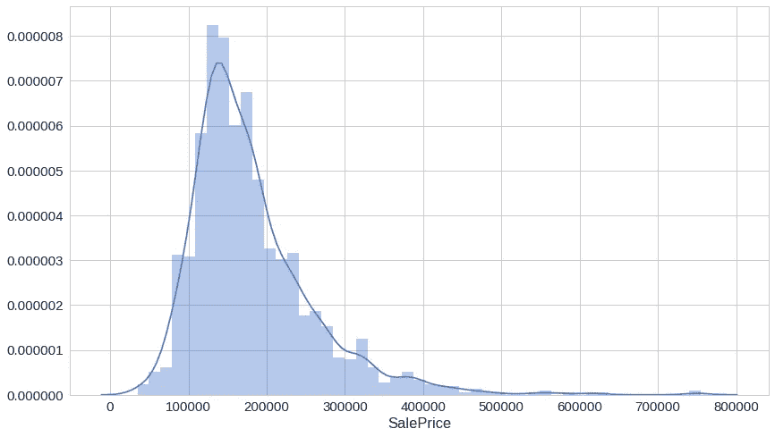

大部分密度介于 100k 和 250k 之间，但在价格较高的一侧似乎有许多异常值。

接下来，我们来看看更大的居住面积(平方英尺)与售价的对比:

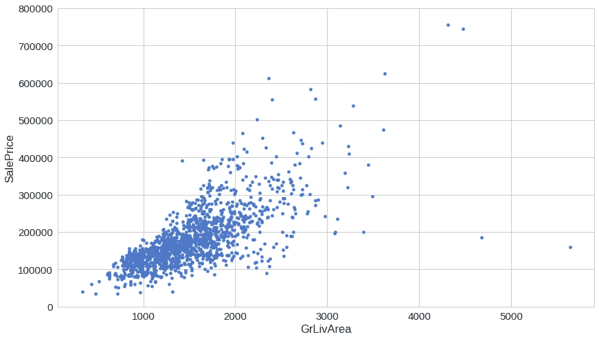

你可能认为更大的居住面积意味着更高的价格。这张图表显示你大体上是正确的。但是那些提供巨大居住面积的 2-3“便宜”的房子是什么呢？

有一列你可能没想到要探索的是“TotalBsmtSF”——地下室面积的总平方英尺，但我们还是要做:

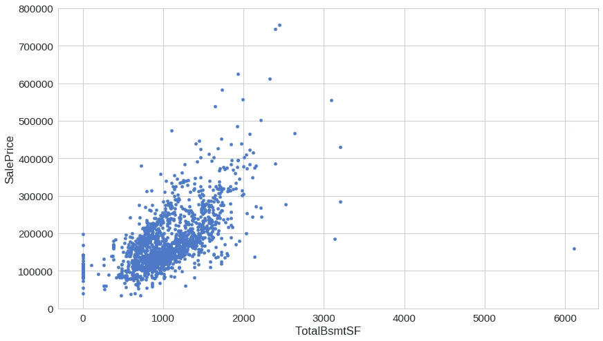

很有趣，不是吗？地下室区域似乎对我们的模型有很大的预测能力。

好了，最后一个。让我们看看“总体质量”——整体材料和表面质量。当然，这看起来更像是一个主观的功能，所以它可能会提供一个关于销售价格的不同观点。

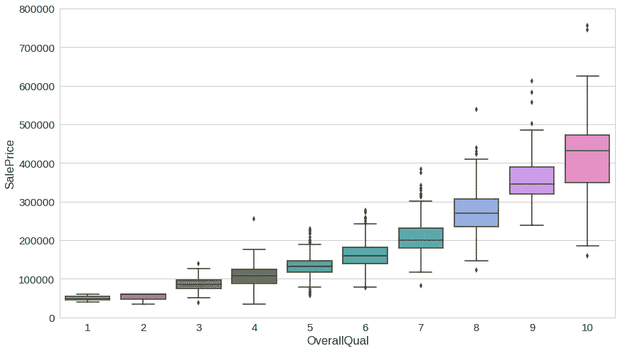

对于这一个来说，一切似乎都很好，除了当你看向正确的东西时，事情开始变得更加微妙。这会“混淆”我们的模型吗？

让我们更全面地了解一下*与售价相关的 8 大*特性:

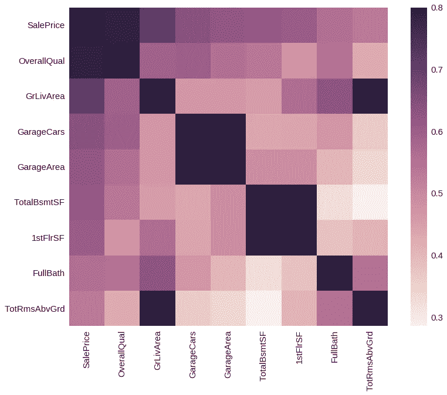

惊讶吗？到目前为止，我们讨论的所有特性似乎都存在。就好像我们从一开始就认识他们…

## 我们有缺失的数据吗？

我们还没有讨论“处理”丢失数据的方法，所以我们将像老板一样处理它们——只是不使用那些功能:

```
|              | Row count | Percentage |
|--------------|-----------|------------|
| PoolQC       | 1453      | 0.995205   |
| MiscFeature  | 1406      | 0.963014   |
| Alley        | 1369      | 0.937671   |
| Fence        | 1179      | 0.807534   |
| FireplaceQu  | 690       | 0.472603   |
| LotFrontage  | 259       | 0.177397   |
| GarageCond   | 81        | 0.055479   |
| GarageType   | 81        | 0.055479   |
| GarageYrBlt  | 81        | 0.055479   |
| GarageFinish | 81        | 0.055479   |
| GarageQual   | 81        | 0.055479   |
| BsmtExposure | 38        | 0.026027   |
| BsmtFinType2 | 38        | 0.026027   |
| BsmtFinType1 | 37        | 0.025342   |
| BsmtCond     | 37        | 0.025342   |
```

是的，我们不会使用任何一个。

# 预测销售价格

现在我们对正在处理的数据有了一些了解，我们可以开始我们的攻击计划了——如何预测给定房屋的销售价格？

## 使用线性回归

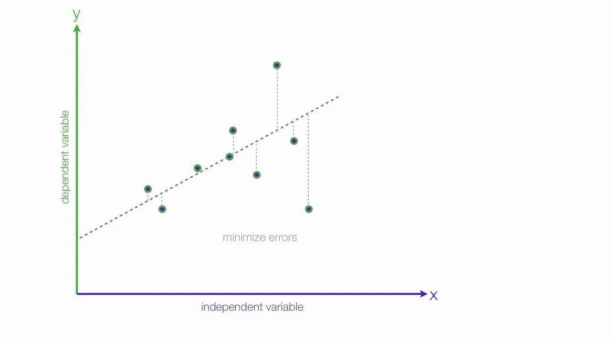

source: [http://mybooksucks.com](http://mybooksucks.com/)

线性回归模型假设因连续变量 Y 与一个或多个解释(自变量)变量 X 之间的关系是线性的(即直线)。它用于预测连续范围内的值(如销售额、价格)，而不是试图将它们分类(如猫、狗)。线性回归模型可以分为两种主要类型:

## 简单线性回归

简单的线性回归使用传统的斜率截距形式，其中 *a* 和 *b* 是我们试图“学习”并产生最准确预测的系数。 *X* 代表我们的输入数据， *Y* 是我们的预测。

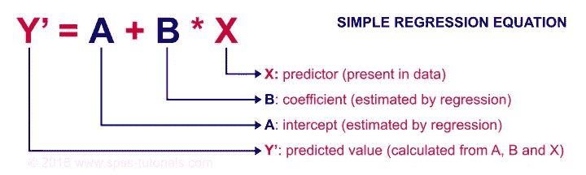

source: [https://spss-tutorials.com](https://spss-tutorials.com)

## 多变量回归

一个更复杂的多变量线性方程可能看起来像这样，其中 *w* 代表系数或权重，我们的模型将尝试学习。

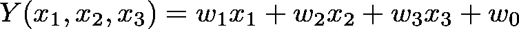

变量`x_1, x_2, x_3`代表我们对每个观察的属性或不同的信息。

# 损失函数

给定我们简单的线性回归方程:


我们可以使用以下成本函数来为我们的模型找到系数/参数:

## 均方差(MSE)成本函数

MSE 定义为:

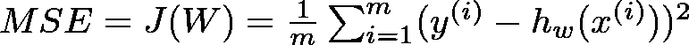

在哪里

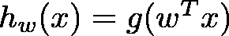

MSE 衡量平均模型预测与正确值的差异程度。当模型在我们的训练数据上表现“差”时，该数字会更高。

MSE 的一阶导数由下式给出:

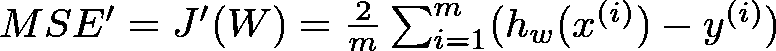

## 半均方误差

我们将对 MSE 应用一个小的修改——乘以 *1/2* ,这样当我们求导时， *2s* 抵消了:

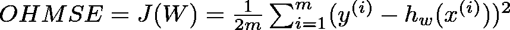

OHMSE 的一阶导数由下式给出:

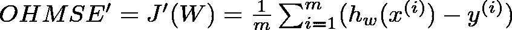

让我们用 Python 来实现它(是的，我们要走 TDD 风格！)

现在我们已经准备好了测试，我们可以实现损失函数:

```
run_tests()
```

揭晓结果的时间到了:

```
..... 
-------------------------------------------------------------- 
Ran 5 tests in 0.007s OK
```

## 数据预处理

我们将使用以下公式(标准化)对数据进行一些预处理:

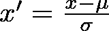

其中是总体均值，σ是标准差。

但是为什么呢？我们为什么要这么做？下面的图表也许能帮到你:

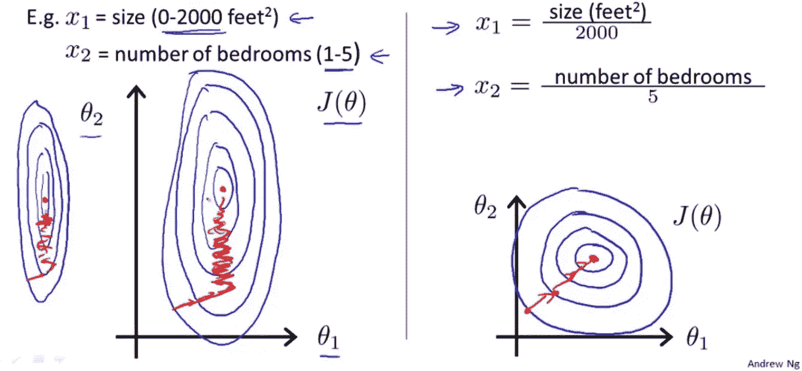

source: Andrew Ng

涂鸦告诉我们，当我们的训练数据被缩放时，我们的老朋友——梯度下降算法——可能会更快地收敛(找到好的参数)。我们走吧。

我们将只对我们的第一个模型使用`greater living area`特性。

## 实施线性回归

首先，我们的测试:

事不宜迟，简单的线性回归实现:

您可能会发现我们的线性回归实现比逻辑回归实现简单。注意，梯度下降算法的使用非常相似。很有趣，不是吗？一个算法可以建立两种不同类型的模型。我们可以用它做更多的事情吗？

```
run_tests()...... 
----------------------------------------------------------------- Ran 6 tests in 1.094s OK
```

## 用我们的第一个模型预测销售价格

让我们使用新创建的模型开始我们的住房市场统治:

训练进行得怎么样？

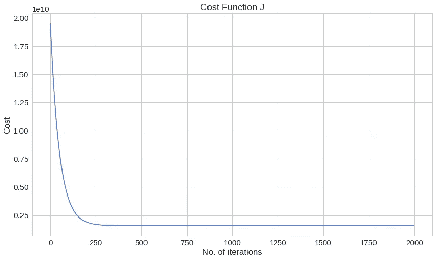

在最后一次迭代中，我们的成本值为:

`1569921604.8332634`

我们能做得更好吗？

# 多元线性回归

让我们使用更多的可用数据来建立一个*多变量线性回归*模型，看看这是否会改善我们的 OHMSE 误差。我们也不要忘记缩放:

## 执行*多变量线性回归*

> 这个空间是故意留白的

## 使用多变量线性回归

既然我们新模型的实现已经完成，我们就可以使用它了。搞定了。？

你看，年轻的学徒，软件开发的神奇世界有那些神话般的创造，叫做 ***抽象*** 。虽然把它们做对可能非常困难，但它们可能会大大降低你编写的代码的复杂性。

你只是使用了一个这样的抽象——叫做 [***矢量化***](https://www.oreilly.com/library/view/python-for-data/9781449323592/ch04.html) 。本质上，这允许我们建立一个*多变量线性回归*模型，而不需要循环我们数据集中的所有特征。整洁，对不对？

我们的客户端界面也保持不变:

结果是:

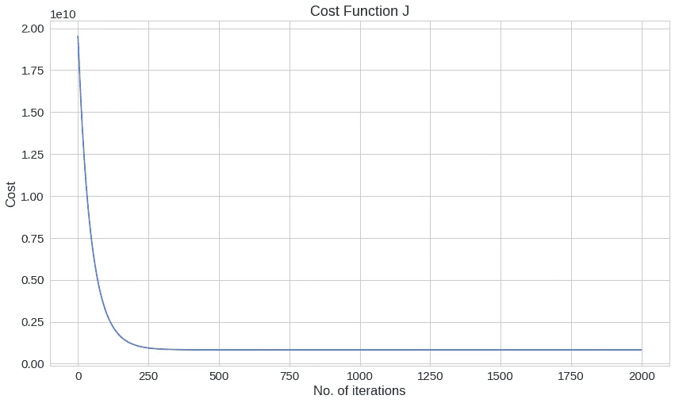

`822817042.8437098`

最后一次迭代的损失几乎小了 2 倍。这是否意味着我们现在的模式更好？

您可以在以下位置找到完整的源代码并在浏览器中运行代码:

[](https://colab.research.google.com/drive/1DXkpo9PmH9_HiCSz9NQlZ9vGQtMIYqmF) [## 线性回归

colab.research.google.com](https://colab.research.google.com/drive/1DXkpo9PmH9_HiCSz9NQlZ9vGQtMIYqmF) 

# 结论

不错！你只是实现了一个线性回归模型，而不是简单/蹩脚的那种。

您可能想尝试的一件事是在 Kaggle 的测试数据集上预测房屋销售价格。这个模型好看吗？

在下一部分中，您将从头实现一个决策树模型！

## 从零开始的机器学习系列:

1.  [逻辑回归智能折扣](/smart-discounts-with-logistic-regression-machine-learning-from-scratch-part-i-3c242f4ded0)
2.  **用线性回归预测房价**
3.  [用 Python 从头开始构建决策树](https://medium.com/@curiousily/building-a-decision-tree-from-scratch-in-python-machine-learning-from-scratch-part-ii-6e2e56265b19)
4.  [利用 K 均值聚类进行调色板提取](https://medium.com/@curiousily/color-palette-extraction-with-k-means-clustering-machine-learning-from-scratch-part-iv-55e807407e53)
5.  [用朴素贝叶斯进行电影评论情感分析](https://medium.com/@curiousily/movie-review-sentiment-analysis-with-naive-bayes-machine-learning-from-scratch-part-v-7bb869391bab)
6.  [使用随机梯度下降的音乐艺术家推荐系统](https://medium.com/@curiousily/music-artist-recommender-system-using-stochastic-gradient-descent-machine-learning-from-scratch-5f2f1aae972c)
7.  [利用神经网络进行时尚产品图像分类](https://medium.com/@curiousily/fashion-product-image-classification-using-neural-networks-machine-learning-from-scratch-part-e9fda9e47661)
8.  [使用强化学习在后启示录世界中构建一个出租车驾驶代理](https://medium.com/@curiousily/build-a-taxi-driving-agent-in-a-post-apocalyptic-world-using-reinforcement-learning-machine-175b1edd8f69)

喜欢你读的吗？你想了解更多关于机器学习的知识吗？提升你对 ML 的理解:

[](https://leanpub.com/hmls) [## 从零开始实践机器学习

### “我不能创造的东西，我不理解”——理查德·费曼这本书将引导你走向更深的…

leanpub.com](https://leanpub.com/hmls)