# 预测医疗保健提供商对政府来说有多贵

> 原文：<https://towardsdatascience.com/predicting-how-expensive-a-healthcare-provider-is-for-the-government-9ef0cccf8a72?source=collection_archive---------23----------------------->

## 将线性回归应用于医疗保险数据

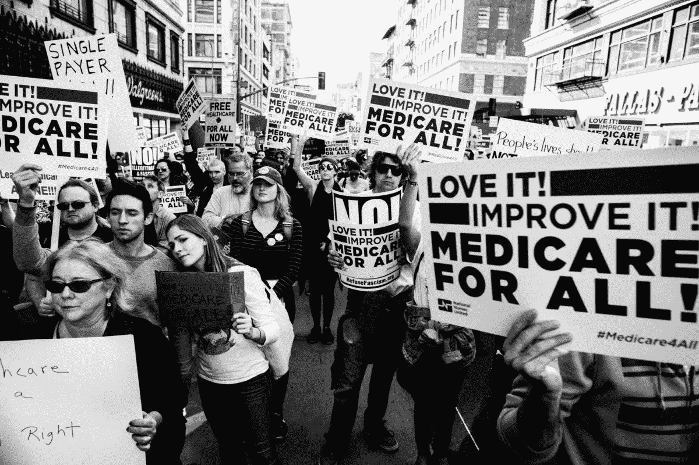

Medicare for All Rally by Molly Adams ([Flickr](https://www.flickr.com/photos/mollyswork/35153038060/in/photolist-Vymvv7-VTKikh-UScjUu-W9xAKp-W9xBCB-VTKk6w-gb7DJu-5Axiq4-cADQ2s-54VQnW-5AByeQ-9opsLj-9if6es-USckGw-5zhjF7-W9xBjv-5ABxCh-5ABxpw-VTKiRh-W9xzaa-W66koo-W66kSj-VTKfGb-VTKgpy-RNYoTC-jTgVre-cBgnMA-5sfurc-5zd2cK-5AxiFe-QL2JD1-RZdne1-dkk864-5zd2CH-5zhj2W-5ABxY9-EXHPC7-5zhj4Y-5zhiq7-5ABwYU-cADNn9-5zoF79-5zd2kX-6QZ5rH-aBzEb6-7joT9p-azN96o-azKNik-SfRqxB-5zhjnj))

作为 Metis 数据科学训练营的学生，我们的任务是为我们的第一个个人项目建立一个线性回归模型。够简单吧？通过数据画一条线就行了。

没那么快！

作为一名医疗保健专业人员，我很高兴使用这种算法来解决医疗领域的一个问题。但我很快发现，在任何建模之前，一个成功的机器学习项目都是从挑选正确的数据开始的。线性回归最适用于连续的数字数据，它排除了几个公开的医疗保健数据来源。然而，事实证明，医疗保险支付数据是一个完美的匹配。

但是为什么要关心医疗保险呢？医疗保险是一项政府资助的健康保险计划，目前覆盖 4400 万人，即美国八分之一的人口( [1](https://maprx.info/15yearreport/) )。这给政府带来了巨大的公共健康和财政影响。一旦你年满 65 岁，你就有资格享受这一福利，只有少数例外，比如残疾的年轻人或患有晚期肾病的人。这个群体只会越来越大。事实上，人口普查局估计，到 2030 年，仅老年人口就将增加近一倍，达到 7800 万，相当于五分之一的美国人。

最重要的是，由于医疗保险在全国政治讨论中的流行，它在未来几年似乎会变得越来越重要。如果美国要采用单一付款人制度，比如拟议中的[全民医保](https://www.congress.gov/bill/116th-congress/senate-bill/1129/text)，我们就必须尽可能降低成本，而有效利用数据有助于实现这一目标。

做到这一点的一个方法是查看医疗保健提供者的成本。你可以在我的 [GitHub 库](https://github.com/tcbonds/medicare-cost-predictor)上跟随我的代码；为了您的方便，我按照时间顺序整理了这篇文章。

在搜索医疗保险和医疗补助服务中心网站后，我能够获得最新的[提供者支付数据](https://www.cms.gov/research-statistics-data-and-systems/statistics-trends-and-reports/medicare-provider-charge-data/physician-and-other-supplier.html)，该数据有超过 100 万行，每一行对应一个医疗保健组织或个人提供者，以及 70 个特征。

# 数据清理

但不出所料，这个数据相当乱。因此，为了尽可能收集最可靠的信息，我决定将我测量的范围缩小到美国的单个供应商，不包括地区和军事区域。

然后，我用计数或百分比数据替换了列中所有缺失的值。如果一个提供者没有患有某种疾病的患者，那么这个字段很可能是空白的；这意味着在不损失太多保真度的情况下估算空值应该是相对安全的。

还有一些[文档](https://www.cms.gov/Research-Statistics-Data-and-Systems/Statistics-Trends-and-Reports/Medicare-Provider-Charge-Data/Downloads/Medicare-Physician-and-Other-Supplier-PUF-Methodology.pdf)提供了每个列名的含义。我决定目标变量应为 total_medicare_payment_amt，这是扣除自付额和共同保险金额后，政府为每位患者支付的所有提供商服务的总金额。此外，我删除了所有不必要的列(如提供商名称)或可能导致数据泄漏的列(如其他基于价格的列)。

最后，我只剩下 38 个特征的 990，000 多行。我们开始吧！

# 初始模型

使用 Statsmodels python 库，我只是将所有数据放入普通的最小二乘(OLS)线性回归中，看看它在没有修改的情况下最初会如何执行。

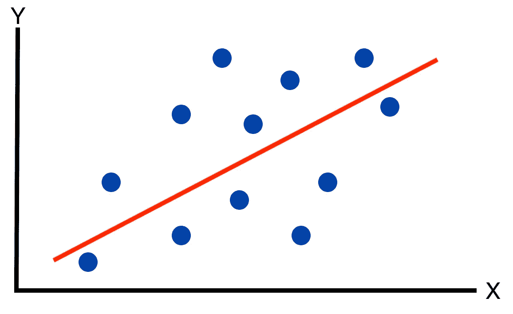

Univariate Linear Regression Example

如前所述，线性回归试图找到自变量和因变量之间的线性关系。上面，你可以看到只有一个自变量或特征的最简单的单变量形式。它使用方程 y = mx + b 来寻找与数据的最佳拟合；m 是斜率，b 是 y 截距。

但是很明显有了 38 个特征，这个线性回归问题就复杂多了。在这种情况下，将有 38 个“mx”项加在一起，每个 m 项对应于特定变量对因变量的影响的大小和方向。在几何术语中，我们将把 38 维超平面拟合到 39 维空间(而不是直线)。如果你找到一种方法来想象这个，请告诉我！

好了，现在我们对模型有了一些直觉，但是我们如何确定模型做得有多好呢？

这里通常使用的度量标准称为决定系数或 R 平方。本质上，它是由特征预测的目标变量的方差的百分比。我们希望 R 平方接近 1，这表明该模型非常具有预测性。

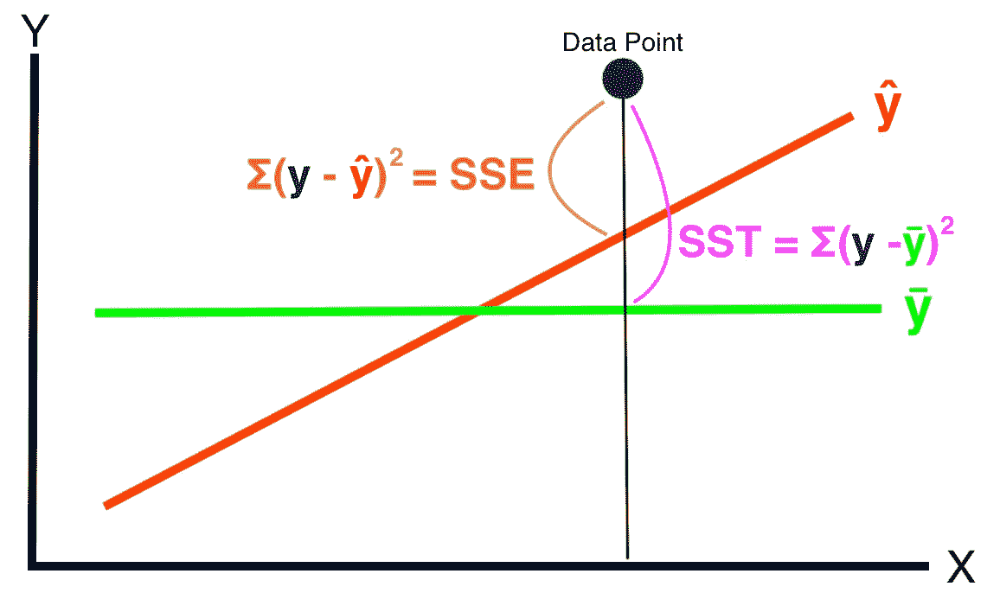

The Inner Workings of R-squared

但让我们更深入地研究一下 R 平方的实际公式，因为它有助于我们理解我们是如何评估该模型的。我们可以用来预测医疗保险费用的最简单的方法就是猜测平均费用。这就是上图中的绿色ȳ(称为 y-bar)。这将是我们的基线。

但是我们可以通过使用线性回归或红色ŷ(称为 y-hat)做得更好。现在，我们只需找出这两个预测值与实际值的差距，并将它们相除(SSE/SST)。这将告诉我们模型*不能*解释的方差的百分比。但是我们真正想知道的是这个模型*解释了多大百分比的方差。从 1 中减去这个值就可以得到结果。*

```
1 - (Error Sum of Squares/Total Sum of Squares) **or** 1 - (SSE/SST)
```

运行初始模型后，R 平方为 **0.619** 。这意味着我们的模型只能解释大约 62%的数据变化。那不太好。

# 检查我们的假设

但是等等！线性回归有许多[假设](https://www.statisticssolutions.com/assumptions-of-linear-regression/)，检查我们的数据是否真的适用于这个模型是很重要的。

**假设#1:** 目标变量和特征之间存在线性关系吗？


Number of Services vs Total Medicare Cost Before Feature Engineering

出于说明的目的，如果我们使用医疗保险总成本的特征，它并不完全清楚。为了纠正这种情况，我们可以做一些功能工程。一种选择是对特征和目标都进行对数变换。

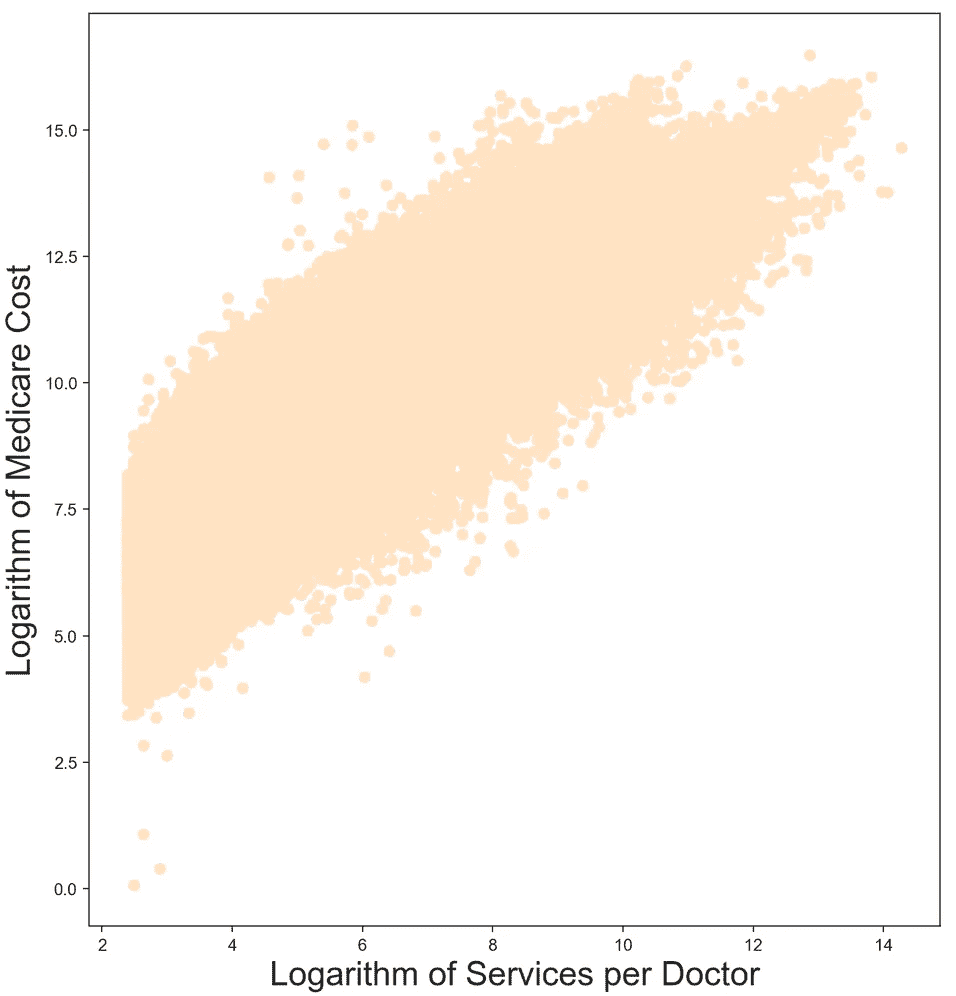

Number of Services vs Total Medicare Cost After Feature Engineering

哇！这是一个巨大的进步。任何人都可以通过它划清界限！如您所见，通常情况下，我们需要以特定的方式转换数据，以使其符合我们正在使用的模型的假设。

*注意:*为了将您的值返回到原始的上下文，请始终记住在之后撤消这个转换。因为毕竟，医疗保险费用的对数到底意味着什么？

**假设#2:** 目标和特征是否正态分布？

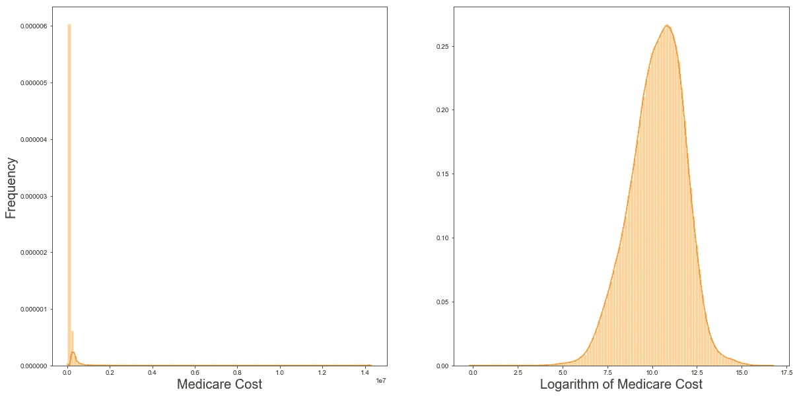

Total Medicare Cost Before and After Feature Engineering

在上图中，左图显示了使用对数变换之前的目标变量；正如你所看到的，它严重向右倾斜。另一方面，右边的图显示了应用这种变换如何产生显著的正态分布。

**假设#3:** 要素之间很少或没有多重共线性吗？

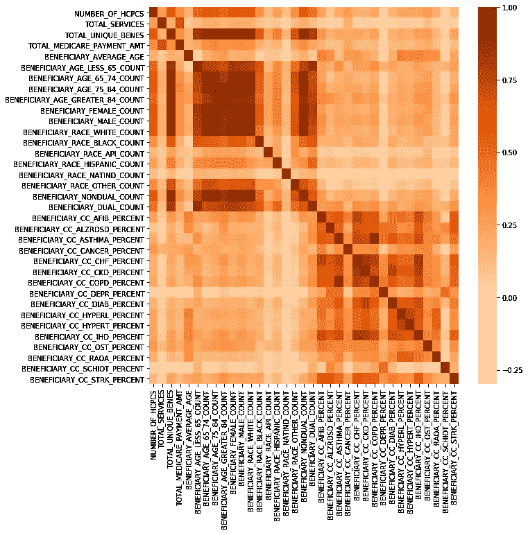

Correlation Coefficient Heat Map of All Variables

[多重共线性](https://www.statisticssolutions.com/multicollinearity/)是指要素之间高度相关。上图中，我们看到了一张热图，深色表示强正相关。理想情况下，除了中间的对角线之外，我们在其他地方只能看到浅色，因为很明显，一个变量将与自身完全相关。

但在现实中，我们看到深色到处出现，这表明我们违反了这一假设。这可能导致不精确的回归系数，或者更糟糕的是，不同样本中相同特征的符号发生变化，从而难以可靠地从这些系数中提取意义。

解决这一问题的方法是移除要素，直到不再存在任何共线性。正如稍后将讨论的那样，正则化技术通过将彼此共线的一些要素的系数置零来实现这一点。

**假设#4:** 残差与自身相关吗？

当特定要素的残差相互不独立时，就会发生自相关。这被认为是不好的，因为它表明模型没有从数据中提取所有可能的信息，因此，我们在残差中看到它。

这可以通过德宾-沃森测试来衡量。接近 2 的值表示没有自相关，而接近 0 或 4 的值表示强自相关。我们的初始模型的值为 1.998，表明该模型正在提取尽可能多的信息，并且已经满足了假设。

**假设#5:** 数据是同质的吗？

这里我们要避免的是异方差，一个有简单解释的大词。这是指残差的方差在要素的值范围内发生变化。

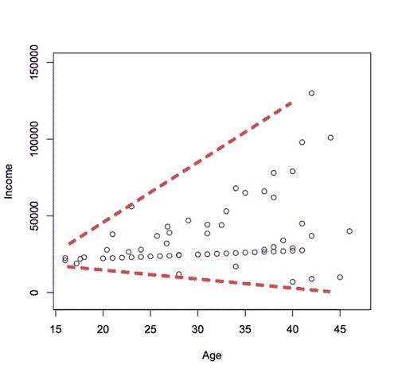

An Example of Heteroskedasticity ([Source](http://www.statsmakemecry.com/smmctheblog/confusing-stats-terms-explained-heteroscedasticity-heteroske.html))

正如你在这个假设的例子中看到的，很明显，随着年龄的增长，方差变得更大。这并不好，因为这意味着我们的模型在预测年龄越大的人时会越差。我们真正想要的是在整个数值范围内一致的可预测性和方差，称为同伦方差。换句话说，两条红色虚线将相互平行。

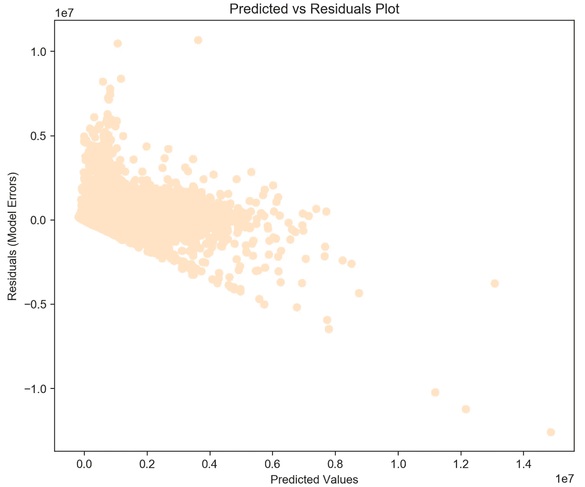

Predicted vs Residuals Plot Before Feature Engineering

这里我们看到了医疗保险数据模型的预测值和残差。这看起来一点都不好。负残差中有一个严格的截止值(由于政府成本总是大于或等于 0 ),并且方差在值的范围内完全不一致。

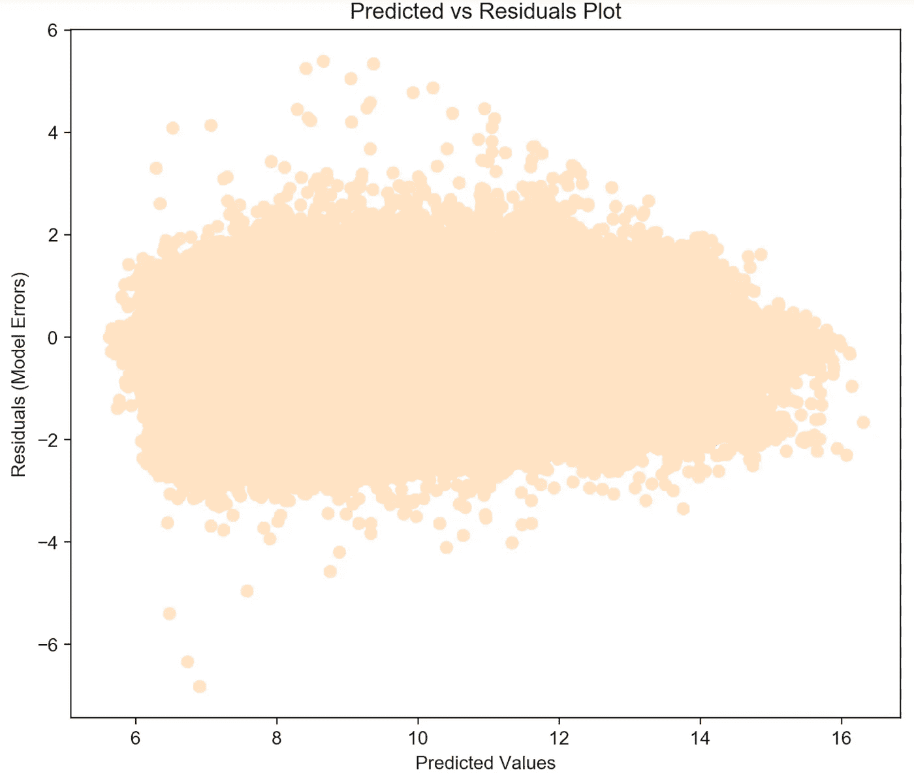

Predicted vs Residuals Plot After Feature Engineering

但是在应用了我们之前所做的对数变换之后，这个图现在看起来是相对同伦的，我们已经满足了这个假设。嘣！

# 二次建模

因此，在检查了所有特性的假设之后，我决定对 3 个特性和目标变量应用对数转换。

现在，我将这个新转换的数据放回模型中，经过训练后，它产生了一个 R 平方值 **0.92** 。太棒了。这是一个可靠的结果，因为与基线模型相比，新模型可以解释 30%以上的数据差异。这表明转换数据以满足所选模型的假设是多么重要。

但这只是一个 OLS 模型。我们可以应用前面简单提到的正则化技术，这将进一步加强我们的模型。这些给成本函数增加了一个额外的项，使模型变得复杂。这是一个好主意，因为简单的模型通常比复杂的模型更好，因为它们不容易受到[过度拟合](https://statisticsbyjim.com/regression/overfitting-regression-models/)的影响。

换句话说，复杂模型往往非常适合训练数据，但在看不见的数据上表现不佳。我切换到 scikit-learn 库来做这种规范化，同时通过测试序列分割和交叉验证来增加过程的严密性。

我用[岭和套索回归](https://hackernoon.com/an-introduction-to-ridge-lasso-and-elastic-net-regression-cca60b4b934f)进行了实验，并对决定正则化程度的阿尔法项进行了超参数调整。令人惊讶的是，优化 alphas 的两个模型的表现基本上与 OLS 模型完全相同，R 平方为 **0.92，【ridge 明显优于 LASSO。这表明正则化对模型没有显著的帮助。**

套索系数也支持这一发现。LASSO 通常会将任何多余的特征归零，只留下少数几个。相比之下，最好的套索模型只清除了 38 个特征中的 1 个。这是一个令人惊讶的结果，表明大多数特征都有助于模型的可预测性，因此更强的正则化只会损害模型的性能。

# 特征重要性

说到系数，我们可以通过查看系数的符号和大小来确定每个特征的重要性。这使我们能够为我们的利益相关者提供有价值的商业见解，在这种情况下是医疗保险和医疗补助服务中心。

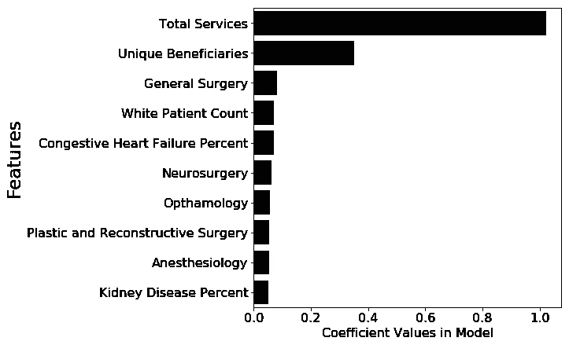

Top 10 Features That Increase Medicare Costs (Positive Coefficients)

在前 10 个特征中，我觉得有趣的是第四个最重要的特征是一个提供者拥有的白人患者的数量。这是令人担忧的，因为模型实际上似乎以某种有意义的方式关心种族。

这可能暴露了系统的潜在缺陷，表明白人人口过多，因此与其他种族相比，白人在医疗保险费用中所占的比例更大。需要进行其他研究来确定根本原因，但很有可能得不到充分服务的人群缺乏获得服务的机会也是原因之一。

这是一个强有力的结果，也是数据科学对社会价值的一个例子。我惊讶地发现，我不仅可以用这种算法来提高利益相关者的底线，还可以揭示社会差距。这是我热爱数据科学的主要原因之一；它会对我们的社会产生巨大的影响。

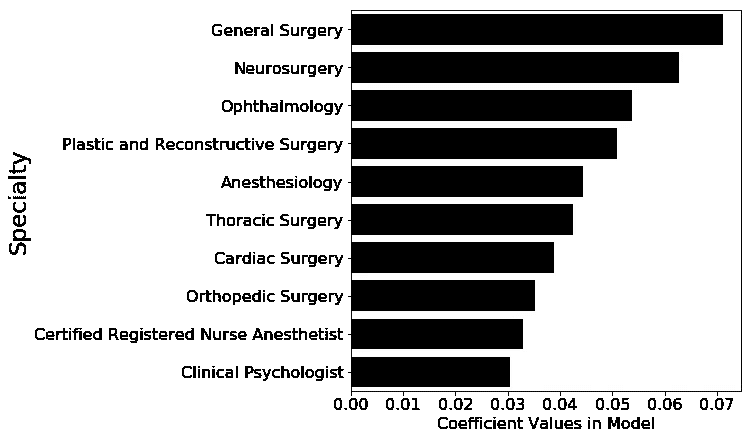

Top 10 Most Expensive Specialties

看看最贵的专科，外科显然脱颖而出。这是有意义的。手术非常昂贵。这意味着政府应该尽最大努力降低手术成本，以便最大程度地影响他们的底线。

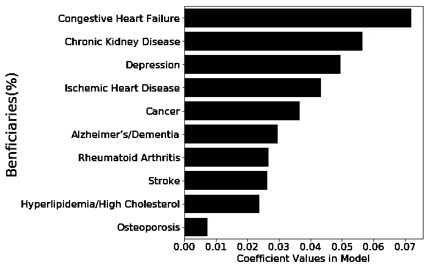

Top 10 Most Expensive Medical Conditions

就医疗条件而言，基本上可以预防的慢性病占据了上风。这一发现是一把双刃剑，与我们已经知道的一致。可悲的是，这意味着这些医疗保险患者中的大多数正在遭受疾病，如果他们有不同的生活方式选择，他们就不会遭受这些疾病。从金融和伦理的角度来看，这绝对是可怕的。

但从更积极的方面来看，这意味着政府可以节省大量的资金，同时通过开始关注预防性生活方式药物而不是被动治疗，如手术，来减少巨大的痛苦。

显然，我们不需要数据科学来告诉我们吃得更好，多运动。但是这进一步支持了我们都知道的对社会中每个人的幸福是必要的。

在这个过程中，我们建立了一个模型来准确预测医疗保健提供商对政府来说有多贵。省钱和拯救生命，我们还能要求什么？