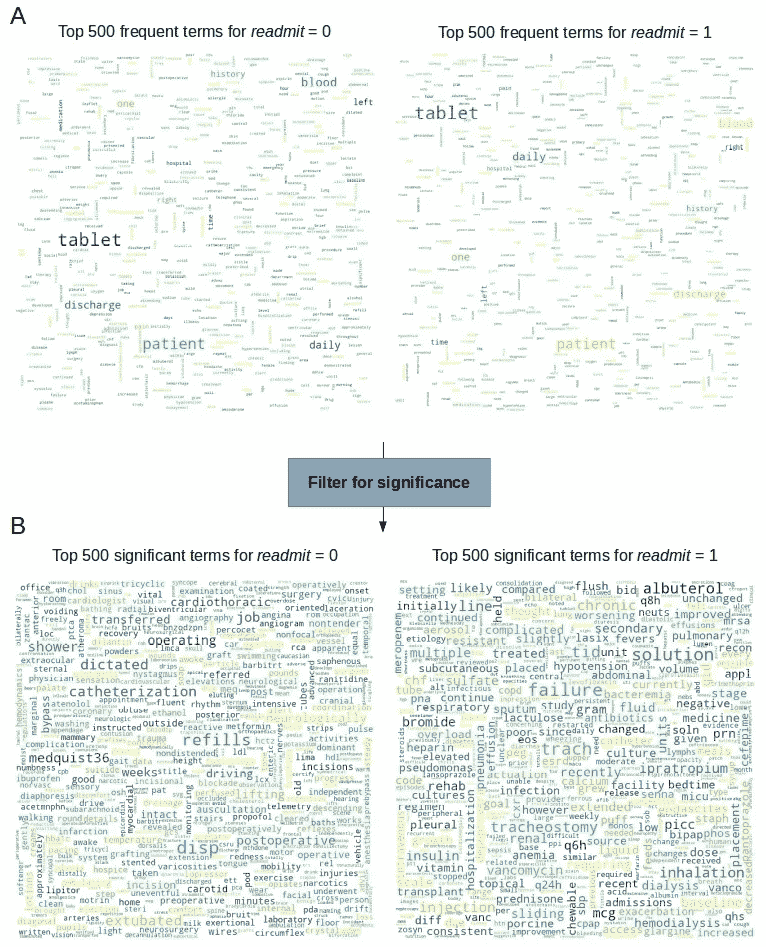
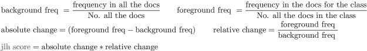
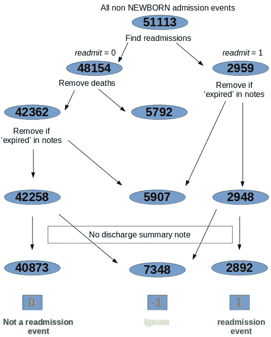
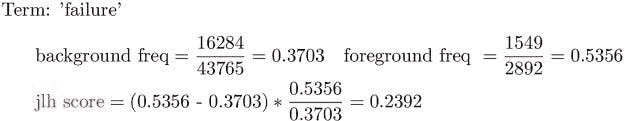
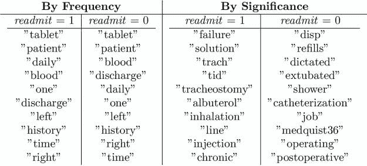
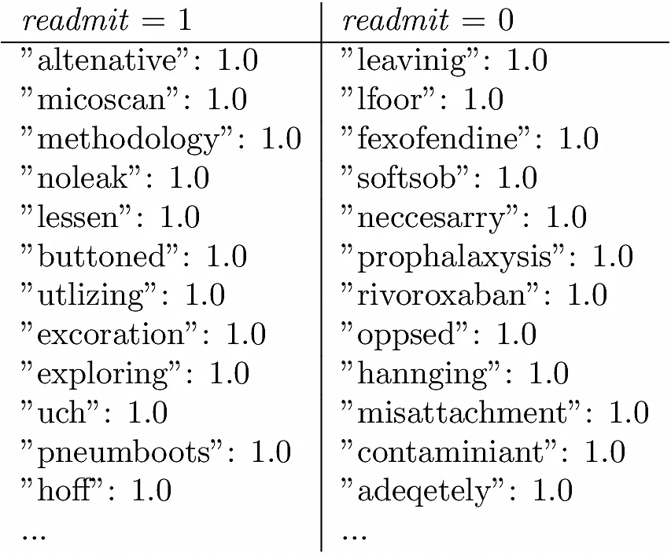

# 从出院记录预测 ICU 再入院:重要术语

> 原文：<https://towardsdatascience.com/predicting-icu-readmission-from-discharge-notes-significant-terms-270f6c6bb8f9?source=collection_archive---------32----------------------->



使用高频术语进行查询提高了召回率和稀有术语的精确度。重要术语平衡了两者，同时在检索到的文档可能属于的潜在类别中提供了一些辨别能力。此处研究 MIMIC-III 数据集的背景是根据出院记录预测患者再入院，弹性搜索驱动显著性测量…

了解哪些患者可能会重复入住重症监护室(CCU)是有用的。患者和支持团队可以格外警惕和规避风险，以尽量减少这种结果。任何 CCU 入院都会有大量数据，如患者的生命体征、诊断、提供的治疗、实验室结果等。除了预后和未来护理计划之外，这些数据通常都包含在*出院记录*中。我们能使用所有这些信息来帮助我们的预测任务吗？

各种传统的分类器(例如逻辑回归[和新的基于 BERT 的模型(例如](/introduction-to-clinical-natural-language-processing-predicting-hospital-readmission-with-1736d52bc709) [ClinicalBERT](https://arxiv.org/abs/1904.05342) )在过去已经被用于相同的任务，并取得了一些成功。因此，这里没有人声称这是开创性的工作——但我们确实以一种不同的方式来完成这项任务。当然，还要与其他产品进行比较，看看有什么好处。这是这篇文章的概要。

*   检查重要的术语，看看它们为什么有用
*   简要描述公开可用的 MIMIC-III 数据集，特别是我们感兴趣的 CCU 入院和出院记录
*   建立一个弹性搜索索引，其中每个文档都是一个出院记录，带有一个标签，指示同一患者在出院后 30 天内是否再次入院( *readmit = 1* )或是否再次入院( *readmit = 0* )
*   提取两个类别中的重要术语
*   使用这些有意义的术语对一组出院记录进行评分，看看我们做得有多好。由于篇幅的原因，我们将在下一篇文章中讨论这个问题。

我们将在这里查看一些代码片段，用于将 MIMIC-III csv 数据转换为弹性搜索索引，但是 MIMIC-3 数据集本身需要单独获得。

## 1.重要术语

在任何文本分类任务中，知道哪些单词可能在一个类别中相对于所有其他类别更普遍是非常有用的。这些术语有可能被用作类的定义特征，从而为分类任务提供一个钩子。这些是*重要术语*。它们不必是该类别中最常用的术语，也不必是最罕见的术语。在大多数情况下，事实并非如此。就此类术语的存在程度而言，我们可以将它们定义为:

> 显示所有放电记录与特定类别放电记录之间测得的频率发生显著变化的术语
> 
> (转述自 elastic.co 的

通过罕见的术语进行搜索给出了很好的精确度，但是召回率会很低。高频词广撒网，提高了召回率，但精确度受到影响。重要术语试图在两者之间取得平衡。当从本质上相同的词汇表(例如，像病人出院记录)构建类时，考虑到精确度/召回率的折衷，重要的术语总体上可以更好地识别匹配的文档。

请参见[杨和 Pedersen，“文本分类中特征选择的比较研究”](http://courses.ischool.berkeley.edu/i256/f06/papers/yang97comparative.pdf)从跨多个类别的文本语料库中提取这些重要术语的详细背景、分析和方法。此外，Elasticsearch 为索引文本提供了这些方法(以及其他一些方法)的现成实现。在它的默认实现中，我们可以按照为每个术语计算的所谓的 *jlh* 分数来排序这些重要的术语，如下所示。



Equation 1\. The jlh score is a compromise between precision and recall

有了每个类别的这些术语，我们就有可能对类别概率的放电笔记进行评分，并确定该笔记应属于哪个类别。这是基本的想法。

## 1.MIMIC-III 数据集

[论文](https://www.nature.com/articles/sdata201635)的摘要指出:

> MIMIC-III(“重症监护医疗信息集市”)是一个大型的单中心数据库，包含与大型三级护理医院重症监护病房收治的患者相关的信息。数据包括生命体征、药物治疗、实验室测量、护理提供者绘制的观察和记录、体液平衡、程序代码、诊断代码、成像报告、住院时间、存活数据等。
> 
> 约翰逊等人。艾尔。2016

数据以各种 csv 文件的形式提供。就我们的目的而言，我们感兴趣的是“录取”。CSV "和" NOTEEVENTS。CSV”。入院文件允许我们判断某个特定的入院事件是否实际上是同一患者的再入院事件(当然，在某个时间段内，这里假定为 30 天)。“招生”的有用栏目。CSV”对于我们的目的是:

```
"ROW_ID", "SUBJECT_ID", "HADM_ID", "ADMITTIME","DISCHTIME", "DEATHTIME", "ADMISSION_TYPE",.. "HOSPITAL_EXPIRE_FLAG" ..
```

处理录取文件时需要注意的几件事是:

*   死亡时间不为空或 HOSPITAL_EXPIRE_FLAG 等于 1 表示该住院以患者死亡结束。入院类型可以是[“紧急”、“选择性”、“紧急”、“新生儿”]之一
*   如果入院事件最终导致患者死亡，那么该患者自然永远不会有再入院事件。因此，此类入院事件不应被视为不准再入院事件。
*   如果入院事件是选择性的(即由患者发起)，则即使该事件发生在上次出院后 30 天内，也不会被视为再次入院事件
*   所有新生儿入院事件都被忽略，因为新生儿显然由于各种原因被例行地移入和移出 CCU

NOTEEVENTS 文件只有我们感兴趣的几列。

```
"ROW_ID","SUBJECT_ID","HADM_ID", ..., "CATEGORY", ... ,"TEXT"
```

*   当该行的“类别”列显示为“出院小结”时，我们使用“文本”列。
*   SUBJECT_ID 和 HADM_ID 允许我们在招生中加入一个招生事件行。
*   尽管入院中的每行在 NOTEEVENTS 中至少有一行，但该行可能没有“出院总结”类别。录取文件中的那些录取事件自然不会成为我们分析的一部分。
*   当有出院总结时，通常每个入院事件有*份*份。但是有些入院事件确实有两个出院小结，不管什么原因。我们在这里把它们连接起来。
*   在少数情况下，出院记录显示患者已经过期，而同一事件的入院文件(SUBJECT_ID 和 HADM_ID 组合)却没有。不知道为什么，但为了安全起见，我们不考虑他们。

## 2.弹性搜索指数

我们将招生和 NOTEEVENTS 文件中的内容编入一个单一的弹性搜索索引。索引中的每个文档都将

*   对应于入院事件(SUBJECT_ID 和 HADM_ID 组合)
*   有相关的出院小结(如果不止一个，则串联)
*   让*重新接收*标签按照上面的讨论进行计算。
*   *再入院= 1* 此入院是指患者在较早出院后的 30 天内再次入院
*   *重新接纳= 0* 不是重新接纳事件

我们从这两个文件中选择我们需要的列。索引的数据模型很简单。

## 2.1 模型

数据模型本质上是一对一的，对于以编程方式连接的两个文件中的每一个，列到字段都有正确的类型关键字/文本/日期等。这些文件中的每一行都有 SUBJECT_ID 和 HADM_ID。它为我们提供了一个自然的连接条件，同时为每个准入强制执行一个出院总结，在我们的例子中，当 NOTEEVENTS 文件中有更多的出院总结时，将它们连接起来。SUBJECT_ID 和 HADM_ID 一起是我们索引的文档 ID。并且每个文档得到计算的标签 *readmit* — 0 或 1。这就很好地为我们想要对这些数据使用的任何分类器做好了准备。

录取文件上的日期是这样的:*2196–04–09 12:26:00*(未来之路！)因此，下面是日期字段的映射。日期值可能看起来很奇怪，但它们已经从实际值*及时转移*——PHI&HIPAA 在起作用。这是我们最终的索引映射。字段令牌和内容来自 NOTEEVENTS 文件。

在索引中携带标记数组的原因是我们希望密切控制标记化——而不是让 Elasticsearch 替我们做这件事。因此，我们用 NLTK 对 NOTEEVENTS 中的流量摘要进行标记，并使用可选的词汇化。内容只是标记的连接。它就在那里，以便我们可以看到和查询文本形式的出院记录。

根据 HIPAA 合规性，出院记录包含几个用于删除摘要中 PHI 的屏蔽词。我们在这里用不到它们，所以除了 NLTK 停用词之外，还要删除一些。

## 2.2 指数

在我的笔记本电脑上运行索引需要几分钟时间。我们需要做的一件事是增加 Elasticsearch 可以生成的聚合桶的数量。我们更新了聚类设置，因此这个数字大于我们拥有的患者数。

首先，当从文件中读取时，所有的许可(除了新生的)都被索引，并设置为 *readmit* = 0。然后，在处理 NOTEEVENTS 文件时，这些文档会用释放摘要(令牌和内容)进行更新。其中大多数都是通过以下流程作为批量索引操作来执行的。添加“time.sleep()”调用是为了确保在处理流程中可以通过搜索查询检索到索引文档。

上面的关键部分是计算*重新提交*标签。下面的代码片段查询索引以获得按 ADMITTIME 排序的每个患者的入院情况。一个选择性录取永远不会有*重录取* = 1。但它可能会导致将来的重新入院事件，因此我们需要处理它。我们也排除了那些因院内呼气事件导致的入院。当前入院时间与前一次入院时间之差应小于 30 天，符合再次入院条件。

我们必须记住删除那些为*重新接收*标记为 0 的住院过期事件。下面的代码片段 *removeDeaths()* 更新它们，以便*重新提交* = -1。它们会出现在索引中，但我们会在分析中将其过滤掉。

函数 *removeExpired()* 在出院记录中包含术语“Expired”的少数情况下，将 readmit 标签设置为-1，但由于某种原因，数据文件中的 HOSPITAL_EXPIRE_FLAG 没有正确设置为 1。

最后，函数 removeEmptyNotes()将所有那些没有出院小结的入院事件的重新入院标签设置为-1，因为它们属于不同的类别。我们在上一节中讨论了这一点。

我想我们可以将这三个移除函数合并成一个，这样可以节省一些编写工作…但是它们已经完成了工作，所以让我们继续。

## 2.3 数据

运行索引器输出票据上计算标签的分布进度。



Figure 1\. Of the 51113 admission events 2892 of them resulted in readmission within 30 days.

这些班级很不平衡，在考虑的 43765 名入学者中，再入学者仅占 6.6%。在下一篇文章的分类练习中，我们会对更大的类进行二次抽样来处理这个问题。

## 3.重要术语

有了干净的标记和索引，我们就可以提取每个类中的重要术语了。首先，让我们通过实际计算一个学期的分数来说明我们在第 1 节中所说的关于 jlh 的分数。

## 3.1*jlh*分数

我们的背景设定是所有的放电笔记:40873 + 2892 = 42765。前景集是这两个类中任何一个的音符。所以我们得到了每个类的一组重要术语。查询很简单。对于*重新提交* = 1 类，查询如下。前景注释集来自重新入院事件。background_filter 子句包括了 *readmit* = 0 和 *readmit* = 1(同时排除了索引中仍然存在的 *readmit* = -1！).正是我们想要的。

运行上面的代码会产生前 100 个重要术语，按照类 readmit = 1 的 *jlh* 分数排序。让我们看看最上面的一项，并确认分数与我们在等式 1 中的公式一致。

```
"aggregations" : {
    "driver_words" : {
      "doc_count" : 2892,
      "bg_count" : 43765,
      "buckets" : [
        {
          "key" : "failure",
          "doc_count" : 1549,
          "score" : 0.2392225894630799,
          "bg_count" : 16204
        },
        {
...
```



Figure 2\. Computing the jlh score for a term

我们在这里计算的 *jlh* 分数与响应中的分数匹配。

## 3.2 频率与重要性

看看这两个类的前 10 个术语(*重新接纳* = 0 & 1)是很有启发性的，包括频率和重要性。只是为了证明原始频率在描述一个类的特征方面并不是很有帮助…



Figure 3\. There is no difference in the top 10 terms by Frequency in either class, except for a minor change in order. On the other hand, the significant terms for the two classes have zero overlap.

更好的是，为了鸟瞰，我们可以并排查看两个类中的频繁和重要术语的 wordcloud 图表。


Figure 4\. (A) You cannot tell a potential future readmission discharge note from looking at the high frequency words. (B) Focusing on the significant terms we do see a good bit of difference between the two notes

## 3.3 稀有性与重要性

人们可能会认为，在识别类别时，稀有术语(按类别)可能比高频术语做得更好。不幸的是，在任何真实文本语料库中，这些罕见的术语都受到拼写错误的困扰，许多这样的词的计数为 1(长尾)，因此没有产生任何价值。为了完整起见，这里是 MIMIC-III 数据集中按类别列出的最罕见的术语(带有计数频率)。



Figure 5\. Rare terms are plagued by spelling errors, thereby yielding little value to the analysis. Plus we get whipped by the long tail of such words with the same low frequency

几乎所有罕见的术语似乎都是拼写错误的单词。使用最低阈值频率(> 1)作为一个罕见的词可能会有所改善，但你的里程可能会有所不同。

## 4.结论

在本帖中，我们有:

*   描述了重要术语对信息检索的有用性
*   描述了 MIMIC-III 数据集，并在 Elasticsearch 中对其进行了索引，目的是使用当前入院的出院记录预测潜在的未来 ICU 再入院事件(或不)
*   使用 Elasticsearch 过滤每门课笔记中的重要术语
*   我们发现，重要术语似乎能更好地区分这两个类别，而高频术语或罕见术语则不能

这为后续的文章打下了基础，在后续的文章中，我们将如何利用这些重要的术语来预测一组放电记录。

…

*原载于 2019 年 11 月 30 日*[*【xplordat.com】*](http://xplordat.com/2018/09/27/word-embeddings-and-document-vectors-part-1-similarity/)*。*