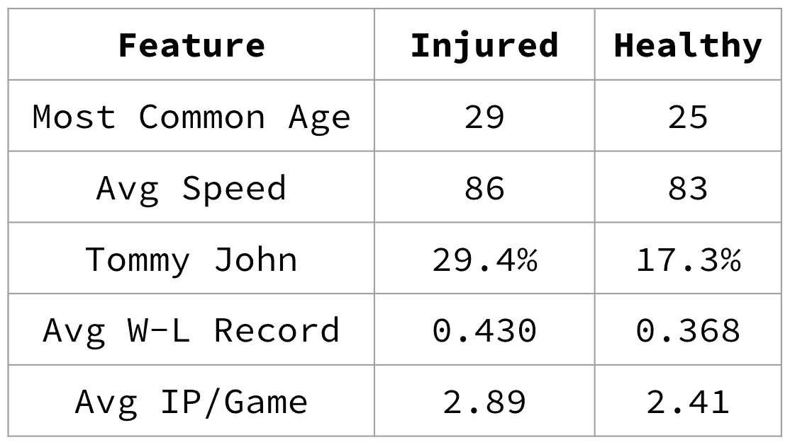
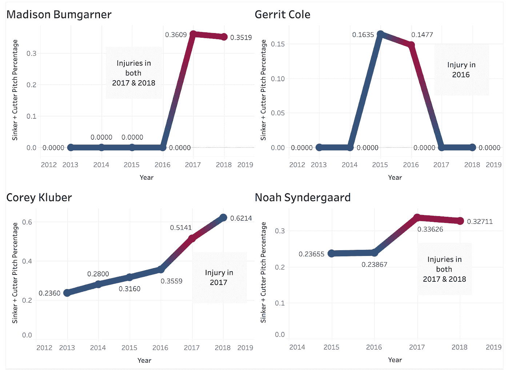
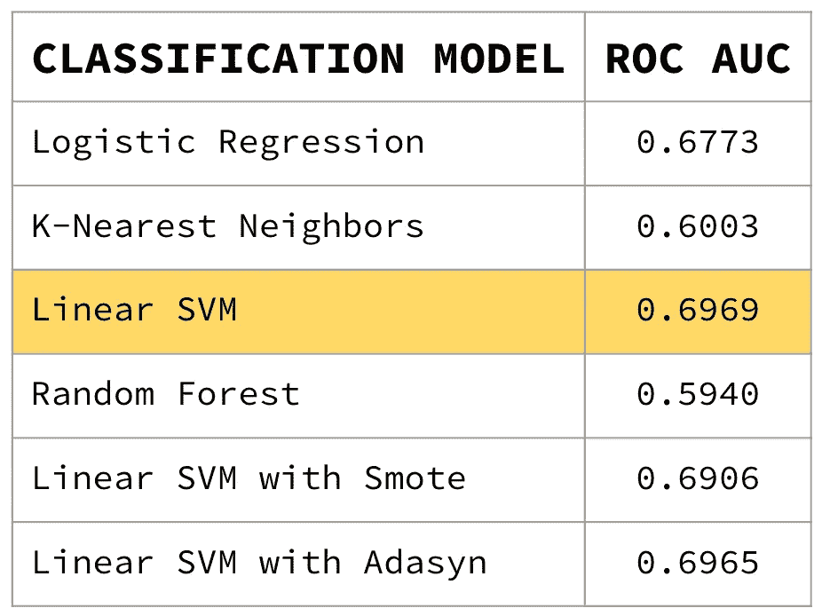
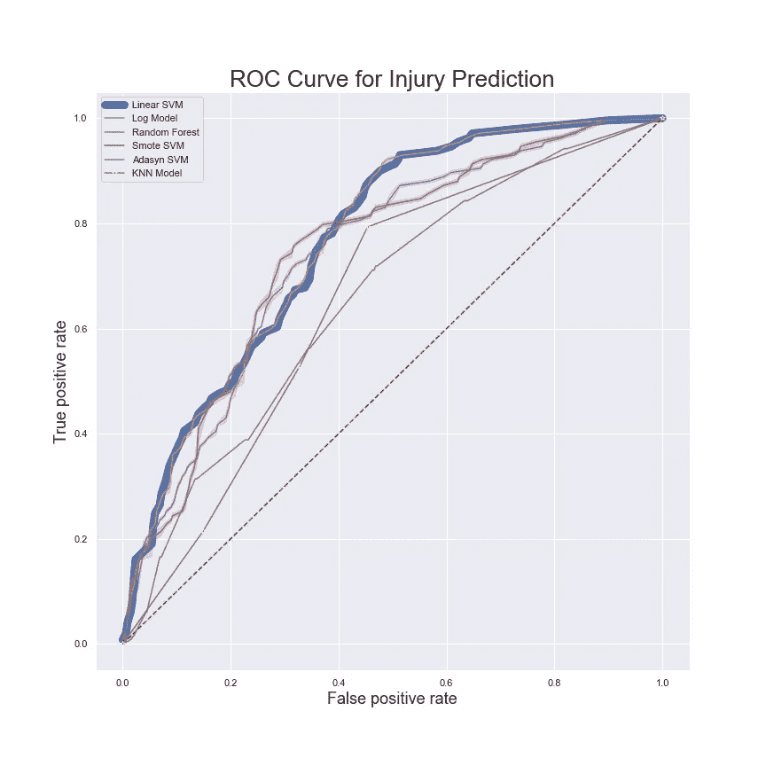
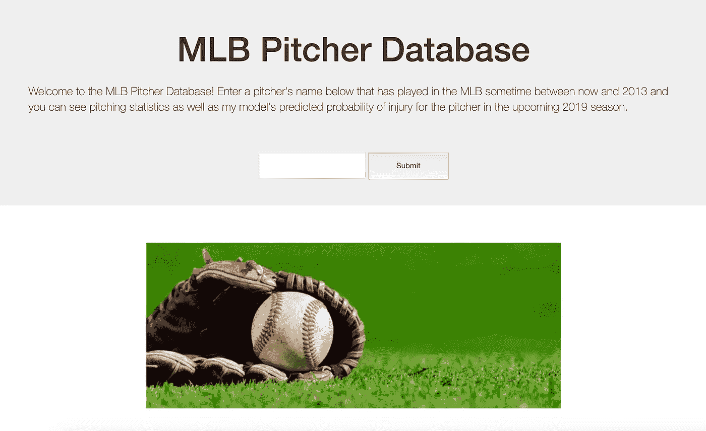
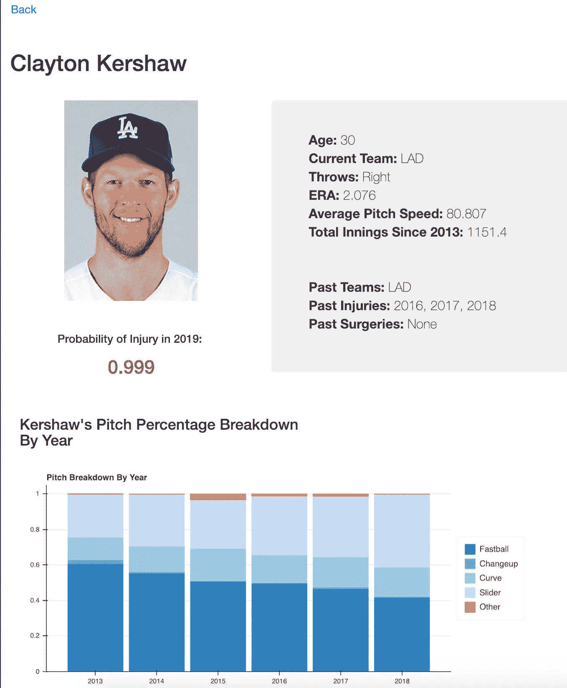

# 预测 MLB 投手的伤病

> 原文：<https://towardsdatascience.com/predicting-injuries-in-mlb-pitchers-c2e133deca39?source=collection_archive---------21----------------------->

Photo by [Jose Francisco Morales](https://unsplash.com/@franciscomorales?utm_source=medium&utm_medium=referral) on [Unsplash](https://unsplash.com?utm_source=medium&utm_medium=referral)

我已经完成了训练营的一半，完成了我的第三个也是最喜欢的项目！过去几周，我们学习了 SQL 数据库、分类模型(如逻辑回归和支持向量机)以及可视化工具(如 Tableau、Bokeh 和 Flask)。我把这些新技能用在我过去两周的项目中，对受伤的投手进行分类。这篇文章将概述我对这个项目的过程和分析。我所有的代码和项目演示幻灯片都可以在我的 [Github](https://github.com/kdavis01/projects/tree/master/pitcher_injury_prediction) 上找到，我这个项目的 Flask 应用程序可以在 [mlb.kari.codes](http://mlb.kari.codes) 上找到。

# 挑战:

在这个项目中，我的挑战是使用二元分类法预测 MLB 投手的受伤情况。为此，我从几个网站收集了数据，包括 Baseball-Reference.com 和 MLB.com 按赛季统计的投球数据，Spotrac.com 按赛季统计的残疾人名单数据，以及 ka ggle 2015-2018 年的逐场数据。我的目标是使用前几个赛季的汇总数据，预测下一个赛季是否会有投手受伤。该项目的要求是将我们的数据存储在 PostgreSQL 数据库中，利用分类模型，在 Flask 应用程序中可视化我们的数据，或者在 Tableau、Bokeh 或 Plotly 中创建图表。

# 数据探索:

我收集了 2013-2018 赛季超过 1500 名美国职业棒球大联盟投手的数据。为了对我的数据有一个感觉，我从最直观地预测受伤的特征开始，并在受伤和健康投手的子集中进行比较，如下所示:

我首先看了看年龄，虽然受伤和健康球员的平均年龄都在 27 岁左右，但数据在两组中都略有不同。受伤球员最常见的年龄是 29 岁，而健康球员的年龄要低得多，为 25 岁。同样，受伤球员的平均投球速度比健康球员高，这是意料之中的。我考虑的下一个功能是汤米约翰手术。这是投手中非常常见的手术，手臂的韧带撕裂，用从手臂或腿上提取的健康肌腱代替。我假设有手术史的投手更有可能再次受伤，数据证实了这个想法。30%的受伤投手曾经做过手术，而健康的投手只有 17%。

然后，我查看了两组的平均输赢记录，令人惊讶的是，这是我的数据集中与伤害相关性最高的特征。受伤投手的子集平均赢得了 43%的比赛，相比之下，健康球员的胜率为 36%。获胜次数多的投手会获得更多的上场时间，这是有道理的，这可能会导致更多的受伤，正如受伤球员每场比赛的平均投球局数更高所示。

在这个项目中，我最感兴趣探索的特性是投手的曲目，以及某些投球是否更能预示受伤。查看特征相关性，我发现伸卡球和切球的投球与受伤有最高的正相关性。我决定更深入地探索这些球种，并且观察每年由个别投手投出的伸卡球和切球组合球种的百分比。我注意到一种受伤的模式，发生在伸卡球/切球百分比最高的几年。以下是最近受伤的四位 MLB 顶尖投手的样图。图上的红点代表运动员受伤的年份。你可以看到他们通常对应于每一个投手的伸卡球/切球百分比都达到高峰的年份。

另一个趋势是，我从几个投手的这些图中注意到，受伤经常发生在同一年或在投手的剧目中首次引入伸卡球/切球的第二年。

# 建模:

我的下一步是将我所有的特征放入几个分类模型中。受伤的投手只占我的数据集的 28%,我首先要处理我的班级不平衡。我转向随机过采样来平衡输入到逻辑回归、KNN、线性 SVM 和随机森林模型中的类。我还用 Smote 和 Adasyn 测试了线性 SVM 模型中的合成过采样，结果稍差。我在 2015-2017 赛季训练了我的模型，并在这个训练数据的验证子集上比较了它们的分数。我的模型得分如下:

从上表可以看出，采用随机过采样的线性 SVM 得分最高。我使用 ROC 曲线下的面积作为我的模型评分标准，因为它提供了模型的真阳性与假阳性比率的可解释评估。下面是我测试的每个模型的 ROC 曲线。理想的 ROC 曲线会接触到图表的左上角，因此我们正在寻找最接近该角并且具有持续增加的真阳性率的模型。在这种情况下，代表线性 SVM 模型的蓝色粗线在 ROC 曲线的大多数阈值上为我的数据集取得了最好的成绩。

我选择了线性 SVM 模型，根据我的训练和验证数据对它进行了重新训练，并最终在我的 2018 赛季的 hold out 数据上对它进行了评分。我的模型在 ROC 曲线下获得了 0.7072 的面积，我对此非常满意！我的模型提供了对随机伤病猜测的重大改进，并给了我一些对可控特征(如伸卡球/切球投球百分比)的洞察力，教练可以想象这些特征来避免高风险投手的伤病。

# 烧瓶应用程序:

Main Search Page of App

为了展示我所有的上述发现，我创建了一个 Flask 应用程序，其中包括我数据库中所有投手的球员页面。在主页上，你可以输入你最喜欢的 MLB 投手(只要他们在 2013 年和 2018 年赛季之间打了 5 局以上)，你就会被引导到他们的球员页面，其中包括投球统计数据、按赛季分列的投球百分比以及我的模型对 2019 年受伤概率的预测。

Sample Player Page in App

# 未来工作:

在这个训练营中，我真的希望我有机会参与一个与棒球相关的项目，我在构建这个模型和应用程序中获得了很多乐趣。在未来，我会喜欢在这个项目的基础上，把我的预测缩小到一个游戏一个游戏的水平，而不是一个赛季一个赛季的。我还希望扩展我的应用程序，使其更具交互性，并允许用户玩不同的投球百分比，以查看受伤概率如何变化。我很高兴有机会通过这些项目扩展我的知识。我也意识到在我当投手的这些年里，我个人努力投伸卡球，这可能是一件因祸得福的事。