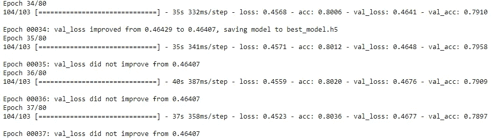

# 在 Keras 中使用卷积神经网络(CNN)预测浸润性导管癌

> 原文：<https://towardsdatascience.com/predicting-invasive-ductal-carcinoma-using-convolutional-neural-network-cnn-in-keras-debb429de9a6?source=collection_archive---------12----------------------->

## 使用 CNN 将组织病理学切片分类为恶性或良性

在这篇博客中，我们将学习如何在真实世界的组织病理学数据集中使用 CNN。真实世界的数据比 MNIST 等标准数据集需要更多的预处理，我们将经历使数据为分类做好准备的过程，然后使用 CNN 对图像进行分类。我还将讨论所使用的 CNN 架构以及在构建模型时调整的一些超参数。

这个博客的不同部分是:

*   介绍
*   了解数据集
*   加载数据集
*   数据预处理
*   通过随机欠采样处理数据不平衡
*   模型架构
*   编译模型
*   数据扩充
*   训练模型
*   做预测
*   评估模型性能

我假设读者知道什么是卷积神经网络及其基本工作机制。

在这篇博客中，我们将只讨论在深度学习的背景下重要的代码，同时避免重复解释不止一次使用的代码。

这篇文章的 Github 库可以在这里找到。我建议你在阅读本教程的时候跟着 Jupyter 笔记本走。

## 介绍

在过去的几年里，使用深度学习进行医学图像分析的情况越来越多，并且越来越成功。医疗保健领域的深度学习用于识别模式、分类和分割医学图像。与大多数图像相关的任务一样，卷积神经网络用于完成这一任务。

这里解决的分类问题是将浸润性导管癌(IDC)的组织病理学切片分类为恶性或良性。


Histopathology slide of a malignant tumour. Image credits: Department of Pathology at Johns Hopkins University

IDC 是一种乳腺癌，其中癌症已经扩散到周围的乳腺组织。

癌症肿瘤可以分为两种类型:恶性和良性。良性肿瘤是一种不侵犯其周围组织的肿瘤，而恶性肿瘤是一种可以扩散到其周围组织或身体其他部位的肿瘤。

## 了解数据集

> 我们将使用的数据集可以从[这里](http://www.andrewjanowczyk.com/use-case-6-invasive-ductal-carcinoma-idc-segmentation/)下载。向下滚动到页面的数据集描述部分，并下载 1.6 GB 的 zip 文件。

该数据集由 162 幅以 40 倍扫描的乳腺癌标本的完整载片图像组成。从中提取了 277，524 个大小为 50×50 的斑块，其中 198，738 个为 IDC 阴性(良性)，78，786 个为 IDC 阳性(恶性)。

每个修补程序的文件名的格式如下:

u_xX_yY_classC.png →示例 10253 _ idx 5 _ x 1351 _ y 1101 _ class 0 . png

其中 u 是患者 ID (10253_idx5)，X 是裁剪此补丁的 X 坐标，Y 是裁剪此补丁的 Y 坐标，C 表示类别，其中 0 表示非 IDC(良性)，1 表示 IDC(恶性)

## **加载数据集:**

```
imagePatches = glob('C:/Users/asus/Documents/Breast cancer classification/**/*.png', recursive=True)patternZero = '*class0.png'
patternOne = '*class1.png'#saves the image file location of all images with file name 'class0' classZero = fnmatch.filter(imagePatches, patternZero) #saves the image file location of all images with file name 'class1'
classOne = fnmatch.filter(imagePatches, patternOne)
```

数据集由 279 个文件夹组成，279 个文件夹中的每个文件夹都有子文件夹 0 和 1。我们首先创建两个变量 classZero 和 classOne，分别保存所有 class 0 和 class 1 图像的位置

```
def process_images(lowerIndex,upperIndex):
    """
    Returns two arrays: 
        x is an array of resized images
        y is an array of labels
    """ 
    height = 50
    width = 50
    channels = 3
    x = [] #list to store image data
    y = [] #list to store corresponding class
    for img in imagePatches[lowerIndex:upperIndex]:
        full_size_image = cv2.imread(img)
        image = (cv2.resize(full_size_image, (width,height), interpolation=cv2.INTER_CUBIC))
        x.append(image)
        if img in classZero:
            y.append(0)
        elif img in classOne:
            y.append(1)
        else:
            return
    return x,y
```

然后我们创建一个函数 *process_images* ，它将图像的起始和结束索引作为输入。这个函数首先使用 OpenCV 的 cv2.imread()读取图像，并调整图像的大小。因为数据集中的图像很少不是 50x50x3，所以完成了调整大小。该函数返回两个数组:X 是调整大小后的图像数据的数组，Y 是相应标签的数组。

```
X, Y = process_images(0,100000)
```

对于本教程，我们将只分析从索引 0 到 60，000 的图像。图像数据(像素值)现在存储在列表 X 中，它们相应的类存储在列表 y 中

## **数据预处理:**

```
X = np.array(X)
X = X.astype(np.float32)
X /= 255.
```

列表 X 首先被转换为 numpy 数组，然后被转换为 float32 类型以节省空间。

图像首先通过除以 255 进行归一化。这确保了所有值都在 0 和 1 之间。这有助于我们更快地训练模型，也防止我们陷入消失和爆炸梯度的问题。

```
from sklearn.model_selection import train_test_split
X_train, X_test, y_train, y_test = train_test_split(X,Y,test_size=0.15)
```

数据集分为训练集和测试集，整个数据集的 15%保留用于测试。对于 60，000 的数据集，这意味着 51000 个图像被保留用于训练，9000 个用于测试。

## 通过随机欠采样处理数据不平衡

```
y_train.count(1)  #counting the number of 1
y_train.count(0)  #counting the number of 0
```

计算数组 Y 中 1 和 0 的数量，我们发现有 44478 个 0 类图像和 15522 个 1 类图像。

这个问题被称为数据不平衡，会导致我们的模型更偏向于某个特定的类，通常是拥有更多样本的类。特别是在医疗保健等领域，将少数群体(在这种情况下是恶性的)归类为多数群体(在这种情况下是良性的)可能非常危险。我们将通过随机欠采样多数类来处理数据不平衡，即移除多数类的样本以使多数类和少数类的样本数量相等。

```
y_train = to_categorical(y_train)
y_test = to_categorical(y_test)
```

在此之前，我们需要对输出变量 y_train 和 y_test 进行一次热编码。

```
X_trainShape = X_train.shape[1]*X_train.shape[2]*X_train.shape[3]
X_testShape = X_test.shape[1]*X_test.shape[2]*X_test.shape[3]
X_trainFlat = X_train.reshape(X_train.shape[0], X_trainShape)
X_testFlat = X_test.reshape(X_test.shape[0], X_testShape)
```

我们还需要改变 X_train 和 X_test 的形状，以使用随机欠采样。

```
from imblearn.under_sampling import RandomUnderSampler
random_under_sampler = RandomUnderSampler(ratio='majority')
X_trainRos, Y_trainRos = random_under_sampler.fit_sample(X_trainFlat, y_train)
X_testRos, Y_testRos = random_under_sampler.fit_sample(X_testFlat, y_test)
```

参数“ratio=majority”表示随机欠采样到欠采样多数类。

在执行随机欠采样后，再次检查每个类别的样本数量，我们发现两个类别的样本数量相等。然后，图像数据被转换回其 50 x 50 x 3 的原始形状。

## 模型架构

我们使用一个与这篇[论文](http://www.apsipa.org/proceedings/2017/CONTENTS/papers2017/15DecFriday/FP-02/FP-02.3.pdf)中讨论的*类似的*架构。

```
batch_size = 256
num_classes = 2
epochs = 80model = Sequential()
model.add(Conv2D(32, kernel_size=(3,3),
                 activation='relu',
                 input_shape=(50,50,3)))
model.add(MaxPooling2D(pool_size=(2, 2)))
model.add(Conv2D(64, (3,3), activation='relu'))
model.add(MaxPooling2D(pool_size=(2,2)))
model.add(Conv2D(128, (3, 3), activation='relu'))
model.add(Conv2D(256, (3, 3), activation='relu'))
model.add(Flatten()) #this converts our 3D feature maps to 1D feature vectors for the dense layer below
model.add(Dropout(0.5))
model.add(Dense(128, activation='relu'))
model.add(Dropout(0.5))
model.add(Dense(128, activation='relu'))
model.add(Dense(num_classes, activation='sigmoid'))
```

该模型是连续的，允许我们逐层创建模型。该架构由卷积层、最大池层、丢弃层和全连接层组成。

第一层是卷积层，具有 32 个大小为 3×3 的滤波器。我们还需要在第一层中指定输入形状，在我们的例子中是 50 x 50 x 3。

我们将对除最终输出层之外的所有层使用整流线性单元(ReLU)激活函数。ReLU 是隐藏层中激活函数的最常见选择，并且已经显示出相当好的效果。

第二层是汇集层。汇集层用于减少维度。2x2 窗口的最大池仅考虑 2x2 窗口中的最大值。

第三层也是 64 个滤波器的卷积层，每个滤波器的大小为 3×3，后面是另一个 2×2 窗口的最大池层。通常，卷积层中的滤波器数量在每一层之后都会增长。具有较低数量滤波器的第一层学习图像的简单特征，而较深的层学习更复杂的特征。

接下来的两层也是卷积层，具有相同的滤波器大小，但是滤波器数量增加；128 和 256。

在添加完全连接的层之前，我们需要将从卷积层输出的 3D 特征图展平为 1D 特征向量。这就是扁平化层的用武之地。

下一层是辍学率为 0.5 的辍学层。脱落率为 0.5 的脱落层意味着 50%的神经元将被随机关闭。这有助于防止过度拟合，方法是让所有的神经元学习一些关于数据的知识，而不仅仅依赖于少数几个神经元。在训练过程中随机丢弃神经元意味着其他神经元将不得不做关闭的神经元的工作，从而更好地泛化并防止过度拟合。

值 0.5 取自 [Hinton (2012)](https://arxiv.org/pdf/1207.0580.pdf) 的原始论文，经证明非常有效。这些脱落层被添加到输出之前的每个完全连接的层之后。辍学也减少了每个历元的训练时间。

下面的密集层(全连接层)有 128 个神经元。其后是另一个退出层，退出率为 0.5

下一层是另一个密集层，有 128 个神经元。

最终输出层是另一个密集层，其神经元的数量等于类别的数量。这一层中的激活函数是 sigmoid，因为手头的问题是二元分类问题。对于多类分类问题，激活函数应设置为 softmax。

## 编译模型

```
model.compile(loss=keras.losses.binary_crossentropy,
              optimizer=keras.optimizers.Adam(lr=0.00001),
              metrics=['accuracy'])
```

该模型采用二元交叉熵损失函数进行编译，并使用 Adam 优化器。“准确性”指标用于评估模型。

Adam 是一种优化算法，它以迭代的方式更新网络权重。

虽然可以设置 Adam 的初始学习速率(在我们的例子中，我们将其设置为 0.00001)，但这是初始学习速率，每个参数的学习速率随着训练的开始而调整。这就是 Adam(自适应矩估计的缩写)与随机梯度下降的不同之处，随机梯度下降对所有权重更新保持单一的学习速率。亚当优化算法的详细解释可以在[这里](https://machinelearningmastery.com/adam-optimization-algorithm-for-deep-learning/)找到

学习率决定了我们将网络的权重向局部最小值调整的速度。过高的学习率会导致如此高的权重变化，以至于可能导致超过局部最小值。这导致训练或验证误差在连续的时期之间剧烈波动。学习率太低会导致花更长的时间来训练我们的网络。因此，学习率是建立模型时需要调整的最重要的超参数之一。

## 数据扩充

```
datagen = ImageDataGenerator(
    featurewise_center=True,
    featurewise_std_normalization=True,
    rotation_range=180,
    horizontal_flip=True,vertical_flip = True)
```

一般来说，我们拥有的数据越多，深度学习往往就越有效。Keras ImageDataGenerator 使用数据扩充在训练期间生成实时图像。转换是在运行中对小批量执行的。数据扩充通过减少网络过度拟合训练数据的能力来帮助概括模型。旋转、垂直和水平翻转是一些常用的数据扩充技术。

Keras ImageDataGenerator 提供了多种数据扩充技术。但是，我们只会使用其中的少数几个。

> 如果将标记为恶性的组织病理学载玻片旋转 20 度并垂直翻转，它仍然是恶性的。

## 训练模型

> 使用 GPU 训练模型可以加快训练过程。你将需要一个 NVIDIA 的 GPU 来做到这一点。我按照这个[教程](https://medium.com/@ab9.bhatia/set-up-gpu-accelerated-tensorflow-keras-on-windows-10-with-anaconda-e71bfa9506d1)来启用 GPU 训练。

我们将历元的数量设置为一个较大的数字，在我们的例子中为 80，并使用一种称为早期停止的正则化方法

```
early_stopping_monitor = EarlyStopping(monitor='val_loss', patience=3, mode='min')
```

早期停止是一种用于避免过度拟合的方法，当要观察的参数集在一定数量的时期内没有改善时，通过停止训练过程来避免过度拟合。

> 在我们的例子中，我们告诉 EarlyStopping 监控 val_loss，如果连续 3 个时期没有改善，就停止训练过程。"

批量大小通常设置为 2 的幂，因为这样计算效率更高。我们将其设置为 256。

我们使用另一个称为 ModelCheckpoint 的 Keras 回调

```
model_checkpoint = ModelCheckpoint('best_model.h5', monitor='val_loss', mode='min', verbose=1, save_best_only=True)
```

模型检查点用于保存模型。monitor 参数允许我们设置一个我们想要关注指标。在我们的例子中，我们只在验证损失最小的时候保存模型。我们保存最佳模型，以便稍后用于进行预测，从而评估模型的性能。

> 结合这两个回调，保存最佳模型(其具有最小的验证损失),然后，如果验证损失在接下来的 3 个时期(由 EarlyStopping 设置)没有改善(减少),则模型训练停止。

```
training = model.fit_generator(datagen.flow(X_trainRosReshaped,Y_trainRosHot,batch_size=batch_size),steps_per_epoch=len(X_trainRosReshaped) / batch_size, epochs=epochs,validation_data=(X_testRosReshaped, Y_testRosHot), verbose=1, callbacks=[early_stopping_monitor, model_checkpoint])
```

因为我们正在动态使用 ImageDataGenerator，所以我们使用 model.fit_generator 来训练模型。我们将其设置为变量“training ”,因为我们稍后将绘制训练损失和验证损失。这有助于我们了解方差，即训练误差和验证集误差之间的差异。

为了验证，我们将使用 x_testRosReshaped 和 y_test shot，它们是在对 X _ test 和 Y _ test 集进行欠采样后获得的。

由于提前停止，训练在 37 个周期后停止。因此，保存的最佳模型是在时期 34 期间的模型，验证精度为 79.10%



val_loss stopped improving after Epoch 34

绘制训练集和验证集损失，我们发现方差非常低。该图确保我们的模型不会过度拟合。


Training and testing set loss

## 做预测

```
from keras.models import load_model
from sklearn import metricsmodel = load_model('best_model.h5')y_pred_one_hot = model.predict(X_testRosReshaped)y_pred_labels = np.argmax(y_pred_one_hot, axis = 1)
y_true_labels = np.argmax(Y_testRosHot,axis=1)
```

我们加载由 ModelCheckpoint 保存的最佳模型，并使用 predict 函数来预测 X_testRosReshaped 数组中图像的类别。预测现在存储在列表 y_pred_labels 中。

## 评估模型的性能

```
confusion_matrix = metrics.confusion_matrix(y_true=y_true_labels, y_pred=y_pred_labels)
```

我们使用混淆矩阵来评估模型的性能。二进制分类矩阵中的混淆矩阵有四个象限；假阳性，假阴性，真阳性和真阴性。

对于我们的情况，混淆矩阵的四个象限可以简化如下:


Confusion matrix with description of the 4 quadrants for our case

我们得到的混淆矩阵是:


Resultant confusion matrix

在这种情况下，较低的假阴性比较低的假阳性要好。这是因为将恶性肿瘤识别为良性比将良性肿瘤识别为恶性更危险，因为前者将导致患者因误诊而接受不同的治疗，而后者无论如何都可能要接受进一步的检查。

我们可以看到，我们的模型在测试集上表现良好，准确率为 79.10%。只有混淆矩阵也对我们有利，我们有一个低方差的模型。

应用深度学习是一个迭代的过程。您可以通过调整优化算法的学习速率、更改批量大小、更改卷积层的滤波器、添加更多层或使用更多数据等超参数来尝试和进一步改进该模型。

*感谢阅读。如果你有任何问题，请在下面评论。我将定期撰写深度学习等主题的文章，所以请在 Medium 上关注我。我也可以上* [*LinkedIn*](https://www.linkedin.com/in/bikramb/) *！:)快乐编码。*