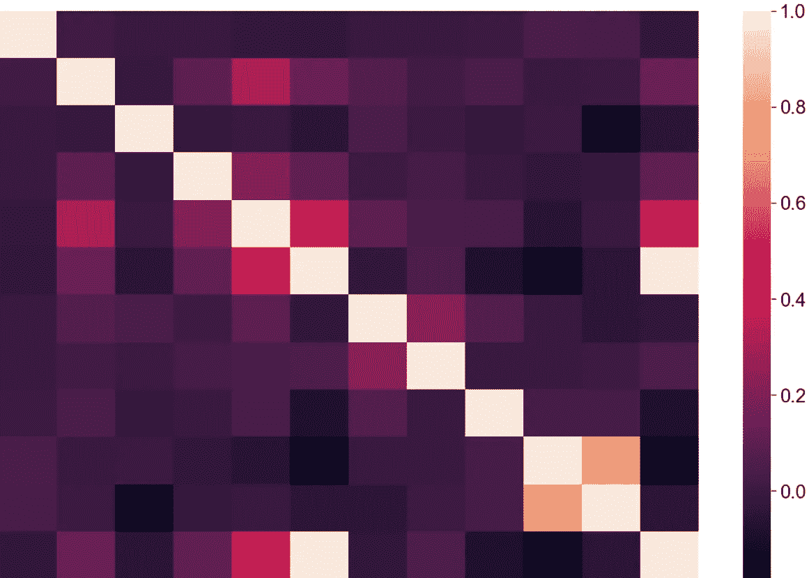
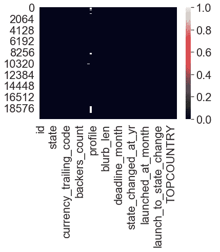
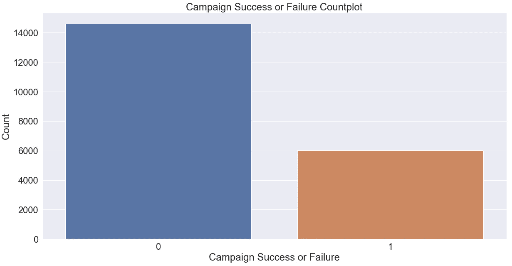
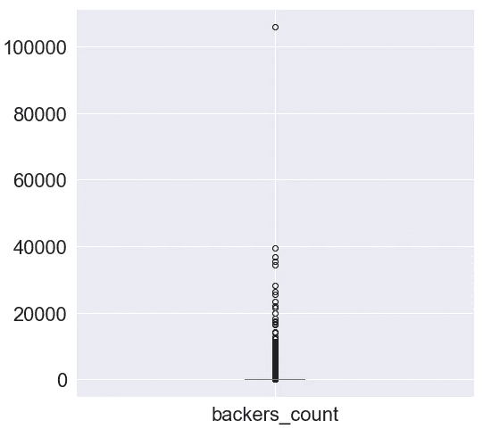
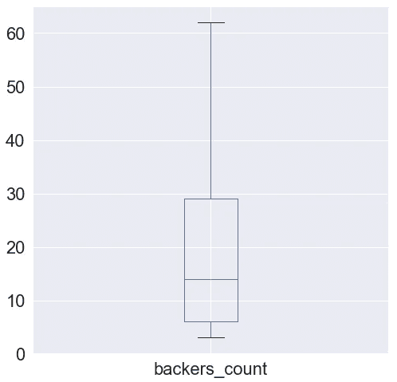
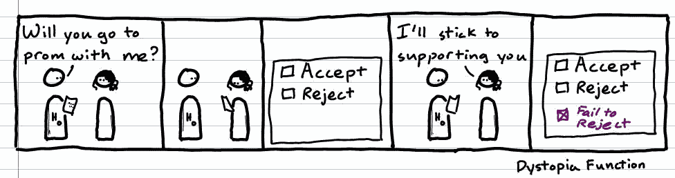
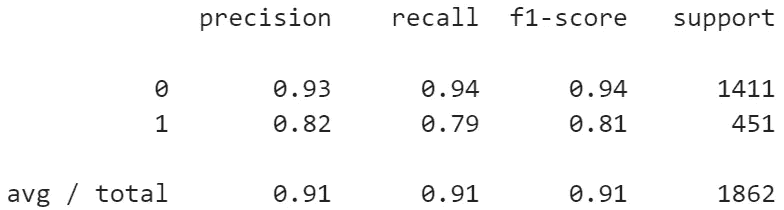
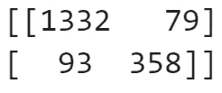

# 用梯度增强决策树预测 Kickstarter 活动的成功:一个机器学习分类问题

> 原文：<https://towardsdatascience.com/predicting-kickstarter-campaign-success-with-gradient-boosted-decision-trees-a-machine-learning-23077436c5f7?source=collection_archive---------9----------------------->

前几天，我在浏览 [data.world](https://data.world/) 时，偶然发现了一个数据集，该数据集研究了 [kickstarter](http://kickstarter.com) 成功和失败的活动。

我想，“在预测 kickstarter 活动是否成功时，需要什么，即哪些功能是重要的？”于是，这个项目诞生了。在本文中，我将带您了解该项目的更多精彩亮点。完整代码见底部回购链接！

## 探索性数据分析对数据进行清洗并再次返回

我一头扎进去，看了看数据集的结构，想知道我能从中得到什么。在数据科学中，工作流的这一阶段被称为[探索性数据分析](/exploratory-data-analysis-8fc1cb20fd15) (EDA)。

EDA 通常发生在数据清理之后，但它不一定是一个线性过程。有时候，通过 EDA，你会意识到你需要以不同于以前的方式或者比以前更多的方式来清理某些东西。随着我们的进展，你会明白我的意思。

该数据集包含 67 个变量的 20，632 个观察值，也称为机器学习问题中的特征。在数据帧上调用`.info()`向我展示了每个特征的数据类型。

从这些信息中，我发现了一些无用的变量，并迅速删除了它们。在数据清理中，我们经常会处理丢失的值。如果你的数据集不是太大和多维的，你可以用 seaborn 库(sns)做一个巧妙的小把戏，用`sns.heatmap(df.isnull())`可视化你的数据帧是 df 的地方。通过这样做，只有空值才会以与其他值形成对比的颜色显示，如下所示。

正如我们所看到的，profile 变量是唯一剩下的包含缺失值的变量。接下来，我更详细地查看了该变量，发现由于它主要是元数据，每个元素在数据的其他地方都有自己的变量，所以我决定删除它。

在分类问题中，将你的目标变量(你试图使用机器学习算法预测的变量)可视化是必不可少的。对于此问题，0 =活动失败，1 =活动成功)。

我们可以看到，这大约是 60:40 的比例，失败多于成功。这在直觉上是有道理的。在你的整个工作流程中，重要的是要经常问自己一些事情直觉上是否有意义。

分类算法模型在数据子集上训练，并在不包含目标变量标签的数据上测试。通过测量有多少预测被正确标记，我们可以了解模型的性能。

在分类问题中，了解目标变量的分布很重要:在这个样本空间中存在偏差。看一下上面的图，可以训练的成功活动很少，所以对预测要有所保留(然后再多加一些盐，你稍后会看到)。

## 离群值

处理异常值也很重要。它们不仅会打乱你的绘图比例，还会弄脏你的数据，从而影响你的预测模型的性能。如果你的模型考虑了偏离平均值 5 个标准偏差的变量(假设正态分布为 T1)，这是一个新的观察结果极不可能出现的值。您的模型将会被不代表可能人群的数据点扭曲/影响！

虽然我的变量很少是正态分布的，但我仍然觉得有必要采用四分位范围，并删除低于或高于平均值 3 个标准差的异常值。下面是该操作如何改变 backers_count 变量(一个活动拥有的支持者数量)。

Initial backers_count

在上面的方框图中，你甚至看不到方框。底部的线是第四个四分位数的边缘(数据的前 25%)。所以之后的一切都是极端的。这些点是单独的异常值。不仅有很多，而且一个活动就有 10 万支持者。而平均值大约是 12。这太不靠谱了。所以我应用了变换，得到了更合理的东西:

由于大多数值位于第三季度和第四季度，因此仍然存在一些右偏。但这是一个合理得多的方框图！我对其他变量也做了同样的处理，比如目标变量和承诺变量。还有 create_to_launch_days 变量，它是活动开始日期和将要开始日期之间的天数。

## 相关性、特征工程和特征选择

我接下来需要找到相关性。这些变量与目标变量的关联程度如何？这将为我们提供每个变量对目标的解释力/影响力的初步指示。

这很重要，原因有二:

1.  可以说，我们将更多地了解哪些变量为模型提供了最强的解释力。
2.  我们将查看是否有任何变量与目标变量有相似或相同的关联(也称为[共线性](http://www.stat.tamu.edu/~hart/652/collinear.pdf)，或者[多重共线性](https://www.statisticssolutions.com/multicollinearity/)，如果有两个以上)。

项目这一步的一个值得注意的发现是，如果一个活动受到关注，它与活动成功有 1.0 的完美正相关。这就是我们需要直觉/思维帽/严肃侦探面孔的地方。

统计学上没有什么是完美的…至少我有 95%的把握…

source: [this funny site](https://dyfx.wordpress.com/2011/11/18/confidence-intervals-and-hypothesis-testing/)

我的猜测是，这个数据集仅仅是在聚光灯下的竞选活动中收集的。也许 Kickstarter 想分享他们最喜欢的活动的数据，而唯一成功的活动恰好在聚光灯下。因此，我们不能仅仅因为一个活动受到关注就认为它一定会成功，尽管我敢打赌它有助于获得曝光率！

此外，并非所有变量之间的关系都是线性的，因此处理这种情况并检查非线性关系相关性的一种技术是取变量的对数和平方根，并再次检查相关性。

这样做的时候，我发现活动的对数目标明显比其原始值更高度相关。对数认捐额也有所增加。

进入最终特征空间的亚军变量包括:

*   启动至截止日期天数—启动和截止日期之间的天数)
*   staff _ pick—Kickstarter 员工是否选择了活动

## 拟合模型、评估性能、选择最终模型以及预测新的(完全真实的)活动

数据科学工作流程中的另一件常见事情是尝试多种模型。根据您想要完成的任务或者数据集是什么/问题是什么，有一些方法可以最大限度地减少这一阶段的工作量(例如，您不会尝试回归模型，因为这是一个分类问题)。

我们知道这是一个分类问题(活动是成功还是失败？)因为结果或目标变量采用二进制离散值(0 或 1，中间没有任何值)。

在我试过的模型上。

我使用了令人敬畏的机器学习库 [sklearn](https://scikit-learn.org/stable/) 并定义了一个函数，该函数接受一个模型，将该模型拟合到特征和目标变量的训练数据集上，并返回该模型的[分类报告](http://www.scikit-yb.org/en/latest/api/classifier/classification_report.html)和[混淆矩阵](https://www.dataschool.io/simple-guide-to-confusion-matrix-terminology/)。如果你不知道这两种评估方法是什么，请随意查看这些链接，但我也会在下面简单解释一下。

Classification Report for K-Nearest-Neighbors Classifier (KNN) on Kickstarter Campaign dataset

让我们看看上面的 [KNN](https://www.analyticsvidhya.com/blog/2018/03/introduction-k-neighbours-algorithm-clustering/) 算法的结果。左边是类:0 和 1。顶部是精确度、回忆、f1 分数和支持。

精确度基本上意味着:对于所有被归类为积极的观察，正确的百分比是多少？这个号码。

回忆是:所有实际上是正面的观察的量度，正确分类的百分比。

F₁分数是精确度和召回率的加权调和平均值。这应该用于比较模型，而不是问题的全局准确性。

最后，支持度是数据集中每个类的实例数量。我们从 EDA 中知道失败多于成功，我们可以在这里看到这一点。

我们也有混淆矩阵，它利用了与上面相同的概念，但是显示了与百分比相对的单个实例。让我们看看下面 KNN 分类器的混淆矩阵。

Confusion Matrix for KNN Classifier

好，那么从左到右，从上到下我们有:

真正否定的次数:分类器正确猜测活动失败的次数。

误报的数量:当一个活动实际上是一个失败的活动时，分类器错误地猜测该活动成功的次数。

假阴性的数量:当一个活动实际上是成功的时候，分类器错误地猜测它是失败的次数。

真正肯定的次数:分类器正确猜测活动成功的次数。

如你所见，分类报告和混淆矩阵对于分类问题都是非常有用的评估工具。分类报告给你更多的信息，包括每一类的观察次数。但我也喜欢混淆矩阵的简单性。将它们都检查出来是很有用的，而且只有一行代码。

如题所示，我选择了梯度增强决策树分类器(它实际上有 100%的准确率，这是令人担忧的，因为在统计学和机器学习中，完美是值得警惕的)。

## 预测一场(完全真实的)运动的成功

好吧，这不是真的。我算出了这些数字，但这是:

`gradient_boosted.predict_prob([[45, 0, 6, 1, 15000, 9.62, 6.91]])`

这个调用的结果是什么？首先让我解释一下每个数字是什么。每个数字都对应于我们的功能列表，所以请仔细阅读下一段，了解它们各自的功能。出于 Pythonic 的原因，我将从第一个开始按顺序从[0]开始。

距离截止日期[0]还有 45 天的活动，不是工作人员挑选的[1]，由 6 个支持者[2]支持，处于聚光灯下[3]，目标为 15000 美元[4]，log_goal 为 9.62 [5]，log _ pledged 金额为 6.91(等于 1000 美元)[6]，有 99.9%的成功机会！

## 结论

我希望你喜欢阅读！想看源代码？想帮我弄清楚为什么我的梯度增强分类器达到 100%吗？

[查看回购！](https://github.com/rileypredum/Kickstarter-Campaign-Success-Prediction)

如果你学到了新的东西，并希望将其传授给下一个学习者，[可以考虑捐赠](https://www.patreon.com/rileypredum)任何你觉得合适的金额，谢谢！

快乐编码，

奢侈的生活