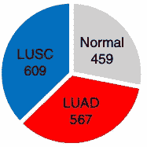
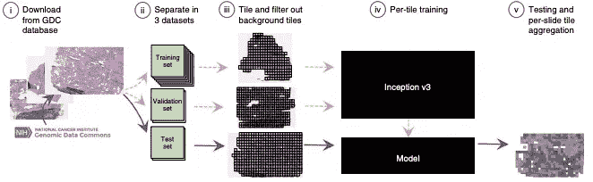
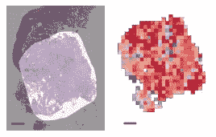
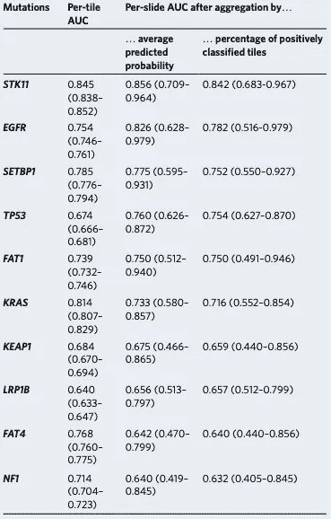

# 用机器学习预测肺癌突变

> 原文：<https://towardsdatascience.com/predicting-lung-cancer-mutations-with-machine-learning-fe2e348eaadb?source=collection_archive---------29----------------------->

最近看了一篇《自然医学》的文章，作者用机器学习预测肺癌基因突变有深度学习([链接](https://www.nature.com/articles/s41591-018-0177-5.pdf))。他们是怎么做到的？

Photo by [Ousa Chea](https://unsplash.com/@cheaousa?utm_source=medium&utm_medium=referral) on [Unsplash](https://unsplash.com?utm_source=medium&utm_medium=referral)

**肺癌。**肺癌有两个关键亚型:腺癌和鳞状细胞癌。能够区分这些亚型是极其重要的，因为每种亚型都有自己的治疗选择——针对腺癌和鳞状细胞癌的靶向治疗不同。特别是腺癌，需要分析基因突变；靶向的主要突变包括表皮生长因子受体(EGFR)、间叶淋巴瘤受体酪氨酸激酶(ALK)、肿瘤蛋白 53 (TP53)和 KRAS 突变。

 [## 医疗保健的未来正在被一场巨大的技术入侵所塑造——数据驱动的投资者

### 过去十年，全球经济的所有部门都经历了大规模的数字颠覆，而卫生部门现在…

www.datadriveninvestor.com](https://www.datadriveninvestor.com/2018/11/02/the-future-of-healthcare-is-being-shaped-by-a-big-tech-invasion/) 

识别这些突变是至关重要的，因为每个突变都有量身定制的治疗方法。例如，EGFR 和 ALK 突变已经有 FDA 批准的靶向治疗可用。当前分析肺癌组织样本的方法(组织样本的人工视觉检查)既详尽又有时不准确。此外，也很难区分腺癌和鳞状细胞癌。因此，能够准确分析肺癌组织的自动化机器学习模型将是极其有益的。

Number of whole-slide images for each class, where LUSC represents squamous cell carcinoma and LUAD represents adenocarcinoma. Image credits to Coudray et al., the original authors of the paper.

**肺癌图像数据集。**作者使用了来自 NCI 基因组数据共享空间的数据；他们检索了大约 1700 张全切片图像，其中 609 张为鳞状细胞癌阳性，567 张为腺癌阳性，459 张为正常。他们使用滑动窗口算法，从这些整张幻灯片图像中生成大约一百万个 512×512 像素的窗口。本质上，他们在整个组织样本上滑动一个想象的“窗口”(可以达到 100，000 像素乘 100，000 像素)，并将这些窗口中的每一个用作单独的样本。然后，他们将得到的 100 万个窗口进行分割，其中 70%用作训练集，15%用于验证，15%用作测试集。

The data processing strategy used in the paper. Image credits to Coudray et al., the original authors of the paper.

**用 Inception v3 进行机器学习。**作者基于 Inception v3 架构 36 建立了他们的模型，该架构使用由不同内核大小的卷积和最大池层构成的 Inception 模块。你说的这个卷积是什么？我基本上说的是卷积神经网络(CNNs 这些神经网络特别擅长图像处理，而这恰好是论文试图做的事情！

**迁移学习。**本文还使用迁移学习进行腺癌和鳞状细胞癌的分类。*但是什么是迁移学习呢？*迁移学习基本上就是用别人的模式。神经网络在各层之间有权重，这些权重有助于模型的实际运行。所以如果你能得到那些精确的重量，你实际上是复制粘贴一个模型。这就是迁移学习——使用别人训练的重量，并根据自己的目的进行微调。*先生偷哟模型。*在这种情况下，作者使用了在 ImageNet 竞争中表现最好的权重，并在肺癌数据中对其进行了微调。当然，他们的模型还使用了其他一些超参数——损失函数(交叉熵)、学习率(0.1)、权重衰减(0.9)、动量(0.9)和优化器(RMSProp)。

Heatmap showing what the model is looking at. Image credits to Coudray et al., the original authors of the paper.

**训练。**因为他们有两个不同的任务(预测腺癌与鳞状细胞癌，以及预测腺癌载玻片的基因突变)，他们训练了模型的多个变体。对于第一项任务，他们训练他们的模型来预测正常组织对腺癌对鳞状细胞癌。对于第二项任务，他们训练他们的模型以二元方式预测每个基因突变，而不是作为多类分类器。这意味着他们的实施允许肺癌组织的每个 512×512 斑块对一个以上的基因突变呈阳性。对于这两项任务，他们对模型进行了 50 万次迭代训练。

**结果。使用了一些方法来验证他们的模型的有效性。首先，他们将他们的模型与病理学家进行比较。在独立的测试集上，被其模型错误分类的 50%的载玻片也被至少一个病理学家错误分类，并且被至少一个病理学家错误分类的 83%的载玻片被模型正确分类。这被视为该模型的表现与病理学家不相上下的证据。作者还计算了他们的模型对每个基因突变的准确性，发现该模型比猜测所有突变要好得多。**

Area under Receiver Operating Characteristic scores for each mutation achieved by the model. Image credits to Coudray et al., the original authors of the paper.

**这是什么意思？**作者创建了一个机器学习模型，能够以合理的准确度对肺癌基因突变进行分类，并识别两种肺癌亚型之间的差异。这表明机器学习是多么强大，以及它有多么广泛的应用。该模型主要用于辅助病理学家进行诊断，从而使诊断过程保持半人工状态。*这个模型还能做什么？*在未来，作者将应用该模型尝试对不太常见的肺癌进行分类，包括大细胞肺癌和小细胞肺癌。他们的模型的引入还可能导致肺癌组织的高精度全自动分析，这将减少分析时间和潜在的人为错误。

*也许在未来，我们将能够通过机器学习让电脑为我们诊断疾病……*

我将在下面列出一些有趣的附加资源:

*   [原纸](https://www.nature.com/articles/s41591-018-0177-5.pdf)
*   [GitHub 文件库](https://github.com/ncoudray/DeepPATH)
*   [关于肺癌的更多信息](https://www.cdc.gov/cancer/lung/basic_info/what-is-lung-cancer.htm)