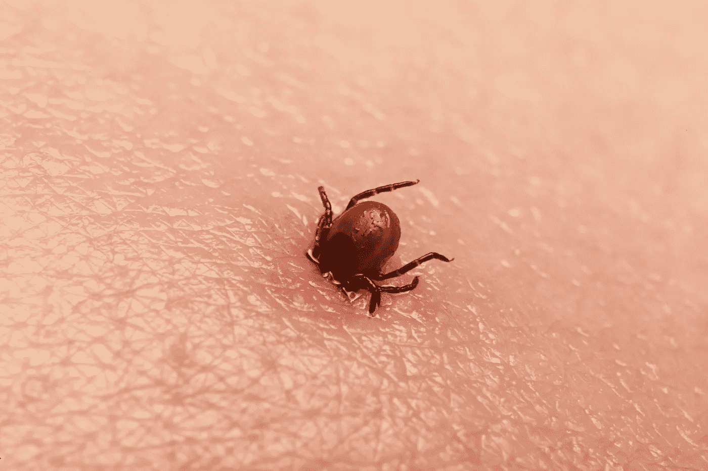
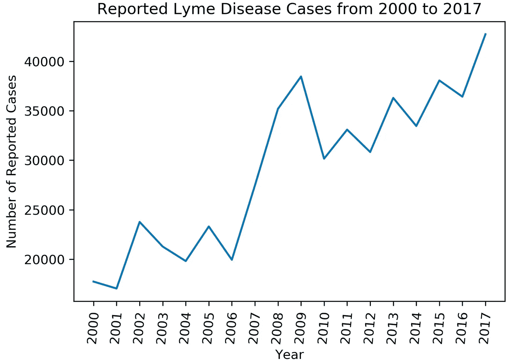
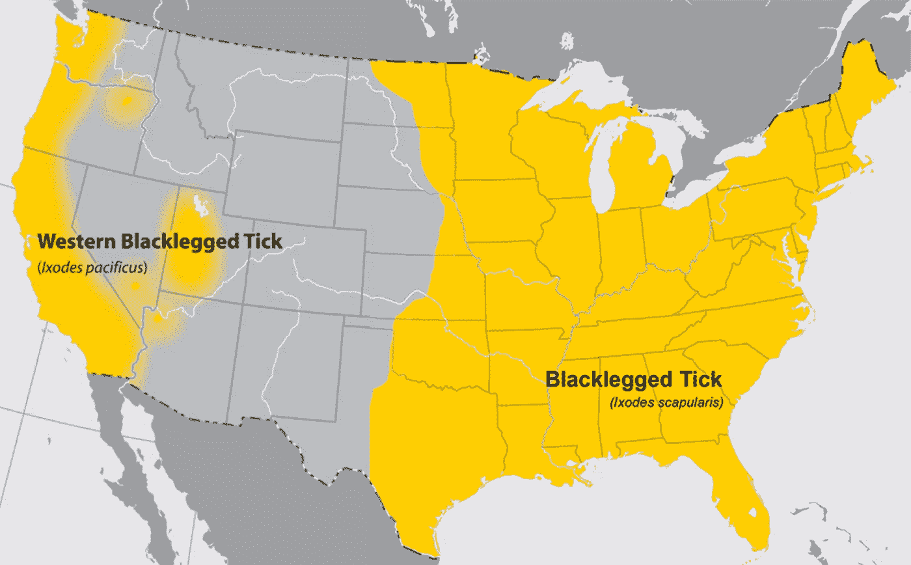
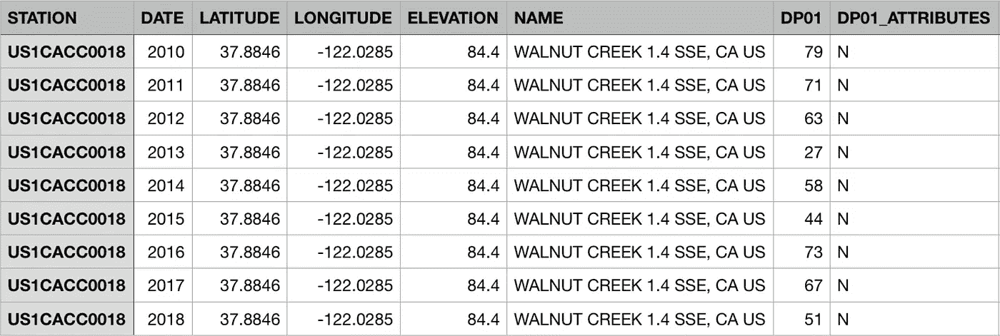
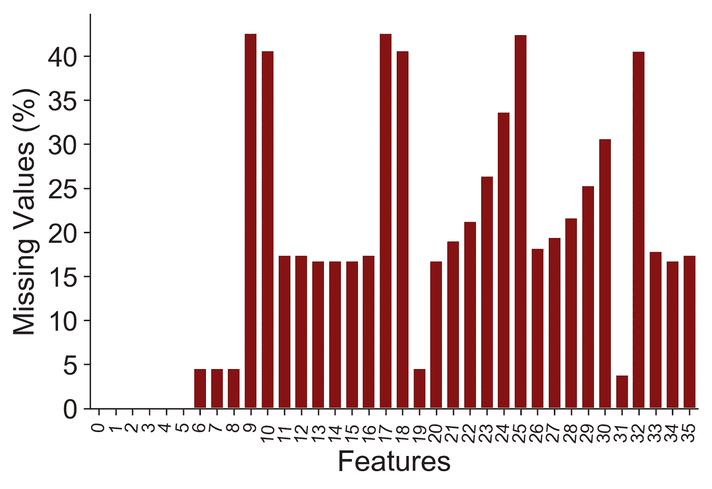
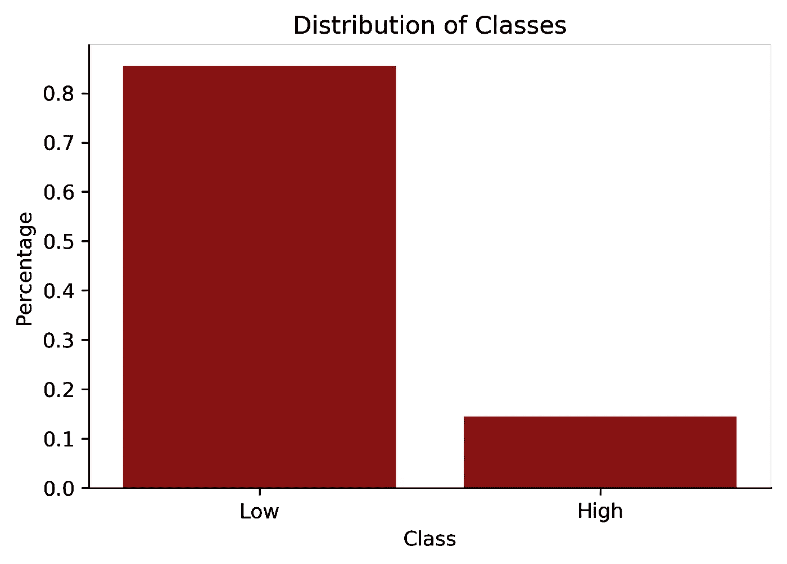
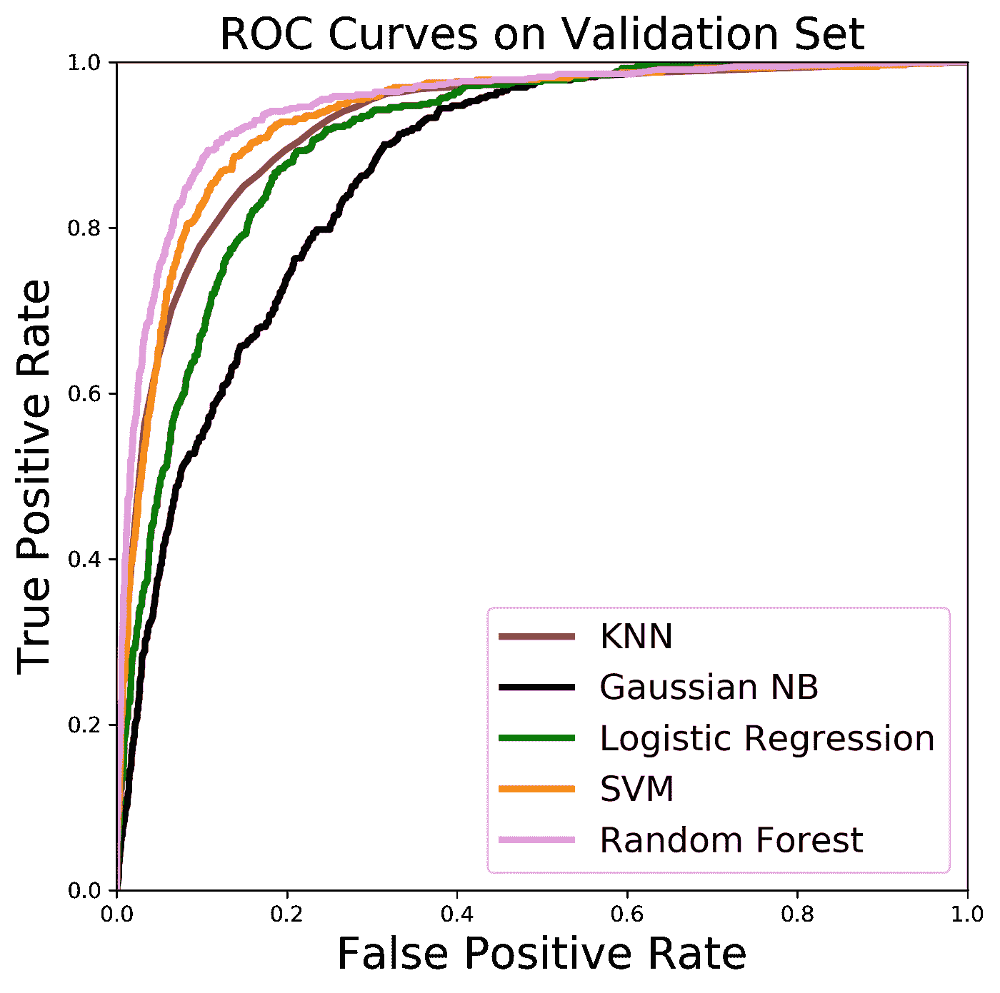
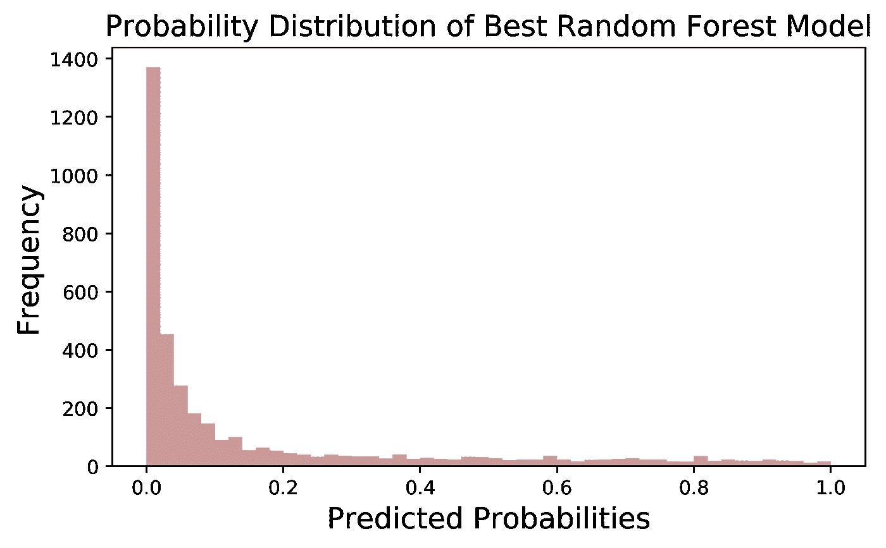
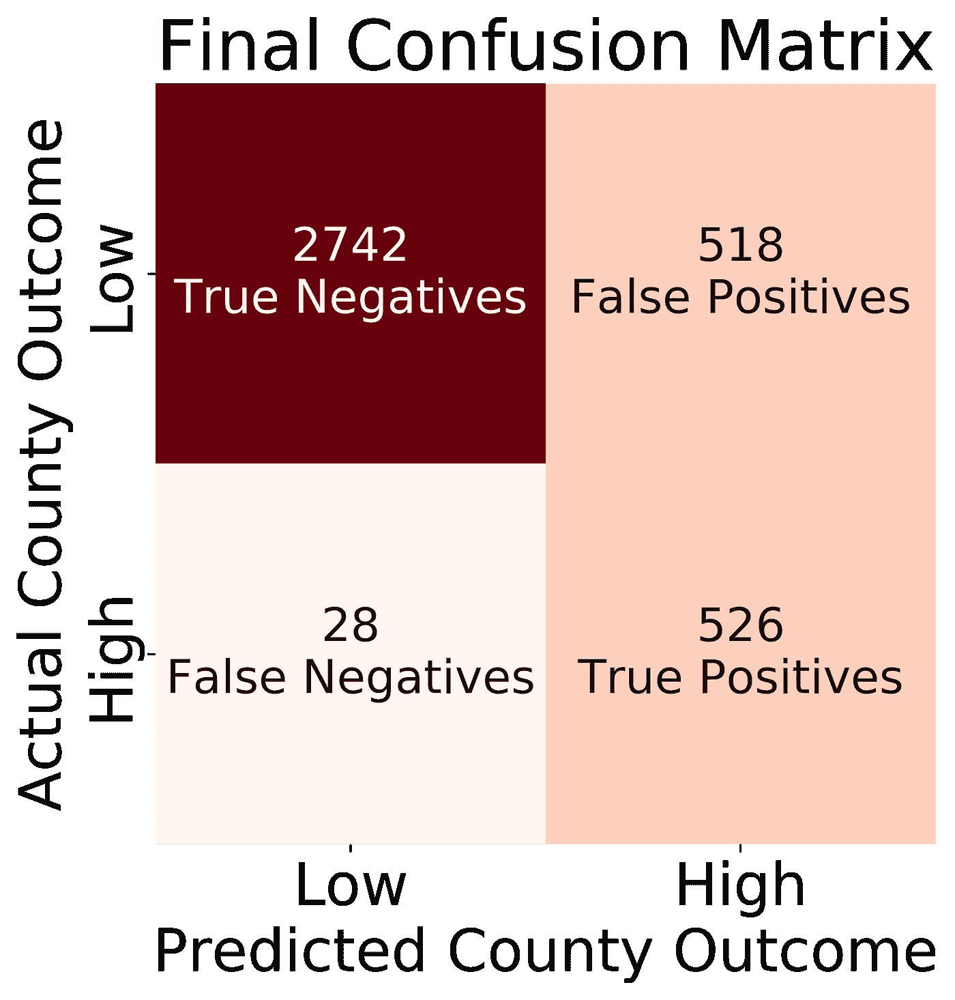

# 预测莱姆病，美国增长最快的传染病

> 原文：<https://towardsdatascience.com/predicting-lyme-disease-the-fastest-growing-infectious-disease-in-the-u-s-4874ee1f5738?source=collection_archive---------21----------------------->

## 一个基于气候的分类模型来解决安静的流行病



([Source](https://www.nidirect.gov.uk/sites/default/files/images/news/tick.jpeg))

[30 万](https://www.cdc.gov/lyme/stats/humancases.html)。这是美国每年估计感染莱姆病的人数。

但更令人担忧的是，每年只有 10%的病例被报告给疾病控制和预防中心。这意味着每年可能有 270，000 人感染这种疾病，甚至可能不知道自己患有这种疾病。



Figure 1: Number of Reported Cases of Lyme Disease to the CDC from 2000–2017 ([Data Source](https://www.cdc.gov/lyme/stats/survfaq.html))

受影响的人数也在增加。如图 1 所示，在过去的 20 年里，莱姆病的年度病例增加了一倍多。大部分集中在东北部和中西部偏上地区，它继续每年向新的县蔓延[。](https://www.cdc.gov/lyme/datasurveillance/recent-surveillance-data.html)

这都是由于[黑腿蜱](https://tickencounter.org/tick_identification/deer_tick)，也被称为鹿蜱。如果你被受感染的蜱叮咬，这种细菌*伯氏疏螺旋体*将进入你的血液，开始悄悄破坏你的免疫系统。

在大约一周内，70%到 80%的人会出现典型的“靶心”皮疹，称为[游走性红斑](https://www.cdc.gov/lyme/signs_symptoms/rashes.html)。随后通常会出现典型的类似流感的症状，如发烧、头痛、发冷和全身疲劳。

这看起来没什么，但是如果不治疗，它会导致几乎每个身体系统的广泛炎症。一些症状包括使人虚弱的关节炎和关节肿胀、面瘫、心悸、气短、大脑和脊髓肿胀，导致严重的神经疼痛和记忆力丧失。

但不一定要这样。如果在早期确诊，莱姆病可以用某些抗生素完全治愈。这一切都归结于提高公众意识和教育高危地区的医疗服务提供者。

这就是机器学习的用武之地。我的想法是建立一个分类模型，可以预测美国哪些县的莱姆病发病率高。这样，疾控中心可以提前通知高危县，以便主动采取措施防止感染。

# 获取数据

但问题是。对莱姆病研究的资助比其他疾病低得多。因此，目前对莱姆病的研究和监测很少，公开可用的数据也极其有限。这意味着我必须完全从零开始构建我的数据集。

接受挑战。让数据争论开始吧。

如果您想了解我的代码，请查看我的 [GitHub 库](https://github.com/tcbonds/lyme-disease-classifier)；为了您的方便，我按照时间顺序整理了这篇文章。

## 目标变量

首先，我需要设计我的目标变量。幸运的是，疾病预防控制中心有 2000 年至 2017 年每个县的[报告病例数的数据。尽管如前所述，该疾病的报告严重不足，但这仍然很好地描述了该疾病的地理分布。](https://www.cdc.gov/lyme/stats/survfaq.html)

为了保持一致性，我决定将数据限制在 2010-2017 年，因为如图 1 所示，2009 年出现了异常大的峰值。此外，很可能许多年前的数据并不代表今天的数据，因此删除 2010 年之前的数据可能有利于模型的可预测性。

但是，这种形式的数据不能解决分类问题。一个问题是，病例的数量严重依赖于每个县有多少人居住。为了解决这个问题，我从人口普查局获得了[县人口估计数据](https://www2.census.gov/programs-surveys/popest/datasets/2010-2017/counties/totals/co-est2017-alldata.csv)。然后，我将数据集合并在一起，并将每个县的病例数除以该县当时的估计人口数。

这导致了每人患莱姆病的比率。现在，我们有了一个指标，可以更合理地比较各个县之间的差异。

不过，还有一个步骤。对于监督学习算法，目标变量必须被标记。我发现疾控中心将[高发县](https://www.cdc.gov/lyme/datasurveillance/recent-surveillance-data.html)定义为每 10 万人中有 10 例以上确诊病例。这使我能够对数据进行分类，这样任何高于临界值的都被认为是高发县，任何低于临界值的都被认为是低发县。

## 特征

好的，但是我们如何获得这个模型的特征呢？我决定深入研究找出答案。

1998 年， [Stafford 等人](https://www.ncbi.nlm.nih.gov/pmc/articles/PMC104807/)发现蜱类丰度与莱姆病感染呈强正相关。所以你会认为现在我们应该有一个完善的国家蜱类监测计划。



Figure 2: CDC Map Showing Geographic Distribution of the Black Legged Tick ([Source](https://www.cdc.gov/ticks/geographic_distribution.html))

嗯，不。如上所示，CDC 今天提供的只是一张定性地图，显示黑腿蜱可能在哪里。不是很有帮助。

在过去的几年里，一些州，如康涅狄格州的[和北达科他州的](https://www.lymedisease.org/connecticut-tick-surveillance/)[、北达科他州的](http://www.ndhealth.gov/microlab/docs/2018%20Tick%20Report.pdf)已经主动测量蜱的浓度，但是在有一个[协调的国家监测计划](https://www.hhs.gov/sites/default/files/tbdwg-report-to-congress-2018.pdf)之前，全国范围的蜱的数量数据将不会存在。

幸运的是，有一个很好的代理。 [Khatchikian 等](https://www.ncbi.nlm.nih.gov/pmc/articles/PMC3872055/)研究表明，极端冬季温度和夏冬降水等环境因素直接调节蜱类种群动态。这可能是气候对橡子影响的结果。如果气候最适合橡子生长，吃橡子的老鼠和鹿就会大量繁殖。以这些宿主动物为食的蜱也会因此而繁盛起来。

这是个好消息，因为美国国家海洋和大气管理局(NOAA)提供了大量的气候数据。

我很快发现这比预期的要难一些，因为每天有 10，000 个 API 请求的限制。假设我需要美国每个县的每个气象站 7 年的数据，那么我大概需要 56 天才能下载完所有数据。不理想。

不过，我还是解决了这个问题。幸运的是，我找到了一个允许访问每一个[年度全球总结](https://www.ncei.noaa.gov/data/global-summary-of-the-year/access/)文件的页面，我把它们全部下载到了我的本地电脑上。当然，这意味着我现在拥有从 1900 年左右开始的世界上每个电台的数据，总计大约 78，000 个 CSV 文件，每个文件对应一个特定的电台。

显然，我只想要其中的一小部分。因此，我必须编写代码来手动解析每个 CSV 文件。



Figure 3: Example of NOAA Global Summary of the Year CSV Files

上面，您可以看到每个文件的一般格式(这里没有显示更多的列)。本质上，我从每个文件中获取纬度和经度，并将其用作[反向地理编码器](https://github.com/thampiman/reverse-geocoder) python 库的输入，该库输出该位置的国家、州和县。如果它是一个美国站，那么我只取 2010 年到 2017 年的行，并将它们附加到一个全局数据帧中，并将它们关联的州和县作为新列。

经过 24 小时的解析，我得到了一堆乱七八糟的数据。首先，有 209 列有神秘的名字，比如“DX90”和“EMSD”。我使用提供的[文档](https://www1.ncdc.noaa.gov/pub/data/cdo/documentation/gsom-gsoy.pdf)来确定每个特性的含义，然后通过仔细研究，小心翼翼地删除不相关的特性。我还重新标记了这些列，使它们有了更容易理解的名称。



Figure 4: The Percentage of Missing Values for Each of the 35 Selected Features

下一个问题是大量丢失的值，如图 4 所示。无论出于何种原因，许多台站在记录和/或报告其测量结果时并不一致。

我不想去掉列，因为那样我会丢失一些可以从气候数据中收集到的信息。因此，我选择估算所有缺失的值。

现在，这是一个我们必须非常小心的领域。我们需要放入一个能够合理代表实际值的占位符。

例如，假设缺少宾夕法尼亚州蒙哥马利县 2017 年的总降水量值。有理由相信宾夕法尼亚州所有县的平均总降水量将接近蒙哥马利县的实际降水量。这就是我对所有缺失值所做的。我在那个特定的列中找到了那个县的州的平均值，并估算了这个值。

夏威夷和华盛顿特区的一些列中没有数据，所以我必须完全删除它们。夏威夷在地理上是孤立的，没有莱姆病的发病率，所以清除它没有问题。华盛顿特区比任何一个州都要小得多，所以它对建模没有影响。

## 将目标与特征合并

好了，现在数据已经很好很干净了，我差不多准备好把特征和目标合并了。

由于我试图建立一个预测模型，我需要使用前一年的气候数据来预测今年的莱姆病发病率。

为此，我在包含下一年的特性数据中创建了一个新列。然后，我合并了该列上的目标数据，以创建一年的偏移。

# 建模准备

## 阶级不平衡

在任何建模之前，检查数据是否适合您将使用的算法是很重要的。在分类模型的情况下，类需要相对平衡。这意味着正面类和负面类应该有相同数量的实例。



Figure 5: Class Imbalance in Data

如上所述，该数据存在明显的阶层不平衡问题，85%的县莱姆病发病率低，只有 15%的县莱姆病发病率高。

但是为什么这是一个这样的问题呢？嗯，如果大多数县的莱姆病发病率较低，那么通过猜测所有县的发病率较低，模型将获得最佳准确性。在这种情况下，85%的时间模型是正确的。但是这对少数民族来说是以 0%的准确率为代价的。换句话说，我们的模型对于我们关心的有严重莱姆病问题的国家来说是完全无用的。

## 重采样技术

我尝试了许多重采样技术来抵消这一点。**随机欠采样**是指随机选择一小部分多数类，删除其余的数据点。这种去除导致多数阶级与少数阶级的平衡。但这也带来了丢失信息的明显负面影响，这可能会降低模型的可预测性。

然后是**随机过采样，**随机选择一部分不常见的类，并复制那些数据点。这也导致了平衡的班级；这里需要注意的是，拥有一堆完全相同的行可能会导致过度拟合，即模型只记住过度表示的合成数据，而对现实世界中看不见的数据失去了泛化能力。

这就是 [**合成少数过采样技术**](https://arxiv.org/pdf/1106.1813.pdf) ，也被称为**击杀**的用武之地。它不只是复制少数类的一部分，而是试图创建与原始数据相似但不完全相同的数据。在高层次上，它直接在不频繁类的数据点之间随机生成新点，从而产生完全唯一的合成数据。

最后，还有 [**自适应合成采样方法**](https://sci2s.ugr.es/keel/pdf/algorithm/congreso/2008-He-ieee.pdf) 或 **ADASYN** ，它类似于 SMOTE，但为较难学习的少数类样本创建更多合成数据，为较容易学习的少数类样本创建较少合成数据。这将导致合成数据的分布，从而增强模型在决策边界区分类别的能力。

## 拆分数据

在我们看到这些技术如何执行之前，我们必须对数据进行分区。我将数据分成三部分:60%用于训练不同的模型，20%用于验证和优化最佳模型，20%作为测试集来展示最终模型的可推广性。

# 初始建模

现在我们到了有趣的部分。我使用[不平衡学习](https://imbalanced-learn.readthedocs.io/en/stable/api.html) python 包结合 scikit-learn 的 [GridSearchCV](https://scikit-learn.org/stable/modules/generated/sklearn.model_selection.GridSearchCV.html) 构建了一个建模管道。这使我能够对超参数和数据转换(如缩放和重采样技术)的每种组合进行彻底的网格搜索，同时还进行 5 重交叉验证，以更可靠地测试每种组合的表现。

我在这条管道中运行的算法是:

*   K 最近邻居 (KNN)
*   [高斯朴素贝叶斯](https://machinelearningmastery.com/naive-bayes-for-machine-learning/)
*   [逻辑回归](/understanding-logistic-regression-using-a-simple-example-163de52ea900)
*   [支持向量机](/support-vector-machine-introduction-to-machine-learning-algorithms-934a444fca47) (SVM)
*   [随机森林](/understanding-random-forest-58381e0602d2)

我提供了有用文章的链接，以防您有兴趣了解每个模型的更多信息。

## 评估每个模型的性能



Figure 6: ROC Curves for Each Model

在分别优化了每个算法之后，我在验证集上测试了由此产生的五个模型。然后，我使用受试者工作特征曲线(也称为 ROC 曲线)绘制了它们之间的关系，如图 6 所示。ROC 曲线下面积(ROC AUC)用于比较模型。

简而言之，这一指标代表了模型在每个阈值的成本与收益，量化了模型区分不同类别的能力。最好的模型会有靠近左上角的曲线，并占据绘图中的大部分区域。

如图 6 所示，Random Forest(粉色)基本上在每个阈值上都优于其他模型，支持向量机(橙色)次之；这些模型的 ROC AUC 值分别为 **0.947** 和 **0.934** 。1 分意味着它完美地预测了数据，所以这些是非常值得尊敬的结果。

有趣的是，随机过采样为这两种模型产生了最好的结果，这表明有时简单性甚至可以胜过最复杂的方法。

# 优化最佳模型



Figure 7: Distribution of the Best Random Forest Model’s Outputs

以上是最佳随机森林模型输出的预测概率分布。这些数字代表了某个县莱姆病高发的可能性。

输出向右倾斜，表明模型预测大多数县发生高发病率的概率较低。这正是我们想要看到的，尤其是在班级不平衡的情况下。

目前，模型的默认阈值是 0.5，这意味着任何概率高于 0.5 的县都将被归类为高发病率，任何低于 0.5 的县都将被归类为低发病率。但是如果这个阈值不是最优的呢？

这是我选择 ROC AUC 作为我的评估指标的主要原因，因为它独立于阈值。这意味着我可以调整阈值来优化与犯错相关的成本模型。为此，我专门留出了 20%的额外数据。

所以现在我们需要确定这些成本。这可以说是这个过程中最重要的一步，因为我们将把模型放在真实世界的背景中，而不仅仅是在数学的真空中。我必须自己估算成本，但理想情况下，与你合作的利益相关方应该能够给你这些信息。

正如我前面提到的，这种模式背后的想法是给疾病预防控制中心一个工具，以确定他们需要努力的领域。如果一个县被归类为莱姆病高发区，疾病预防控制中心将采取两项具体措施:

1.  提高公众意识，以便从一开始就预防感染的发生
2.  为医疗保健提供者提供教育资源，以增加早期诊断的数量。

## 假阳性成本

好吧，但是如果模型预测一个县将会有很高的莱姆病发病率，但实际上却没有呢？这被称为假阳性。这意味着人们会不必要地限制他们在户外的时间，甚至可能决定不去这些地方旅行。户外娱乐和旅游业的减少会损害当地经济。

为了估算这个数字，我使用了国家公园对当地社区的估计的[总经济贡献](https://www.nps.gov/subjects/socialscience/vse.htm)，大约是每年**202 亿美元**。很明显，这并没有考虑到州立公园或其他任何会受到影响的服务，但目前来看这是可行的。

然后，我试图找到量化消费者销售在既定的流行病期间如何下降的研究，但没有太多可用的研究。Chou et al. 发现亚洲的 SARS 疫情给各国的消费相关产业造成了 0.2%到 1.56%的损失。SARS 是一种非常不同的疾病，但它几乎是目前唯一可以摆脱的疾病。我选择用 **1%** 来大致估算经济成本。

下面是我如何得出每个县的误报成本:

```
**Total Cost of a False Positive:**
(20.2 billion x .01) / [3,141 counties](https://www.usgs.gov/faqs/how-many-counties-are-there-united-states) = **$64,311 lost per county**
```

## 假负成本

那么假阴性的代价呢？这将是我们的模型预测，一个县不会有莱姆病的问题，当它真的发生了。

这显然是一个代价更大的错误。由于缺乏公众意识，更多的人会不必要地感染莱姆病。更多的人会患有慢性莱姆病，因为接受早期莱姆病诊断教育的医生越来越少。

[张等人](https://www.ncbi.nlm.nih.gov/pmc/articles/PMC3294685/)发现，早期莱姆病患者平均每年花费**1310**美元，而一个慢性莱姆病患者每年花费**16199**美元。那要贵 12 倍以上。这是在 2000 年完成的，所以我必须考虑到 1.41 的通货膨胀因素。

此外， [Aucott 等人](https://link.springer.com/article/10.1007%2Fs11136-012-0126-6)估计，每年 **64%** 的新增莱姆病病例为早期，而 **36%** 为慢性。如前所述，每年大约有 [**30 万**](https://www.cdc.gov/lyme/stats/humancases.html) 的这些新增病例。

此外，为了简化我的计算，我假设 CDC 的干预会完全有效，导致所有新的莱姆病病例都被及早发现。

要找出假阴性的成本，我只需要找出疾病控制中心不干预和干预时的成本差异。以下是我所有的计算:

```
**Number of Annual Early and Chronic Cases:**
.64 x 300,000 = 192,000 cases of early Lyme disease
.36 x 300,000 = 108,000 cases of chronic Lyme disease**Inflation-Adjusted Cost of Early vs Chronic:**
$1,310 x 1.49 = $1,952 per patient with early Lyme disease
$16,199 x 1.49 = $24,137 per patient with chronic Lyme disease**Average Cost for High Incidence County Without CDC Intervention:**
192,000 early cases / 3,141 counties = 61 early cases per county
61 early cases * $1,952 = $119,065108,000 chronic cases / 3,141 counties = 34 chronic cases per county
34 chronic cases * $24,137 = $820,641$119,065 + $820,641 = **$939,706****Average Cost for High Incidence County With CDC Intervention:** 300,000 early cases / 3,141 counties = 95 early cases per county
95 early cases * $1,952 = **$185,430**------------------------------**Total Cost of a False Negative:** $939,706 - $185,430 = **$754,276 lost per county**
```

## 寻找最佳阈值

最后，我计算了假阴性和阳性之间的成本比率:

```
**Ratio of False Negative vs False Positive:
$754,276 / $64,311 = 11.73**
```

据此，假阴性的代价几乎是假阳性的 12 倍。然后我将这个值插入我的代码，发现最佳阈值是 **0.17** 。这意味着任何高于 0.17 的县都将被列为高发病率，任何低于 0.17 的县都将是低发病率。回头参考图 7 来观察截止位置。

# 决赛成绩

为了证明我的最终模型的可推广性，我在之前使用的所有 80%的数据(60%的训练集和 20%的阈值优化集)上训练该模型，然后从一开始就用完全看不见的 20%测试集进行测试。

结果甚至比训练期间更好，ROC AUC 为 **0.961** 。



Figure 8: Confusion Matrix of Final Model’s Outputs

此外，该模型的召回率很高，约为 **0.949** ，这意味着它对约 95%的高发县进行了正确分类。如图 8 所示，在 554 个高发县中，它只有 28 个假阴性。

这当然是以 0.503 的精度为代价的。这意味着，模型预测为高发的县，实际上只有 50%左右是高发县。如图 8 所示，假阳性和真阳性大致相同。

因为假阴性比假阳性代价高得多，这些结果完全有意义。为了正确分类尽可能多的高发县，模型必须不精确。

作为一名医疗保健专业人员，也作为一个认识四名受这种疾病影响的人的人，我受到了启发，机器学习可以成功地用于帮助抗击莱姆病。这是数据科学如何被用来让世界变得更美好的又一个例子，这也是我如此热爱它的原因。

当你在户外的时候，请检查你自己是否有虱子。帮助传播消息。