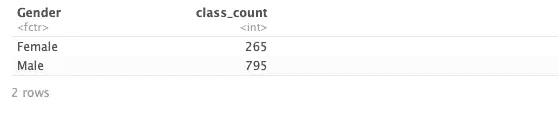
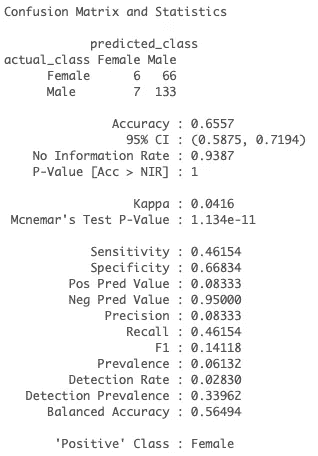
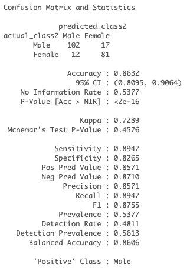
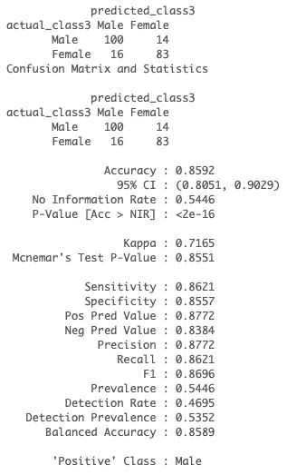

# 预测 TED 演讲中的男性和女性演讲者

> 原文：<https://towardsdatascience.com/predicting-male-and-female-speakers-in-ted-talks-a2deb0ae84b?source=collection_archive---------22----------------------->

## 自然语言处理中使用朴素贝叶斯和处理类别不平衡


Photo by [Samuel Pereira](https://unsplash.com/@samuelpereira?utm_source=unsplash&utm_medium=referral&utm_content=creditCopyText) on [Unsplash](https://unsplash.com/search/photos/speech?utm_source=unsplash&utm_medium=referral&utm_content=creditCopyText)

TED 演讲已经成为非常受欢迎的会议。它们被视为思想的麦加，吸引了最高级的演讲者，如比尔·盖茨、阿尔·戈尔或斯蒂芬·霍金。截至 2015 年，TED 和它的姐妹 TEDx 已经在互联网上发布了超过 2000 篇长达 18 分钟的免费演讲。

如果你能建立一个模型来预测 TED 演讲的演讲者是男是女，会怎么样？有点像预测一本书的作者，有没有按照某个特征对文档进行分类的技术？

是啊！我告诉你怎么做。

使用一个包含 1060 场 TED 演讲记录的数据集，我应用了一个**朴素贝叶斯分类器**来预测演讲是由女性还是男性演讲者发表的。

# 准备

## 创建文档-特征-矩阵

在创建文档-特征-矩阵之前，我快速浏览了一下我感兴趣的主要变量的分布:性别。下面的代码显示数据集是有偏差的:**大部分说话者是男性**。为什么这很重要？当我们应用朴素贝叶斯分类器时，我们需要仔细考虑这一点，因为这可能会严重影响算法的性能！

```
class_distribution <- TedTalks %>% group_by(Gender) %>% summarize(class_count=n())
print(head(class_distribution))
```



但是我们暂时就这样吧。

创建文档特征矩阵的基本步骤是首先创建定义文本字段的语料库，然后应用基本的预处理技术，包括去除停用词和标记化。我还将行随机化，以确保 train、dev 和 test set 之间的划分是完全随机的。

```
#Randomizing rows
set.seed(1628)
TedTalks_imbalanced <- TedTalks[sample(row.names (TedTalks)), ]# Creating a corpus
TedTalks.c <- corpus(TedTalks, text_field = "transcript")# Pre-processing
stop_words = stopwords("english")
tok.all <- tokens(TedTalks.c, what="word",
              remove_symbols = TRUE,
              remove_punct = TRUE,
              remove_numbers = TRUE,
              remove_url= TRUE,
              remove_hyphens = FALSE,
              verbose = TRUE,
              remove_twitter = TRUE,
              include_docvars = TRUE)# Creating a document feature matrix
TedTalks_dfm <- dfm(tok.all,
                    tolower= TRUE,
                    remove=stop_words,
                    verbose=TRUE,
                    include_docvars = TRUE)
```

# **就绪**

## **测试你的第一个模型**

我现在可以从我的第一个模型开始。注意，我在这里主要依赖 r 中 quanteda 包中的命令。通常，行的随机化应该确保您在三个不同的数据集中保持大致相同的类别分布(即男性与女性)。但是一定要检查是否真的是这样。

```
# Dividing dfm into train, dev and test set.  
TedTalks_dfm_train <- TedTalks_dfm[1:635, ] #60% of total observations
TedTalks_dfm_dev <- TedTalks_dfm[636:847, ] #20% of total observations
TedTalks_dfm_test <- TedTalks_dfm[848:1060, ] #20% of total observationsTedTalks_train_labels <- TedTalks_imbalanced[1:635, ]$Gender
TedTalks_dev_labels <- TedTalks_imbalanced[636:847, ]$Gender
TedTalks_test_labels <- TedTalks_imbalanced[848:1060, ]$Gender
```

现在，我训练并运行我的朴素贝叶斯分类器。第一个模型做好了！

```
nb_model <- textmodel_nb(TedTalks_dfm_train, docvars(TedTalks_dfm_train, "Gender"))
summary(nb_model)dfmat_matched <- dfm_match(TedTalks_dfm_dev, features = featnames(TedTalks_dfm_train))actual_class <- docvars(dfmat_matched, "Gender")
predicted_class <- predict(nb_model, newdata = dfmat_matched)tab_class <- table(actual_class, predicted_class)
tab_class
```

**评估**

为了评估我的模型的性能，我运行了如下所示的混淆矩阵。考虑以下指标很重要:准确度、预见度、召回率和 F1。随着 0.6557 的**精度水平**，可以说我的模型表现良好。然而，在我有偏见的数据集的情况下(还记得数据集中男性说话者比女性说话者多吗？)，将准确性水平作为模型性能的衡量标准可能会产生误导。为什么？因为**您的模型将在大多数情况下预测主导类，并且仍然实现相对较高的整体准确性。**

这就是为什么最好也看看其他指标。

0.083 的**精度**表明我的模型有大量的假阳性。同样，0.461 的**召回**也表明我的模型有一些假阴性。0.141 的 **F1** 的水平也很低，并且表明模型的精确度较低。因此，这些指标表明，我的模型实际上并不能很好地预测 TED 演讲者是男是女。是时候调整一下了！

```
confusionMatrix(tab_class, mode="everything")
```



# 一组

## 调整你的模型

如果我纠正我的数据集中的性别不平衡会发生什么？为了做到这一点，我依赖于一种常见的采样方法。基本上，我试图将不平衡的数据转换成平衡的分布，这样就有希望改进我的模型。通过改变原始数据集的大小并提供相同比例的平衡来进行修改。

在 R 中，ROSE 和 DMwR 等包帮助我们快速执行采样策略。在这里，我使用玫瑰包装。

作为第一步，我从**过采样**开始:我将女性数量与男性数量置于相同的水平(即各 795)。换句话说，我已经指示 R 对少数民族女性类进行过采样，直到它达到与男性类相同的水平，因此整个集合应该包括 1590 个观察值。

在第二步中，我执行**欠采样**:我降低我的多数类(男性)的观察数量，使其等于少数类(女性，即每个 265)。换句话说，我已经指示 R 对男性类进行欠采样，直到它达到 265，因此整个集合减少到 530 个观察值。

最后一步，我通过**结合欠采样和过采样方法**来实现平衡。这可以使用方法= both 来实现。在这种情况下，少数类在替换的情况下被过采样，而多数类在没有替换的情况下被欠采样。这个平衡的数据集被认为是最适合我的模型的，因为简单的过采样会导致大量的重复观察，而简单的欠采样会剥夺数据集的重要信息。

```
library(ROSE)# first step: oversampling
data_balanced_over <- ovun.sample(Gender ~ ., data = TedTalks, method = "over",N = 1590)$data
table(data_balanced_over$Gender)# second step: undersampling
data_balanced_under <- ovun.sample(Gender ~ ., data = TedTalks, method = "under",N = 530)$data
table(data_balanced_under$Gender)# third step: both
TedTalks_balanced <- ovun.sample(Gender ~ ., data = TedTalks, method = "both",p=0.5, N=1060, seed=1)$data
table(TedTalks_balanced$Gender)
```

因此，我知道我有一个新的平衡数据集(TedTalks_balanced ),我为朴素贝叶斯分类器准备的方式与我之前处理不平衡数据集的方式相同:我确保随机化行，创建语料库，运行基本的预处理技术，并随后创建新的 dfm。

与我的第一个模型相似，我也在训练集(60%的观察值)、开发测试(20%的观察值)和测试集(20%的观察值)之间划分了平衡数据集。

然后，我应用朴素贝叶斯分类器，如下面的代码所示。

```
nb_model2 <- textmodel_nb(TedTalks_dfm_train2, docvars(TedTalks_dfm_train2, "Gender"))
summary(nb_model2)dfmat_matched2 <- dfm_match(TedTalks_dfm_dev2, features = featnames(TedTalks_dfm_train2))actual_class2 <- docvars(dfmat_matched2, "Gender")
predicted_class2 <- predict(nb_model2, newdata = dfmat_matched2)tab_class2 <- table(actual_class2, predicted_class2)
```

**评估**

毫不奇怪，我新调整的模型在评估其性能时表现得更好。**精度**的水平更高，但最重要的是，我有高水平的**精度**、**召回**和 **F1** ，这表明误报或漏报的数量很少。因此，通过使用 ROSE 软件包平衡数据集，我能够显著提高算法的性能，预测 TED 演讲是由男性还是女性演讲者进行的。

```
confusionMatrix(tab_class2, mode="everything")
```



# 去

## 在您的测试集上运行它

最后，我在测试集上测试我的模型。混淆矩阵的结果表明，该模型在预测 TED Talk 演讲者的性别方面表现良好。我在开发测试中有非常相似的**精确度**、**精确度**、**回忆**和 **F1** 值。

```
dfmat_matched3 <- dfm_match(TedTalks_dfm_test2, features = featnames(TedTalks_dfm_train2))
actual_class3 <- docvars(dfmat_matched3, "Gender")
predicted_class3 <- predict(nb_model2, newdata = dfmat_matched3)tab_class3 <- table(actual_class3, predicted_class3)
tab_class3confusionMatrix(tab_class3, mode="everything")
```



就是这样！**在自然语言处理中创建一个朴素贝叶斯分类器很容易，它允许你预测一些很酷的事情，比如一个 TED 演讲者的性别。**

只需确保检查您感兴趣的变量的**分布**，因为偏差会显著影响您模型的性能。此外，在评估你的模型时，准确性不应该作为唯一的衡量标准，因为它有时会误导人。相反，应始终包括其他指标，如**精度**、**召回**和 **F1** 。

*我定期撰写关于数据科学和自然语言处理的文章——如果您想了解我的最新文章，请随时关注我的文章**[](https://twitter.com/celine_vdr)**！***