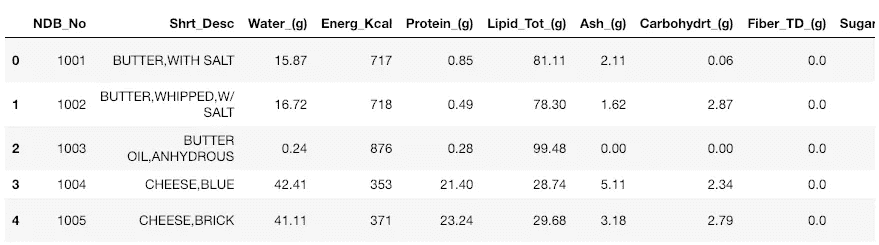
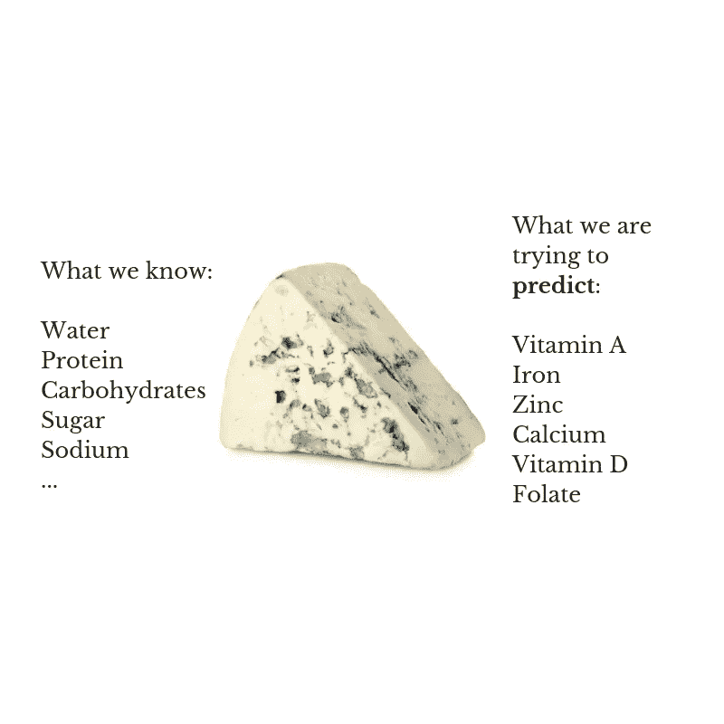

# 用神经网络和随机森林预测微量营养素(上)

> 原文：<https://towardsdatascience.com/predicting-micronutrients-using-neural-networks-and-random-forest-part-1-83a1469766d7?source=collection_archive---------6----------------------->

## 联合国儿童基金会希望你利用机器学习的力量，帮助他们预测食物中的重要营养成分。


Photo by [Dose Juice](https://unsplash.com/@dosejuice?utm_source=medium&utm_medium=referral) on [Unsplash](https://unsplash.com?utm_source=medium&utm_medium=referral)

欢迎大家！今天，我们将实施机器学习算法来解决世界上最困难的问题之一——世界饥饿。

我决定将本教程分成多个部分，以确保我们不会错过任何重要的细节。

在这个系列中，我们将解决一个回归问题，并根据其他微量营养素和常量营养素预测重要的微量营养素，微量营养素是健康大脑、骨骼和身体的基石。

我们将使用编程语言 Python 和机器学习中两个常用的依赖项来构建我们的模型，Keras 和 Scikit-Learn。

在第一部分中，我们将更多地讨论数据集和数据清理，而不是构建模型本身。

数据清理是该过程的一个关键部分，因为提供给我们的数据并不总是准备好输入到模型中。

事不宜迟，我们开始吧。

# **概述**

这篇博文包括以下内容:

*   动机
*   先决条件
*   介绍
*   资料组
*   数据清理

# 动机

在这篇博文中，我决定报道一些与任务稍有不同的内容。大多数时候，机器学习教程都涉及单变量回归，在预测过程中只有一个结果变量。

然而，这一次，我们将使用一些流行的机器学习算法来解决一个多元回归问题，其中结果变量不止一个。

我认为这很重要，因为许多现实世界的问题需要考虑多个输出变量之间的关系。

注意——深度学习的话题将在我们使用神经网络进行回归时出现。大多数博客帖子都会比较深度神经网络如何显示出比其他算法更好的准确性。

然而，在这个系列中，我将涵盖一个场景，其中深度神经网络实际上*比其他机器学习架构*表现更差。

此外，我将介绍一些有用的工具，您可以利用它们来构建机器学习算法。

# 先决条件

这篇博客文章假设读者对流行的机器学习算法(如线性回归和决策树)和技术术语(如过拟合、隐藏层等)有所熟悉。,).

如果你以前没有任何知识，或者需要一些知识来更新我上面提到的一些东西，这里有一些我推荐的资源:

*   《统计学习导论》，作者:Gareth James，Daniela Witten，Trevor Hastie，Robert Tibshirani
*   机器学习、线性回归、随机森林
    《统计学习的要素》，作者 Trevor Hastie、Robert Tibshirani、Jerome Friedman
*   [机器学习入门](https://bit.ly/2RorsKx)
*   [多元/多变量回归](https://bit.ly/2QYbebw)
*   [深度学习和神经网络](https://bit.ly/2iv6dmW)

# 介绍

联合国儿童基金会(UNICEF)有一个请求，希望您加入他们的数据科学团队，解决一个在对抗世界饥饿的斗争中起着至关重要作用的重要问题——微量营养素(也称为维生素和矿物质)。


Photo by [Perry Grone](https://unsplash.com/@perrygrone?utm_source=medium&utm_medium=referral) on [Unsplash](https://unsplash.com?utm_source=medium&utm_medium=referral)

你的工作是创建一个机器学习模型，可以根据其他营养物质(蛋白质、碳水化合物等)对这些缺乏进行预测。,).

然而，关于这项工作，他们忘了说一件事，他们没有数据(这对于像联合国儿童基金会这样大的组织来说是极不可能的；但为了这篇博文，姑且说他们没有)。

因此，您需要找到获取数据的方法来构建模型。

但是怎么做呢？从哪里来的？

# 资料组

幸运的是，历史上最伟大的创造之一，互联网，充满了许多开放的数据集，我们可以下载并用来训练我们的模型。

在这种情况下，我们将使用来自美国农业部农业研究服务局的[美国农业部国家营养数据库作为标准参考(SR)](https://www.unicef.org/nutrition/index_iodine.html) 。

在本教程中，我们将使用缩写的 excel 文件，您可以在[这里](https://www.ars.usda.gov/ARSUserFiles/80400525/Data/SR/SR28/dnload/sr28abxl.zip)下载。

该数据集包含美国食物成分数据的主要来源，有超过 8000 个数据点，每种食物中有超过 50 种微量营养素(如碳水化合物、蛋白质等)。,).

现在我们得到了数据，首先要做的是数据清洗。

# 数据清理

自然，数据并不总是以干净的 CSV 或文本文件的形式出现，可以随时输入到机器学习模型中。

我们从大自然中获取的大部分食物在我们从超市购买之前都要先进行清洗和加工。数据也是如此。

但首先，让我们看看我们的数据。由于数据是 Excel 文件的形式，我们将使用 Pandas `read_excel`函数打开文件。

```
import pandas as pdpath_to_data = "datasets/ABBREV.xlsx" # Path to the Excel file
dataset = pd.read_excel(path_to_data)
dataset.head()
```



If you run on the code on Jupyter Notebook, then the table should look like this (might look different if you run a python script on terminal)

`dataset.head()`显示数据集的前 5 行。通过这样做，我们可以对我们的数据有所了解。

正如我们所见，该表包含了每种食物的营养成分数据(如黄油、奶酪等。,).

各栏包含食物中每种微量营养素和常量营养素(蛋白质、碳水化合物等)的名称。,).

要查看所有变量的数据，可以运行下面的代码。

```
dataset.columns# Output
Index(['NDB_No', 'Shrt_Desc', 'Water_(g)', 'Energ_Kcal', 'Protein_(g)',
       'Lipid_Tot_(g)', 'Ash_(g)', 'Carbohydrt_(g)', 'Fiber_TD_(g)',
       'Sugar_Tot_(g)', 'Calcium_(mg)', 'Iron_(mg)', 'Magnesium_(mg)',
       'Phosphorus_(mg)', 'Potassium_(mg)', 'Sodium_(mg)', 'Zinc_(mg)',
       'Copper_mg)', 'Manganese_(mg)', 'Selenium_(µg)', 'Vit_C_(mg)',
       'Thiamin_(mg)', 'Riboflavin_(mg)', 'Niacin_(mg)', 'Panto_Acid_mg)',
       'Vit_B6_(mg)', 'Folate_Tot_(µg)', 'Folic_Acid_(µg)', 'Food_Folate_(µg)',
       'Folate_DFE_(µg)', 'Choline_Tot_ (mg)', 'Vit_B12_(µg)', 'Vit_A_IU',
       'Vit_A_RAE', 'Retinol_(µg)', 'Alpha_Carot_(µg)', 'Beta_Carot_(µg)',
       'Beta_Crypt_(µg)', 'Lycopene_(µg)', 'Lut+Zea_ (µg)', 'Vit_E_(mg)',
       'Vit_D_µg', 'Vit_D_IU', 'Vit_K_(µg)', 'FA_Sat_(g)', 'FA_Mono_(g)',
       'FA_Poly_(g)', 'Cholestrl_(mg)', 'GmWt_1', 'GmWt_Desc1', 'GmWt_2',
       'GmWt_Desc2', 'Refuse_Pct'],
      dtype='object')
```

在我们继续之前，我总是喜欢检查每一列的数据类型。这一点很重要，因为在训练中只使用 float 类型。

我不会详细说明所有这些变量的含义。但是如果您有兴趣了解，可以在下载数据集时查看 zip 文件中包含的文档。

幸运的是，Pandas 的`DataFrame`类有一个属性`dtypes`，它返回一个包含每一列数据类型的`Series`。

```
dataset.dtypes#OutputNDB_No                 int64
Shrt_Desc             object
Water_(g)            float64
Energ_Kcal             int64
Protein_(g)          float64
Lipid_Tot_(g)        float64
Ash_(g)              float64
Carbohydrt_(g)       float64
Fiber_TD_(g)         float64
Sugar_Tot_(g)        float64
Calcium_(mg)         float64
Iron_(mg)            float64
Magnesium_(mg)       float64
Phosphorus_(mg)      float64
Potassium_(mg)       float64
Sodium_(mg)          float64
Zinc_(mg)            float64
Copper_mg)           float64
Manganese_(mg)       float64
Selenium_(µg)        float64
Vit_C_(mg)           float64
Thiamin_(mg)         float64
Riboflavin_(mg)      float64
Niacin_(mg)          float64
Panto_Acid_mg)       float64
Vit_B6_(mg)          float64
Folate_Tot_(µg)      float64
Folic_Acid_(µg)      float64
Food_Folate_(µg)     float64
Folate_DFE_(µg)      float64
Choline_Tot_ (mg)    float64
Vit_B12_(µg)         float64
Vit_A_IU             float64
Vit_A_RAE            float64
Retinol_(µg)         float64
Alpha_Carot_(µg)     float64
Beta_Carot_(µg)      float64
Beta_Crypt_(µg)      float64
Lycopene_(µg)        float64
Lut+Zea_ (µg)        float64
Vit_E_(mg)           float64
Vit_D_µg             float64
Vit_D_IU             float64
Vit_K_(µg)           float64
FA_Sat_(g)           float64
FA_Mono_(g)          float64
FA_Poly_(g)          float64
Cholestrl_(mg)       float64
GmWt_1               float64
GmWt_Desc1            object
GmWt_2               float64
GmWt_Desc2            object
Refuse_Pct           float64
dtype: object
```

啊哈，看那个。似乎除了`NDB_No`、`Shrt_Desc`、`Energy_Kcal`、`GmWt_Desc1`和`GmWt_Desc2`之外，所有的列都是浮动的。

此外，您可以看到其中一些列的数据类型为`object`。这是因为它们包含每个行条目的文本。

出于这个原因，熊猫会认为它们是分类数据。我想使用术语*假分类变量*，因为它们实际上不是分类数据，只是包含文本。

为了使数据清理过程更加简单，让我们将这些*错误分类变量*与另一个数值变量分开。

由于熊猫不提供这样的功能，我们必须手动完成。

```
tot_cols = dataset.columns
num_cols = dataset._get_numeric_data().columns
cat_cols = list(set(tot_cols)-set(num_cols))# Output of cat_cols['GmWt_Desc1', 'GmWt_Desc2', 'Shrt_Desc']
```

太好了！现在我们可以开始第一步了。

首先注意，`NBD_No`包含每种食物的索引，`Shrt_Desc`包含食物本身的名称。在这种情况下，我们可以删除这些变量，因为它们不会用于构建模型。

```
drop_cols = ['NDB_No', 'Shrt_Desc']
dataset = dataset.drop(drop_cols, axis=1)
```

接下来，我们需要为我们的培训设置**标签**。因为我们正在处理一个多元回归问题，这意味着输出变量将不止一个。

换句话说，这意味着我们有多个标签。

正如我之前提到的，联合国儿童基金会希望你对某些食物中的重要微量营养素做出预测。但是正如我们在专栏中看到的，他们有很多。

我们怎么知道哪一个会成为我们的标签呢？

这个问题没有明确的答案，这取决于你要解决的问题。由于我们不太了解营养(我想)，我们可以查看联合国儿童基金会的官方网站。

根据联合国儿童基金会的官方网站，微量营养素主要有七种缺乏:碘、维生素 A、铁、锌、钙、维生素 D 和叶酸。

除了碘，所有这些都在我们的数据集中提供。但是在与我们团队中的主管讨论之后，他说可以进行构建模型的第一次迭代。



Just to give a visualization of what we are trying to do.

现在，我们只是将结果变量的名称放在一个列表中。在 Python 中，我们可以通过执行以下操作来做到这一点。

```
labels = ['Calcium_(mg)', 'Iron_(mg)','Zinc_(mg)', 'Vit_A_IU', 'Vit_D_IU', 'Folate_Tot_(µg)']
```

好了，现在我们需要回到那些*错误的分类变量。*因为我们已经去掉了`NDB_No`、`Shrt_Desc`，我们需要做的就是如何处理`GmWt_Desc1`和`GmWt_Desc2`。

现在你可以做两件事。

首先，你可以放弃它们，因为它们只是对`GmWt_1`和`GmWt_2`变量的描述。第二种方法是清理文本，只包含每一行条目的编号。

我会推荐第一种选择，因为这些变量很可能不会对模型的性能产生任何重大影响。然而，为了这篇博文，我将把他们包括在内。

为什么？我会解释的。

互联网上的数据并不总是干净的。他们可以有多余的或喋喋不休的话。因此，以某种方式清除这些文本并用数字表示它们是一个好习惯。

计算机只能计算数字，不能计算文本类型的数据。

因此，我们需要删除`GmWt_Desc1`和`GmWt_Desc2`中的文本。在这种情况下，它包括括号内的任何内容。

幸运的是，我已经写了一个函数来做这件事。

```
def clean_text(data):

    # If value is NaN we return the same value for cleansing later on
    if isinstance(data, str):

        # Remove any punctuations including words within parentheses
        clean = re.sub(r'\([^)]*\)', '', data)

        # Get numbers only
        clean = re.sub("\D","",clean)

        return clean

    else:
        return data
```

我们可以使用这个函数来删除括号中的标点符号和单词。此外，我们希望得到句子中的数字。

例如，如果行中的条目是“1 pat，(1" sq，1/3" high)”，那么我们只留下数字 1。

熊猫让我们简单地用属性`apply`来说明。这就是*假分类变量*列表派上用场的地方。

```
# Remove text in GmWt_Desc1
dataset[cat_cols[0]] = dataset[cat_cols[0]].apply(clean_text)# Remove text in GmWt_Desc2
dataset[cat_cols[1]] = dataset[cat_cols[1]].apply(clean_text)
```

太棒了。看来我们完了，对吧？不完全是。在准备好输入数据之前，我们需要做几件事情。

如果你回到`clean_text`函数，有一个注释说“如果值是 NaN，我们返回相同的值用于以后的清理。”

清理数据集的另一个常见步骤是处理**缺失数据**。这很常见，因为许多可以在互联网上找到的数据集并没有完全填满。

那些丢失的数据被替换为 NaN 值。与文本一样，计算机不能计算 NaN 值。

让我们看看数据集的每一列是否有任何缺失值。

```
dataset.isnull().sum()# OutputWater_(g)               1
Energ_Kcal              0
Protein_(g)             0
Lipid_Tot_(g)           0
Ash_(g)               325
Carbohydrt_(g)          0
Fiber_TD_(g)          594
Sugar_Tot_(g)        1832
Calcium_(mg)          348
Iron_(mg)             144
Magnesium_(mg)        739
Phosphorus_(mg)       579
Potassium_(mg)        426
Sodium_(mg)            83
Zinc_(mg)             706
Copper_mg)           1257
Manganese_(mg)       2160
Selenium_(µg)        1700
Vit_C_(mg)            818
Thiamin_(mg)          634
Riboflavin_(mg)       616
Niacin_(mg)           637
Panto_Acid_mg)       2242
Vit_B6_(mg)           905
Folate_Tot_(µg)      1261
Folic_Acid_(µg)      2039
Food_Folate_(µg)     1768
Folate_DFE_(µg)      2057
Choline_Tot_ (mg)    4016
Vit_B12_(µg)         1193
Vit_A_IU              711
Vit_A_RAE            1535
Retinol_(µg)         1806
Alpha_Carot_(µg)     3258
Beta_Carot_(µg)      3162
Beta_Crypt_(µg)      3270
Lycopene_(µg)        3292
Lut+Zea_ (µg)        3315
Vit_E_(mg)           2889
Vit_D_µg             3262
Vit_D_IU             3211
Vit_K_(µg)           3563
FA_Sat_(g)            349
FA_Mono_(g)           666
FA_Poly_(g)           665
Cholestrl_(mg)        410
GmWt_1                300
GmWt_Desc1            299
GmWt_2               3965
GmWt_Desc2           3965
Refuse_Pct             50
dtype: int64
```

哇，看来我们的数据集中有很多缺失的数据。

同样，这里我们可以做两件事。第一种方法是删除任何列中包含缺失数据的行。这意味着如果一个列有一个 NaN 值，我们会立即删除它们。

第二个选择是做输入，这意味着替换丢失的值。这个选项更可取，因为我们不会丢弃在模型训练期间可能很重要的其他数据。

问题是，我们用什么来代替它呢？

没有人能回答这个问题。这取决于你面临的问题和你使用的模型。一些模型对于缺失数据是稳健的，而另一些则不能处理它们。

例如，稍后，我们将使用一种流行的机器学习算法，称为随机森林。这个模型有自己处理缺失数据的方式。

但是，我们不会在本系列中讨论这个问题。但是如果你有兴趣了解的话，[这个视频](https://www.youtube.com/watch?v=nyxTdL_4Q-Q)会很有帮助。

为了简单起见，我们将使用一种最流行的技术来替换丢失的数据。那就是通过使用中间值。

为什么？这是对另一篇博文的解释。与此同时，让我们继续前进。

为了获得每一列的中间值，我们可以使用由`DataFrame`类提供的属性`median()`。然后，我们可以使用`fillna`属性替换丢失的值。

```
get_median = dataset.median()
dataset = dataset.fillna(get_median)
```

另一种方法是使用 Scikit-learn 的`[SimpleImputer](https://scikit-learn.org/stable/modules/generated/sklearn.impute.SimpleImputer.html)` [类](https://scikit-learn.org/stable/modules/generated/sklearn.impute.SimpleImputer.html)。

现在我们需要检查数据集中是否没有丢失的数据值。

```
dataset.isna().values.any()# Output
False
```

看起来所有丢失的值都不见了。

现在，到了最后一步。由于我们正在处理一个监督学习任务，我们需要将数据集分成输入数据和标签。

但在此之前，我想快速提一下。

如果你注意我们的变量列表，对于维生素 A 和维生素 D，我们有两个变量分别代表它们。

维生素 A 有`Vit_A_IU`和`Vit_A_RAE`，维生素 D 有`Vit_D_IU`和`Vit_D_µg`。

IU 代表国际标准。我不打算解释什么是 IU，但是如果你想知道更多，你可以在这里查看。

我决定选择`Vit_A_IU`和`Vit_D_IU`，因为我试图避免每个变量的单位差异有太大的变化。

现在我们已经解决了这个问题，让我们继续分离输入数据和标签。

还记得之前最初准备的标签名称列表吗？这就是它派上用场的地方。

```
# List of names of the columns that we will drop for the input data
drop_cols = ['Vit_D_µg', 'Vit_A_RAE'] + labels# Get the data for labels
y = dataset[labels].values# Get the data for inputs
X = dataset.drop(drop_cols, axis=1).values
```

属性将数据从一个对象转换成 Numpy 数组。

厉害！我们已经清理完数据了

作为数据科学团队的一员，我们正在取得进步。既然数据已经去掉了文本和缺失值，我们就可以开始构建模型了。

请加入本系列的第 2 部分，我们将通过使用 Scikit-learn 创建一个机器学习模型，最终在战胜世界饥饿的斗争中迈出又一步。

我希望这篇博文对你有所帮助，并且迫不及待地想在第 2 部分见到你。在那之前，干杯！

关于我:

*一名印尼留学生，目前在韩国留学，对人工智能世界有着浓厚的兴趣。一家名为 88spares 的初创公司的后端开发人员。相信不断的学习。我想回馈在我追求知识的过程中贡献良多的人工智能。当我不写代码时，我喜欢阅读航天工业的最新趋势，并为我大学的美式足球队效力。*