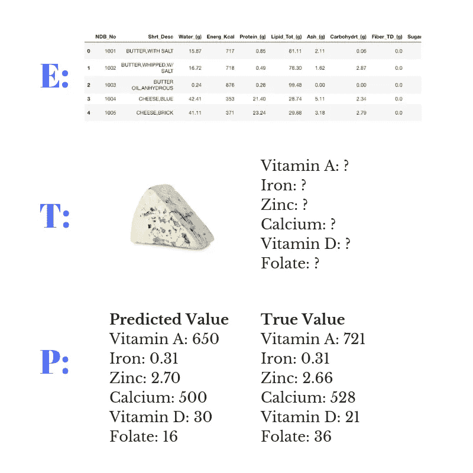

# 用神经网络和随机森林预测微量营养素(下)

> 原文：<https://towardsdatascience.com/predicting-micronutrients-using-neural-networks-and-random-forest-part-2-1bd85497fdf1?source=collection_archive---------25----------------------->

## 联合国儿童基金会希望你利用机器学习的力量，帮助他们预测食物中的重要营养成分。

Photo by [Julien R](https://unsplash.com/@djulien?utm_source=medium&utm_medium=referral) on [Unsplash](https://unsplash.com?utm_source=medium&utm_medium=referral)

欢迎回来！很高兴你能加入我的“使用神经网络和随机森林预测微量营养素”系列的第 2 部分。

在之前的博文中，我提到了联合国儿童基金会邀请我们加入他们的数据科学团队，通过使用机器学习的力量来预测某些食物中的微量营养素成分。

此外，我们还对来自美国农业部的数据集进行了数据清理。

现在，我们将进入几乎每个数据科学项目中最令人兴奋的部分之一，构建机器学习模型。

你可能从标题本身就能看出，我们将使用随机森林和神经网络来构建模型。但是对于第 2 部分，我们还没有进展到神经网络。

事实上，建议您在从事数据科学或机器学习项目时，从使用简单的模型开始，逐步转向更复杂的模型。

好的，我们在联合国儿童基金会数据科学团队的同事正在会议室等我们，所以让我们开始建立机器学习模型吧。

# 概观

这篇博文包含以下内容:

*   介绍
*   机器学习简介
*   多元线性回归:线性回归和多元回归
*   随机森林:决策树和引导

# 机器学习简介

在本系列的第一部分中，我提到了一些资料，这些资料是任何人能够更好地理解我在本系列中所谈论的内容的先决条件。

其中一个是关于“机器学习导论”然而，我决定我们应该做一个小的介绍来保持这篇博文的流畅。

但是如果你想获得更好的理解，我强烈推荐你阅读[这篇由](/introduction-to-machine-learning-db7c668822c4)[维哈尔·鞍马](https://towardsdatascience.com/@vihar.kurama)写的博客。

## 什么是机器学习？

我们将不得不对这个问题有更多的批判，因为已经有很多尝试来定义什么是机器学习，什么不是机器学习。这里有几个例子。

> 机器学习:在没有明确编程的情况下赋予计算机学习能力的研究领域。
> 
> 阿瑟·塞缪尔(1959)

20 世纪 50 年代，亚瑟·塞缪尔(Arthur Samuel)编写了一个程序，让计算机通过与自己对弈来学习下跳棋。最后连 Samul 自己都在跳棋中输给了自己的程序。

第二个定义可能是机器学习社区中最流行和最知名的。

> 适定的学习问题:如果一个计算机程序在 T 上的表现，如 P 所测量的，随着经验 E 的增加而提高，那么就说它从关于某个任务 T 和某个表现测量 P 的经验 E 中学习。
> 
> 汤姆·米切尔(1998)

让我们以目前的任务为例，预测某些食物中的微量营养素。

在这种情况下，E 是每种食物中营养成分数量的记录，T 是根据其他营养成分预测微量营养素的任务，P 是预测值与实际值的差距。

E: the records of the amount of nutrient composition within each food. T: the task of predicting the micronutrients based on other nutrients. P: how far are the predicted values from the ground truth.

在通常的实践中，当涉及到任务时，有三种不同类型的机器学习算法:

*   **监督学习**。当我们有输入变量和输出变量进行训练时，这就是我们实际在做的事情。
*   **无监督学习**。它与监督学习基本相同，但没有输出变量。
*   **强化学习**。这种类型的机器学习处理没有输入或输出变量的任务。相反，计算机程序将与动态环境交互，通过试错来实现某个目标。

当谈到监督学习时，我们实际上试图学习一个将输入变量映射到输出变量的函数。

这个函数的形式是未知的，我们的工作是评估各种机器学习算法，并观察哪种算法在逼近底层函数方面更好。

我们认为函数的另一种方式就像一个永远无法打开的魔法盒子。但是这个盒子可以接受输入，并根据输入做出预测。

例如，如果你把一封来自可疑未知电子邮件放入邮箱，它可以 100%正确地告诉你这是一封垃圾邮件还是你的一个朋友刚刚创建了一封新邮件。

既然我们看不到盒子里面是什么，那么也许我们可以创造出类似于那个盒子的东西。这个东西的形式不一定是盒子。它可以是球形、棱柱形或任何其他形状。

*(假设我们以一个球结束)*

最重要的是我们的球可以做出和魔盒预测一样好的近似。这意味着它可以正确预测 99%而不是 100%。

# 多元线性回归

正如我之前提到的，当处理一个数据科学或机器学习项目时，建议我们从更简单的模型开始。

在这里，我们将介绍多元线性回归并使用 Scikit-learn 实现它。

## 线性回归

线性回归是预测建模中使用最广泛的机器学习算法之一。它也通常在监督学习场景中实现。

它被称为线性模型，因为它推断出我们的输入和输出变量之间的线性关系。基本上，它给了我们一个类似下图的线性方程

注意——当我们谈论线性回归时，输入和输出变量通常分别被称为自变量和因变量。我将交替使用这两个术语。这也适用于系数、权重和参数。

在上面的等式中，我们有一个**因变量**，y，和一个**自变量**，x。此外，我们还有两个β，它们是线性等式的**系数**。

ε是随机采样产生的**误差项**。

第一个系数(beta null)是截距项，而第二个系数(beta one)是分配给变量的权重。权重表示变量的重要性。

这意味着如果 beta one 是 2.5，那么我们的变量(x one)的单位也会增加 2.5。

请注意，上面的等式只有一个变量和一个系数。当我们有一个以上的变量时，假设有 *n 个*变量，那么我们需要在方程中包含 *n 个*系数。

当我们使用多变量线性回归建立预测模型时，它通常被称为**多变量线性回归**。

Based on the preprocessing step that we’ve done in the previous blog post, we have 43 input variables for training. That means we will have 44 coefficients (43 for each variable plus the intercept term).

线性模型的目标是通过最小化残差平方和(RSS)来找到最佳学习数据的参数。

RSS 是真实值 y 和模型预测值ŷ(发音为 y-hat)之间的平方差总和，表示估计值。

在这篇博文中，我们不打算讨论 RSS 的细节。对详细的解释和推导感兴趣的可以查看[这里](http://www.stat.cmu.edu/~cshalizi/mreg/15/lectures/13/lecture-13.pdf)。

好吧，让我们在这里等一会儿。你能发现我们的讨论遗漏了什么吗？与我们提议的任务特别相关的东西？

如果你在想“但是我们有不止一个输出标签”或者“为什么线性方程中只有一个 *y* ？”那你应该升职了我的朋友(开个玩笑，也许一颗糖就够了？)

当我们必须预测一个输出变量的值时，这被称为**单变量回归。**事实上，这在你能在网上找到的大多数线性回归教程中都很常见。

但是当我们有不止一个输出变量时该怎么办呢？

## 多变量回归

在我们必须对多个输出变量进行预测的情况下，这被称为**多元回归**，我们将首先简要介绍一下。

还记得我们刚才谈到的线性方程吗？我们实际上可以进一步扩展这个公式，看起来像这样

基本上，我们现在有了更多的因变量、参数和误差项。我们的目标类似于单变量回归。只是这一次，我们必须找到最小化所有输出变量 RSS 的参数。

而且，这意味着我们现在有 264 个参数(44x6)，而不是 44 个参数需要估计。

哇，真多，对吧？不完全是。这在大多数机器学习实践中很常见。尤其是当我们谈论深度学习时，我们可以拥有数千个参数。

我们不打算在多元回归的背景下讨论 RSS。然而，如果你想知道更多关于多元回归的细节，请参考这张[幻灯片](https://maitra.public.iastate.edu/stat501/lectures/MultivariateRegression.pdf)。

对于不熟悉统计学的人来说，这张幻灯片可能太专业了。但是如果你感兴趣，试试吧！

接下来，我们将使用 Scikit-learn 实现多元线性回归。如果需要的话，别忘了休息一下。

## 是时候编码了！

好了，我们终于要开始编码了。确保您安装了 Scikit-learn。此外，我们将在这一部分进行数据可视化，因此请确保您还拥有 Matlotlib 和 Seaborn。

在我们构建模型之前，让我们使用一些可视化来更好地理解我们的数据。

让我们分析每两个变量之间线性关系的强度。这也就是每两个变量之间的 [**相关性**](https://en.wikipedia.org/wiki/Correlation_and_dependence) 。

我们可以使用 pandas 提供的`corr`属性构建一个相关矩阵。

您将看到类似这样的输出。

啊，看看这些数字！我认为我们应该以这样一种方式让我们的团队成员能够更好地理解这种相关性。

让我们使用 Seaborn 来可视化相关矩阵。我们可以使用[中的一小段代码来快速制作相关矩阵的热图。](https://seaborn.pydata.org/examples/many_pairwise_correlations.html)

通过一些小的调整，我们可以运行下面几行代码…

…应该会出现类似下面这样的内容。

好吧，这样看起来好多了。让我们来看看。

我们可以看到，其中一些营养素与其他营养素要么正相关，要么不相关，而只有一对是负相关的。

想知道正相关、负相关、无相关的区别，请看这里的。

虽然相关矩阵直观地显示了每两个变量之间的线性关系，但它并没有解释两个变量**是否会导致**彼此上升或下降。

事实上，很多时候你这里会有大量参与统计(包括机器学习)的人说类似[“相关性不会导致因果关系”或者“相关性并不意味着因果关系”](/why-correlation-does-not-imply-causation-5b99790df07e)。

出于这个原因，绘制我们的数据是一个好主意，以便更好地了解每个变量之间的关系。

让我们用 Matplotlib 来做这件事吧！

看起来碳水化合物和铁呈正相关。我们可以使用下面一行代码来绘制数据。

嗯，看起来尽管相关矩阵表明碳水化合物和铁是正相关的，但它们似乎缺乏 [**共线性**](https://en.wikipedia.org/wiki/Collinearity) 。

这就是为什么在建立模型之前绘制数据很重要。

好的，回到我们的数据，在图的底部看起来很混乱。不如我们用纤维和铁再试试。

看起来纤维和铁也是一样的。然而，在这种情况下，数据点都杂乱地堆在图的左下方。

另一个需要注意的是图上显示的 [**异常值**](https://www.mathsisfun.com/data/outliers.html) 的高可变性。

显然，如果我们的最初目标是基于碳水化合物或纤维的量来预测铁的量，线性模型肯定会显示出较差的结果。

但是，我们在这里处理多个变量，让我们从 2D 进入三维。同样，Matplotlib 提供了一种绘制 3D 图的好方法。

好的，现在这个图明确显示了线性模型在这里不适用。我们的数据是高度非线性的，使用线性回归不会给我们带来任何好的表现。

不过为了好玩，还是试试吧。

首先，我们需要在一个训练和测试集中拆分输入数据和标签。Scikit-learn 的`train_test_split`函数使这个过程变得很方便。

我们将把 75%的数据分配给训练集，15%的数据分配给测试集。

在大多数实践中，强烈建议我们应该增加一个叫做**验证集**的集合。但是由于我们的数据集很小，我们不必在这里这样做。

现在，我们需要在编码模型之前标准化我们的数据。这一点很重要，因为有些营养素使用不同的单位。例如，维生素 A 使用 UI 单位，而碳水化合物使用克。

我们将使用 Scikit-learn 的`RobustScaler`来标准化我们的数据，这样所有的数据都可以抵抗单位的差异。

好了，看起来我们已经准备好使用数据来建立模型了。

我假设大多数读者已经熟悉 Scikit-learn 的`[LinearRegression](https://scikit-learn.org/stable/modules/generated/sklearn.linear_model.LinearRegression.html)`类。在很多在线教程中都是常用的。

但是，该类假定只提供了一个输出变量。

对于多个输出变量，我们需要添加一个类，这个类在大多数教程中通常不会提到，叫做`MultiOutputRegressor`。

简单来说，就是 Scikit-learn 扩展 regressor 的一种方式，它本身不支持多输出回归。

我们将从简单地导入类开始。

接下来，我们可以开始拟合模型。

通常，在大多数关于线性回归的教程中，你很可能会看到这样的内容。

我们需要稍微修改一下，以包含`MultiOutputRegressor`类。

目前看起来不错。接下来，我们需要检查我们的模型在训练期间是否表现良好。Scikit-learn 的`score`属性应该可以做到这一点。

我们的模型显示了大约 72%的准确性。这是怎么回事？好吧，看起来仅仅用线性回归，我们就能得到比抛硬币更好的性能。

但是让我们继续每一个机器学习实践中非常重要的一步，在测试集上验证我们的训练性能。

我们这样做是为了避免**在训练中过度适应**。简而言之，当模型试图预测噪音过大的数据趋势时，就会发生过度拟合。

The black line is when the model was able to generalize well on the data. On the other hand, the blue line displays the line when the model has overfitted. (source: wikipedia.org)

因此，让我们检查模型在测试集上的表现。我们可以像训练集一样做一些小的改动。

看起来我们的模型能够在一定程度上避免过度拟合(训练和测试集精度之间的差异约为 7%)。

你现在可能会在脑海中嘀咕“那么我们如何避免过度适应和适应不足呢？”嗯，跟 [**偏差-方差权衡**](http://scott.fortmann-roe.com/docs/BiasVariance.html) 有关系。

如果我们回到图中，我们的数据看起来杂乱无章。从视觉上看，这应该是高偏差的标志，这将导致拟合不足。然而，看起来我们的模型有更多的机会过度拟合。

虽然我们做了很好的工作来避免过度适应和适应不足，但这还不足以向我们在联合国儿童基金会的团队展示。

既然我们能够影响的人数很大(我指的是联合国儿童基金会)，那么我们就应该提高我们模型的性能。

就像我之前说过的，数据集本身是高度非线性的，包含许多异常值。使用这样的数据集进行线性回归肯定不会产生最佳性能

作为一个有趣的练习，您可以尝试使用模型的预测值再次绘制数据。这将使我们对数据有更好的视觉理解(我们将在本系列的后面部分进行更多的可视化)。

因此，基本上，我们需要做的是使用一个不同的模型，可以处理非线性数据，并对异常值具有鲁棒性。

进入随机森林！

# **随机森林**

如果我们试图找到一些最常用的机器学习模型来提高 Kaggle 的性能，它要么是随机森林，要么是梯度增强树。

然而，在这篇博文中，我们将讨论第一个问题。

但是在开始研究算法之前，我们需要先讨论一下决策树和自举。

## **决策树**

想象一下，一边在公园散步，一边观察周围的环境。没有明显的原因，你决定看一棵树。它从根部开始，一路向上，直到最后一片叶子。

决策树也是一样，只是颠倒了。决策树算法也称为 CART、分类和回归树。

现在，我们将把注意力集中在回归树上，因为，当然，我们正在处理一个多元回归任务。

与线性回归不同，决策树算法不考虑数据中的线性假设。此外，它不需要任何重量。

相反，当使用决策树时，我们试图使用特征空间的满意度来进行预测。

根据《统计学习入门》一书的第 8 章，我们需要遵循两个步骤来构建决策树:

> 1.我们将预测空间(即 X1，X2，…，Xp 的可能值集)划分为 J 个不同且不重叠的区域，R1，R2，…，RJ。
> 2。对于落在区域 Rj 中的每个观察值，我们进行相同的预测，这只是 Rj 中训练观察值的响应值的平均值。

注意，作者使用 *Xj* 作为自变量的符号，而不是 *xi。从现在开始，我们将做同样的事情。*

现在，对于那些不熟悉决策树算法的人来说，可能会发现上面的陈述相当不清楚。

但简单地说，第一个陈述表明我们需要选择一个变量，并基于这些观察建立观察区域(数据点)。

而第二种说法是，在我们有了我们的区域之后，我们可以通过计算每个区域的观察值的平均值来进行预测。

有两种方法可以让我们通过视觉化直观地理解这个概念。

首先，我们可以绘制我们的数据点，并画一条线来分隔它的两个区域。让我们用纤维和碳水化合物来估计铁的价值。

这里我们看到一条线，将图分成两个区域。如果我们仔细观察，这条线在轴上代表碳水化合物的大约 41 个标记处开始分裂。

在回归方面，决策树算法通过平均每个区域的数据点来进行预测。

然后，算法将继续对变量进行分割，直到估计值与实际值相差不远。

我们可以形象化决策树的另一种方法是使用图表。

这里我们可以看到图表从顶部开始分裂。这些方框被称为**节点**，而指向/连接另一个节点的箭头被称为**边**。

如果你注意到了，第一个节点在 41.32 的值上做了一个分割，这和图中几乎一样。

与现实生活中的树不同，决策树通常通过向下的分支来可视化。

从顶层节点分支出来的两个节点被称为**内部节点**。上图中，每个内部节点内部都有字*值*。

这些值是算法通过对每个区域的观察值进行平均而得出的预测值。

然而，上面的图和图都只有一个深度。如果我们让树长到深度为 2，那么我们会得到这样的结果。

The plot and the graph with a depth of two.

在剧情上，我们可以看到现在另一条线对上一条线做了拆分。而该图具有更多的内部节点，这使得纤维分裂。

对于这个图，如果我们让树一直增长，直到它进行了最好的分裂，它将有更多的内部节点，最终可能不再是视觉上可理解的。

但问题是什么是最好的分割？好吧，最好的拆分是最小化预测值和真实值之间的误差的拆分。

如果我们仔细观察我们的图表，我们可以看到其中有单词 *mse* 。

这是指 [**均方误差**](https://en.wikipedia.org/wiki/Mean_squared_error) ，由以下公式给出

这类似于我们之前讨论过的 RSS，只是略有不同。

正如我们看到的，该公式具有 *1/N* 符号。这意味着在对所有平方误差求和后，我们用 *N* 个观察值对它们进行平均。

MSE 可能看起来像 RSS 加平均符号，但是在得出结论之前，这个讨论可能值得一查。

无论如何，理解决策树算法是使用随机森林算法的关键一步。

然而，这只是对决策树能力的简要说明，并推荐您查看《统计学习介绍》 [*第八章*](https://www-bcf.usc.edu/~gareth/ISL/)**书*。*

*该书对决策树给出了更好的高级数学解释。*

*在我们继续之前，我可能需要提到使用决策树时的一个更重要的方面。它被称为**基尼指数。***

*简而言之，就是用来衡量某个变量在任意选择时被错误分类的概率。基尼指数基于熵的概念，熵是不确定性的程度。*

*这个概念通常在各种使用决策树相关算法进行分类任务的博客文章中很常见。*

*在分类任务中，我们想要测量**信息增益**，以便了解哪些特征给出了关于某个类别的最多信息。*

*然后，该信息用于解释每个变量的重要性，并利用它了解哪个变量对预测影响最大，或者最常被理解为**变量重要性**。*

*就回归而言，正如我们之前讨论的，我们使用 *mse* 找到最佳分割。*

*我们可能会在本系列的一篇特色博文中讨论更多的可变重要性。*

*接下来，我们将介绍随机森林的另一个重要方面，引导。*

## *拔靴带*

*使用机器学习项目的挑战之一是收集数据可能非常昂贵和困难。*

*虽然互联网上有各种开放数据集(如我们正在使用的数据集)，但一些模型需要更多数据来提高训练期间的性能。*

*但是在实践中，收集数据有时既昂贵又困难。我们可以使用一种叫做自举的重采样方法*

*简而言之，bootstrapping 包括用替换随机地从我们已经可用的数据集中重新采样数据。“With replacement”基本上意味着我们可以在新数据集中两次使用相同的观察值。*

*我们重复这个过程一段时间，直到我们得到所需数量的引导数据集。每个引导数据集包含相同数量的原始数据集的观测值。*

*让我们以数据集为例，使用碳水化合物变量的前五个观察值。*

**

*前五个观察值分别是 0.06、2.87、00.0、2.34 和 2.79。*

*让我们将引导数据集表示为*子*。如果我们有 4 个数据集，那么每个数据集将分别命名为 *Z1、Z2、Z3、*和 *Z4* 。*

*如果查看上面的图像，所有自举数据集的观测值都有重复值。这就是“用替换”的意思。*

*那么我们该如何处理这些自举数据集呢？当然，我们用它们来制作机器学习模型。*

*这听起来可能有点奇怪，因为我们已经有了用于训练的原始数据集。*

*但是，一旦我们进入这个主题令人兴奋的部分，编码随机森林，这一切就都有意义了！*

## *编码随机森林*

*既然我们对决策树和自举有了一些直觉，我们可以继续讨论随机森林。*

*你看，这个算法被称为随机森林是有原因的。思考我们刚刚讨论的两个重要方面。*

*该算法使用 bootstrapping 使用原始数据集中的要素子集随机创建数据子集。然后使用决策树算法对每个子集建立模型。*

*然后，对每个模型的每个预测进行平均，以创建一个最终预测。*

*这对于多变量任务也是一样的。唯一的区别是每个决策树输出维生素 A、铁、锌、钙、维生素 D 和叶酸的值。*

*我们开始吧！与线性回归一样，我们需要导入`RandomForestRegression`类和`MultiOutputRegressor`类。*

*现在我们可以将数据放入模型中。*

*如我们所见，这里设置了一些参数。`n_estimators`为 100，因为 Scikit-learn 的下一个版本将把这个值作为默认值。*

*`max_features`仅仅是确保我们子集特征数量的平方根。这是我们需要为我们的模型调整的超参数之一。我们将在另一篇博文中讨论这个问题。*

*接下来，我们可以尝试检查我们的模型的准确性。*

*哇，看起来我们的模型在训练数据上表现得非常好。我是说，95%的准确率？听起来不错，对吧？*

*不完全是。我们仍然需要检查测试的准确性，因为我们想要的是模型在我们以前没有观察到的数据上表现良好。*

*看起来性能似乎相当不错。几乎比线性回归好 20%*

*与线性回归不同，我们的模型过度拟合，因为训练精度远大于测试精度(大约 15%的差异)。*

*我们可以用各种方法来改进这个模型。然而，让我们看看我们是否可以使用近年来获得高人气的算法来制作模型。*

*在本系列的下一部分，我们将构建一个神经网络算法来训练我们的数据。*

*当我们在数据集上使用神经网络时，您认为会发生什么？还会一样吗？好些了吗？或者更糟？*

*请在评论中告诉我你的想法。期待反馈和进一步的讨论。*

*第 3 部分见。干杯！*

*一名目前在韩国留学的印尼学生，对人工智能世界有着浓厚的兴趣。最近以 AI 研究实习生的身份跳槽到 IBM。相信不断的学习。我想回馈在我追求知识的过程中贡献良多的人工智能。当我不写代码时，我喜欢阅读航天工业的最新趋势，并为我大学的美式足球队效力。*