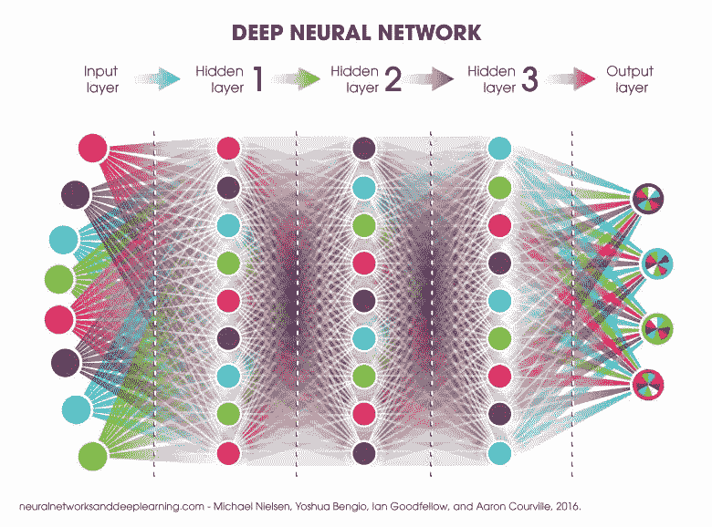
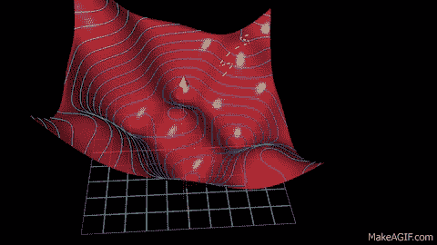
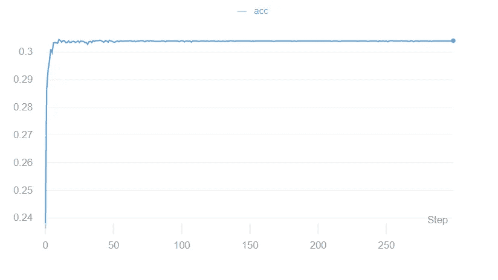

# 用神经网络和随机森林预测微量营养素(三)

> 原文：<https://towardsdatascience.com/predicting-micronutrients-using-neural-networks-and-random-forest-part-3-337ed6c5946a?source=collection_archive---------39----------------------->

联合国儿童基金会希望你利用机器学习的力量，帮助他们预测食物中的重要营养成分。

Photo by [Zoltan Tasi](https://unsplash.com/@zoltantasi?utm_source=medium&utm_medium=referral) on [Unsplash](https://unsplash.com?utm_source=medium&utm_medium=referral)

问候！欢迎来到“使用神经网络和随机森林预测微量营养素”博客系列的第 3 部分。

在之前的博客文章中，我们通过对数据进行一些可视化技术，稍微看了一下我们的数据是什么样子的。

然后，我们尝试使用两种最常见的监督机器学习算法:线性回归和随机森林。然而，似乎我们没有得到我们想要的结果。

如果你是深度学习的新手，请注意，虽然内容包含对深度学习的介绍，但这不是一篇关于深度学习如何漂亮地工作的博客文章。

相反，这篇博客文章是为了表明，当试图建立机器学习模型或解决数据问题时，深度学习是**而不是**的银弹。

如果你想看看深度学习何时起作用的例子，我会在这篇博文的结尾附上一些文章。

到目前为止，我们只有几天时间来准备我们向联合国儿童基金会数据科学团队提出的模型。当然，鉴于该组织的声誉，我们不想让他们失望，对吗？

太好了，现在我们站在同一边了，让我们开始吧。

# 概述 **:**

这篇博文包含以下内容:

*   深度学习简介
*   深度神经网络是如何“学习”的？
*   使用 Keras 编码深度神经网络
*   反射部分

# 深度学习简介

关于深度学习的所有宣传，我假设大多数正在阅读这篇文章的人对它的总体情况有所了解。

简而言之，深度学习是主要利用堆叠感知机从数据中学习的各种机器学习方法之一。

这些堆叠的**感知器**被称为神经网络，其灵感来自人脑复杂的生物结构。一般来说，一个神经网络有**三个主要层** : **输入**、**隐藏**和**输出**。

隐藏层中的每个单元称为一个**隐藏单元**。

A general structure of a neural network has an input, hidden, and output layer.

现在你可能会想，“好吧，但我还是不明白这到底是怎么回事。”嗯，你完全正确。然而，在大多数实践中，更多的隐藏层和隐藏单元堆叠在架构中。

一些复杂的网络使用了数十万甚至数百万个隐藏层和单元。随着隐藏层和单元数量的增长，大多数专家将该网络称为**深度神经网络**。

A Deep Neural Network

另一个可能会突然出现在你脑海中的问题是“那么这个深度神经网络有什么特别之处？”深度学习的一个特殊之处就是它的“学习”部分。

我们已经讨论了“深”的部分，现在让我们谈谈第二部分。

# 深度神经网络是如何“学习”的？

各种有监督的机器学习算法的目标从根本上是相似的:最小化预测值和地面真实值之间的误差。

在深度学习流行之前，大多数机器学习过程都试图通过[**特征工程**](https://machinelearningmastery.com/discover-feature-engineering-how-to-engineer-features-and-how-to-get-good-at-it/) 的方式来做到这一点。

不要太深入细节，特征工程只是一种创建特征以使机器学习工作的方法。在这种情况下，特性意味着数据的变量。

然而，在深度学习算法中却不是这样。相反，一个 [**优化算法**](https://en.wikipedia.org/wiki/Mathematical_optimization#Computational_optimization_techniques) 被用来寻找最佳执行模型。其中最流行的一种叫做 [**渐变下降**](https://en.wikipedia.org/wiki/Gradient_descent) 。

基本上，梯度下降的主要目标是找到一个损失函数的局部最小值。

它能够通过称为 [**反向传播**](https://en.wikipedia.org/wiki/Backpropagation) 的过程，相对于隐藏层中的所有权重取误差的梯度来做到这一点。

然后，你要向梯度方向迈出负的一步。我们将尝试使用类比来更好地理解这一点。

我们不打算在这里讨论数学，但从视觉上看，它大概是这样的。

What a gradient descent process looks like in three dimensions.

或者，我们可以用一个人蒙着眼睛下山的类比。向山下一大步，或者在山的某个安全的地方迈出一小步，会更好吗？

如果有人还想再活一天，那么后者当然会好得多。基本上，我们想做的是采取一个小的渐进步骤，将我们带到山的底部。

这些小步骤就是“向梯度负移一步”的意思，但这一次，它来自“误差函数”山。

optimization using gradient descent be like…

注意梯度下降有它的变体。选择使用哪种深度学习算法是训练深度神经网络艺术的一部分。

具体来说，我们使用的是最常见的变体之一，称为 **Adam** optimizer。同样，我们不打算在这里讨论，但可以随意参考[原始论文](https://arxiv.org/abs/1412.6980)。

好了，现在是我们一直在等待的时刻，Keras 的编码部分！

# 使用 Keras 编码深度神经网络

Keras 是一个用 python 编写的开源神经网络库。它运行在各种现有的深度学习库之上，如 Tensorflow、MXNet 和微软认知工具包。

此外，我们将使用另一个名为[权重和偏差](https://www.wandb.com/)的工具，用于跟踪可视化神经网络的训练进度。现在，我们将把注意力集中在跟踪训练精度上。

在我们开始编码之前，请注意我们已经准备好了数据集。在本博客系列的第一部分中，它已经被清理、扩展并分成了训练集和测试集。

数据准备好了，我们就可以开始编码神经网络了。我假设读者熟悉 Keras。如果没有，那么[文档](https://keras.io/)会非常有用。

让我们从 Keras 库中导入所有需要的东西。

这里，我们使用`Sequential`来堆叠层。我们将使用四种类型的层对象:`Activation`、`Dense`、`BatchNormalization`、`Dropout`。

只是指出，`Dense`就是我们之前讲过的全连通层。根据名称，`Activation`、`Dense`和`BatchNormalization`层非常简单。

如果你不熟悉最后两个，那么我强烈建议你读一点，因为它们在实践中经常被使用。

如前所述，`Adam`被选为优化器。此外，我们使用`mean_squared_error`作为损失函数，因为它是我们用于随机森林和线性回归的函数。

好了，我们从 Keras 得到了我们需要的东西，但是我们还需要一些东西来跟踪我们的模型在训练时的表现。这样，我们可以看到一段时间后精度是否停止提高。

我们可以使用很多开源工具，但我更喜欢的是一个叫做[权重&偏差](https://www.wandb.com/) (wandb)的工具。它为 Keras、Tensorflow 和 Pytorch 提供支持。

要使用它，我们需要在官网注册，下载 Python 的 SDK，做一点点设置。

`wandb.init()`初始化图表，将显示图表。`config`允许我们设置参数(批量、学习率等。)将被发送到图表轴的 wandb 服务器；例如像纪元。

现在我们需要将参数设置为 config。请随意修改参数。

太好了！让我们从神经网络架构开始。首先，让我们建立一个 2 个隐藏层的神经网络。第一层有 128 个隐藏单元，第二层有 64 个。

我们将在每一层之后使用一个 ReLU 激活。然后我们再做批量归一化，后面会有一个掉线。最后一层有 6 个输出单元。

我们得到了我们的架构，现在我们只需要编译我们的优化器和损失函数。

现在，是训练的时间了！

正如我们在这里看到的，我们有一个`callbacks`参数，它接受一个列表作为它的输入。我们可以有多个性能跟踪器，但是在这种情况下，我们将只在列表中使用`WandbCallback`。

要查看模型的性能，我们可以直接查看 wandb 网站上的仪表板。

根据您的内存能力，可能需要一段时间来训练模型。然而，有了追踪器，如果我们的表现似乎一点也没有改善，我们可以随时停止。

让我们看看进展如何。

在整个训练过程中，我们的模型似乎只能达到大约 30%的准确率。具体来说，在第 20 个纪元前后，精确度停止提高。看起来我们必须稍微改变一下架构。

让我们试着在两层中使用较少的隐藏单元。注意，我们需要重新运行`wandb.init()`和`config = wandb.config`来开始一个新的图表。

如果没有，那么 wandb 会认为我们在继续之前的培训课程，而实际上我们正在开始一个新的课程。

也就是说，让我们建立架构。

而且准确率还在 30%左右。嗯，我想知道这是怎么回事？但是在前 40 个纪元的训练中似乎有剧烈的变化。

这里有很多假设，但是减少隐藏单元的数量可能不是一个好主意。那么，如果我们添加比第一种架构更多的隐藏单元，会发生什么呢？

让我们找出答案。

准确率还是~30%？(混乱开始了)。

到目前为止，我们所做的只是改变隐藏单元的数量。也许是时候用图层来增加一些东西的味道了。让我们就这么做吧！我们要做 5 层，而不是 2 层。

好吧，现在我很确定我们没有朝着正确的方向前进。

在这种情况下，人们很容易得出这样的结论，即深度学习在这种情况下可能不是一个可行的解决方案，并提出一个解决方案。

然而，后退一步，花时间去理解*为什么*这不是一个可行的解决方案，这总是一个好的做法。

理解为什么某个解决方案对某个问题不起作用是每一次失败的学习部分。这样，当被问及为什么有些东西不起作用时，我们将能够解释为什么

那么让我们继续下一部分，反射部分。

# 反射部分

首先，让我们多想想我们的数据。我们的数据集大约有 8000 个数据点。

在深度学习实践者的眼中，这是相当小数量的数据点。通常，深度神经网络需要数百万，甚至数千万个数据点。

此外，我们在数据集中使用许多变量，这些变量可能充当噪声，而不是实际信号。也许我们不需要全部都用上。

也许如果我们做更多的可视化，我们可以更好地理解我们的数据，并使用更好的方法而不是深度学习。这正是我们在这个博客系列的第四部分也是最后一部分要做的。

尽管有深度学习的大肆宣传，但我们现在明白，深度学习并不总是答案；至少在这种情况下不会。还有其他方法可以解决数据问题。

顺便说一下，正如承诺的那样，这里有一些深度学习工作得非常好的文章(当然有 Keras):

*   [你的第一个深度学习项目是用 Python 和 Keras 一步一步来的](https://machinelearningmastery.com/tutorial-first-neural-network-python-keras/)
*   [LSTM 情绪分析| Keras](https://www.kaggle.com/ngyptr/lstm-sentiment-analysis-keras)
*   [使用 Keras 的图像识别:卷积神经网络](/image-recognition-with-keras-convolutional-neural-networks-e2af10a10114)

上面的文章是很好的例子，当有足够数量的数据时，它们将向你展示深度神经网络的真正力量。

如果你一直读到最后，非常感谢你。如果你有进一步的问题或者想要给我一些反馈，请在评论中告诉我，或者在[我的 Linkedin](https://www.linkedin.com/in/gilang-ilhami-832b96147/) 上给我发消息。

希望下一部能见到你。到那时，干杯！

关于我:

*一名目前在韩国留学的印尼学生，对 AI 世界有着浓厚的兴趣。大部分时间是后端和机器学习开发者。相信不断的学习。我想回馈在我追求知识的过程中贡献良多的人工智能。*