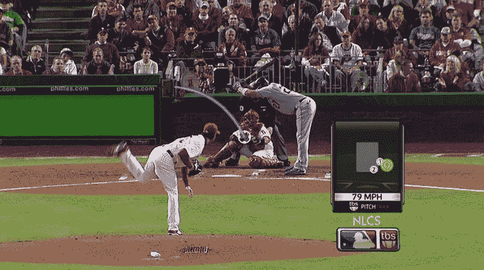
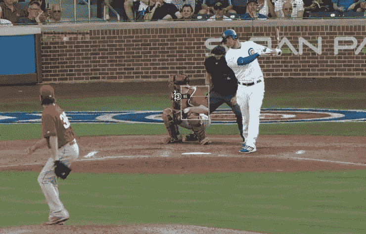
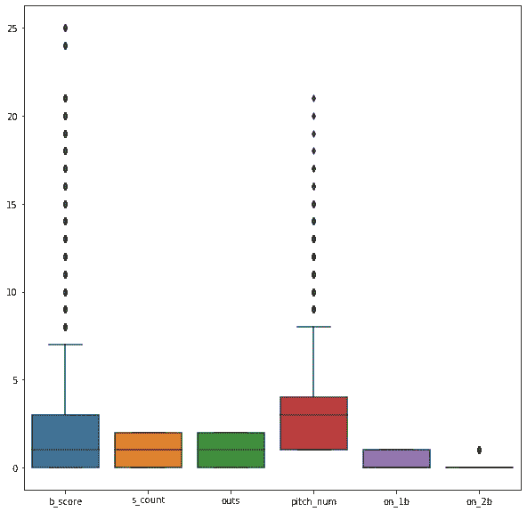
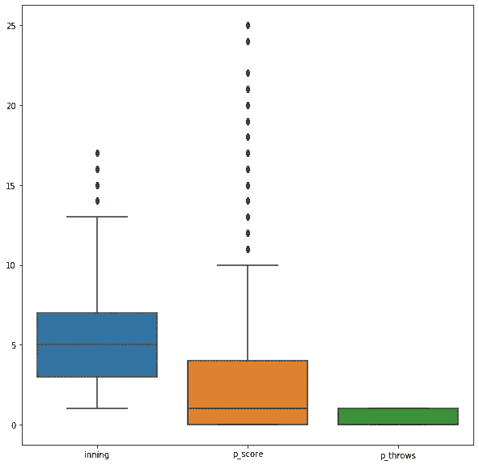
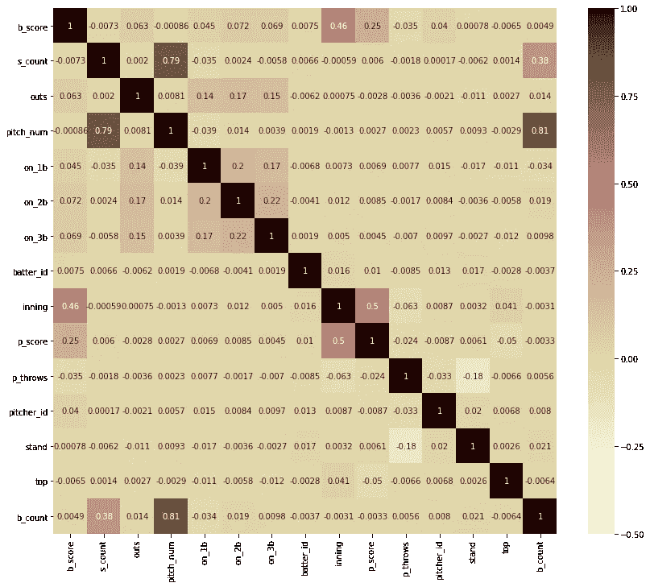
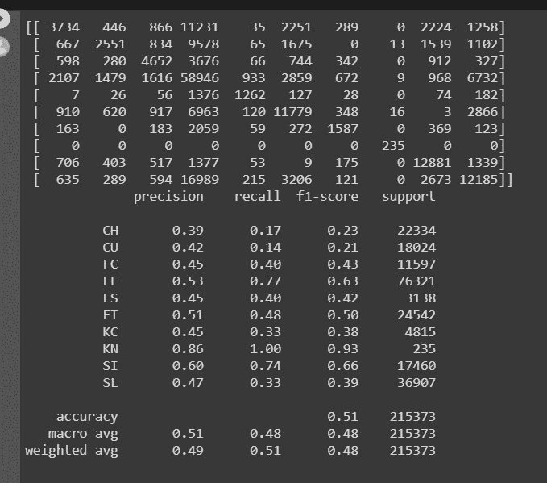
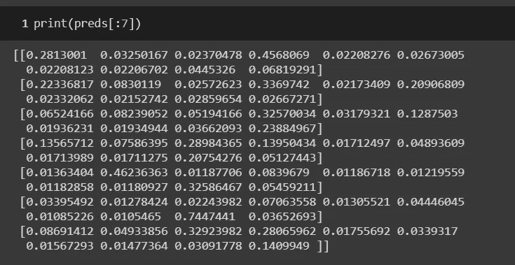
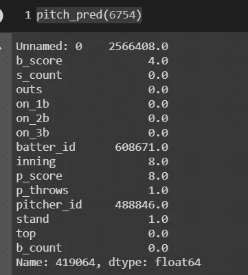
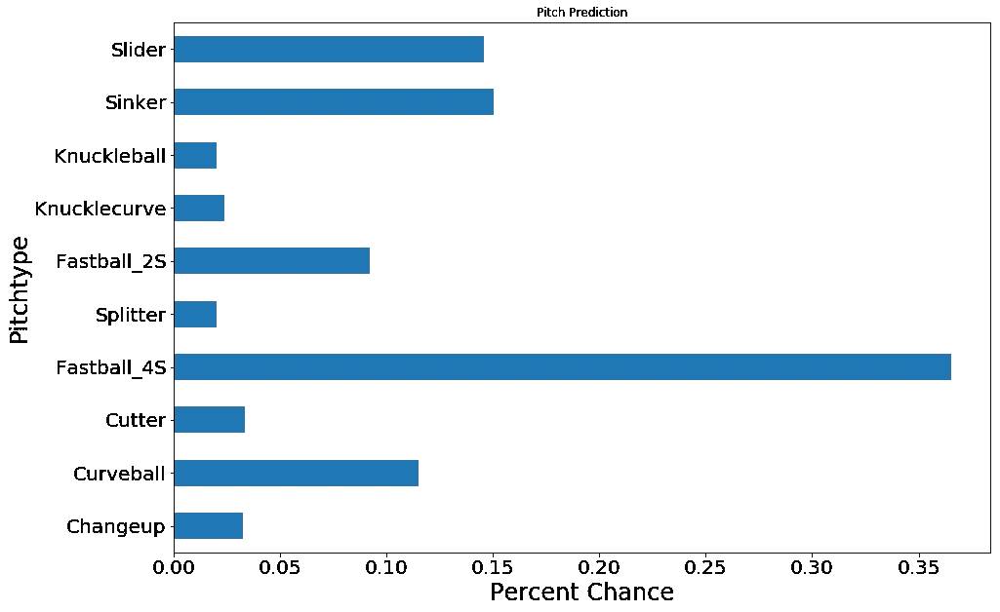

# 基于比赛情况预测 MLB 投球概率

> 原文：<https://towardsdatascience.com/predicting-mlb-pitch-probability-based-on-the-game-situation-1afc5a01cf3?source=collection_archive---------34----------------------->



Can we determine what this pitch will be before it is thrown?

对许多人来说，棒球是一项很棒的运动。这是第一个想到利用数据在各个层面做出决策的运动之一。经理使用数据做出游戏决策，总经理使用数据决定合同支出。

棒球也是最早将统计数据纳入电视转播内容的运动之一。实时投球速度，投球位置，得分概率和偷垒概率。这些只是观众在观看这项全国性娱乐节目时可以吸收的一些东西。随着最近人工智能的加入，更多的预测和实时内容可用。



Pitch location is just one of the many AI uses of real-time mediated content

作为一个游戏爱好者，我想深入到一个目前还不属于本内容的领域，但在未来将会是:根据游戏情况预测接下来会有什么样的投球。我对最初的结果感到非常兴奋。

第一，数据。Kaggle 提供了一个数据集，其中包含 2015-2018 赛季在[https://www.kaggle.com/pschale/mlb-pitch-data-20152018](https://www.kaggle.com/pschale/mlb-pitch-data-20152018)的所有球场数据。数据来自几个方面。csv 文件包括投球，击球，比赛，弹射和球员姓名。为了达到我们的目标，只使用了击球和投球数据集。

以下是加载到笔记本中的包

```
import pandas as pd
import numpy as np
import matplotlib.pyplot as plt
import seaborn as sns
from sklearn.preprocessing import RobustScaler, LabelEncoder
from sklearn.model_selection import train_test_split, cross_val_score
from sklearn.metrics import accuracy_score, f1_score, confusion_matrix, classification_report, precision_score
import xgboost as xgb
from keras.utils.np_utils import to_categorical
import random
from keras import models, layers, optimizers, regularizers
from keras.layers import Embedding, GRU, Dropout, GlobalMaxPool1D, Dense
from sklearn.model_selection import GridSearchCV
```

读入数据并将两个数据集合并在一起(在 ab_id 上)后，第一个障碍是要处理的数据量。从 2015 年到 2018 年，记录了超过 280 万次投球。出于计算费用和最相关数据的目的，数据集被缩减为仅反映 2018 赛季。

```
#isolating the data that only contains the 2018 season
data18 = data[data['year'] == '2018']
```

这仍然提供了超过 70 万次的观测。现在，有超过 40 列，其中许多包含俯仰速度，轨迹和位置信息。这些对我们预测下一次投球没有任何好处，因为在那个时候，投球已经投出了。我们关心的是所有可能有助于投球的信息，所以我们将只保留我们需要的信息:

*   pitch_type —音高的类型。这是我们的目标
*   b_score —击球手所在队的得分
*   b_count —当前计数中的球
*   s_count —当前计数中的打击数
*   出局数——出局数(投球前)
*   投球数——击球时的投球数
*   on_1b —如果第一个上有跑步者，则为 True，如果为空，则为 False
*   on_2b —如果二垒上有跑垒者，则为真；如果二垒上没有跑垒者，则为假
*   on_3b —如果三垒上有跑垒员，则为真，如果为空，则为假
*   击球手 id —击球手的球员 id。由 MLB 提供，在 player_names.csv 中找到的球员姓名
*   第一局——第几局
*   p_score —投手队的得分
*   p _ throws——投手用哪只手投球。单个字符，R 或 L
*   pitcher_id —投手的玩家 id。
*   站立——击球手击中哪一方。单个字符，R 或 L
*   topTrue 如果是一局的开始，如果是结束，则为 False

```
#new dataframe with what is initially determined as situational + the target (pitch_type)pXs = pd.DataFrame(data18[['pitch_type', 'b_score', 's_count', 'outs', 'pitch_num', 'on_1b', 'on_2b', 'on_3b', 'batter_id', 'inning', 'p_score', 'p_throws','pitcher_id', 'stand', 'top', 'b_count']])
```

这些是我们将瞄准的推销类型:

*   CH —变速
*   CU —弧线球
*   FC —刀具
*   FF——四缝线快速球
*   FS —拆分器
*   双缝线快速球
*   KC —关节曲线
*   KN——球
*   SI —沉降片
*   SL —滑块

数据集中还有其他类型的音高，但只占总观测值的不到 0.1%(投球、螺旋球或罕见的以弗所音高)。这些都从数据集中删除，布尔和二进制对象转换为整数和空删除(代表不到 1%的总数据)。

看一下数据本身，数据中的异常值代表了局数和得分。这是典型的加时赛，但不像高分比赛那样频繁。得分和局数确实与投球有关，所以删除它们可能会对结果产生负面影响，所以那些异常值被保留了下来。



Outliers for batters score, pitch number and on second base



outliers for inning and pitchers score

检查多重共线性，发现球场数与球数和击球数高度正相关。，因此将其从数据集中移除。



Multicollinearity of pitch_num

在这一点上，执行了几个测试模型和试验，但是在这一点上，超调 XGBoostClassifier 为我们的数据提供了最好的结果。

```
X_train, X_test, y_train, y_test = train_test_split(features2, target2, test_size=0.30)#create xgb instance with parameters
clf = xgb.XGBClassifier(learning_rate=0.1,max_depth=10,min_child_weight=15,n_estimators=250)#fit data
clf.fit(X_train, y_train)#make predictions
training_preds = clf.predict(X_train)
val_preds = clf.predict(X_test)#run classification report and confusion matrix
gbt_confusion_matrix = confusion_matrix(y_test, val_preds)
print(gbt_confusion_matrix)
gbt_classification_report = classification_report(y_test, val_preds)
print(gbt_classification_report)
```



Classification Report for hypertuned XGBoostClassifier

这是一个彻底的分类，因此在 11 种音高类型上获得 51%的总体准确率是很好的。然而，将这一点转化为实际的游戏，只在一半的时间里获得正确的音高对于现场消费来说并不是最佳的。在这一点上决定，也许预测每个投球的概率会更有益。幸运的是，XGBoost 的包中有一个概率选项，只需将目标切换到 multi:softprob。

```
le = LabelEncoder()
le.fit(target3)
target_num = le.transform(target3)# list(le.inverse_transform(target_num)) #If you wish to retrieve the original descriptive labels post productionX_train, X_test, y_train, y_test = train_test_split(features3, target_num, test_size=0.3, random_state=42)# use DMatrix for xgboost
dtrain = xgb.DMatrix(X_train, label=y_train)
dtest = xgb.DMatrix(X_test, label=y_test)
fit = xgb.XGBClassifier(objective = 'multi:softprob')
fit.fit(X_train,y_train)# set xgboost params
param = {
'max_depth': 10,  # the maximum depth of each tree
'learning_rate': 0.1,  # the training step for each iteration
'min_child_weight': 20,
'n_estimators': 300,
'objective': 'multi:softprob',  # error evaluation for multiclass training
'num_class': 10}  # the number of classes that exist in this datset
num_rounds=30#------------- numpy array ------------------#training and testing - numpy matrices
bst = xgb.train(param, dtrain,num_rounds)
preds = bst.predict(dtest)#extracting most confident predictions
best_preds = np.asarray([np.argmax(line) for line in preds])print ("Numpy array test precision:", precision_score(y_test, best_preds, average='macro'))
```



Probability predictions for each observation (example)

我们将 dataframe 转换为 numpy 数组进行计算，因此为了可视化结果，有必要将数据转换回 dataframe，并使用 matplotlib 重新标记列以创建一个视图。

```
#creating a dataframe for plotting purposes
plot = pd.DataFrame(data=preds[:,:], columns=['Changeup', 'Curveball', 'Cutter', 'Fastball_4S', 'Splitter', 'Fastball_2S', 'Knucklecurve', 'Knuckleball', 'Sinker', 'Slider'])#visualization function
    def pitch_pred(data):
    print(X_test.iloc[data])
    ax = plot.iloc[data].plot(kind='barh',title ="Pitch Prediction",     figsize=(15, 10), fontsize=20)
    ax.set_xlabel("Percent Chance", fontsize=24)
    ax.set_ylabel("Pitchtype", fontsize=24)
    plt.show()#visualize observation 6754
pitch_pred(6754)
```



Parameters for observation 6754



Visual for observation 6754

正如你所看到的，在彻底分类的基础上，展示下一个音高的可能性更有意义。未来的工作包括部署模型后的实时测试。也可能找到一些有用的附加数据，如体育场和天气。由于数据量巨大，笔记本可以在 Google Colab 和 Github 上找到，但我无法将数据文件保存在云中。数据集可以从 Kaggle 下载。

[](https://colab.research.google.com/drive/1VaHWXq2yYuH-S-6WL_WD8VFSugcgoiUz#scrollTo=eNI5nrnYrxPV) [## 谷歌联合实验室

### 棒球 _ 投球 _ 预测

colab.research.google.com](https://colab.research.google.com/drive/1VaHWXq2yYuH-S-6WL_WD8VFSugcgoiUz#scrollTo=eNI5nrnYrxPV) [](https://github.com/Jason-M-Richards/Baseball-Pitch-Prediction) [## 杰森·M·理查兹/棒球投球预测

### 作为职业棒球的狂热观众，越来越明显的是，统计数据不仅有助于经理们…

github.com](https://github.com/Jason-M-Richards/Baseball-Pitch-Prediction)