# 使用 AdaBoost、XGBoost 和 LightGBM 预测电影收入

> 原文：<https://towardsdatascience.com/predicting-movie-revenue-with-adaboost-xgboost-and-lightgbm-262eadee6daa?source=collection_archive---------20----------------------->

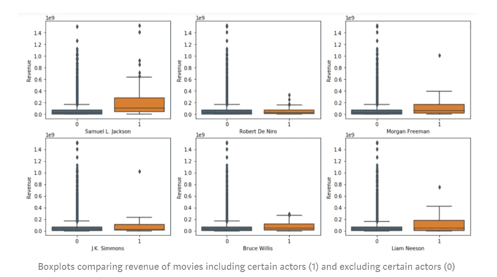

## 决定电影成功的因素是什么？

[*漫威的复仇者联盟 4：终局之战*最近取代*阿凡达*](https://www.forbes.com/sites/scottmendelson/2019/07/20/avengers-endgame-avatar-james-cameron-marvel-star-wars-force-awakens-titanic-jurassic-box-office/) 成为历史上票房最高的电影，尽管这部电影无疑会非常成功，但我想知道是什么让任何一部电影成功。

我要回答的问题是:

1.  **哪些变量特别能预测绝对收入数字？**
2.  **将问题限制在二进制“失败”或“成功”的情况下，收入预测有多准确？**

我正在使用通过 [kaggle](https://www.kaggle.com/c/tmdb-box-office-prediction) 提供的[电影数据库](https://www.themoviedb.org/)中的数据。数据集被分成训练集和测试集，训练集包含 3，000 部电影，测试集包含 4，398 部电影。在训练集和测试集中有 22 个特性，包括*预算*、*流派、所属集合、运行时间、关键字*和更多*。*训练数据集还包含目标变量*收入*。

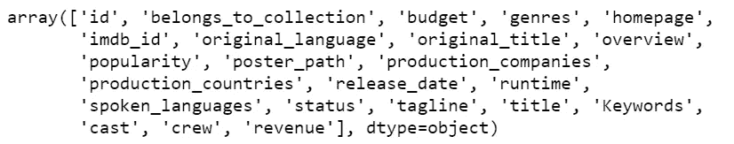

List of variables in the train data set

## 探索性数据分析

**难点:**

*   在进行任何探索性的数据分析之前，我必须将文本格式的看起来像 JSON 的数据转换成实际的数据类型，这实际上是字典列表。完成这个任务的一个非常有用的函数是`ast`包中的`literal_eval()`。
*   这个数据集中有很多分类特征，包括*制作国家、制作公司、演员*和*剧组*。要包括他们所有的回报是不可能的，所以我决定对每种类型的特性的前 30 个回报进行任意限制。
*   数据集中的*流行度*变量基于不同的指标，如每天的用户投票和浏览量。因为一旦一部电影上映，这一功能就会变得更加强大，所以这个变量可能不应该包含在一个旨在对正在上映的电影进行稳健的未来预测的模型中。
*   有很多缺失的值，特别是在*预算*变量中，还有*剧组*和*剧组*的性别子变量中。因为预算似乎是一个非常重要的指标，基于最初对*收入*数字的绘制，我决定删除任何预算为 0 的电影。由于数据不一致，我决定不在我的模型中包含性别比例。

**见解:**

**前传和续集:**也许不出所料，相关电影的前传或续集的平均收入高于独立电影。

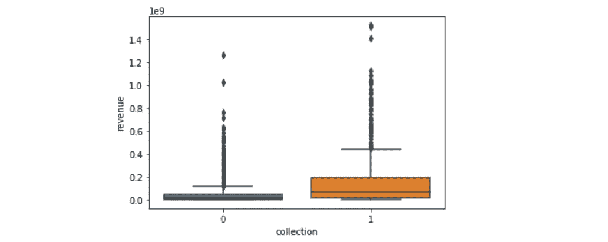

Boxplots for movies that are part of collections (1) and those that are not (0)

**预算:**图表清楚地表明*收入*与*预算*正相关。人们实际上希望大笔投资会产生更大的回报。

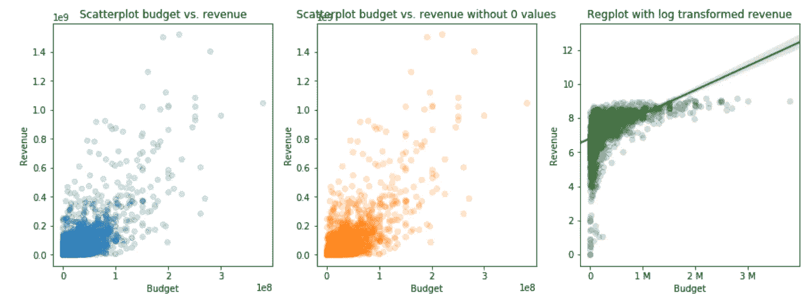

Budget variable plotted against revenue

train 数据集中的前六名演员似乎都是赚钱的人，其中一些人——比如塞缪尔·L·杰克逊——比其他人多。

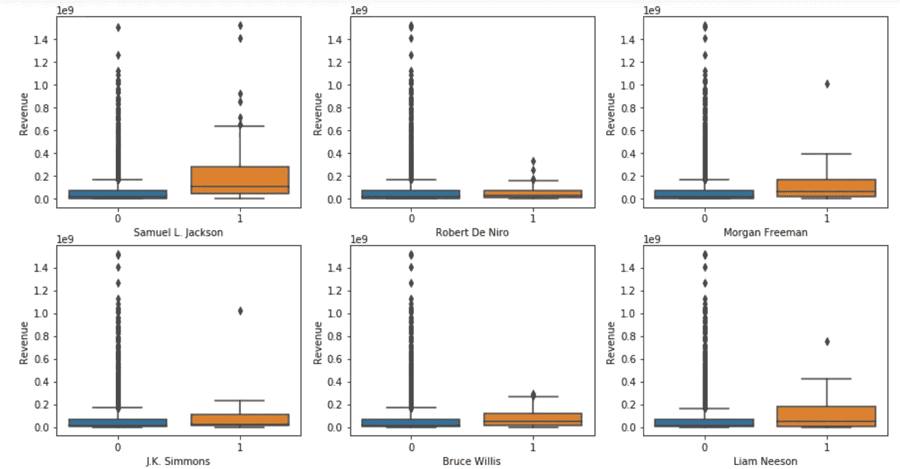

Boxplots comparing revenue of movies including certain actors (1) and excluding certain actors (0)

**上映日期:**随着时间的推移，电影的数量和收入都在增加，然而，20 世纪 70 年代有一些电影产生了大量的收入，导致收入数字飙升。2017/2018 年也发生过类似事件。

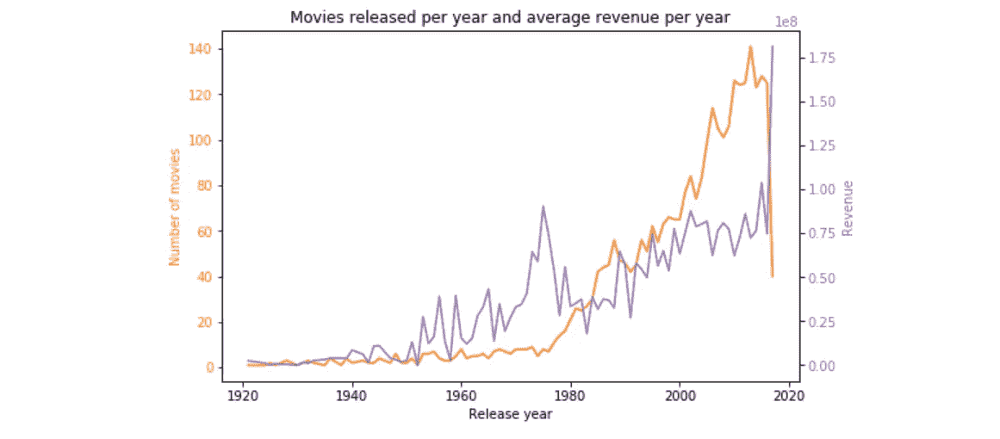

Number of movies and revenue over time

## 数据预处理

我将*演职人员、剧组、制作公司、制作国家*和*关键词*变量的前 30 个回报作为虚拟变量添加到数据集。我还创建了新的功能来计算每个样本的不同退货数量(*生产公司、生产国家、口语*)以及字母数量(*标题、标语*)。因为*预算*因通货膨胀而增加加班，所以我添加了一个可变的*预算 _ 到 _ 年*比率。

为了让数据进入统一的区间，我将对数函数应用于*预算、人气*和*收入*变量，并借助 0 到 1 之间的`MinMaxScaler()`对所有数据进行缩放。我将*发布日期*转换成 4 个不同的变量:*发布年份、发布月份、发布周*和*发布工作日*。我没有对*概述、标题*或*标语*变量使用任何自然语言处理，并且忽略了单词内容。

在数据清理和工程之后，我的训练集中有 201 个特征。我把训练集拆分成 X_train，y_train，X_cross，y_cross。我的测试数据集不包含任何收入特征，我的预测仅包含在我的 [Jupyter 笔记本](https://github.com/julianikulski/tmdb)中。

## 建模和评估

为了预测绝对收入数字，我决定使用三种不同的集成算法。我对它们每个都应用了参数调整技术。

**AdaBoost**

[AdaBoost](https://scikit-learn.org/stable/modules/generated/sklearn.ensemble.AdaBoostRegressor.html) (自适应增强)是一种元估计器，它首先将一个回归变量拟合到数据中，然后添加额外的回归变量，旨在改善与回归变量偏差较大的情况。所有回归变量的结果是平均的，并导致最终的模型。

该算法的[最重要的参数](https://stats.stackexchange.com/questions/303998/tuning-adaboost)是 *n_estimators* (应该高些以获得更好的精度)和 *learning_rate* (应该小些以获得更好的精度)。我使用`GridSearchCV`来确定最优参数，对于 *n_estimators* 为 100，000，对于 *learning_rate* 为 0.001。

**XGBoost**

[XGBoost](https://xgboost.readthedocs.io/en/latest/index.html) (极限梯度提升)是一种基于梯度下降的提升算法，比 AdaBoost 算法更高效。它使用[提升树](https://xgboost.readthedocs.io/en/latest/tutorials/model.html)和并行提升，使其快速准确。提升树的底层算法类似于 RandomForests。

我查看了许多不同的参数，并调整了以下内容:

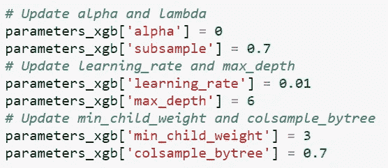

Parameters tuned for the XGBoost model

**LightGBM**

我使用的最后一个模型是 [LightGBM](https://lightgbm.readthedocs.io/en/latest/index.html) ，这也是一个基于树的梯度推进算法。它提高了 XGBoost 的速度，可以很快得到高精度的结果。关于 LightGBM 和 XGBoost 之间的差异的更多细节可以在这里找到[。](https://medium.com/kaggle-nyc/gradient-boosting-decision-trees-xgboost-vs-lightgbm-and-catboost-72df6979e0bb)

我向我的模型添加了以下调整后的参数:

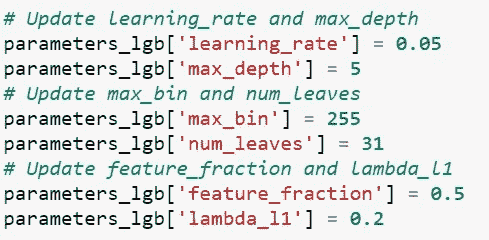

Parameters tuned for the LightGBM model

**均方根误差**

我检查了训练和交叉验证数据集的预测，并决定将重点放在 XGBoost 模型上进行进一步的分析。它确实过拟合，但是，它仍然具有最佳比例对数均方根误差。

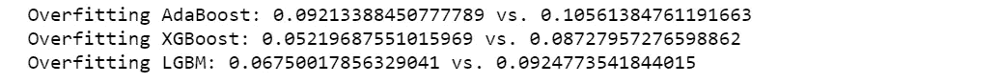

Scaled logarithmic root mean squared error for training set on the left and cross-validation set on the right

## **1。哪些特征特别能预测电影收入？**

使用`lightgbm` 包中非常有用的方法`plot_importance`，预测收入时最重要的特性是*流行度、预算、预算 _ 年 _ 比率、发行 _ 年、运行时间、标题 _ 长度、标语 _ 长度*和*发行 _ 周。*这些特性类似于 AdaBoost 模型和 LightGBM 模型的最重要特性。

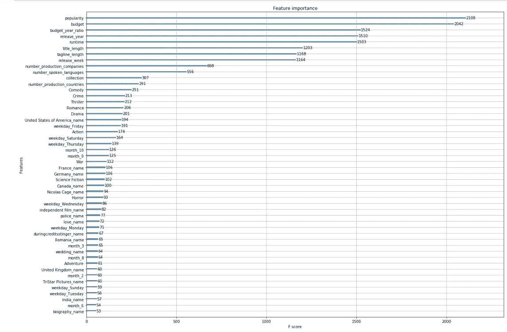

Feature importance based on the XGBoost model

## 2.这个模型能多好地预测失败和成功的电影？

上述衡量尺度和对数均方根误差的指标可能难以理解和判断，因此我在我的数据集中添加了一个*利润*目标标签，其定义如下，先前由[本研究论文](https://www.researchgate.net/publication/313455341_Predicting_Movie_Box_Office_Profitability_A_Neural_Network_Approach)介绍:

利润= (1/2) *收入-预算

计算 X_train 和 X_cross 数据集的实际利润和预测利润，得出训练数据的准确率为 78.9%，交叉验证数据的准确率为 68%。

43.2%的失败电影被错误地预测为成功电影，而 21.3%的成功电影被错误地预测为失败电影。这表明该模型有预测高于实际值的趋势。

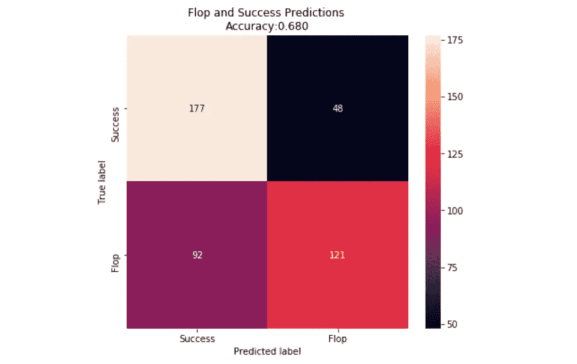

## 结论

1.  **哪些特征特别能预测电影收入？** *人气、预算、预算年比率、发行年、运行时间、标题长度、标语长度*和*发行周*
2.  这个模型能多好地预测失败和成功的电影？将绝对值转换为二进制分类系统(翻牌或成功)只会导致交叉验证集中的**准确率为 68%** 。

## 限制

*   **相对较小的训练集规模。**更大的训练集可以产生更精确的模型。
*   **特征选择。**添加其他变量，包括用户评级、评论家评分、社交媒体内容，甚至来自网飞等推荐系统的[数据，在试图提高准确性时，可能会被证明是有价值的。](https://www.researchgate.net/publication/313455341_Predicting_Movie_Box_Office_Profitability_A_Neural_Network_Approach)
*   **线性回归。**根据这篇[的研究论文](https://www.researchgate.net/publication/313455341_Predicting_Movie_Box_Office_Profitability_A_Neural_Network_Approach?enrichId=rgreq-ad34e492628c6189402293fe1b47410f-XXX&enrichSource=Y292ZXJQYWdlOzMxMzQ1NTM0MTtBUzo2MTAwMjYyNDY5MTQwNDhAMTUyMjQ1Mjk5OTk0Mg%3D%3D&el=1_x_3&_esc=publicationCoverPdf)，在应用的三个不同模型中，使用线性回归作为基本回归变量在预测低票房电影时表现良好，但在预测高票房电影时表现较差。
*   **将回归转换为分类输出。**我只是简单地将我的回归输出转换成一个二进制类案例，并计算准确性。但是，我的模型只针对绝对收入数字进行了优化，而不是这两个类别。如果我们对失败与成功预测感兴趣，那么使用分类器和深度学习算法来获得高准确性会更好。

这个项目是我的 Udacity 的数据科学家纳米学位项目的顶点项目。在我的 Jupyter 笔记本上，还有很多关于电影数据集的有趣见解。详细代码请看我的 [GitHub](https://github.com/julianikulski/tmdb) 。

你想在媒体上阅读更多高质量的故事吗？考虑注册一个支持我和其他媒体作者的会员。

 [## 通过我的推荐链接加入 Medium-Julia Nikulski

### 作为一个媒体会员，你的会员费的一部分会给你阅读的作家，你可以完全接触到每一个故事…

medium.com](https://medium.com/@julia.nikulski/membership) 

想知道 AdaBoost 和 XGBoost 算法实际上是如何工作的吗？查看我关于 bagging、boosting、AdaBoost、random forests 和 XGBoost 的深入指南。

 [## AdaBoost、随机森林和 XGBoost 的终极指南

### 它们是如何工作的，有何不同，何时应该使用？

towardsdatascience.com](/the-ultimate-guide-to-adaboost-random-forests-and-xgboost-7f9327061c4f)