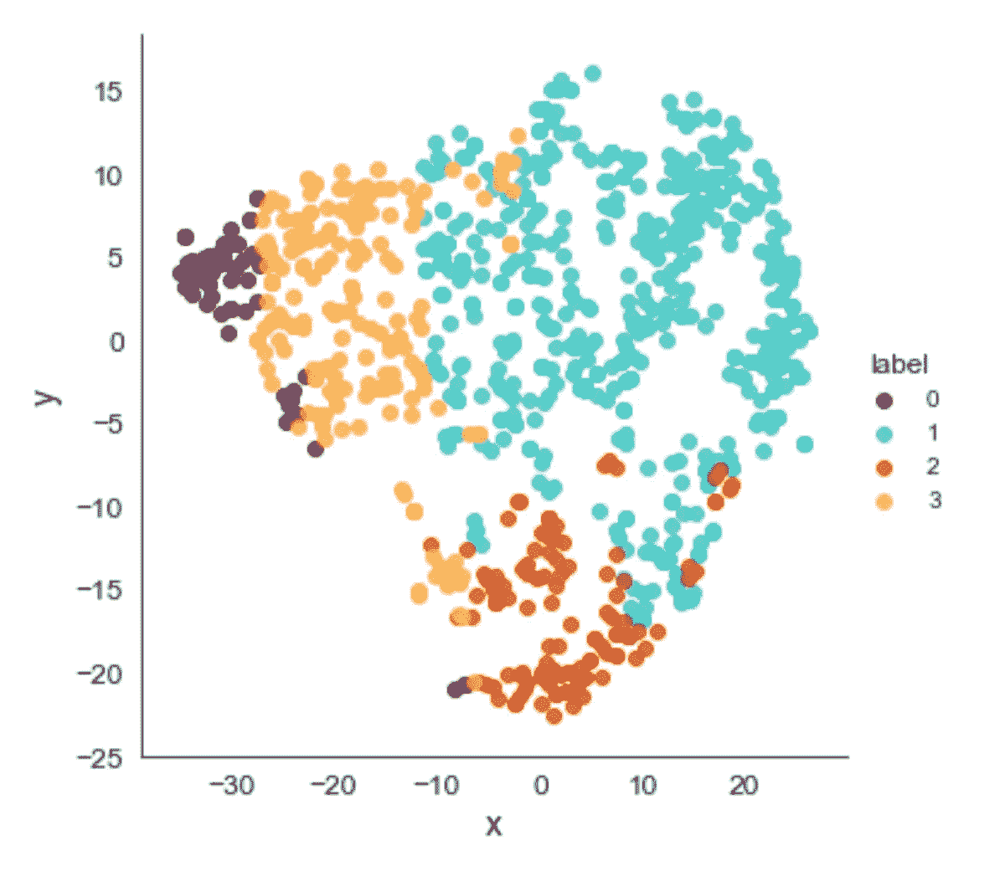
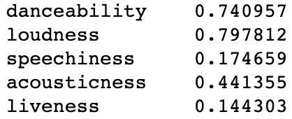

# 使用我的 Spotify 数据预测我的情绪

> 原文：<https://towardsdatascience.com/predicting-my-mood-using-my-spotify-data-2e898add122a?source=collection_archive---------9----------------------->

上个月那是一个命运攸关的夜晚，我赶上了我最好的朋友。像往常一样，我们分享了我们最喜欢的新歌，并讨论了当前嘻哈游戏的氛围。有趣的是，我们的谈话最终引导我们讨论音乐流媒体服务(如 Apple Music 和 Spotify)可能有多少关于我们音乐行为和情绪状态的数据。

这段对话引发了我脑海中的一个问题:

给定听众的音乐数据，我们能推断出他们的情绪吗？

在本文中，我将概述我使用聚类和监督学习方法来回答这个问题的方法。


Photo by [Fimpli](https://unsplash.com/@fimpli?utm_source=medium&utm_medium=referral) on [Unsplash](https://unsplash.com?utm_source=medium&utm_medium=referral)

# 获取我的 Spotify 数据

第一步是通过 Spotify 的便捷 API 建立我的 Spotify 歌曲数据集！

我使用 Spotipy 库编写了一个 Python 脚本来连接到 Spotify API，并获取我曾经创建的每个播放列表以及其中的歌曲的列表。

对于每首给定的歌曲，Spotify API 都会提供其音频功能。

这些特征从一首歌的节奏到它的可跳舞性(是的，你没听错)，衡量一首歌可跳舞的程度！

在这个项目中，我使用了 5 个音频特征来预测情绪:

*   **acoustic ness**:0.0 到 1.0 的音轨是否声学的置信度度量。1.0 表示音轨是声学的高置信度。
*   **可跳舞性**:根据音乐元素的组合，包括速度、节奏稳定性、节拍强度和整体规律性，衡量一首曲目是否适合跳舞。值 0.0 最不适合跳舞，1.0 最适合跳舞。
*   **活跃度**:检测录像中是否有观众。较高的活跃度值表示音轨被现场执行的概率增加。高于 0.8 的值表示该轨迹很有可能是实时的。
*   **响度**:音轨的整体响度，单位为分贝(dB)。响度值是整个轨道的平均值，可用于比较轨道的相对响度。响度是声音的质量，是与体力(振幅)相关的主要心理因素。值的典型范围在-60 和 0 db 之间。
*   **语速**:检测音轨中是否存在口语单词。高于 0.66 的值描述可能完全由口语单词组成的轨道。介于 0.33 和 0.66 之间的值描述可能包含音乐和语音的轨道，可以是分段的，也可以是分层的，包括说唱音乐。低于 0.33 的值很可能代表工具性的。

(显示的定义来自 [Spotify API 文档](https://developer.spotify.com/documentation/web-api/reference/tracks/get-audio-features/)。)

然后，我将每首歌曲的特征导出到 csv，总共包含 822 首歌曲。


first 5 songs in the data set

## 使音量正常化

在将数据输入任何最大似然算法之前，我必须确保特征被正确地缩放。典型地，当数值属性在非常不同的尺度上操作时，ML 算法表现不佳，因为它向它们的目标函数引入了偏差。

幸运的是，API 提供的大多数特性都在 1 到 0 之间。除了值在-60 和 0 db 之间的**响度**特性。

因此，我使用 sklearn MinMaxScaler 将响度特性标准化，使其值介于 0 和 1 之间。

```
from sklearn import preprocessingloudness = songs[['loudness']].values
min_max_scaler = preprocessing.MinMaxScaler()
loudness_scaled = min_max_scaler.fit_transform(loudness)
```

# 将歌曲分成不同的情绪

有了现在准备好的数据，下一步就是将我的歌曲分组，并确定每个分组所代表的情绪。

我决定使用 K-Means 聚类算法，它在发现数据中的潜在分布方面非常出色。它是一种无监督学习算法，只有一个目标:

将相似的数据点分成 *k* 组，并发现潜在的模式。为了实现这个目标，它寻找预定数量( *k* )的聚类。

## 那么，我们如何决定 *k* 的最优个数呢？

有许多方法可以做到这一点，其中最流行的方法是**肘法。**这包括对范围 *k(例如*1–15)运行 K 均值，并绘制**到聚类中心的平均平方和距离与聚类数量的关系图**以找到视觉“肘”，这是聚类的最佳数量。

```
from sklearn.cluster import KMeansSum_of_squared_distances = []
K = range(1,15)
for k in K:
    km = KMeans(n_clusters=k)
    km = km.fit(songs_features)
    Sum_of_squared_distances.append(km.inertia_)
```

现在，如果我们针对 *k.* 的范围绘制我们的距离，我们会得到以下图表:


正如你所看到的，当 *k* = 4 时，到聚类中心的平均平方距离开始显著下降。这就是期待已久的肘子，我们的优 *k* 。

## 使用主成分分析和 t-SNE 可视化聚类

确定了聚类的数量后，下一步就是探索由 K-均值构成的聚类，并识别它们可能代表的情绪！

由于数据集包含 5 个特征，我们正在处理**高维数据，**这意味着这很难想象(更不用说绘图了 lol)。

幸运的是，我们可以使用降维技术来降低数据的维度，使其更容易可视化，同时保留数据中的大部分信息(如方差)。

我使用了两种降维算法，主成分分析( **PCA** )和 t 分布随机邻居嵌入( **t-SNE** )来可视化下面看到的聚类。


2D Visualisation of song clusters using PCA



2D Visualisation of song clusters using t-SNE

从图中，我们可以看到集群形成良好，具有清晰的边界和最小的重叠。最大的重叠在簇 1 和簇 2 之间。

聚类 0 是最小的聚类，并且其歌曲离聚类 1 & 2 最远，这表明 0 中的歌曲与聚类 1 & 2 非常不同。

有趣的是，在 t-SNE 表示中，与更密集的 PCA 簇相比，簇的形状更加扩展和广泛分布。在 t-SNE 图像中，我们可以看到来自与簇 2 重叠的簇 0 的几个极值点，另一方面，在 PCA 表示中没有重叠。

下图显示了每个聚类中的歌曲数量。聚类 1 是最大的聚类，包含数据集中超过一半的歌曲！这可能表示我的播放列表中的一种主要情绪。其余分类的大小较小，分类 0 包含的数据集不到 10%!


Number of songs in each cluster

## 识别情绪

然后，我通过查看每个集群中的歌曲，并确定我与特定集群中大多数歌曲相关联的关键情绪，为每个集群分配一种**情绪**。

所以让我们来看看其中的一些歌曲吧！

## 群集 0

4 个集群中最小的一个。我非常感兴趣地看到了聚集在这里的少数歌曲。

1.  弗洛里汽车收音机(L **o-fi 嘻哈**
2.  米勒·戴维斯-那又怎么样(**爵士**)
3.  植松信夫-最终幻想 X(钢琴协奏曲):三。凯森(**管弦乐，钢琴**)
4.  Destati - Kairi 项目(**管弦乐**)
5.  植松信夫-最终幻想 X(钢琴协奏曲):I .扎纳尔坎德(**管弦乐，钢琴**)

这 5 首歌我注意到的第一件事就是都是器乐曲目！例如，Flovry 的汽车收音机是一种高保真嘻哈乐器，我通常在放松时听。后 3 首是我学习时听的游戏原声(最终幻想&王国之心)。

Car Radio by Flovry

在进一步检查集群后，我开始看到更多的高保真和爵士乐乐器(包括更多的米勒·戴维斯，戴夫·布鲁贝克和艾拉·费兹杰拉)。

所有这些歌曲都有一个共同点。相对**高的** **声音度**接近 1，表示使用真实乐器。因为大多数乐器的音轨都是声学的，所以它们共享这个属性是有意义的。下图显示了分类 0 的平均分类值。正如所料，声音值最高，语音值最低，表明在这些聚类的歌曲中很少或没有语音。


Average Features in Cluster 0

这一簇绝对代表了我“下雨时的舒适热巧克力”的心情。

因此，我将第 0 组标记为**寒冷**情绪。

## 群组 1

1.  古驰马内-梅特加拉(壮举。偏移)(**陷印**)
2.  肯德里克·拉马尔——大人物(与特拉维斯·斯科特)
3.  damso-θ。马卡雷纳(**法国陷阱)**
4.  逻辑不锈钢(**嘻哈**)
5.  一个$AP 洛基-一个$AP 永远(**嘻哈**)

Big Shot by Kendrick Lamar

从第一组的前五首歌来看，它们都是一贯响亮而乐观的嘻哈音乐。这些是我可能会在健身房或者和朋友一起听的歌曲！

从下面的平均群集特征中，我们可以看到该群集比之前的 **chill** 群集具有更高的可跳舞性和响度。此外，声音低得多，表明在这些集群歌曲中使用了更多的电子和合成声音。


Average Features in Cluster 1

这组歌曲向我传达了一个明确的信息，那就是能量！

因此，我将第一组标记为**充满活力的**情绪。

## 群组 2

1.  萨巴-光合作用(**嘻哈**)
2.  杰米 xx -我知道会有(美好时光)(**舞蹈，电子**)
3.  坎耶·韦斯特-触摸天空(**嘻哈**)
4.  Epik High - 막을 올리며安可(**k**嘻哈
5.  Téo？- Orso (off top) ( **新美国嘻哈**)

Photosynthesis by Saba

这绝对是最多样化的 4 个集群，包含了各种不同类型的音乐，从电子音乐到令人惊讶的年轻暴徒…

我发现第二组和第一组非常相似，因为有大量的嘻哈音乐，这解释了在可视化中看到的重叠。然而，我发现这个集群中的歌曲有更多的口语词(例如 A$AP Rocky 的 1Train 和创作者 Tyler 的 11 月)。

集群 2 的平均特征支持这一点，因为我们可以看到语音和活跃度(指示现场表演)高于集群 1。


Average Features in cluster 2

集群 2 中的歌曲让我想起我感到欢欣鼓舞和快乐的时候。

因此，我将第二组标记为**愉快的**心情。

## 第 3 组

1.  玛丽娅-我希望我错过了我的前任( **RnB，灵魂**)
2.  爱莉安娜·格兰德-陈哥( **RnB** )
3.  Joji -忘不了你(专长。蛤蜊赌场)( **RnB 电子**)
4.  gianni & kyle -你有没有想过我？( **RnB，嘻哈**)
5.  RAYE -自信( **RnB，舞蹈**)

I Wish I Missed My Ex by Mahalia

当我看到这个集群的时候，它已经在我的情绪中尖叫了。在这个集群中有明显的 RnB 歌曲趋势，我喜欢的很多歌手都聚集在这里(Syd，Jorja Smith 和 Daniel Caesar)。有趣的是，平均而言，这一组是最适合跳舞的，可能是因为 Rnb 和舞曲的自然反弹。



由于这个集群的“浪漫”本质，我决定将集群 3 标记为我的**浪漫**心情！

# 预测我的情绪标签

每首歌现在都被贴上了各自心情的标签。我想看看我们是否可以训练一个监督学习模型，然后准确地预测给定歌曲时我的情绪。

我将数据集分成训练集和测试集(70:30)，并在训练集上训练 4 个不同的分类器模型。

1.  **随机森林**
2.  **KNN**
3.  **SVM**
4.  **MLP 分类器**

每首歌曲的情绪标签被用作目标数据，我们的目标是正确预测(寒冷，充满活力，欢快，浪漫)。

## 混淆矩阵和 F1 分数

为了评估分类器的性能，我比较了它们的混淆矩阵。

混淆矩阵是查看哪个分类器误差最小的好方法，在理想世界中，一个完美的分类器只在对角线轴上有值(100%准确)。

我们可以在下面看到，大多数分类器都非常擅长识别充满活力的情绪歌曲。SVM 显示出最高的错误，例如，它把 11 首寒冷的歌曲归类为浪漫的歌曲。另一方面，**随机森林显示出最少的错误**，具有最少的假阳性。它能够预测所有充满活力的歌曲，除了 1！


然后，我计算 F1 分数，定量比较每个分类器的准确性。它是一个分类器的**精度**和**召回**的调和平均值(这里[解释得很好](/accuracy-precision-recall-or-f1-331fb37c5cb9))。只有当分类器的精度和召回率都很高时，F1 分数才能很高。


F1 Scores for each classifier

不出所料，兰登森林得分最高，KNN 和 MLP 紧随其后，得分相同。或许，SVM 的性能可以通过调整内核等超级参数来提高。

厉害！我们现在有了一个强大的模型选择，开始根据看不见的歌曲预测听众的情绪。

## 特征重要性

当使用随机森林分类器时，我们可以输出每个特征相对于它们在构建森林时提供的信息量的重要性(减少熵)。


Feature Importance from Random Forest

声音是最重要的。这可能是因为数据集中原声/非原声歌曲之间的明显区别，以及大多数 **Chill** 集群是如何由高度原声的乐器音轨组成的！

另一方面，语言能力和舞蹈能力似乎是数据中最没有帮助的特征。这可能是因为我听的大多数歌曲都含有大量的话语，因为我喜欢说唱和嘻哈音乐。这也表明了我听的大多数歌曲都是适合跳舞的(所以至少我可以说我的音乐在大多数时候并不无聊👊).

## **结论**

总之，这个项目是探索我的 Spotify 播放列表数据并了解更多关于我的音乐品味和行为的有趣方式。

和音乐评价一样，一首歌能创造出什么样的情感和感受，这是一个人的主观性问题。尽管如此，我认为在了解每个独特的听众的口味之后，我们可以慢慢地但肯定地开始在更大的范围内理解这些感受。

作为这个项目的后续，我们有可能预测听众的情绪。如果能建立一个推荐引擎，向听众推荐类似情绪的歌曲，那就太棒了！

感谢你阅读这篇文章，我希望你已经学到了一些新的东西(并且发现了一些新的音乐)。如果你想聊天或者有任何反馈，请在下面评论！

我在这里写的代码。

## 和平 Out✌️