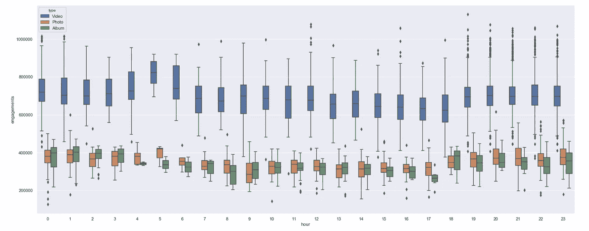

# 预测 NBA Instagram 与机器学习的互动

> 原文：<https://towardsdatascience.com/predicting-nba-instagram-engagements-with-machine-learning-f3a43d0aeef6?source=collection_archive---------42----------------------->


今年早些时候，我有幸参加了在新泽西 Secaucus 联盟办公室举行的 [2019 NBA 黑客马拉松](https://hackathon.nba.com/)。作为申请过程的一部分，NBA 提出了两个技术筛选问题——一个涉及计算 2019 年季后赛每场比赛的高级球员指标，另一个侧重于预测 1000 个 Instagram 帖子被 [NBA](https://www.instagram.com/nba/?hl=en) 雇佣的数量。

第二个筛选问题非常适合机器学习，我真的很享受在这个问题上全力以赴的时光。在这篇文章中，我将概述我的总体方法和最终解决方案。

# **问题陈述**

手头的任务相当简单:我们有超过 7500 个 NBA Instagram 帖子的相关数据，根据这些数据，我们被要求预测 1000 个帖子的参与人数。

这两个数据集包括以下字段:

*   **发帖时的关注者**(发帖时 Instagram 关注者的数量)
*   **创建日期**(帖子的日期戳)
*   **文章类型**(文章分类为照片、相册或视频)
*   **描述** (Instagram 帖子标题/描述)
*   **参与度** (Instagram 参与度——我们将对我们的抵制活动进行预测)

解决方案根据预测约定的**平均绝对百分比误差**进行分级，这可以通过找到 1000 个预测中每个预测的百分比误差的平均值来计算。

由于目标变量(参与度)是由 NBA 人为生成的，任何解决问题的方法都是公平的！让我们深入了解我是如何用机器学习来应对这一挑战的。

# **第一步:探索性数据分析**

就像几乎所有的机器学习问题一样，我的第一步是通过探索性数据分析(EDA)在笔记本上熟悉数据。我们可以将训练数据集导入到熊猫数据框架中，并从查看数据开始。


接下来，我喜欢创建简单的可视化来更好地理解什么可能影响我们的目标变量。首先，我们可以从我们的数据集中绘制出参与次数与两个连续变量的关系:发帖时间和发帖时的关注者。


Engagement vs Post Date-Time


Engagement vs Followers at time of post

从这些想象中，我很快注意到两个观察结果。首先，NBA 休赛期(7 月至 10 月)的参与度似乎有所下降。此外，除了一些异常值，似乎有两个不同的“波段”的业务。

帖子参与之间的这种明显区别表明，我们可能正在查看两种不同类型的 Instagram 帖子，仔细看看我们的数据集，我们有一个分类变量在其他连续变量中脱颖而出: **Type** 。摘下我们的分析帽子，这具有定性意义——insta gram 照片可能会表现出与自动播放视频明显不同的参与度表现。通过根据帖子类型将我们的帖子映射到特定的颜色，我们可以更清楚地了解正在发生的事情。


Videos appear to be in a league of their own

看起来，当谈到一个给定帖子的参与次数时，我们实际上有两种类型:视频和照片/相册。为了更深入地了解这一点，我们可以通过叠加多个直方图来检查这些职位类型的聘用分布。


基于上述分析，很明显，为了有效地解决这个问题，我们可能需要建立多个机器学习模型。虽然*有可能*创建一个处理所有帖子类型的单一模型(使用“虚拟”分类变量)，但这个模型很可能只会适度地推广。在我们开始构建我们的机器学习模型之前，我们先来看看这个问题中可能是我最喜欢的部分:特征工程。

# 步骤 2:特征工程

虽然我们的数据集只包括 4 个“开箱即用”的输入字段，但我们可以通过直觉和创造力创建更多的功能。两个字段包含丰富的基础数据，可用于生成额外的有价值的特征:**创建日期**和**描述**。让我们看看如何从这些领域中梳理出有用的特性。

**创建日期-** 直觉告诉我们，休赛期的帖子可能比 NBA 赛季中期的帖子表现更差，同样，美国东部时间凌晨 1 点的帖子可能比美国东部时间晚上 7 点的帖子表现更差。从这个假设出发，我们有必要从我们独有的时间戳中提取一些常见的与日期相关的特征，比如:月、工作日和小时。

我们可以使用 Pandas***dt***[系列访问器对象](https://pandas.pydata.org/pandas-docs/stable/reference/api/pandas.Series.dt.html)在我们的训练集数据框架中创建这些新特征，如下所示:

```
posts_df['month'] = posts_df.created_ts.dt.month
posts_df['weekday'] = posts_df.created_ts.dt.weekday
posts_df['hour'] = posts_df.created_ts.dt.hour
```

使用一些箱线图，我们可以更好地了解这些新功能是否指示帖子的参与度。


Engagements vs Instagram post Month


Engagements vs Instagram post Weekday



Engagements vs Instagram post Hour

**描述-** 我们的 Instagram 帖子描述了*无尽的*可能特征的来源。首先，我们可以检查一些可能影响帖子性能的连续和分类特征。以下是我能确定的一些最有影响力的特征:

1) **长度** —我们可以很容易地计算出每个职位的描述长度，并检查与聘用的对应关系。对于所有类型的职位，描述长度和聘用之间存在负相关关系。下面是视频的散点图。


For Videos, there seems to be a negative correlation between Description Length and Engagements

2) **表情符号—** 虽然看起来很傻，但我很好奇表情符号是否会影响帖子的参与度。在我们的数据集中，表情符号显示为*’？?'* string，所以我们可以在我们的描述中搜索这个子串，并创建一个数据透视表来理解结果。


🚀 Emojis! Continuous performance.

我们可以构建一个数据透视表，显示每个月的参与人数中位数，根据职位描述是否包含表情符号进行分组。值得注意的是，月复一月，描述中有表情符号的帖子表现优于没有表情符号的帖子。

3) **标记账户**——虽然我们无法分析图片本身，但我们可以通过对 NBA 球员的潜在标记，围绕 Instagram 帖子做出有根据的猜测(例如:*“@ Stephen curry at the buzzer！”*)。解决这个问题有点棘手，如果我们看看表现最好和最差的帖子，并确定是否有任何标记帐户与参与度高度相关，这可能是最容易的。


Top 20 performing posts — looks like the audience has some favorite players

看看排名前 20 的表演帖子，我们看到两名球员脱颖而出:勒布朗詹姆斯(@金詹姆斯)和凯里·欧文(@凯里欧文)。事实上，77 篇热门帖子中的每一篇都提到了这两个球员中的一个或两个。陪审团已经明确表态，他们有一些喜欢的球员。我们将确保为勒布朗和垂怜经创建分类变量(例如: *contains_kingjames* )，以表示给定的帖子描述是否包括对相关球员的提及。虽然这种方法可能不适用于预测未来 10 年的职位表现(外推)，但由于我们正在解决一个*插值*问题(属于我们训练数据集的职位)，这似乎完全有效。


Bottom 20 performing posts (worst at the top)

同样，我们可以在*表现最差的*职位中发现一些趋势。提到替代联赛或比赛的帖子(例如: *NBA 非洲赛，WNBA，Jr NBA 等。)*似乎都表现不佳。此外，包含大量标记球员的描述似乎也会出现在我们列表的底部。我们可以通过创建一个分类变量(*contains _ alternate _ league)*，以及一个连续变量( *player_mentions* )并检查结果来测试这些假设。


Be warned if you post about an alternate league and mention a slew of players!

# 第三步:建模

创建了自定义功能后，我们可以开始测试不同的回归算法来预测雇佣关系。在高层次上，当选择算法时，我们将把数据分成两个子集:训练数据和测试数据，使我们的模型适合训练数据，并对我们的测试数据进行预测。然后，我们将计算我们的预测和测试数据集中的实际值之间的误差，并比较我们的各种模型。

虽然让我们的模型适应所提供的整个训练数据集(7500 个 Instagram 帖子的参与度值)很有吸引力，但我们会发现自己无法评估我们的模型对数据的预测有多好*没有看到*。我们将被迫对用于拟合模型的训练数据进行预测，这很可能导致过度拟合。相反，我们将留出一部分训练数据集，并将其视为测试数据集。


如前所述，我们需要创建一个模型来对视频进行预测，并创建另一个模型来对照片和相册进行预测。因此，我们首先将训练数据分成两个较小的数据集:视频数据和照片/相册数据。然后，我们可以使用 SciKitLearn 的 **train_test_split** 将每个数据集进一步分割成训练集和测试集。以下是用于预测视频参与度的各种初始模型的计算平均绝对百分比误差(我们提供的误差函数):


根据我们的初始模型，我们的线性回归模型对*以前没有见过的数据*做出预测，平均误差约为 3%。平均雇佣值约为 692，000 次雇佣，我们做出的预测平均错误 21，036 次雇佣(不错！)

在我们继续微调我们的线性回归模型之前，重要的是停下来考虑这样一个事实，即我们的视频数据集的分割有可能导致*非常有利的*训练数据。换句话说，我们只是运气好吗？我们是不是碰巧通过让他们在 Instagram 帖子上做出预测来测试我们的模型，与 K 近邻模型相比，线性回归模型更容易做出预测？有可能！为了更加确信我们选择了正确的算法，我们将利用**交叉验证**。

交叉验证是一种技术，通过这种技术，我们可以评估模型归纳为独立数据集的能力，并更有把握地排除好运。最常见的交叉验证形式之一是 **K-Folds 交叉验证，**其中数据集被分成 K 个部分(或“折叠”)，从一个折叠创建测试集，从其余折叠创建训练集。重复这个过程，直到每个折叠都被用作测试数据集，并且我们已经为每个独特的训练和测试计算了模型的误差。


source: K-folds cross-validation, [Kaggle](http://blog.kaggle.com/2015/06/29/scikit-learn-video-7-optimizing-your-model-with-cross-validation/)

在执行一轮 K 倍交叉验证(K 值为 5)后，我们可以通过对每次训练和测试的平均绝对百分比误差进行平均来再次比较我们的不同模型。毫不奇怪，我们的线性回归模型仍然表现最好(平均绝对百分误差为 3.0%)。

这个过程可以在我们的照片/相册中重复，在我的例子中，线性回归再次表现得最好。

随着我们最终模型的选定，我们可以通过对我们训练数据的*整体*训练新的线性回归模型来结束这个项目。值得注意的是，SciKit-Learn 的标准线性回归模型实际上是一个普通的最小二乘(OLS)回归。该模型优化了我们的特征系数，以最小化观察到的和预测的参与度值之间的差的平方和。在我们的具体应用中，我们的任务是针对平均绝对百分比误差(MAPE，一种不同的损失函数)进行优化。从高层次来看，OLS 是规模依赖型的，而 MAPE 是*而不是*。由于我们没有任何明显的异常值会扭曲我们的模型，我决定用 SciKit-Learn 的“普通”线性回归模型来训练我的线性回归模型。我在这个项目上的工作的一个改进将是创建一个定制的求解器来根据定制的损失函数优化特征系数——这是另一个有趣的项目！

# 结论

由于这个挑战是基于人工 Instagram 参与数据，不幸的是，我可能永远不会知道我最终预测的准确性。然而，我*所知道的是，我的提交奖励了我一次去 NBA 总部的旅行，与体育分析世界中一些最聪明的头脑一起参加进一步的数据科学挑战。*

有机会将我最大的两个爱好——数据科学和篮球——结合在一起无异于梦想成真，能够会见来自 NBA 各地的分析师是一次我将永远珍惜的经历。


Team 3!