# 用机器学习预测 NBA 新秀数据

> 原文：<https://towardsdatascience.com/predicting-nba-rookie-stats-with-machine-learning-28621e49b8a4?source=collection_archive---------7----------------------->

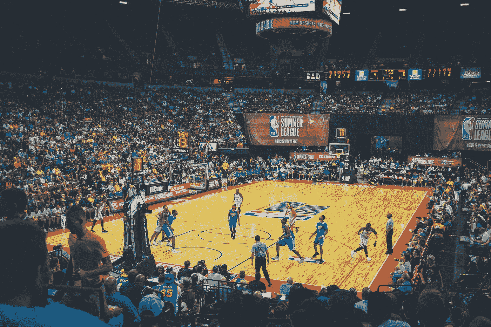

Photo by [NeONBRAND](https://unsplash.com/@neonbrand?utm_source=medium&utm_medium=referral) on [Unsplash](https://unsplash.com?utm_source=medium&utm_medium=referral)

每年，来自世界各地的数百万篮球迷都会收看 NBA 选秀，希望他们最喜爱的球队能够夺金，发现下一个 NBA 巨星。这些 NBA 球队前台办公室的人花费数千小时来寻找和评估大学和国际人才，试图找到能够在职业水平上取得成功并为球队做出贡献的球员。随着数据科学领域的发展，尝试超越传统方法来评估人才是有意义的。这篇文章记录了一个项目，试图通过预测最新一批 NBA 新秀的统计数据来做到这一点。

# 数据准备

这个项目的总体目标是预测某些球员在 NBA 的第一年在得分、助攻、篮板、抢断和盖帽方面的表现，实现这一目标的第一步是创建正确的数据集。有很多变量有助于 NBA 球员的成功，但对于这个项目，我决定专注于这些不同的球员在大学水平上的表现。为了创建这个数据集，BeautifulSoup 被用来收集 2000 年至 2018 年期间从[www.basketball-reference.com](http://www.basketball-reference.com)选秀的 NBA 新秀数据。在那之后，所有那些被选中的球员的平均大学统计数据都是从 www.sports-reference.com/cbb 的 T2 收集来的，所有的数据都被很好地格式化成 python 上的熊猫数据框。所有为这个项目而创建的数据集现在都可以在[这里](https://www.kaggle.com/siddhesvark/compiled-ncaa-basketball-data)找到。csv 文件。

# 分析

在进入机器学习模型之前，最好先检查数据集，寻找任何基本/有趣的模式和异常。

## 统计趋势

通过创建不同年份的各种统计数据的箱线图，对大学篮球和职业篮球的演变进行了可视化。

[Box plot distribution of the average points scored in college of players drafted by Year.](https://github.com/SidTheKid007/NBARookieAnalysis/blob/master/College%20and%20Rookie%20Trends.ipynb)

今年的草案类别(由 2020 年的方框图表示)在任何统计类别中都不突出。这应该转化为今年的选秀班是一个非常典型的选秀班，因为它将遵循前几年设定的模式，即有几个超级明星，有太多中等或中等以下的角色球员..

[Box plot distribution of the average 3 pointers attempted by NBA Rookies by Year](https://github.com/SidTheKid007/NBARookieAnalysis/blob/master/College%20and%20Rookie%20Trends.ipynb)

NBA 新秀方框图被证明是更有趣的，虽然有很多更重要的趋势和模式。这里最吸引人的模式是关于三分球的演变以及它是如何在最近几年变得越来越流行的。与近年来平均三分球命中率的上升一样有趣的是，这一三分球趋势的支点最近出现了。在 2010 年之前，看起来没有任何一个新秀赛季场均 1 3 分，而在 2010 年之后，几乎每个新秀赛季都超过了这个数据。

## 簇

除了从寻找历史统计趋势的角度分析数据之外，还从具有两个主要目标的聚类分析角度分析数据。生成的聚类透视了这个选秀职业中的球员如何相互堆叠，以及这个选秀职业中的球员如何堆叠前几年的新秀。

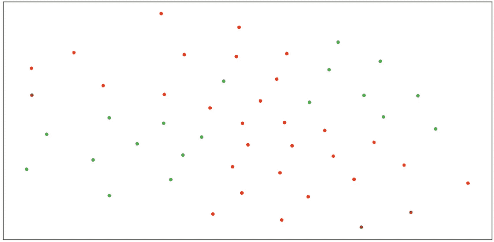

[Agglomerative Clustering on college stats of 2019 draft class](https://github.com/SidTheKid007/NBARookieAnalysis/blob/master/2019%20College%20Clustering.ipynb)

三种不同的聚类算法(K-Means 聚类、凝聚聚类和相似性传播)在今年选秀班的大学统计数据集中运行。锡安·威廉姆森(Zion Williamson)是一位受到体育媒体界大量炒作的下一位超级巨星，所有聚类算法都将他的大学表现与布兰登·克拉克(Brandon Clarke)和波尔·波尔(Bol Bol)进行比较。

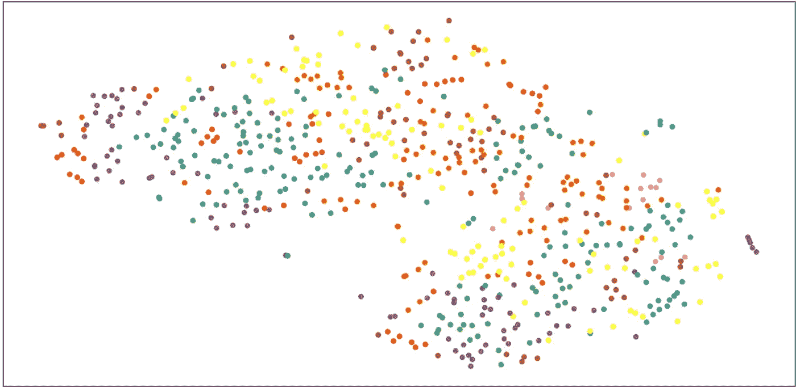

[Affinity Propagation Clustering on college stats of 2000-2019 draft class](https://github.com/SidTheKid007/NBARookieAnalysis/blob/master/Modified%20Full%20College%20Clustering.ipynb)

同样的三个聚类算法在由过去 20 个 NBA 选秀班的球员的大学统计数据组成的数据集上运行，并且获得了一些有趣的结果。亲和力传播模型在这里将锡安描述为布雷克·格里芬和迪安卓·艾顿的混血儿，它相应地估计他每场比赛将得到令人印象深刻的 19.4 分，11.2 个篮板，2.8 次助攻，0.85 次抢断和 0.7 次盖帽。

# 特征工程

创建强大的机器学习模型的三个主要步骤来自于选择/操纵输入特征，选择最成功的算法，以及微调该算法的超参数。这就是为什么在通过所有的 ML 算法运行数据之前，需要对数据集进行一些调整。

分类变量，例如学院的名称和选拔球员的球队的名称，最初被分解成一系列虚拟变量，唯一地代表每个学院/球队。这项技术最终没有成功，因为在这个修改的数据集上运行的算法往往比在没有团队或学院的原始数据集上运行的算法产生更低的指标。

团队变量不是很强，因为团队每年都会发生根本性的变化。例如，将 2010 年赢得 74%比赛的克利夫兰骑士队与 2011 年赢得 23%比赛的克利夫兰骑士队相提并论似乎不太正确。这就是为什么球队变量在球员被选中前一年被替换为一些关于球队成功的元数据特征。获胜、每场比赛的点数差异等)。结果在一定程度上验证了这种功能扩展，因为在修改的数据集上运行的算法比在只有 team 的原始数据集上运行的算法产生了更好的度量。

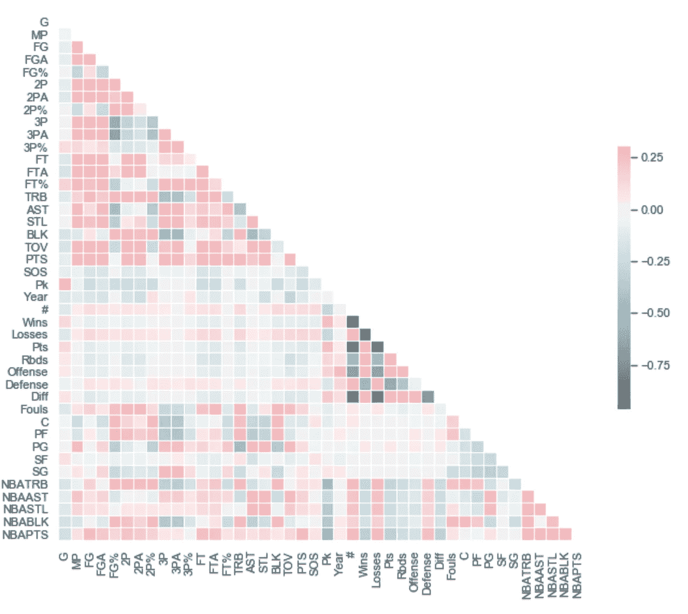

Correlation matrix between various features

除了用虚拟变量进行实验之外，还构建了一个相关矩阵，以更好地理解输入变量和目标变量之间的关系强度。例如，如上图所示，在大学里每场比赛的投篮次数和 NBA 里每场比赛的实际得分之间似乎有很强的相关性。

循环特征消除也用于确定要考虑的最佳变量子集。这种方法的工作原理是从线性回归模型中重复检索特征重要性，并删除重要性最低的特征。根据实验，发现使用 RFE 将输入变量从 37 个减少到 30 个产生了最好的结果。

# 模型

在整个实验过程中运行了许多不同的算法，下面描述的所有算法的原始代码可以在这里找到。

## 线性回归

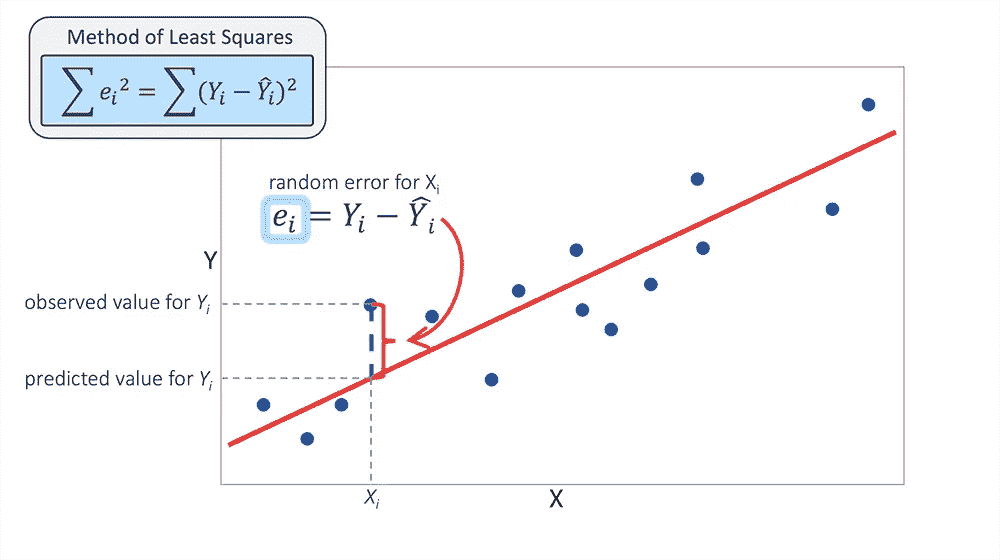

[Linear Regression via the Method of Least Squares in 2 dimensions](https://www.jmp.com/en_hk/statistics-knowledge-portal/what-is-multiple-regression/fitting-multiple-regression-model.html)

在进入所有花哨的算法之前，运行一个基本的回归模型来设置一些基线基准。线性回归被选为基准模型，该算法的工作原理是尝试绘制一条直线，穿过 N 维训练集中提供的所有点(其中 N 是数据集中的要素数量)。这条线的方程是按照最小二乘法计算的，其目标是使误差的平方和最小。

## 随机福里斯特

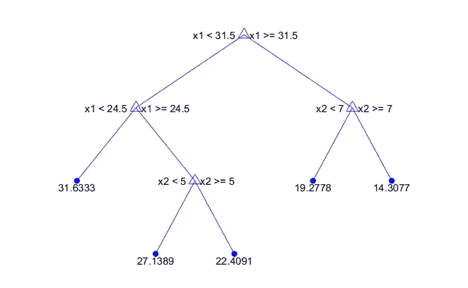

[A simple Decision Tree example](https://www.mathworks.com/help/stats/train-regression-trees-using-regression-learner-app.html)

使用的第一个主要算法是随机 Forrest 回归器，该算法通过挑选位于 N 个随机输入要素和 M 个随机列的交集中的数据的过程，从原始训练数据集中随机提取各种子集。接下来，对所有这些不同的子集运行上面说明的基本决策树算法。一旦创建了所有的树，就通过对每个决策树运行输入特征所产生的结果取平均值来计算测试集中元素的预测。

## 额外的树

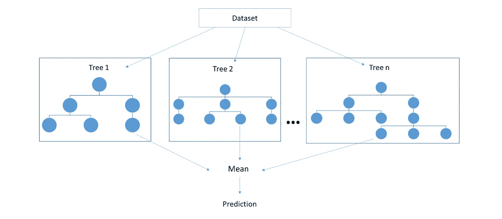

[The process of creating multiple decision trees to make a prediction](/random-forests-and-decision-trees-from-scratch-in-python-3e4fa5ae4249)

第二次运行的算法是额外树回归器，该算法的行为方式与随机 Forrest 回归器非常相似。就像 Random Forrest 一样，Extra Trees 对从训练数据集生成的各种随机子集运行决策树算法来创建预测。这两种算法的最大区别在于决策树在子集上运行的方式。随机森林算法使用传统的决策树方法，其中在分割点使用的特征和值是基于在该步骤获得的信息来确定的。额外树算法使用一种更宽松的决策树方法，其中在分割点使用的特征和值是随机选择的。

## XGBoost

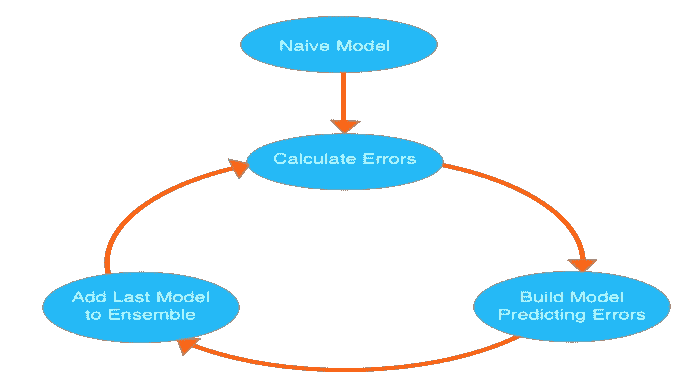

[Process behind the Gradient Boosting technique](https://machinelearningmastery.com/gentle-introduction-xgboost-applied-machine-learning/)

下一次运行的算法是 XGBoost，该算法使用一种称为梯度增强的技术来创建一个强大而准确的模型。梯度推进的工作原理是递归地在彼此之上构建不同的模型，以最小化误差值。由于 XGBoost 的整个目标是最小化在训练集上发现的错误，所以该算法偶尔会过度拟合数据，并在测试集上执行 subpar。

## 神经网络

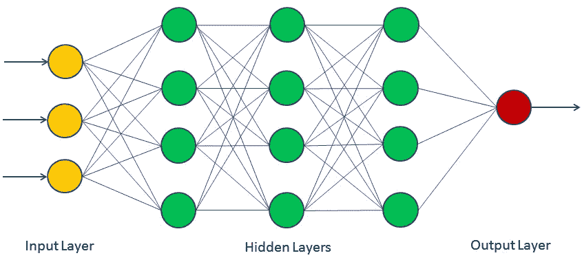

[Example of a simple feed forward Neural Network](https://blog.goodaudience.com/artificial-neural-networks-explained-436fcf36e75)

接下来的挑战是设计有效和适当的神经网络来理解提供的数据。神经网络的工作方式与上述所有算法完全不同，但神经网络的核心组成可以描述为一系列由节点组成的层，这些节点通过权重和激活函数连接到下一层的节点。更具体地说，某个隐藏层 N 的节点中的值由前一层的节点内部的值定义，这些值与初始随机化的权重进行线性组合，并通过某个激活函数运行。神经网络背后的算法试图不断地修改这些最初随机的权重，目的是产生接近于所提供的目标输出的输出。

## TPOT

[The automated pipeline process behind TPOT](https://epistasislab.github.io/tpot/)

最终运行的算法是 TPOT，这个算法本质上与前面提到的算法有很大的不同，因为它实际上是一个用来寻找好的算法和模型的工具。它的本质是利用遗传编程不断淘汰效果不佳的模型，从而返回最成功的模型。

# 结果

归根结底，机器学习实际上是一个结果驱动的游戏，产生更高指标的模型比不产生更高指标的模型更有价值。就本项目而言，有 5 个主要指标用于比较不同模型的成功性。

*   调整后的测试 r:该统计测量测试集上调整后的 r 值。该统计值的范围从-inf 到 1，值越大表示结果越好。
*   交叉验证得分:该统计数据是通过将 100 乘以在数据集内不同的训练测试分割上运行算法所产生的原始 r 的平均值而得到的。该统计值的范围从-inf 到 100，值越大表示结果越好。
*   百分比非常准确:如果预测与实际结果相差在 20%以内，则认为预测“非常准确”。这个统计数据查看测试集中被标记为“非常准确”的百分比。
*   准确百分比:如果预测与实际结果相差 20%到 50%,则认为预测是“准确的”。这个统计数据查看测试集中被标记为“准确”的百分比。
*   点差误差:该统计信息查看测试集中有多少百分比的预测与实际结果相差不到 2 个点。

Result metrics from the different algorithms

创建了一个基本网站，以更深入和互动的方式显示上表中的结果。

# 预言

这个项目的最后一步是通过使用上述见解来预测即将到来的新秀职业的统计数据，从而完成最初的目标。

在所有预期的算法中，随机福里斯特回归器被选中来分析即将到来的新秀班的大学数据，并预测这些球员一旦进入 NBA 会有什么样的统计数据。随机福里斯特被选中是因为它有最高的点差错误分数，它有第二高的 CV 分数。Extra Trees 可以说是更好的算法，因为它比 Random Forrest 具有更高的 CV 分数和更高的调整后 r，但经过更仔细的检查，Extra Trees 在分析“精英”球员时的表现不如 Random Forrest。Random Forrest 将“精英”球员定义为在新秀年平均每场比赛超过 10 分的球员，他非常准确地识别了 14 名球员中的 5 名，并准确地识别了 14 名球员中的 2 名。另一方面，额外的树只能非常准确地识别 14 个玩家中的 3 个，并准确地识别 14 个玩家中的 2 个。

下面的表格在左边显示了按照他们被选中的位置排序的新人，在右边显示了按照总价值排序的预测数据的新人。总价值是根据[这些指导方针](http://www.nba.com/article/2017/10/05/nba-unveils-new-official-fantasy-scoring)预测的每场游戏的幻想点数输出。表格也按照位置进行了划分，以便读者能够容易地理解在这个特定的选秀职业中，一个玩家如何与其他类似的玩家进行较量。

## 控球后卫:

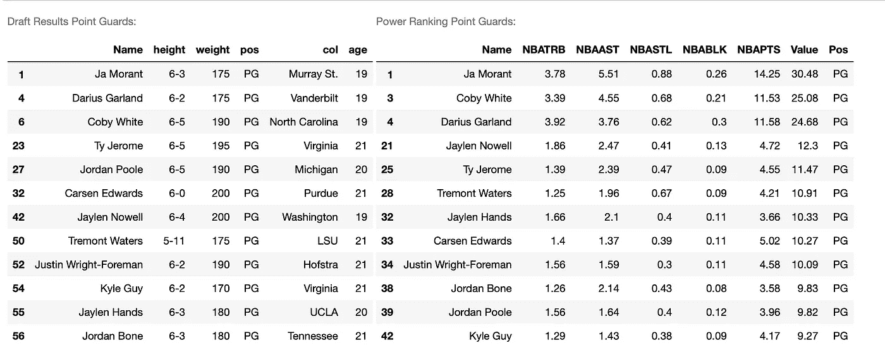

## 得分后卫:

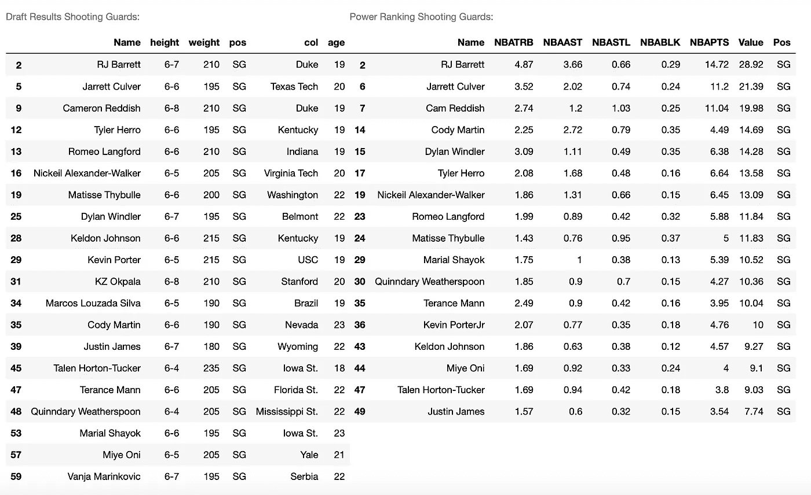

## 小前锋:

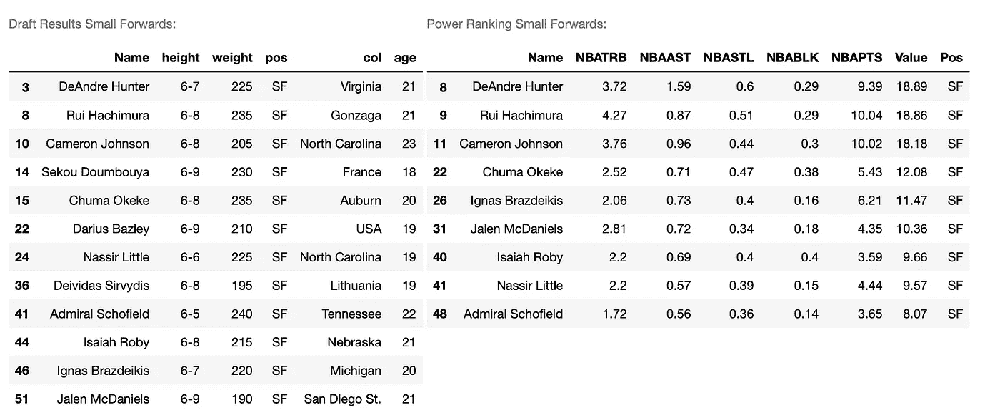

## 大前锋:

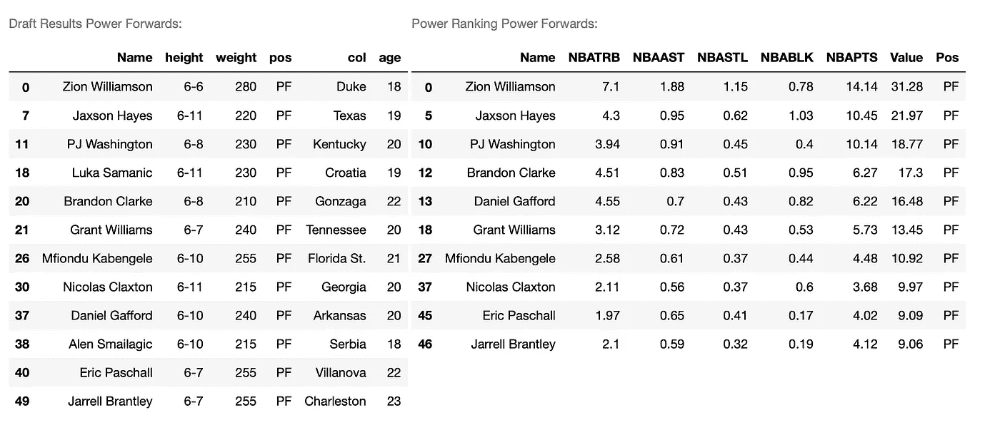

## 中心:

生成的结果的完整表格可以在[这里](https://github.com/SidTheKid007/NBARookieAnalysis/blob/master/NewRookiePredictions4-1.csv)找到。创建了一个简单的网站，以更具交互性的方式显示上表中的结果。

This module displays the predicted stats of individual prospective players. The full website is available [here](https://2019nbarookies.glitch.me).

# 未来的工作

> “数据科学家的天性就是永远不会对自己的工作感到完全满意”。— *尼拉布·潘特博士*

这个项目有很大的潜力，可以帮助 NBA 球探在 NCAA 找到能够在下一阶段茁壮成长并取得成功的球员。尽管如此，这个项目还远远没有真正结束。以上所有模型仍可进一步调整和试验，以提供更好和更准确的结果。

关于这个项目的更多信息，你可以参考我的 [GitHub](https://github.com/SidTheKid007/NBARookieAnalysis) ，如果你有任何意见或问题，欢迎在下面发帖或在 siddhesvark@gmail.com 给我发邮件。