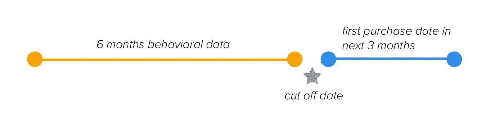
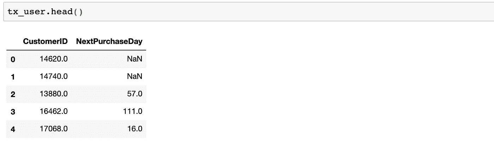
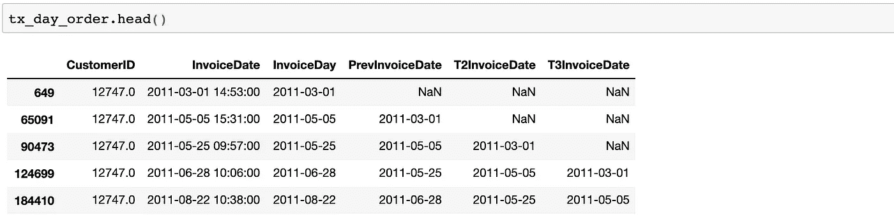
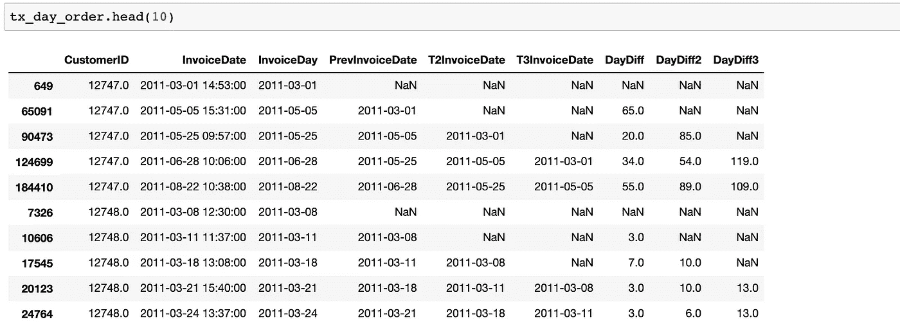
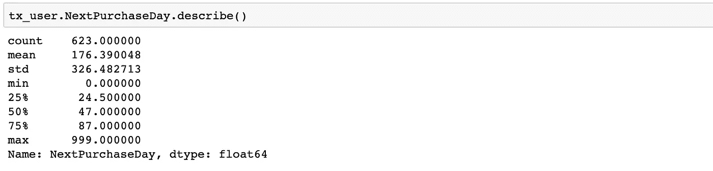
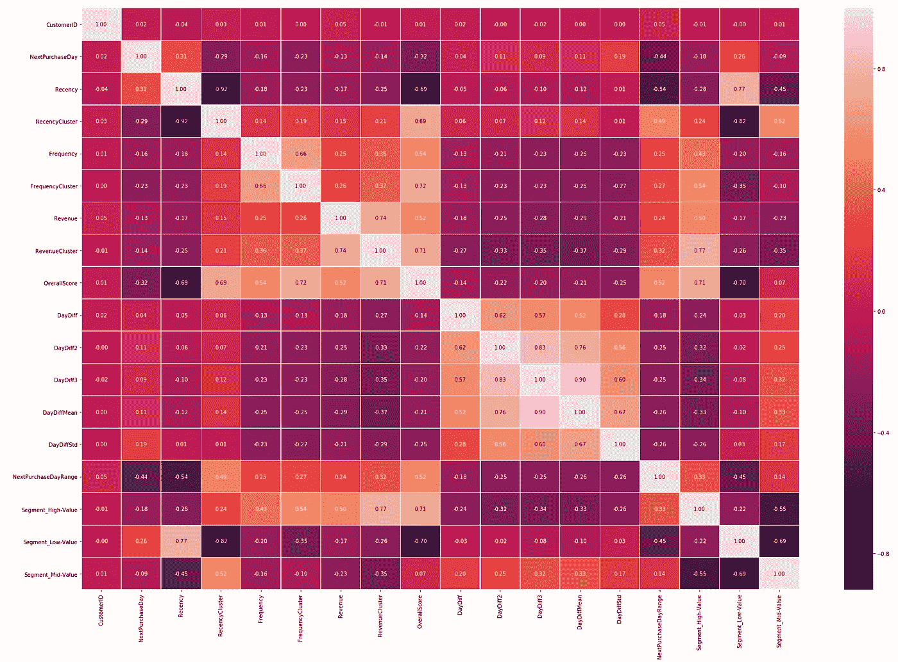
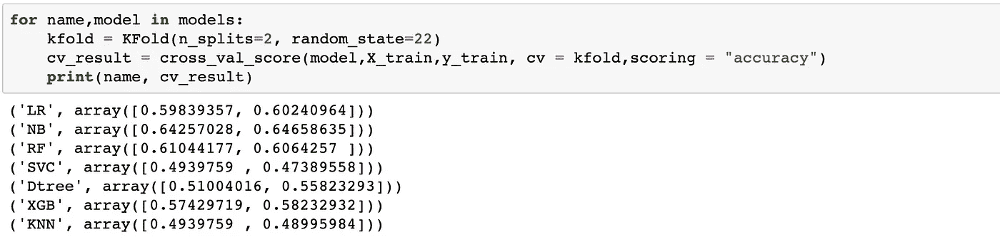
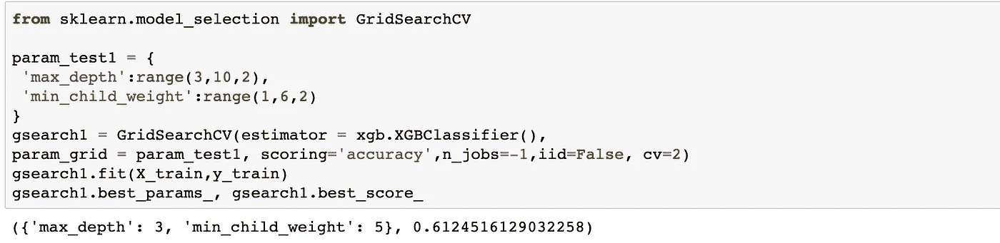

# 预测下一个购买日

> 原文：<https://towardsdatascience.com/predicting-next-purchase-day-15fae5548027?source=collection_archive---------2----------------------->


## [使用 Python 实现数据驱动的增长](https://towardsdatascience.com/tagged/data-driven-growth)

## 机器学习模型预测顾客下次购买的时间

这一系列文章旨在解释如何以一种简单的方式使用 Python，通过将预测方法应用于您的所有行动来推动您公司的发展。它将是编程、数据分析和机器学习的结合。

我将在以下九篇文章中讨论所有主题:

1- [了解你的衡量标准](/data-driven-growth-with-python-part-1-know-your-metrics-812781e66a5b?source=post_page---------------------------)

2- [客户细分](/data-driven-growth-with-python-part-2-customer-segmentation-5c019d150444?source=post_page---------------------------)

3- [客户终身价值预测](/data-driven-growth-with-python-part-3-customer-lifetime-value-prediction-6017802f2e0f?source=post_page---------------------------)

4- [流失预测](/churn-prediction-3a4a36c2129a?source=post_page---------------------------)

**5-预测下一个购买日**

[6-预测销售额](/predicting-sales-611cb5a252de?source=post_page---------------------------)

[7-市场反应模型](/market-response-models-baf9f9913298)

[8-隆起建模](/uplift-modeling-e38f96b1ef60)

[9- A/B 测试设计和执行](/a-b-testing-design-execution-6cf9e27c6559)

文章将有自己的代码片段，使您可以轻松地应用它们。如果你是编程的超级新手，你可以在这里很好地介绍一下 [Python](https://www.kaggle.com/learn/python?source=post_page---------------------------) 和 [Pandas](https://www.kaggle.com/learn/pandas?source=post_page---------------------------) (一个我们将在任何事情上使用的著名库)。但是仍然没有编码介绍，您可以学习概念，如何使用您的数据并开始从中产生价值:

> 有时候你得先跑，然后才能走——托尼·斯塔克

作为先决条件，确保你的电脑上安装了 J [upyter Notebook](https://jupyter.readthedocs.io/en/latest/install.html?source=post_page---------------------------) 和 P [ython](https://www.python.org/downloads/?source=post_page---------------------------) 。代码片段只能在 Jupyter 笔记本上运行。

好吧，我们开始吧。

# 第 5 部分:预测下一个购买日

我们在“数据驱动增长”系列中解释的大多数行动背后都有相同的思路:

**在客户期望之前，以他们应得的方式对待他们(如 LTV 预测)，在不好的事情发生之前采取行动(如流失)。**

预测分析在这一点上对我们帮助很大。它可以提供的众多机会之一是预测客户的下一个购买日。如果您知道客户是否可能在 7 天内再次购买，该怎么办？

我们可以在此基础上构建我们的战略，并提出许多战术行动，例如:

*   此客户没有促销优惠，因为她/他无论如何都会购买
*   如果在预测的时间窗口内没有购买，用集客营销来推动客户(或者解雇预测🦹‍♀️ 🦹‍♂️的人)

在本文中，我们将使用[在线零售数据集](https://www.kaggle.com/vijayuv/onlineretail)，并遵循以下步骤:

*   数据争论(创建上一个/下一个数据集并计算购买日差异)
*   特征工程
*   选择机器学习模型
*   多分类模型
*   超参数调谐

## 数据争论

让我们从导入数据开始，并做初步的数据工作:

**导入 CSV 文件和日期字段转换**

我们已经导入了 CSV 文件，将日期字段从字符串转换为日期时间以使其可用，并过滤掉了除英国以外的国家。

为了构建我们的模型，我们应该将数据分成两部分:



**Data structure for training the model**

我们使用六个月的行为数据来预测客户未来三个月的首次购买日期。如果没有购买，我们也会预测。假设我们的截止日期是 2011 年 9 月 9 日，然后分割数据:

```
tx_6m = tx_uk[(tx_uk.InvoiceDate < date(2011,9,1)) & (tx_uk.InvoiceDate >= date(2011,3,1))].reset_index(drop=True)tx_next = tx_uk[(tx_uk.InvoiceDate >= date(2011,9,1)) & (tx_uk.InvoiceDate < date(2011,12,1))].reset_index(drop=True)
```

**tx_6m** 代表六个月的业绩，而我们将使用 **tx_next** 来找出 tx_6m 中最后一次购买日期和 tx_next 中第一次购买日期之间的天数。

此外，我们将创建一个名为 **tx_user** 的数据帧，以拥有预测模型的用户级特征集:

```
tx_user = pd.DataFrame(tx_6m['CustomerID'].unique())
tx_user.columns = ['CustomerID']
```

通过使用 tx_next 中的数据，我们需要计算我们的**标签**(截止日期前最后一次购买和之后第一次购买之间的天数):

现在，tx_user 看起来如下:



正如你很容易注意到的，我们有 NaN 值，因为那些客户还没有购买。我们用 999 填充 NaN，以便稍后快速识别它们。

我们在数据帧中有客户 id 和相应的标签。让我们用我们的功能集来丰富它，以建立我们的机器学习模型。

## 特征工程

对于这个项目，我们选择了如下候选功能:

*   RFM 分数和聚类
*   最近三次购买的间隔天数
*   购买天数差异的均值和标准差

添加这些特征后，我们需要通过应用 **get_dummies** 方法来处理分类特征。

对于 RFM，为了不重复[第 2 部分](/data-driven-growth-with-python-part-2-customer-segmentation-5c019d150444)，我们共享代码块并继续前进:

**RFM Scores & Clustering**

让我们来关注如何添加接下来的两个特性。在这一部分我们将会大量使用 **shift()** 方法。

首先，我们用客户 ID 和发票日期(不是日期时间)创建一个 dataframe。然后，我们将删除重复的，因为客户可以在一天内多次购买，差异将成为 0。

```
#create a dataframe with CustomerID and Invoice Date
tx_day_order = tx_6m[['CustomerID','InvoiceDate']]#convert Invoice Datetime to day
tx_day_order['InvoiceDay'] = tx_6m['InvoiceDate'].dt.datetx_day_order = tx_day_order.sort_values(['CustomerID','InvoiceDate'])#drop duplicates
tx_day_order = tx_day_order.drop_duplicates(subset=['CustomerID','InvoiceDay'],keep='first')
```

接下来，通过使用 shift，我们创建包含最近 3 次购买日期的新列，并查看我们的数据帧看起来是什么样的:

```
#shifting last 3 purchase dates
tx_day_order['PrevInvoiceDate'] = tx_day_order.groupby('CustomerID')['InvoiceDay'].shift(1)
tx_day_order['T2InvoiceDate'] = tx_day_order.groupby('CustomerID')['InvoiceDay'].shift(2)
tx_day_order['T3InvoiceDate'] = tx_day_order.groupby('CustomerID')['InvoiceDay'].shift(3)
```

输出:



让我们开始计算每个发票日期的天数差异:

```
tx_day_order['DayDiff'] = (tx_day_order['InvoiceDay'] - tx_day_order['PrevInvoiceDate']).dt.daystx_day_order['DayDiff2'] = (tx_day_order['InvoiceDay'] - tx_day_order['T2InvoiceDate']).dt.daystx_day_order['DayDiff3'] = (tx_day_order['InvoiceDay'] - tx_day_order['T3InvoiceDate']).dt.days
```

输出:



对于每个客户 ID，我们使用**。agg()** 找出购买天数差异的平均值和标准差的方法:

```
tx_day_diff = tx_day_order.groupby('CustomerID').agg({'DayDiff': ['mean','std']}).reset_index()tx_day_diff.columns = ['CustomerID', 'DayDiffMean','DayDiffStd']
```

现在我们要做一个艰难的决定。上面的计算对于有很多采购的客户来说相当有用。但是我们不能对那些购买 1-2 次的人说同样的话。例如，将一个客户标记为 ***频繁*** 还为时过早，他只有两次购买，但却是连续购买。

我们只保留购买次数超过 3 次的客户，使用以下热线:

```
tx_day_order_last = tx_day_order.drop_duplicates(subset=['CustomerID'],keep='last')
```

最后，我们删除 NA 值，将新数据帧与 tx_user 合并，并应用**。get_dummies()** for 转换分类值:

```
tx_day_order_last = tx_day_order_last.dropna()tx_day_order_last = pd.merge(tx_day_order_last, tx_day_diff, on='CustomerID')tx_user = pd.merge(tx_user, tx_day_order_last[['CustomerID','DayDiff','DayDiff2','DayDiff3','DayDiffMean','DayDiffStd']], on='CustomerID')#create tx_class as a copy of tx_user before applying get_dummies
tx_class = tx_user.copy()
tx_class = pd.get_dummies(tx_class)
```

我们的特征集已准备好构建分类模型。但是有很多不同的型号，我们应该使用哪一种呢？

## 选择机器学习模型

在开始选择模型之前，我们需要采取两个行动。首先，我们需要识别标签中的类。一般来说，百分位数给出了这个权利。还是用**吧。describe()** 方法在 **NextPurchaseDay:** 中看到它们



决定边界是一个统计和商业需求的问题。就第一点而言，它应该是有意义的，并且易于采取行动和沟通。考虑到这两个，我们将有三个类:

*   0–20:将在 0–20 天内购买的客户— **类别名称:2**
*   21–49:将在 21–49 天内购买的客户— **类别名称:1**
*   ≥ 50:将在 50 天以上购买的客户— **类别名称:0**

```
tx_class['NextPurchaseDayRange'] = 2
tx_class.loc[tx_class.NextPurchaseDay>20,'NextPurchaseDayRange'] = 1
tx_class.loc[tx_class.NextPurchaseDay>50,'NextPurchaseDayRange'] = 0
```

最后一步是查看我们的特征和标签之间的相关性。**相关矩阵**是展示这一点的最简洁的方式之一:

```
corr = tx_class[tx_class.columns].corr()
plt.figure(figsize = (30,20))
sns.heatmap(corr, annot = True, linewidths=0.2, fmt=".2f")
```



看起来**总分**正相关度最高(0.45)，而**新近度**负相关度最高(-0.54)。

对于这个特殊的问题，我们希望使用精度最高的模型。让我们分开训练和测试测试，并测量不同模型的准确性:

**Selecting the ML model for the best accuracy**

每个型号的精度:



从这个结果中，我们看到朴素贝叶斯是性能最好的一个(大约 64%的准确率)。但在此之前，让我们看看我们到底做了什么。我们应用了机器学习中的一个基本概念，那就是**交叉验证。**

我们如何确定我们的机器学习模型在不同数据集之间的稳定性？此外，如果我们选择的测试集中有噪声怎么办。

交叉验证是衡量这一点的一种方式。它通过选择不同的测试集来提供模型的得分。如果偏差较低，则表示模型稳定。在我们的例子中，分数之间的偏差是可以接受的(除了决策树分类器)。

通常，我们应该用朴素贝叶斯。但是对于这个例子，让我们用 XGBoost 来展示我们如何用一些先进的技术来改进一个现有的模型。

## 多分类模型

为了构建我们的模型，我们将遵循前面文章中的步骤。但是为了进一步改进，我们将进行**超参数调整**。

从程序上讲，我们将找出我们的模型的最佳参数，以使它提供最佳的准确性。

让我们首先从编码我们的模型开始:

```
xgb_model = xgb.XGBClassifier().fit(X_train, y_train)print('Accuracy of XGB classifier on training set: {:.2f}'
       .format(xgb_model.score(X_train, y_train)))
print('Accuracy of XGB classifier on test set: {:.2f}'
       .format(xgb_model.score(X_test[X_train.columns], y_test)))
```

在这个版本中，我们在测试集上的准确率是 58%:


XGBClassifier 有许多参数。你可以在这里找到他们的名单[。对于这个例子，我们将选择**最大 _ 深度**和**最小 _ 子 _ 重量。**](https://xgboost.readthedocs.io/en/latest/parameter.html)

以下代码将为这些参数生成最佳值:

```
from sklearn.model_selection import GridSearchCVparam_test1 = {
 'max_depth':range(3,10,2),
 'min_child_weight':range(1,6,2)
}
gsearch1 = GridSearchCV(estimator = xgb.XGBClassifier(), 
param_grid = param_test1, scoring='accuracy',n_jobs=-1,iid=False, cv=2)
gsearch1.fit(X_train,y_train)
gsearch1.best_params_, gsearch1.best_score_
```



该算法认为最大深度和最小子权重的最佳值分别为 3 和 5。了解它如何提高精确度:


我们的分数从 58%上升到 62%。这是相当大的进步。

知道下一个购买日也是预测销售的一个很好的指标。我们将在第 6 部分中深入探讨这个话题。

你可以在这里找到这篇文章的笔记本。

享受数据驱动增长系列？给我买杯咖啡[这里](https://www.buymeacoffee.com/karamanbk) …