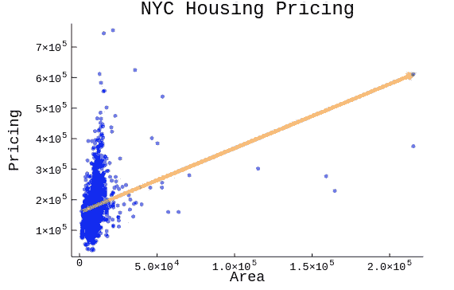
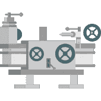
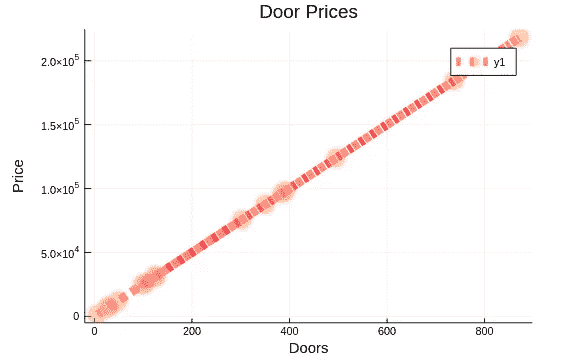
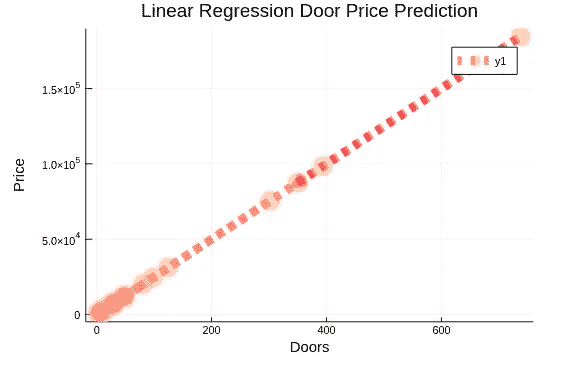
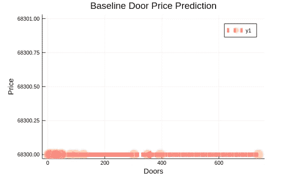
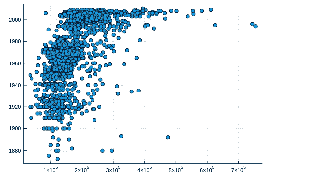
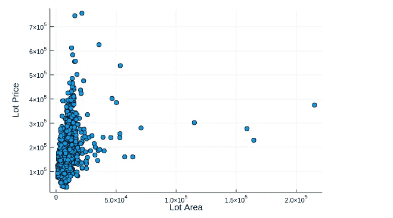
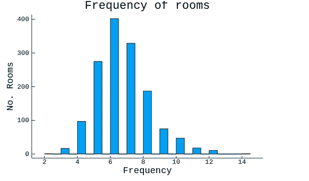
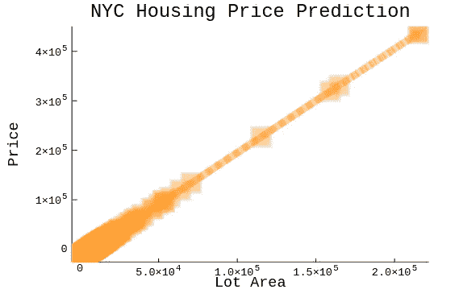

# 用 Julia 中的车床预测纽约市的拍品价格

> 原文：<https://towardsdatascience.com/predicting-nyc-lot-prices-with-lathe-in-julia-446b14de77c9?source=collection_archive---------18----------------------->



> 没错女士们先生们，介绍:第一个车床. jl 模型，并不意外；是线性回归。

Julia 是一种奇妙的、强大的语言(尤其是如果你喜欢编程 arduino 板。也就是说，鉴于 Julia 是一种非常函数式的语言，它几乎与生俱来的基础结构使得它非常适用于传统上被认为是面向对象的编程。然而，Julia 相对缺乏的目标受众是数据科学家。

虽然很多 Julia 的老手可能对 pkg . add()-为 3 个不同的模型提供 7 个不同的包没有问题，但这却是我对 Julia 最大的不满。Julia 有一个绝对神奇(更不用说简单)的包，Flux.jl 用于渐变、图像识别，所有这些有趣的东西，但不幸的是，我觉得这些包在预测性机器学习方面存在不足，特别是无监督学习。随着我计划改变这一点，通过为 Julia 数据科学家(包括我自己)将大量数据科学工具放在一个地方，我最终开始了一个小的包，起初是几个标量，t 测试，f 测试，在某一点上，我开始考虑创建我自己的模型模块，这已经发生在过去的两个月里。


虽然我不认为我的包会改变生活(只是暂时的)，但我认为即使在预发布状态，我仍然选择使用它，而不是 Julia 提供的更传统的选项(主要得益于我的本地存储)。)所以今天，我很自豪地向大家呈现 Lathe.jl 的官方 SimpleLinearRegression。



Lathe.jl

如果你有兴趣尝试目前状态的车床. jl，这里是[。](https://github.com/emmettgb/Lathe.jl/wiki/Lathe)我适合这个型号的[笔记本在这里。我决定用缩放后的数据开始这个项目。虽然有人强烈反对创建和使用缩放数据来测试模型(因为它的发明是泄漏)，但这是一个很好的方式来看看你的线性模型是否可以找到一个简单的斜率。对于我的斜率，我选择了 250，我生成了一串随机数，并在 For 循环中将所有迭代乘以 250。](https://github.com/emmettgb/Emmetts-DS-NoteBooks/blob/master/Julia/NYC%20Residential%20Regression.ipynb)

当然，生成的数据总是干净的，所以我直接为我的模型获取基线:

```
using Lathe: models
# Our y is going to be Price,
#    Our x is going to be Doors:
# Fitting our model:
model = models.meanBaseline(traindf.Price)
```

嘣，就这样，一个合身的模特。当然，下一步是我们的列车预测:

```
# Put our model, and our xtrain into our predict method
testdf.Baseline = models.predict(model,testdf.Doors)
```

简单，那么我们能期望什么样的精度呢？

```
accuracy = Validate.mae(testdf.Price,testdf.Baseline)
println("Baseline accuracy: ",accuracy)Baseline accuracy: -41321.739130434784
```

我们的平均绝对误差约为 41000，相当糟糕。但这当然是意料之中的，这让我对实际模型的验证更加兴奋。让我们开始吧！：

```
# Fitting our model:
linreg = models.SimpleLinearRegression(traindf.Doors,traindf.Price)
# Put our x and y into the predict method:
testdf.Prediction = models.predict(linreg,testdf.Doors)
```

你可能想知道我们的平均绝对误差怎么样了？

```
linaccuracy = Validate.mae(testdf.Price,testdf.Prediction)
println("Linear Regression Accuracy: ",linaccuracy)Linear Regression Accuracy: 0.0
```

没错，0.0。如果你是数据科学的杰出人士，你可能会理解为什么它是 0。还记得我说过这是缩放数据吗？不管怎样，这个例子表明，我们的模型能够计算出线性方程的斜率。当然，这太好了！这在现实世界中基本上是没有用的，但至少我有理由做一些很酷的可视化！



The Original Door Data



The slope prediction of the door data

线的斜率几乎相同，这是预期的，平均绝对误差为零。当然，这是我们非常搞笑的基线模型:



Baseline door price prediction

# 真实世界的数据

现在终于到了将该模型应用于一些真实世界数据的时候了。这是我既喜欢又讨厌做的事情，因为有些数据集真的需要你跳出框框思考，而其他的数据集则很乏味。对于我的数据，我最终选择了来自 Kaggle 的纽约数据集。奇怪的是，由于某种原因，这个数据集看起来有点熟悉，我觉得好像我以前用过它。然而，我认为事实并非如此。我认为我脑海中的数据集只是关于同一主题的数据集。

我最小化了数据集，并检查是否有丢失的值，但没有发现任何丢失的值。

```
df = DataFrame(:LotArea => df.LotArea, :SalePrice => df.SalePrice, 
    :YearBuilt => df.YearBuilt,:YearSold => df.YrSold, :Rooms => df.TotRmsAbvGrd)
```

手里只拿着我喜欢的功能，我跳入了数据探索的奇妙世界。我认为基本的可视化对于更好地理解数据是不可或缺的，这一点我怎么强调都不为过。统计学也很棒，但是一些可视化通常可以用来证明同样的想法，只需要一半的时间，而且在我看来更有趣。



Sale Price and Year Built ; Sale Price and Area (left to right)

有两个特点非常突出，与我的销售价格直接相关。建造年份和地段面积，所以我把数据分开，对它们都进行了 f 检验。它们都显示了很强的统计显著性，我最终选择了 Lot Area，最初是因为我的 x 特征进入了模型。我认为将两个都拟合并比较结果比只拟合一个更有趣(这是拟合的两倍！)

我很兴奋去适应我的模型，但控制和冷静下来是一件好事，首先去获得一个基线。所以，我做了:

```
# Fit our model once again:
using Lathe: models
model = models.meanBaseline(df.SalePrice)
```

然后，我创建了一个空的数据框架来处理来自各种预测方法的所有输入数据。

```
# we'll have a new dataframe for our predictions
using DataFrames
predictions = DataFrame()predictions.Baseline = models.predict(model,testdf.SalePrice)
```

之后，我们当然会验证:

```
using Lathe: Validate
baseline_accuracy = Validate.mae(testdf.SalePrice,predictions.Baseline)
println("==========>")
println("Baseline Accuracy - ",baseline_accuracy)
println("==========>")==========>
Baseline Accuracy - 1.9455711319021984e-11
==========>
```

哇哦！这是一些可怕的准确性！我当然跳出来拟合一个模型，比较这些分数。

```
# Fit our new model!
model = models.SimpleLinearRegression(testdf.LotArea,testdf.SalePrice)
# And we'll check out what that looks like:
predictions.Prediction = models.predict(model,testdf.LotArea)
```

我开始验证:

```
BasePredAccuracy = Validate.mae(testdf.SalePrice,predictions.Prediction)
println("=========>")
println("Baseline Accuracy: ",baseline_accuracy)
println("-------------------")
println("Model Accuracy: ",BasePredAccuracy)
println("=========>")=========>
Baseline Accuracy: 1.9455711319021984e-11
-------------------
Model Accuracy: 173848.28232265453
=========>
```

如此之大，模型的准确性比基线有了显著的提高。

我尝试用一个重标量进行一些预处理，但是看起来 Z 标量对于大幅度提高精度是必要的。但是当然，如果没有更多的视觉化，我不能结束。



Visualizing my model, room frequency, and lot area.

最后，我对车床的未来感到非常兴奋。这个模型是许多的开始，并且当前的统计是更多的开始。对我来说，在 Julia 中，车床使机器学习变得容易得多。我希望它在未来对其他人也是如此，如果你想做任何改进，请随意在这里发表。