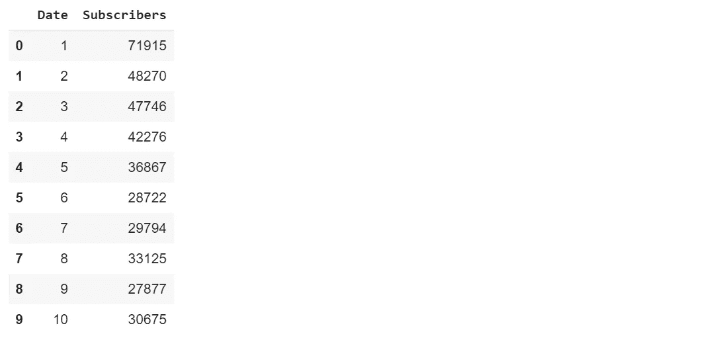
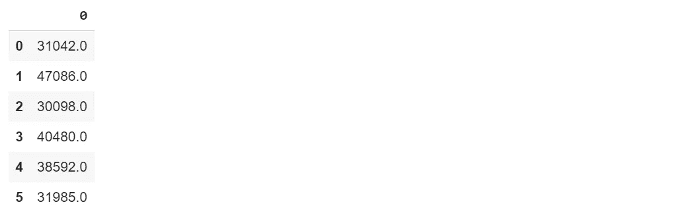
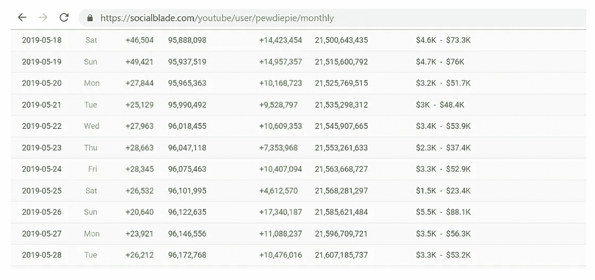

# 使用线性回归预测 PewDiePie 的每日订户。

> 原文：<https://towardsdatascience.com/predicting-pewdiepies-daily-subscribers-using-linear-regression-15da7bd28f85?source=collection_archive---------23----------------------->

让我们了解一下如何使用线性回归来预测 PewDiePie 的日订阅人数。


Credits: [Fandom](https://epicrapbattlesofhistory.fandom.com/wiki/PewDiePie)

PewDiePie 是瑞典的 YouTube，在 YouTube 上拥有 1 亿订户(他是我的最爱)。他每天都有成千上万的用户，所以我想写一篇关于他的用户增长的教程。所以我想给你们展示一个机器学习的线性回归算法的实际实现。这里我们可以应用线性回归来预测他的 YouTube 日订阅量。我将在本教程中指导你们如何去做。本教程的完整代码可以在我的 [GitHub](https://github.com/Tanu-N-Prabhu/Python/blob/master/Predicting_PewDiePie's_daily_subscribers_using_Machine_Learning_.ipynb) 上找到。我不会解释线性回归算法背后的理论，因为根据我的说法，理论并不重要，只有实现才是非常重要的，因为你需要知道如何以及在哪里应用算法。不过，我会鼓励你在网上浏览一些理论，其中一篇最好的文章如下所示:

[](/linear-regression-using-python-b136c91bf0a2) [## 使用 Python 进行线性回归

### 线性回归通常是每个数据科学家遇到的第一个机器学习算法。这是一个…

towardsdatascience.com](/linear-regression-using-python-b136c91bf0a2) 

# 让我们开始吧:

## 我们将遵循以下步骤来完成此实施:

1.  导入必要的库。
2.  从 CSV 文件中读取数据集。
3.  将数据集分成独立变量(x)和因变量(y)。
4.  将完整数据集划分为训练数据集和测试数据集。
5.  基于简单线性回归实现我们的分类器。

## 1.导入必要的库。

在本教程中，我将使用一些重要的库，如:

1.  numpy
2.  熊猫
3.  sklearn.linear
4.  sklearn.model_selection

**Numpy:** 我使用 Numpy 库的原因是，在本教程的结尾，我对一些值进行了四舍五入，以获得更准确的结果。为了调用 round 方法，我需要导入 numpy 库。要阅读 numpy 库的官方文档，请访问下面的链接:

[](https://numpy.org/devdocs/) [## NumPy v1.18.dev0 手册

### 欢迎光临！这是 NumPy 1.18.0.dev0+07a5753 的文档，最后更新于 2019 年 9 月 25 日。部分…

numpy.org](https://numpy.org/devdocs/) 

如你所知，我正在使用 YouTube 上的 PewDiePie 的数据，我需要将它们存储在某种形式的数据框中，为了将数据存储在数据框中，我正在使用 pandas 数据框，使用 Pandas 数据框非常简单和有趣。要阅读熊猫图书馆的官方文件，请访问下面的链接:

 [## pandas:强大的 Python 数据分析工具包- pandas 0.25.1 文档

### 是一个开源的、BSD 许可的库，提供高性能、易于使用的数据结构和数据分析工具…

pandas.pydata.org](https://pandas.pydata.org/pandas-docs/stable/) 

**Sklearn.linear:** 如你所知，现在我正在使用线性回归算法来预测数据，我需要导入线性回归库，但是你不能直接导入线性回归库，虽然你需要导入 sci-kit learn 来帮助你访问线性回归库。这就是我使用 sklearn.linear 的原因。要阅读该库的官方文档，请访问下面的链接:

[](https://scikit-learn.org/stable/modules/generated/sklearn.linear_model.LinearRegression.html) [## sklearn.linear_model。线性回归-sci kit-学习 0.21.3 文档

### 当 fit_intercept 设置为 False 时，此参数将被忽略。如果为真，回归量 X 将在…之前被标准化

scikit-learn.org](https://scikit-learn.org/stable/modules/generated/sklearn.linear_model.LinearRegression.html) 

**sklearn.model_selection:** 如果您正在实施线性回归来预测数据，那么将数据分为训练数据和测试数据通常是一个好的做法，只有这样，您预测的数据才会更加准确。为此，您需要从 scikit learn 导入 model_selection 库。要阅读官方文档，请访问以下链接:

[](https://scikit-learn.org/stable/tutorial/statistical_inference/model_selection.html) [## 模型选择:选择估计量及其参数-sci kit-学习 0.21.3 文档

### Scikit-learn 有一个类集合，可以用来为流行的

scikit-learn.org](https://scikit-learn.org/stable/tutorial/statistical_inference/model_selection.html) 

在 python 中导入任何库的快速注意事项你所要做的就是说“**导入库名**”，库名如 pandas，numpy 等等。

**导入本教程所需的库如下所示:**

```
import numpy as np
import pandas as pd
from sklearn.linear_model import LinearRegression
from sklearn.model_selection import train_test_split
```

## **2。从 CSV 文件中读取数据集。**

我已经将 PewDiePie 的订户数据以 CSV 格式存储在 [Kaggle](https://www.kaggle.com) 中。Kaggle 是世界各地的人们发布和存储数据集的地方。在这里，我将数据存储为 CSV(逗号分隔值)格式。要下载数据集，请查看以下链接:

[](https://www.kaggle.com/tanuprabhu/pewdiepies-subscribers) [## PewDiePie 的订户

### 下载数千个项目的开放数据集+在一个平台上共享项目。探索热门话题，如政府…

www.kaggle.com](https://www.kaggle.com/tanuprabhu/pewdiepies-subscribers) 

您可以通过单击下载选项下载数据集。要将数据转换成 python 中的格式，您必须使用 pandas 数据框。在此之前，你必须将数据加载到你的笔记本中(我正在使用 [Google Colab](https://colab.research.google.com/notebooks/welcome.ipynb) 来键入我所有的 python 代码)，在线上有多种方法可以将数据加载到笔记本中，但最简单的方法是在笔记本左侧的 [**Google Colab**](https://colab.research.google.com/notebooks/welcome.ipynb) 中，你会发现一个“**>”**(大于符号)。当你点击它时，你会发现一个有三个选项的标签，你只需要选择文件。然后你可以在上传选项的帮助下轻松上传你的文件。无需安装到 google drive 或使用任何特定的库，只需上传数据集，您的工作就完成了。在这一步要记住的一点是，当运行时被回收时，上传的文件将被删除。这就是我如何把数据集放进笔记本的。

```
**# Storing the data in a pandas data frame.** 
df = pd.read_csv(“PewDiePie.csv”)
df.head(5)
```



如您所见，上面的数据集包含两列，data 和 subscribers。我知道日期列看起来很混乱，不要担心，多想想，它只是存储了 2019 年 5 月的第一天(像 5 月 1 日、5 月 2 日等等)。订户列包含 PewDiePie 的所有订户。

## **3。将数据集分成独立变量(x)和因变量(y)。**

在将数据集划分为训练数据和测试数据之前，您需要区分哪些是因变量，哪些是自变量，然后才能进行划分。这可以通过以下方式完成:

```
x = df.iloc[:, :-1]
y = df.iloc[:, 1]
```

这里,“x”值包含数据,“y”值包含用户，iloc 用于从数据帧中获取值。我使用[:，:-1]的原因是因为我需要数据帧的倒数第二列，而[:1]给出了数据帧的最后一列。您可以打印该值进行确认。

## **4。将完整数据集划分为训练数据集和测试数据集。**

为了得到一个好的预测，将数据分为训练和测试数据，这是因为顾名思义，你将训练几个数据点和测试几个数据点，并继续这样做，除非你得到好的结果。

```
x_train, x_test, y_train, y_test = train_test_split(x, y, test_size = 0.3, random_state = 0)
```

这里,“x”和“y”变量被分为训练和测试数据，如上面的代码片段所示，测试数据的大小为 0.3 或 30%，其余为 70%(训练数据)，random_state 是随机数生成器使用的种子。

注意:试着把 x 和 y 的训练值都打印出来，你就明白我在说什么了。

```
**HINT:** print(x_test)
```

## **5。基于简单线性回归实现我们的分类器。**

这是最重要的一点，因为这是我们应用线性回归算法的地方，要做到这一点，我们必须将经过训练的测试值提供给实际算法，这样我们就可以预测订户。为此，请遵循以下代码:

```
simplelinearRegression = LinearRegression()
simplelinearRegression.fit(x_train, y_train)**LinearRegression(copy_X=True, fit_intercept=True, n_jobs=None, normalize=False)**
```

在上面的代码中，我们调用了线性回归函数，然后试图绕过训练值来拟合模型。

```
y_predict = simplelinearRegression.predict(x_test)
predict = pd.DataFrame(y_predict)
predict.apply(np.round)
```

然后我们需要使用 then predict 方法来预测这些值，为此我们需要传递“x”变量的测试值，这样我们就可以获得预测值(订户)。下一行代码只是转换，这是因为 y_predict 是 numpy 数组类型，所以我们需要将其转换为数据帧，然后才能应用 round 函数。现在，变量 predict 包含所有预测的订户，如下所示:



稍后，我会将数据放入 while 循环中，以实际格式获取它，不要担心，这只是一个带有预测值的打印语句，一旦您跟踪它，就会得到它:

```
while i <= 28:
 print(“Total number of increase in subscribers on May %d ==>” %(i) , int(simplelinearRegression.predict([[i]])))
 i= i+1 **Total number of increase in subscribers on May 21 ==> 29154 
Total number of increase in subscribers on May 22 ==> 28210 
Total number of increase in subscribers on May 23 ==> 27266 
Total number of increase in subscribers on May 24 ==> 26322 
Total number of increase in subscribers on May 25 ==> 25378 
Total number of increase in subscribers on May 26 ==> 24434 
Total number of increase in subscribers on May 27 ==> 23491 
Total number of increase in subscribers on May 28 ==> 22547**
```

这就是 predict 函数预测订户的方式，predict 函数返回的订户是准确的。下面给出的是社会刀片统计，你可以比较其余的。



Credits: [Social Blade](https://socialblade.com/youtube/user/pewdiepie)

如下图所示，当您将预测值的结果与上面由 [Social Blade](https://socialblade.com/youtube/user/pewdiepie) 获得的实际订户进行比较时，结果几乎相同，除了这里或那里可以找到一些或多或少的订户，但没关系，机器学习无法 100%准确地预测。因此，这就是你如何使用机器学习算法来预测 PewDiePie 的每日订户。如果你对代码有任何疑问，评论区都是你的。如有疑问，请联系我。此外，代码可以在我的 [GitHub 库](https://github.com/Tanu-N-Prabhu/Python/blob/master/Predicting_PewDiePie's_daily_subscribers_using_Machine_Learning_.ipynb)中找到。谢谢你们阅读我的文章。再见，开始练代码，下次见。