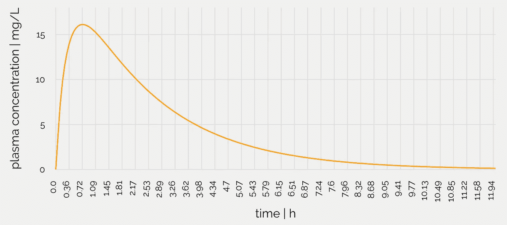
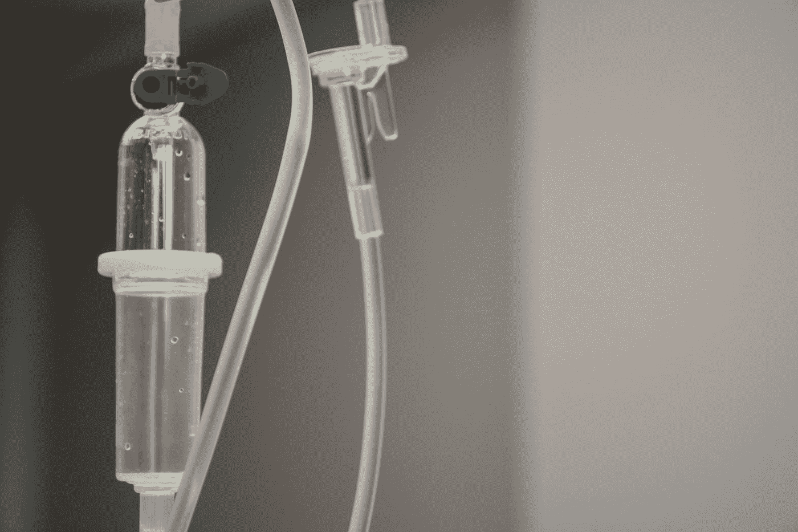

# 用确定性模型预测药代动力学

> 原文：<https://towardsdatascience.com/predicting-pharmacokinetics-with-deterministic-models-and-bayesian-statistics-e3822a28977b?source=collection_archive---------24----------------------->

## [临床数据科学](https://towardsdatascience.com/tagged/clinical-data-science)

## 精准医疗之路。


Photo by [Myriam Zilles](https://unsplash.com/@myriamzilles?utm_source=medium&utm_medium=referral) on [Unsplash](https://unsplash.com?utm_source=medium&utm_medium=referral)

# 介绍

## 药物动力学

[**【药代动力学】**](https://en.wikipedia.org/wiki/Pharmacokinetics) 处理 [**异生素**](https://en.wikipedia.org/wiki/Xenobiotic) 在生物体内的分布和代谢。在药物开发和临床研究中，人们会遇到 [**药理学家**](https://en.wikipedia.org/wiki/Pharmacology) ，他们的工作是建议医生给病人提供药物的剂量。为此，他们经常运行所谓的药代动力学模型的模拟，这些模型是[](https://en.wikipedia.org/wiki/Deterministic_system)**确定性的，即它们由关于时间变量的 [**常微分方程**](https://en.wikipedia.org/wiki/Ordinary_differential_equation) 组成，并描述以下过程(称为 LADME):**

*   **[](https://en.wikipedia.org/wiki/Liberation_(pharmacology))****:**药物从[药物配方中释放出来的过程](https://en.wikipedia.org/wiki/Pharmaceutical_formulation)****
*   ****[**吸收**](https://en.wikipedia.org/wiki/Absorption_(pharmacology)) **:** 物质进入血液循环的过程****
*   ****[**分布**](https://en.wikipedia.org/wiki/Distribution_(pharmacology)) **:** 物质在身体的体液和组织中的扩散或散布****
*   ****[**代谢**](https://en.wikipedia.org/wiki/Metabolism) **:** 生物体对存在外来物质的识别以及母体化合物向子代谢物的不可逆转化****
*   ****[**清除**](https://en.wikipedia.org/wiki/Elimination_(pharmacology)) :从体内清除物质****

****这种模型有助于确定药物的最佳**剂量**，作为患者属性的函数，如**体重**、**身高**、**年龄**或**性别**。此外，可以预测药物在血浆中随时间的浓度分布。此外，可以监测 [**药物相互作用**](https://en.wikipedia.org/wiki/Drug_interaction) 。这样，可以为单个患者定义给药间隔，为 [**个性化治疗**](https://en.wikipedia.org/wiki/Personalized_medicine) 铺平道路(更多信息请访问 [**openPK**](https://openpk.herokuapp.com/home) )。****

## ****确定性建模****

****通常，作为确定性模型一部分的这些方程组具有未知的参数，并且必须根据实验数据进行估计。身体本身被描述为一个 [**多隔室**](https://en.wikipedia.org/wiki/Compartment_(pharmacokinetics)) **系统**(器官是隔室)，在其中发生所述过程的子集，并且药物/代谢物分子*从一个隔室(器官)流向另一个隔室*。通常假设所述隔室是理想混合的，即进来的分子立即混合。请注意，依赖于时间的实验数据通常并不适用于所有的房室，尤其是人类。****

********

****Plasma concentration of paracetamol for a 50-kg patient and a dose of 1 g as it can be encountered on [**openPK**](https://openpk.herokuapp.com/home). (image by author)****

# ****模型开发****

## ****模型组成****

****开发这样一个模型的方法是制定一组微分方程(在我的 [GitHub](https://github.com/gtancev/Pharmacokinetic-Modeling-of-Ethanol-Degradation) 上可以找到一个在 [**MATLAB**](https://de.wikipedia.org/wiki/Matlab) 中编程的处理 [**乙醇**](https://en.wikipedia.org/wiki/Ethanol) 代谢的例子)。下面的等式是对隔室 *k* 中的化合物 *i* 具有流量 *Q* 和体积 *V* 的**质量平衡**的一般公式。 *P* 是一个分配系数，表示某一组织中保留了多少化合物。 *Q* 和 *V* 取决于患者的体重、身高、年龄和性别(用 [**异速生长标度**](https://en.wikipedia.org/wiki/Allometry) 建模)。****

```
**dc_dt_i_k = (Q_k/V_k)*(c_in_i_(k-1)-c_i_k/P_i_k)**
```

****每个隔间的 *Q* 、 *V* 、*和 *P* 的值可在文献中找到。此外，药物在肝脏部分代谢，在肾脏部分排泄。在这种情况下，肝脏和肾脏的方程被修改。*****

```
**dc_dt_i_liver = (1/V_liver)*(Q_liver*(c_in_i-c_i_liver/P_i_liver)-**v_max_i*c_i_liver/(K_m_i+c_i_liver)**)dc_dt_i_kidney = (1/V_kidney)*(Q_kidney*(c_in_i-c_i_kidney/P_i_kidney)-**k_r_i*c_i_kidney****
```

****肝方程式中的粗体术语代表由酶催化的反应的所谓的 [**米氏-门滕**](https://en.wikipedia.org/wiki/Michaelis%E2%80%93Menten_kinetics) 表达式。它将反应限制到最大反应速度 *vmax* ，因为用于反应的活性位点的数量是有限的。但是 *vmax* 和 *Km* 在文献中并不容易得到，必须从实验数据中估算(间隙项 *kr* 也是如此)。此外，可能发生与其他分子竞争活性位点的情况，并且反应项可能需要通过包括抑制表达来修改。先验地不清楚哪些过程包括在哪些区间中。例如，药物在胃肠道内被吸收到血液中，但它也可能在那里分解。要走的路是制定一个初始模型，估计其参数，并在测试集上评估其性能。如果模型性能不足，则通过添加或删除一些项来改进模型，并重复该过程直到收敛。****

## ****参数估计****

****有不同的目标函数用于参数估计。首先，常规的 [**最小二乘问题**](https://en.wikipedia.org/wiki/Least_squares) 可以被最小化(浓度是参数 *p* 的函数，目标函数 *J* 也是如此)。为此，所有隔室 *k* 中的所有化合物 *i* 的浓度堆叠在一列中(使用*整形*功能以避免 for 循环)。变量 *c_m* 是指测量的浓度，而 c_ *p* 是预测的浓度。****

```
**J = (1/N)*(c_m-c_p)'*(c_m-c_p)**
```

****这个函数的缺点是，它比低浓度的分子更适合高浓度的分子，因为它们对目标的贡献小得多。另一种可能性是用一个**协方差矩阵**的逆来缩放点积，并将其重新表述为一个 [**最大似然**](https://de.wikipedia.org/wiki/Maximum-Likelihood-Methode) 问题。当然，方差矩阵 *E* 也得知道。****

```
**J = (1/N)*(c_m-c_p)'***inv(E)***(c_m-c_p)**
```

*****E* 可以例如从每个隔室中每种化合物的 [**变异系数**](https://en.wikipedia.org/wiki/Coefficient_of_variation) *cv* 中估算。****

```
**E = cv'*c_m**
```

****最后，模型必须包含在目标函数中。利用这些参数，使用微分方程求解器(例如， *ode15s* 处理 [**刚度**](https://en.wikipedia.org/wiki/Stiff_equation) )评估模型并计算预测浓度，即通过 [**龙格-库塔法**](https://en.wikipedia.org/wiki/Runge%E2%80%93Kutta_methods) 。使用基于[](https://en.wikipedia.org/wiki/Quasi-Newton_method)****实现的 [*fminunc*](https://ch.mathworks.com/help/optim/ug/fminunc.html) 之类的解算器来最小化目标函数(类似于 [**梯度下降**](https://en.wikipedia.org/wiki/Gradient_descent) ，但是梯度是围绕当前参数点近似的，并且与目标函数的二阶导数的幅度成比例缩放，这通过允许平坦区域中的更大的步长来增强性能)。[执行**多起点**(参数 *p* 的不同起点)很重要，以便找到**全局最优**，而不是以局部最优结束。](https://en.wikipedia.org/wiki/Convex_optimization)(注意，最小二乘法可以作为更复杂方法的起点。)********

## ****模型验证****

****该模型最好使用测试集来验证，即该模型没有被训练的数据。平均相对/绝对(平方)误差可以用作度量。另外，重要的是执行一次 [**灵敏度分析**](https://en.wikipedia.org/wiki/Sensitivity_analysis) 。为此，计算所有浓度(每个隔室中的每种化合物)相对于所有参数的偏导数。注意，它们是时间相关的，因为浓度是时间相关的。因此，一个参数对输出变量的影响会随时间而变化。必须进一步研究非常敏感的参数和它们所描述的过程。****

****灵敏度矩阵的 [**秩**](https://en.wikipedia.org/wiki/Rank_(linear_algebra)) 揭示了所有参数是否相互独立( [**结构可辨识性**](https://en.wikipedia.org/wiki/Identifiability_analysis))；如果秩低于参数的数量，则必须通过移除或重新调整从属参数来重新定义模型。****

```
**R = rank(S)**
```

****此外，应计算参数的[](https://de.wikipedia.org/wiki/Konfidenzintervall)**置信区间，以检验[](https://en.wikipedia.org/wiki/Identifiability_analysis)**的实际可识别性。可以使用 [**费希尔信息**](https://en.wikipedia.org/wiki/Fisher_information) 和 [**克拉美罗界限**](https://en.wikipedia.org/wiki/Cram%C3%A9r%E2%80%93Rao_bound) 来计算参数的方差。********

```
**E_p = inv(S'*inv(E)*S)**
```

****置信区间通过单变量方法计算，仅使用参数协方差矩阵的对角元素和 [**学生 t 分布**](https://en.wikipedia.org/wiki/Student%27s_t-distribution) 的分位数。****

```
**sigma = sqrt(diag(E_p))CI_lb = p_fit-sigma*tinv(0.95, number_points-number_parameters)CI_ub = p_fit+sigma*tinv(0.95, number_points-number_parameters)**
```

****如果置信区间包括零，那么参数也可以是零，即不参与方程，因此模型应该被改进。请注意，所有参数都应该是正数。****

****经过几次迭代的拟合和精化，构建过程当然就完成了，得到了合理的测试集性能，模型就可以用于预测了。****

********

****Photo by [Marcelo Leal](https://unsplash.com/@marceloleal80?utm_source=medium&utm_medium=referral) on [Unsplash](https://unsplash.com?utm_source=medium&utm_medium=referral)****