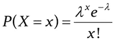
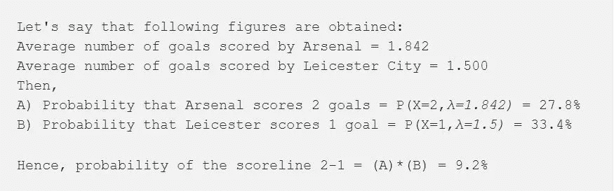
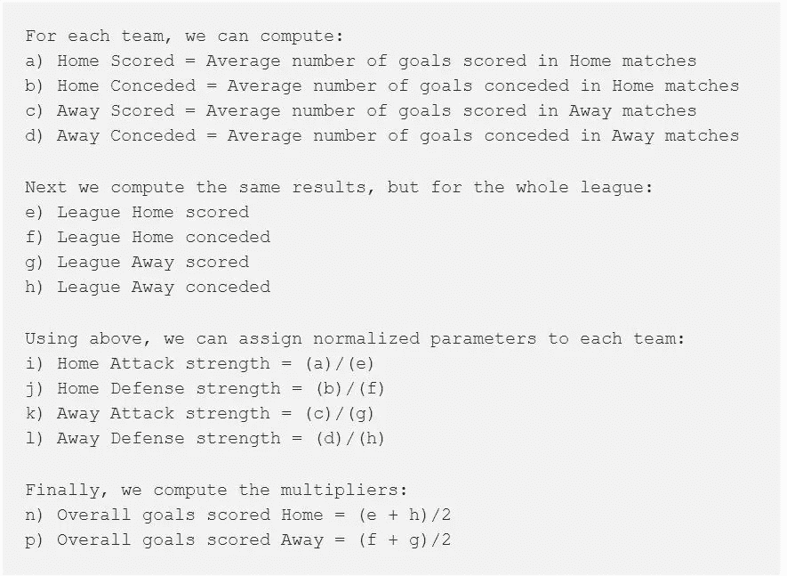
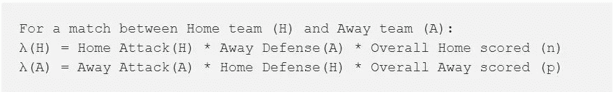
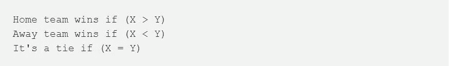
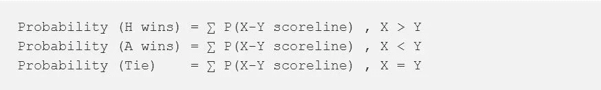
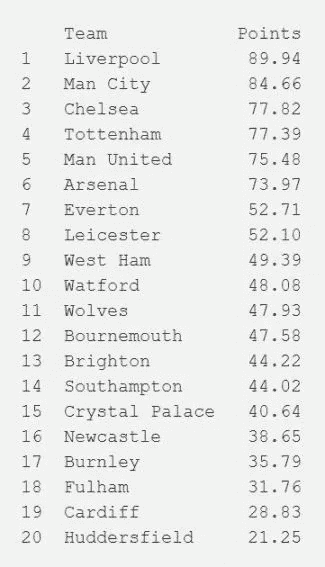

# 预测英超联赛排名——让数学派上用场

> 原文：<https://towardsdatascience.com/predicting-premier-league-standings-putting-that-math-to-some-use-e8de64938d7?source=collection_archive---------4----------------------->

Photo by [Abigail Keenan](https://unsplash.com/@akeenster?utm_source=medium&utm_medium=referral) on [Unsplash](https://unsplash.com?utm_source=medium&utm_medium=referral)

我最近遇到了一个有趣的问题任务，这是一个基于数学和其他有趣主题的[在线地穴搜索](https://www.facebook.com/events/522221961613814)的最终挑战(数学和有趣通常不在一起:P)，我试图在短时间内找到一个解决方案，这并不坏。在本文中，我试图描述我采用的解决方法，并讨论一些可能的改进。

简单来说，问题任务是:

> *预测曼联足球俱乐部在英超本赛季(18-19 赛季)积分榜上的最终排名*

## 一些背景

**超级联赛**是英国足球联赛体系的最高级别，也是**世界上收视率最高的体育联赛**，潜在电视观众达 47 亿人(是的，它很受欢迎！).20 个俱乐部在一个赛季中比赛，每个俱乐部与其他俱乐部比赛两次(双循环制)，一次在他们的**主场**体育场，一次**客场**，在他们对手的体育场，每队总共 38 场比赛。

总部位于老特拉福德的足球俱乐部曼彻斯特联队是最成功的俱乐部，创下了 20 个联赛冠军的记录，也是世界上最受支持的足球俱乐部之一。然而，起飞晚了，俱乐部一直遭受着一个混合了 [*管理*](https://www.cbc.ca/sports/soccer/mourinho-exit-manchester-united-1.4950290) 和 [*投资*](https://www.theguardian.com/football/2018/oct/24/manchester-united-shambolic-investments-lack-grand-design-jose-mourinho) 的问题，这使得它(几乎)自上次举起这个有声望的头衔以来已经六年了。

谈到足球，我只是一个普通的球迷，但建立一个可以应用于现实世界问题的数学模型的想法似乎足够令人兴奋，值得一试。那我们开始吧，好吗？⚽️)

## 分解问题

联赛排名主要由每支球队的积分决定，平局则由净胜球打破。因此，为了预测曼联的最终排名，有必要估计所有球队的总积分。然后问题就变成了预测所有比赛的结果。

为了简单起见，可以假设每个匹配结果彼此独立，即任何匹配 X 的结果独立于任何其他匹配 y

两支球队之间的比赛可能有 3 种结果:主队获胜(H)，客场获胜(A)或平局(T)。获胜的队伍得 3 分，平局得 1 分。

我们可以随机挑选结果，但那是**而不是**适合真实世界场景的好模型。实际上，顶级球队战胜低级弱队的机会更大。因此需要一些*参数*来衡量团队的实力

## 获取数据和选择参数

有什么比查看团队过去的数据更好的方法来衡量团队的表现呢？我使用了 http://www.football-data.co.uk/data*的数据集，其中包括自 1992 年英超联赛成立以来的所有比赛结果，它们被整齐地编译成 CSV 文件。下一步是确定与团队实力密切相关的主导因素。我不得不提到 [*这篇*](https://theartandscienceofdata.wordpress.com/2016/09/17/predicting-the-english-premier-league-standings/) 出色的博文，它在理解变量方面提供了一些很好的见解，以及非常整洁的 [*可视化*](https://public.tableau.com/profile/rosebud.anwuri#!/vizhome/FootballAnalysis2015/PredictingTheBPL) 。可以总结出以下几点:*

1.  *角球、犯规、红黄牌等因素与积分以及球队实力的关系很弱。*
2.  *正相关性最高的最显著因素是净胜球，它基本上转化为一支球队的*进攻和防守实力的平衡。**
3.  *有趣的是，拍摄的数量是成反比的！这意味着一支球队投篮次数越多，得分就越少😮。虽然乍一看似乎有悖逻辑，但事后看来，每一次没有转化为进球的射门尝试都不可避免地将控球权交还给对手，并让他们占据上风，因此出现了负相关。*

*坚持一个简单的模型，然后我决定使用主客场球队的全职进球数作为参数。*

## *给我看看数学*

*有效地说，比赛的结果取决于双方的进球数。因此，我们需要对进球的概率分布进行建模。最常见的方法之一是通过泊松分布。( [*来源*](https://www2.stetson.edu/mathcs/2018/01/brianne-boldrin-predicting-the-result-of-english-premier-league-soccer-games-by-the-use-of-poisson-models/) )*

> ***泊松分布**测量给定数量的事件在固定时间间隔内发生的概率，前提是这些事件以已知的恒定速率发生，并且与上次事件后的时间无关。*

**

*Poisson distribution for x occurrences of the event, *λ is the average rate and e is the Euler’s constant**

*为了理解为什么这个模型适合我们的情况，我们可以认为一个*进球得分*是一个*事件*。那么在 90 分钟的比赛时间内，每个这样的事件可以独立地发生任意次。*

*举个例子，让我们试着预测阿森纳和莱斯特城的比赛以 2-1 的比分结束的概率。*

**

*剩下的就是计算出*恒定速率(λ)* :*

*可以直观地看出，该参数反映了球队的表现，越好的球队平均进球率越高。此外，这个比率取决于两个因素，球队的进攻实力和对手的防守实力。最后，我们还必须考虑到**主场优势**，也就是说，要考虑到一支球队*通常*在主场打得更好。*

*基于上面的讨论，我们可以将参数λ定义为一个队在特定场地的平均进球数*，它可以使用过去的数据来计算。**

## *构建模型*

*那么让我们建立一些统计数据:*

**

*使用上述统计数据，我们现在可以将 *λ* 参数公式化为 *:**

**

## *模拟比赛*

*如前所述，两支球队之间的比赛可能有 3 种结果:主队获胜(H)，客场获胜(A)或平局(T)。让主队进 X 球，客场进 Y 球。然后:*

**

*我们已经看到了如何计算比赛以比分 X-Y 结束的概率。此外，我们可以为一个球队的进球数设定一个实际的上限，比如说 10 个。最后，由于所有得分线都是相互独立的，因此可以简单地将概率相加:*

**

*因此，我们可以模拟主队(H)和客场队(A)之间的比赛，并预测各队的得分:*

## *把所有的放在一起*

*为了预测最终的排名，我们简单地使用模型模拟所有的联赛比赛，并将预测的分数加到积分表中。*

*最终获得的结果:*

**

*所以看起来利物浦和曼城将会获得冠军，而切尔西将会超越热刺。预计曼联将获得第五名，阿森纳紧随其后。结果似乎与当时的普遍舆论一致— [*让我们把弗格森带回来吧*](https://www.rt.com/sport/446765-mourinho-sacking-social-media-reaction/)*

*点击 找到 [*的完整代码*](https://github.com/apaar97/EPLpredictions/blob/master/Prediction.ipynb)*

## *结论*

*一如既往，还有很大的改进空间。一些想法可以尝试:*

1.  *将时间作为一个因素考虑:一个团队的形式可以发挥重要作用，并且*时间加权平均值*可以被认为赋予最近的比赛更多的重要性*
2.  *看看*经理当时的排名*作为一个参数是否能提高效率，这可能会很有趣*
3.  *改善模型对平局的低估，一般的想法是现实世界中的平局机会碰巧比模型对平局的平均估计要多*

*尽管有缺点，这个模型是一个很好的起点，具有相当的准确性。这个练习很有趣，毕竟，它让我在:D 获得了第一名*