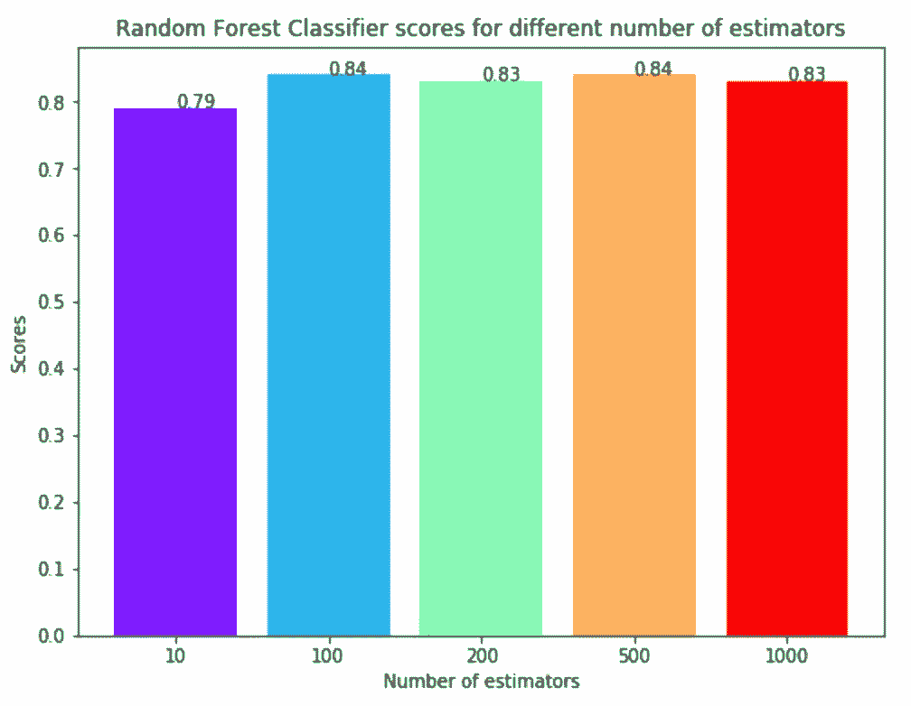

# 使用机器学习预测心脏病的存在

> 原文：<https://towardsdatascience.com/predicting-presence-of-heart-diseases-using-machine-learning-36f00f3edb2c?source=collection_archive---------0----------------------->

Photo by [rawpixel](https://unsplash.com/@rawpixel?utm_source=medium&utm_medium=referral) on [Unsplash](https://unsplash.com?utm_source=medium&utm_medium=referral)

机器学习在世界各地的许多领域都有应用。医疗保健行业也不例外。机器学习可以在预测运动障碍、心脏病等疾病的存在/不存在方面发挥重要作用。如果提前预测，这些信息可以为医生提供重要的见解，然后医生可以针对每个患者调整他们的诊断和治疗。

在这篇文章中，我将讨论一个项目，在这个项目中，我使用机器学习算法来预测人们潜在的心脏病。这些算法包括`K Neighbors Classifier`、`Support Vector Classifier`、`Decision Tree Classifier`和`Random Forest Classifier`。数据集取自 [Kaggle](https://www.kaggle.com/ronitf/heart-disease-uci) 。我的完整项目可在[心脏病预测](https://github.com/kb22/Heart-Disease-Prediction)获得。

# 导入库

我为这个项目导入了几个库:

1.  **numpy** :使用数组
2.  **pandas** :处理 csv 文件和数据帧
3.  **matplotlib** :用`pyplot`创建图表，用`rcParams`定义参数，用`cm.rainbow`着色
4.  **警告**:忽略笔记本中可能出现的所有警告，这些警告可能是由于某项功能过去/未来的折旧
5.  **train_test_split** :将数据集拆分成训练和测试数据
6.  **StandardScaler** :对所有特征进行缩放，使机器学习模型更好地适应数据集

接下来，我导入了所有必要的机器学习算法。

# 导入数据集

从 Kaggle 下载数据集后，我将它保存到我的工作目录中，命名为`dataset.csv`。接下来，我使用`read_csv()`读取数据集并将其保存到`dataset`变量中。

在做任何分析之前，我只想看一看数据。所以，我用了`info()`的方法。

从上面的输出可以看出，总共有 13 个特性和 1 个目标变量。此外，没有丢失的值，所以我们不需要关心任何空值。接下来我用了`describe()`的方法。

dataset.describe()

该方法揭示了每个变量的范围是不同的。`age`的最大值是 77，而`chol`的最大值是 564。因此，必须对数据集执行要素缩放。

# 理解数据

## 相关矩阵

首先，让我们看看特征的相关矩阵，并尝试分析它。使用`rcParams`将图形尺寸定义为 12 x 8。然后，我用 pyplot 展示了相关矩阵。使用`xticks`和`yticks`，我将名字添加到关联矩阵中。`colorbar()`显示矩阵的颜色条。

Correlation Matrix

很容易看出，没有一个单一的特征与我们的目标值有非常高的相关性。此外，一些特征与目标值负相关，一些特征与目标值正相关。

## 柱状图

这种类型的图最好的部分是，它只需要一个命令来绘制图，并提供如此多的信息作为回报。用`dataset.hist()`就行了。

dataset.hist()

我们来看看剧情。它显示了每个要素和标注在不同范围内的分布情况，这进一步证实了缩放的必要性。接下来，无论你在哪里看到离散的条，它基本上意味着这些实际上是一个分类变量。在应用机器学习之前，我们需要处理这些分类变量。我们的目标标签有两类，0 表示无疾病，1 表示有疾病。

## 目标类的条形图

我们正在处理的数据集应该大致平衡，这一点非常重要。一个极度不平衡的数据集会使整个模型训练变得无用，因此是没有用的。我们用一个例子来理解一下。

> 假设我们有一个 100 人的数据集，其中有 99 名非患者和 1 名患者。甚至不需要训练和学习任何东西，该模型总是可以说任何新人都将是非患者，并且准确率为 99%。然而，由于我们更感兴趣的是识别患者，我们需要平衡的数据集，以便我们的模型实际学习。

对于 x 轴，我使用了来自`target`列的`unique()`值，然后使用`xticks`设置它们的名称。对于 y 轴，我使用`value_count()`来获取每个类的值。我把条形涂成绿色和红色。

从图中，我们可以看到，类几乎是平衡的，我们很好地进行数据处理。

# 数据处理

为了处理分类变量，我们应该将每个分类列分成包含 1 和 0 的伪列。

假设我们有一个列`Gender`，值 1 表示男性，值 0 表示女性。它需要被转换成两列，其中值 1 表示该列为真，值 0 表示该列为假。看看下面的要点。

为了做到这一点，我们使用熊猫的`get_dummies()`方法。接下来，我们需要缩放数据集，我们将使用 StandardScaler。缩放器的`fit_transform()`方法缩放数据，我们更新列。

数据集现在准备好了。我们可以从训练我们的模型开始。

# 机器学习

在这个项目中，我采用了 4 种算法，改变了它们的各种参数，并比较了最终的模型。我将数据集分为`67% training data`和`33% testing data`。

## k 近邻分类器

该分类器寻找给定数据点的 K 个最近邻的类别，并且基于多数类别，它将类别分配给该数据点。然而，邻居的数量可以变化。我让他们从 1 到 20 个邻居变来变去，计算每种情况下的测试分数。

然后，我绘制了邻居数量和每种情况下的测试分数的线图。

> 如您所见，当邻居数量选择为 8 时，我们获得了 87%的最高分数。

## 支持向量分类器

该分类器旨在通过调整数据点和超平面之间的距离来形成一个能够尽可能多地分离类别的超平面。基于几个`kernels`来决定超平面。我试了四个内核，分别是，*线性*， *poly* ， *rbf* ，和 *sigmoid* 。

一旦我得到了每个人的分数，我就使用`rainbow`方法为每个条选择不同的颜色，并绘制出每个人所获得分数的条形图。

> 从上面的图中可以看出，`linear`内核在这个数据集上表现最好，获得了 83%的分数。

## 决策树分类器

该分类器创建一个决策树，并基于该决策树将类值分配给每个数据点。在这里，我们可以改变创建模型时要考虑的最大特征数。我将特征的范围从 1 到 30(添加虚拟列后数据集中的全部特征)。

一旦我们有了分数，我们就可以绘制一个线图，看看特征的数量对模型分数的影响。

> 从上面的线形图中，我们可以清楚地看到，最高得分为 79%，并且是在最大特征被选择为 2、4 或 18 的情况下实现的。

## 随机森林分类器

这个分类器将决策树的概念带到了下一个层次。它创建了一个树的森林，其中每棵树都是由从所有要素中随机选择的要素组成的。在这里，我们可以改变用于预测类别的树的数量。我计算了 10、100、200、500 和 1000 棵树的测试分数。

接下来，我将这些分数绘制在一个条形图上，看看哪个给出了最好的结果。您可能会注意到，我没有直接将 X 值设置为数组`[10, 100, 200, 500, 1000]`。它将显示从 10 到 1000 的连续图，这将是不可能破译的。所以，为了解决这个问题，我首先使用 X 值作为`[1, 2, 3, 4, 5]`。然后，我用`xticks`给它们重新命名。

> 看一下条形图，我们可以看到 100 和 500 棵树都达到了 84%的最高分数。

# 结论

该项目涉及通过适当的数据处理对心脏病患者数据集进行分析。然后，对 4 个模型进行训练和测试，最高得分如下:

1.  k 近邻分类器:87%
2.  支持向量分类器:83%
3.  决策树分类器:79%
4.  随机森林分类器:84%

## k 个邻居分类器在 8 个邻居的情况下取得了 87%的最好成绩。

感谢您的阅读！请随意分享你的想法和主意。