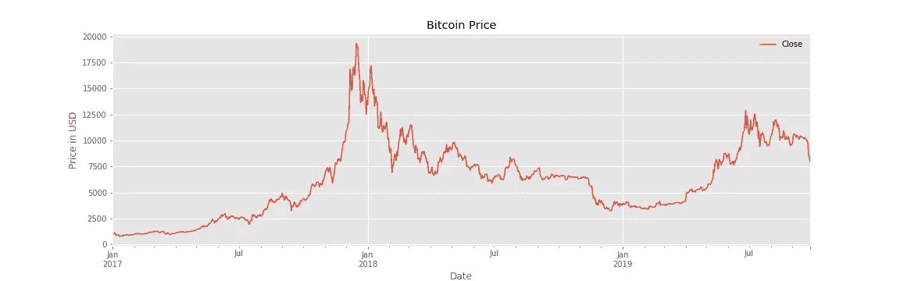
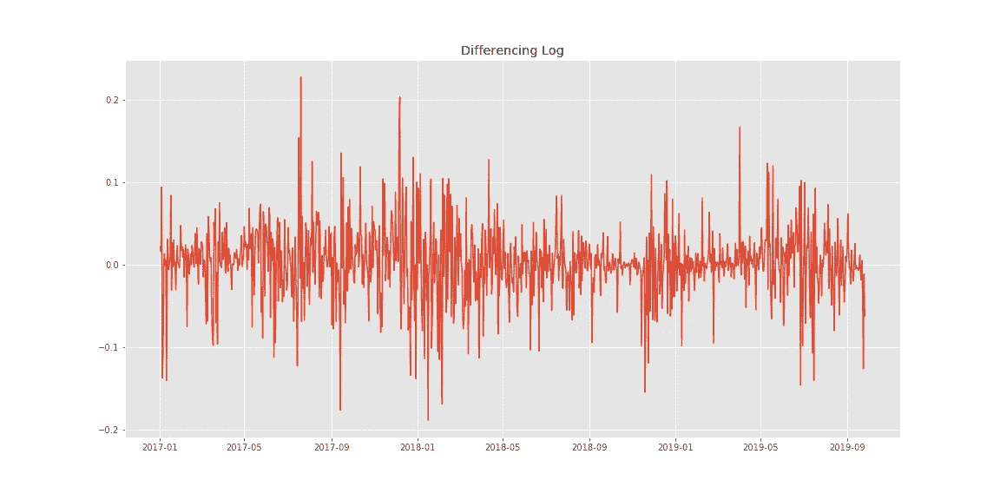
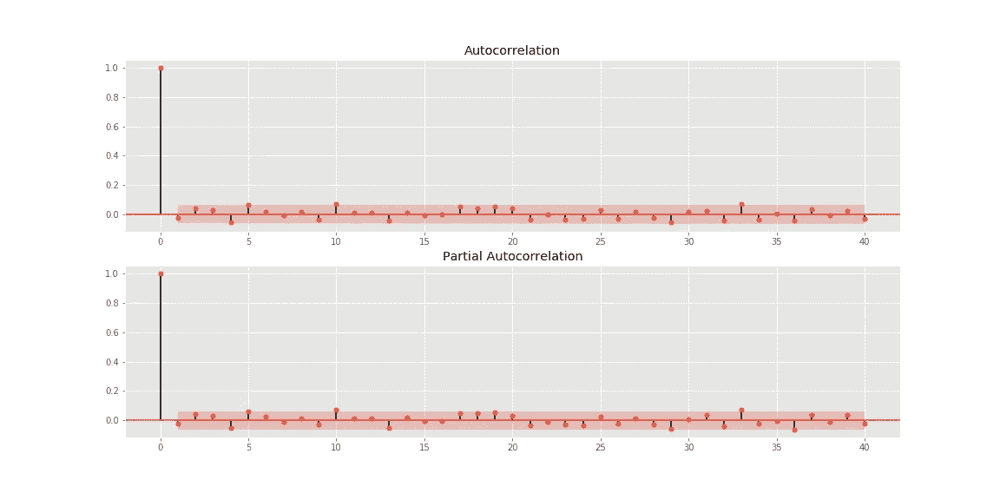
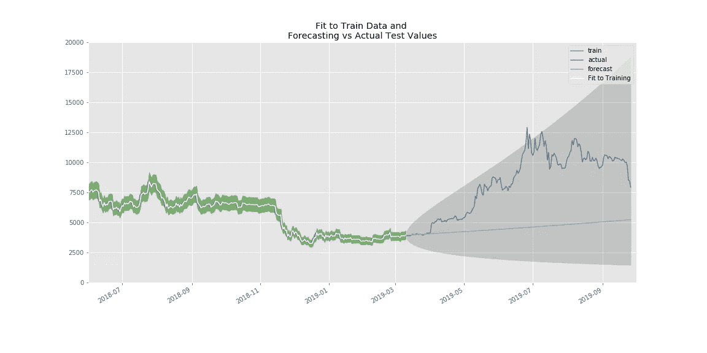
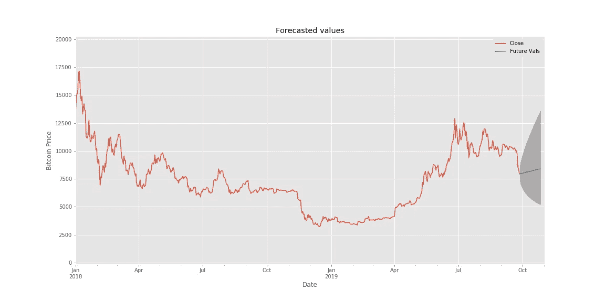
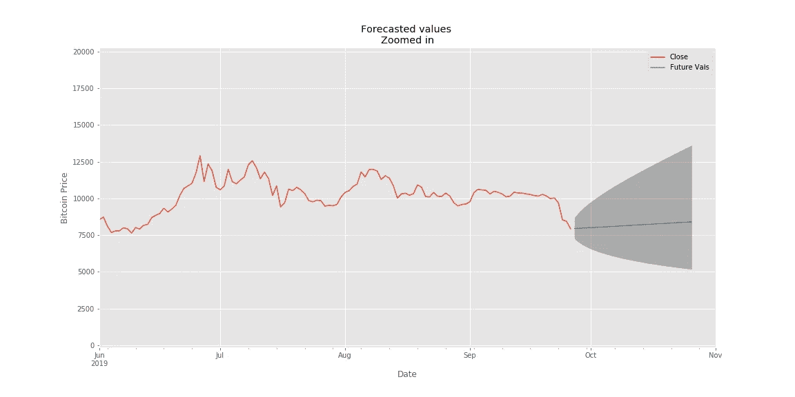
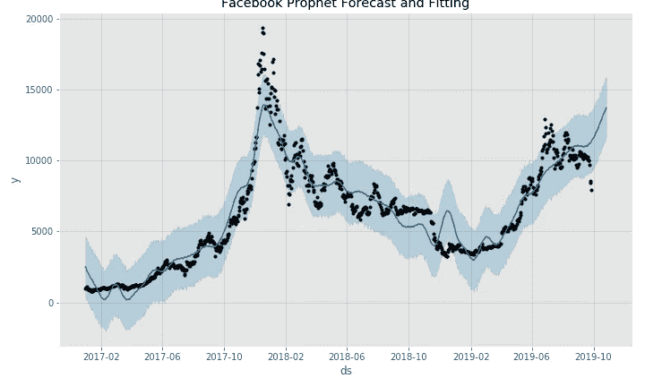
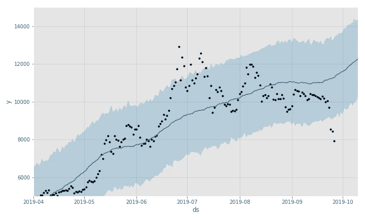

# 我试图用机器学习来预测比特币的价格

> 原文：<https://towardsdatascience.com/predicting-prices-of-bitcoin-with-machine-learning-3e83bb4dd35f?source=collection_archive---------4----------------------->

## 使用时间序列模型预测加密货币价格

Photo by [André François McKenzie](https://unsplash.com/@silverhousehd?utm_source=medium&utm_medium=referral) on [Unsplash](https://unsplash.com?utm_source=medium&utm_medium=referral)

*更新:点击下方查看下一篇描述用深度学习预测比特币价格过程的文章*

 [## 我尝试了深度学习模型来预测比特币价格

### 利用神经网络预测加密货币价格

towardsdatascience.com](/predicting-bitcoin-prices-with-deep-learning-438bc3cf9a6f) 

预测未来不是一件容易的事。许多人尝试过，许多人失败了。但是我们中的许多人都想知道接下来会发生什么，并竭尽全力去弄清楚。想象一下知道未来会发生什么的可能性！想象一下，回到 2012 年，当比特币不到 15 美元，知道它将超过 18000 美元时，你会怎么做！许多人可能会后悔当时没有购买比特币，但他们一开始怎么会知道呢？这是我们现在在加密货币方面面临的困境。我们不想错过下一次价格上涨，但我们不知道这何时会发生或不会发生。那么，我们怎样才能潜在地解决这个困境呢？也许机器学习可以告诉我们答案。

机器学习模型可能会给我们提供了解加密货币未来所需的洞察力。它不会告诉我们未来，但它可能会告诉我们价格移动的一般趋势和方向。让我们尝试使用这些机器学习模型，并通过用 Python 编码来预测比特币的未来！

> [在这里注册一个中级会员，可以无限制地访问和支持像我这样的内容！在你的支持下，我赚了一小部分会费。谢谢！](https://marco-santos.medium.com/membership)

# 建模时间序列

我们要实现的机器学习模型叫做 [**时间序列**](https://en.wikipedia.org/wiki/Time_series) [**模型**](https://en.wikipedia.org/wiki/Time_series#Models) 。这些模型将研究过去，寻找预测未来的模式和趋势。如果没有这些模型，我们将不得不自己做所有这些分析，这将花费太多的时间。幸运的是，我们可以用 Python 编写这些时间序列模型来为我们做所有的工作，这就是我们今天要做的！

我们今天要用的时间序列模型有: [**萨里玛**](https://en.wikipedia.org/wiki/Autoregressive_integrated_moving_average) 和一个由 [**脸书先知**](https://facebook.github.io/prophet/) 实现的加法模型。萨里玛或 ARIMA 是一个相对基本的时间序列模型，我们将在必要时对其进行编码和解释。脸书 Prophet 使用一种快速可调的加法模型来预测时间序列数据。建模后，我们将比较每个模型对比特币未来的独特见解。

## 对 SARIMA 建模的步骤如下:

1.  收集、探索和可视化数据。
2.  对数据求差并检查平稳性。
3.  绘制差异数据的 ACF 和 PACF。
4.  通过搜索最佳参数开始建模。
5.  用优化的参数训练和测试模型。
6.  预测未来！

*这些描述非常简单明了，但我们很快会更详细地介绍每个步骤。以下代码片段摘自文末分享的 Github。*

## 比特币价格数据

我们要做的第一件事是检索比特币的历史数据，这些数据可以从[雅虎财经](https://finance.yahoo.com/quote/BTC-USD/history?p=BTC-USD)下载为一个方便的 CSV 文件。一旦我们有了这些，我们就可以开始将 CSV 文件格式化为一个**熊猫数据帧**。然后，我们使用相同的数据帧进行其余的绘图和计算。

另一种选择是使用财务数据 API，如 [**EOD 历史数据**](https://eodhistoricaldata.com/?ref=31CX3ILN&utm_source=medium&utm_medium=post&utm_campaign=i_tried_to_predict_bitcoin_s_prices_with_machine_learning) 。注册是免费的，你可以获得大量的金融数据。*披露:我通过上面的链接从任何购买中赚取一小笔佣金。*

Formatting/Organizing the Dataset

接下来，我们绘制数据图表，看看过去两年比特币的价格走势。选择过去两年是因为比特币和加密货币总体上变得非常受欢迎，并且更好地代表了当前的市场趋势。

## 平稳性

让我们通过使数据*静止*来为建模准备数据。我们通过简单地对数据进行差分并使用所谓的 [**迪基-富勒测试**](https://en.wikipedia.org/wiki/Dickey%E2%80%93Fuller_test) 来测试平稳性。我们的目标是使 [P 值](https://en.wikipedia.org/wiki/P-value)小于临界值 5%,或者只是尽可能接近零。对于更低的 P 值，我们取价格的对数，然后求对数的差，而不仅仅是求价格的差。

This gives a P-Value of 5.879487529183016e-25

你可能想知道为什么我们关心平稳性。简而言之，平稳性从数据集中移除趋势，这可能会极大地干扰我们的模型。基本上，平稳性使我们的模型表现和预测更好。

Our stationary differenced log of BTC.

## ACF 和 PACF

接下来，我们必须绘制出**自相关函数(ACF)** 和部分**自相关函数(PACF)** 。由于我们处理的是每日数据，ACF 向我们展示了过去的哪一天与当前日期的相关性最大。PACF 通过忽略中间的日子，向我们展示了过去的哪一天与今天直接相关。

The ACF and PACF for the Log of BTC

# 萨里玛造型

通过了解 PACF 和 ACF，我们现在可以更好地理解我们的数据集和可能选择的参数。现在，我们可以继续使用 SARIMA 模型来建模我们的数据。

## 优化参数

为了获得模型的最佳性能，我们必须找到最佳参数。我们通过尝试许多不同的参数组合并选择具有相对最低的 [**AIC 分数**](https://en.wikipedia.org/wiki/Akaike_information_criterion) 的组合来实现这一点。别担心，我们已经写了一个函数来完成这个任务。

According to this function, our best parameters are (1,0,0) for pdq and (0,0,0,0) for pdqs

根据您的电脑，寻找最佳参数的过程可能需要一段时间。对于像我们这样的人来说，我们将不得不满足于受计算机规格限制的最佳参数。不幸的是，并不是所有的计算机都是一样的，有些型号会根据运行它们的计算机而表现得更好。

## 装配和培训

现在我们有了参数，让我们继续训练并使模型适合比特币的价格。

为了进一步测试该模型的性能，我们可以通过绘制它们来看看它的预测与我们已经知道的值是如何一致的。

模型测试还可以，因为实际值仍然在我们的置信区间内(灰色阴影部分),价格也如预测的那样上涨。其余的训练数据似乎很好地符合我们的区间(绿色阴影)，并与模型的预测值一致。

## 预测未来价格

现在我们可以进入我们真正想知道的部分了——预测比特币的未来价格！我们通过对今天的预测来做到这一点，并观察它在未来可能的走向。

General forecast of BTC

> 我们可能需要仔细看看。。。

根据该模型，比特币似乎将在未来一个月继续小幅上涨。但是，不要把这当成事实。阴影区域向我们展示了比特币价格在未来一个月的潜在走向，但它也碰巧显示了比特币可能会下跌。虽然，模型似乎在向价格上升而不是下降倾斜。

萨里玛的预测不应该是唯一需要考虑的预测。还有其他时间序列模型和程序需要考虑，其中一个实际上是由脸书的数据科学团队创建的！

# 脸书先知

使用脸书先知将比使用萨里玛建模相对容易。这是由于 FB Prophet 的简单易用。你将会看到与萨里玛相比，这要容易得多。

## 使用脸书先知的步骤是:

1.  为 Prophet 格式化数据。
2.  根据数据拟合和训练模型。
3.  创建要预测的未来日期。
4.  预测和想象未来！

下面是对脸书先知使用上述步骤的代码:

## 脸书先知崩溃

在第一步中，我们通过为日期和价格创建两列来格式化之前的数据。然后，我们可以通过拟合和训练数据直接进入建模！无需调整参数或检查稳定性！

建模之后，我们现在可以前进到预测未来，首先创建我们希望 Prophet 为我们预测价格的未来日期。我们还可以绘制这些日期，这也将向我们展示模型如何与过去的价值相比较，以及价格接下来可能会走向哪里。

> 放大以近距离观察未来预测。。。

FB Prophet zoomed in

*   蓝线=预测值
*   黑点=观察值(实际值)
*   蓝色阴影区域=不确定性区间

据 FB Prophet 报道，比特币将在未来一个月内上涨。但还是那句话，这不是事实。相比萨里玛，FB Prophet 有更清晰的预测和方向。FB Prophet 有更多的特性和参数可以实验，但是我们在这里没有一一介绍。如果你觉得你需要改变模型，然后点击[这里](https://facebook.github.io/prophet/docs/quick_start.html)FB Prophet 的文件。

# 结束语

现在我们对比特币的未来有了两种预测，请随意对两者做出自己独特的观察，以确定比特币的未来。除了 SARIMA 和 FB Prophet，还有更多时间序列模型可以学习和实验。不要觉得仅限于这两个！我们刚刚做了时间序列、建模和机器学习的简要概述。还有更多的话题可以覆盖和研究！

预测比特币的未来几乎是不可能的，但通过机器学习，我们可以高度自信地理解它可能会走向何方。我们不建议使用这些机器学习模型来做出所有的投资决策，但很高兴看到比特币和加密货币的未来可能会发生什么！

> [**不是中等会员？点击这里支持他们和我！**](https://medium.com/@marco_santos/membership)

## 资源:

 [## 马克桑 93/BTC-预报员

### 此时您不能执行该操作。您已使用另一个标签页或窗口登录。您已在另一个选项卡中注销，或者…

github.com](https://github.com/marcosan93/BTC-Forecaster)  [## 我尝试了深度学习模型来预测比特币价格

towardsdatascience.com](/predicting-bitcoin-prices-with-deep-learning-438bc3cf9a6f) 

***来自《走向数据科学》编辑的提示:*** *虽然我们允许独立作者根据我们的* [*规则和指导方针*](/questions-96667b06af5) *发表文章，但我们并不认可每个作者的贡献。你不应该在没有寻求专业建议的情况下依赖一个作者的作品。详见我们的* [*读者术语*](/readers-terms-b5d780a700a4) *。*