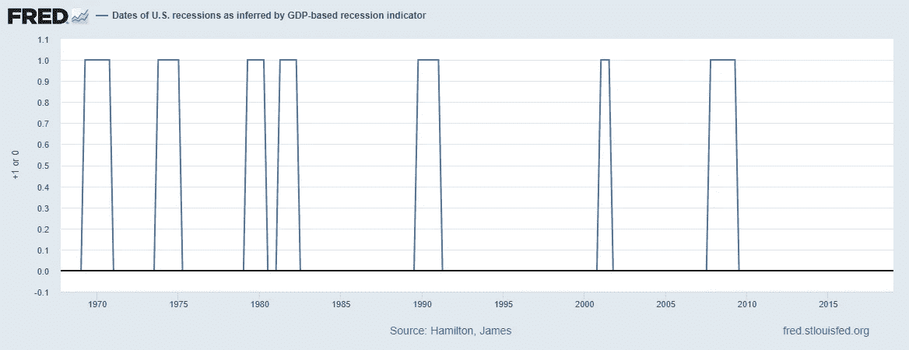
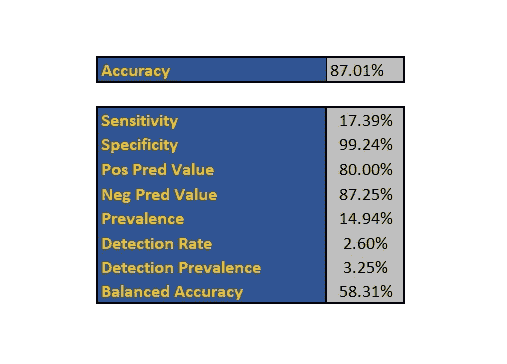

# 用机器学习预测衰退

> 原文：<https://towardsdatascience.com/predicting-recessions-with-machine-learning-5b3d89907b8b?source=collection_archive---------15----------------------->

## 收益率曲线反转真正告诉我们什么

Photo by [Verne Ho](https://unsplash.com/@verneho?utm_source=medium&utm_medium=referral) on [Unsplash](https://unsplash.com?utm_source=medium&utm_medium=referral)

> “这是最好的时代，这是最坏的时代，这是智慧的时代，这是愚蠢的时代，这是信仰的时代，这是怀疑的时代，”

这是一部经典文学作品的开场白，它在两个半世纪前的今天同样适用。在《双城记》中，查尔斯·狄更斯描述了法国大革命时期字面意义和隐喻意义的对立。虽然没有那么极端，但我们可以从它的段落中找到与当前环境的相似之处；当我们看到股市飙升至历史高点，收益率跌至历史低点时，全球经济的经济基本面仍然受到顽固的抑制。

众所周知，为了应对大衰退(GFC ),世界各地的中央银行同步向市场提供流动性，希望重新点燃增长和通胀。然而，这几乎是真正的狄更斯式的风格，对刺激工资增长和消费几乎没有什么作用。相反，较低的利率只会将资产推高到前所未有的估值水平，这对资产所有者非常有利，但却让普通人懊恼不已。简言之，富人变得更富了。

经济和定价的潜在驱动因素之间的这种错位，揭示了一种深刻而反常的动态绑定货币政策和市场预期。市场已经开始预期央行会继续放松货币政策，事实上，即使是**也需要**放松货币政策，以保持同样的上升势头。任何挑战这一共识的信息都引起了强烈的负面膝跳反应。值得注意的是，两周前，美联储十年来首次降息，这在理论上正是保持积极表现所需要的，但是降息的幅度(小于最初的预期)和鲍威尔主席的会后评论不利于持续的资产通胀叙事。因此，冒险行为会受到惩罚。

更近的是发生了**收益率曲线反转**现象。在过去 7 次美国经济衰退之前，两年期和十年期美国国债收益率之间被广泛关注的利差已被视为负值，导致许多市场评论员和从业者密切关注这一数据点作为领先指标。许多人已经注意到，经济逆转和衰退之间的历史时滞可能从几个月到近两年不等。作为注重数据的观察者，这为我们的调查奠定了完美的基础；鉴于市场对这一指标的持续和不相称的关注， ***我们可以通过仅使用 10 年期和 2 年期美国国债之间的利差来实现机器学习以预测美国经济衰退吗？***

# 设置

Photo by [Todd Quackenbush](https://unsplash.com/@toddquackenbush?utm_source=medium&utm_medium=referral) on [Unsplash](https://unsplash.com?utm_source=medium&utm_medium=referral)

技术性衰退被定义为连续两个**季度**的负增长(GDP)，因此我们可以从圣路易斯联邦研究经济数据库 [**这里**](https://fred.stlouisfed.org/series/JHDUSRGDPBR) **获得符合这一描述的日期。**该时间序列采用二进制形式，1 表示衰退期，0 表示衰退期。

**Source: St Louis Fed, Hamilton, James**

接下来我们从同一个数据库 [**这里**](https://fred.stlouisfed.org/series/T10Y2YM) **获取收益率曲线利差数据。**计算方法为月末 10 年期国债收益率减去 2 年期国债收益率。

**Source: St Louis Fed**

我们选择的机器学习工具是 [**逻辑回归**](https://en.wikipedia.org/wiki/Logistic_regression) ，这是经济学家和数据科学家都喜欢的工具。我们使用这种特殊算法有三个原因:

1.  该模型相对简单且易于理解，
2.  该分析相对简单且本质上是单变量的，
3.  市场修辞暗示了曲线反转和衰退之间的线性决策边界。

由于美国 GDP 数据的季度报告频率，需要进行两项调整:

1.  我们将衰退数据集从季度数据集扩展到月度数据集，方法是隐含假设衰退季度内所有月份的增长都是负的。
2.  我们将收益率曲线利差数据后移四分之一，这是必要的，因为我们对 2y 和 10y 利差的预测能力感兴趣，在其原始形式中，两个数据点**同时出现。**使用一个数据点来预测同时可用的另一个数据点是一项毫无意义的任务。

# **结果**

借助广义线性模型(glm)函数和 R 中的 Caret 包，我们将时间序列分成 70%的训练集和 30%的测试集。我们在训练集上拟合了 logit 模型，并根据测试进行了验证，结果如下:

**Evaluation Metrics**

预测精度简直太棒了！ **87%** ！收益率曲线反转肯定是衰退的一个很好的预测指标！但是，等等，这里有些不对劲，让我们仔细看看评估指标。虽然准确率很高，但流行率、灵敏度和检出率都低得惊人。对混淆矩阵的检查可以提供一些额外的见解。

**Confusion Matrix**

我们可以立即看到，该模型**非常擅长预测真正的否定(130 个正确预测)**，坦率地说，其他方面并不多。这说明了这个特定数据集的一个重要问题。虽然有数百个非逆转/非衰退的例子，但逆转/衰退的例子要少得多。这实际上是一个非常不平衡的数据集，如果我们预测测试集中的每一个实例都是非衰退的，我们仍然可以得到 85%的准确率。如果我们在评估指标中查看平衡的准确率(调整了不平衡),我们会发现该模型比掷硬币好不了多少(58%)。这似乎与评论和新闻会让我们相信的相矛盾，那么，收益率曲线反转到底告诉了我们什么？

# **结论**

虽然收益率曲线的期限结构中有关于经济增长前景的信息，这得到了大量学术文献和理论的支持(见 FRB 文章 [**此处**](https://www.frbsf.org/education/publications/doctor-econ/2004/july/yield-curve/) 和 **Ang，Piazzesi and Wei，2003** )，但我们不应通过孤立地查看一个数据点来设计错误的精确度。经济作为一系列不断相互作用的运动部分而存在，因此需要被视为一个整体。与未来前景同样相关的是通胀机制和货币政策方向。仅使用曲线反转作为衰退的预测指标，是一个精选数据来拟合预先构建的描述的典型例子。这种类型的行为偏见并非没有先例，诺贝尔奖获得者丹尼尔·卡内曼和阿莫斯·特沃斯基推测，当面临不确定性时，人类会求助于启发法/经验法则来帮助我们做出决定。虽然我们都只是人类，但我们仍然有独特的能力使用机器学习等定量工具来客观验证未经证实的说法，如果有机会，我们应该行使这一权利。虽然没有提供代码，但如果有兴趣的话，我很乐意在另一篇文章中用 R 代码完整地讨论这种方法。

# **参考文献**

安，皮亚泽西，米和魏，米(2003)。关于 GDP 增长，收益率曲线告诉了我们什么？。 *SSRN 电子杂志*。

**免责声明**:本帖纯属个人观点和看法的表达。它不代表任何建议，也不反映我的雇主的观点。