# 使用 Fastai 预测房地产图像中的丰富属性

> 原文：<https://towardsdatascience.com/predicting-rich-attributes-in-real-estate-images-using-fastai-6d9ab248f359?source=collection_archive---------12----------------------->

## 大卫·塞缪尔和纳文·库马尔

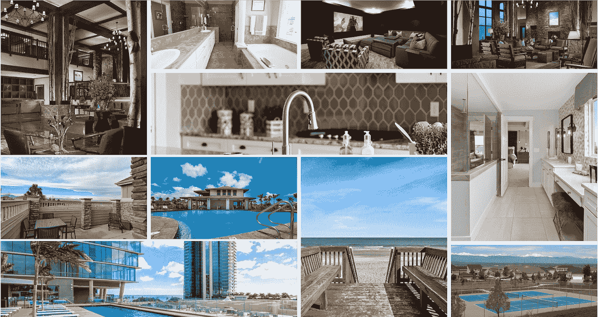

# 概观

视觉属性搜索可以极大的提升用户体验，针对家居房源和旅游网站的 SEO。尽管 Zillow、Redfin、Airbnb 和猫途鹰已经有了一些关于房产设施的元数据，但他们可以通过用视觉模型分析房产图像来扩展可搜索的属性。

在本帖中，我们分享了我们对预测房产属性(如景观、厨房岛、游泳池、高天花板、硬木地板、壁炉等)的几个镜头模型的初步方法。由于这些属性通常依赖于房间和环境，我们从一个精确的分类模型开始，将我们的图像分组到酒店的内部和外部设置中。

在训练我们最初的房间类型模型的过程中，我们注意到这些丰富的属性中的一些很容易在 [platform.ai](http://platform.ai) 中分离。

# 背景

以前的工作集中在使用图像来改善价格估计[1],但是将图像特征添加到定价模型的增量收益很小；与使用一些传统属性(如位置和物业大小)相比，性能提高了 2.3%。虽然构建这些模型的价格数据已经很容易获得，但预测丰富属性(如景观、厨房岛、游泳池、高天花板、硬木地板、壁炉等)的数据集却很稀缺。

我们的初始数据集，以前用于价格估算[1]，由 146，791 张图片和七个类别组成:客厅、餐厅、卧室、浴室、厨房、室内和室外。

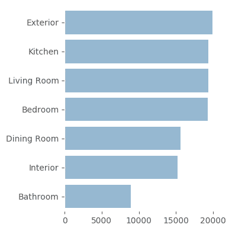

Fig 1\. Class count of real estate images

浴室是最缺乏代表性的一个类别，其图片数量比任何其他类别都少近一半。我们使用 [fastai 的](http://fast.ai) vision.transform 方法【4】解决了这种类别不平衡，使用默认图像增强对数据进行过采样。

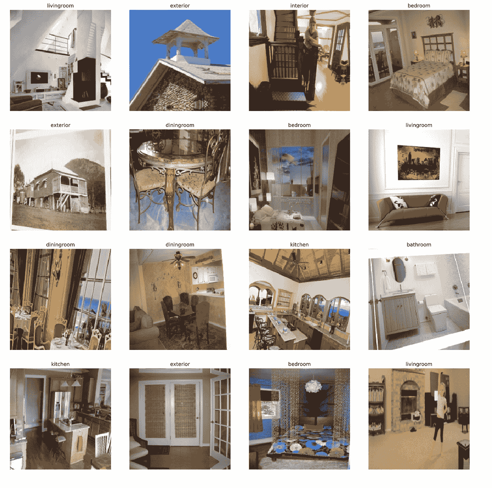

Fig 2\. Example image augmentation of the classes: bathroom, dining room, kitchen, living room, bedroom, interior, and exterior.

这些图像是使用 fast.ai 的内置变换进行预处理的。数据被随机分成 60%训练、20%验证和 20%测试。

该模型用 ImageNet-ResNet34 权重初始化。网络的定制头被训练 3 个时期，随后解冻整个网络，并使用区别性学习速率微调另外 10 个时期。微调提高了模型拟合度，实现了 97%的总体测试集精度。

通过将网络容量增加到 ResNet50，实现了 98%的最终准确性——比之前结果的 91%准确性有了显著提高[1]。

## 构建丰富的属性数据集

我们通过抓取房产列表网站构建了一个丰富的属性数据集。爬行器捕获了图像和感兴趣的属性。总共获得了 18，790 个列表和 350，000 张图片。

# 要素类分布

我们的 web scraper 捕获了非结构化的 html，并提取了清单的 details 表中包含的丰富属性。

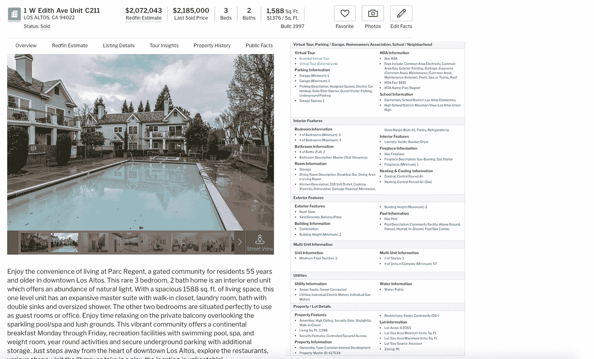

Fig 3\. Example scraped listing text metadata

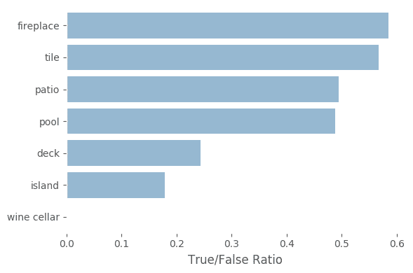

Figure 4\. Feature class distribution from crawled data

最终的数据集由 18，790 个单独的列表组成，每个列表平均包含 21 张图片。我们已经确定了照片中可见的几个特征，如水池、天井、厨房岛和壁炉。在我们的数据集中，近一半的房源有游泳池或露台，只有大约 25 个房源有酒窖。此外，可以在不同的空间中看到属性的外观；现代酒窖倾向于在地面上。

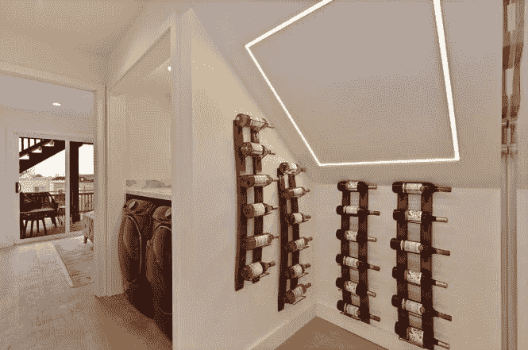

Fig 5a. Example feature from listings dataset: wine cellar

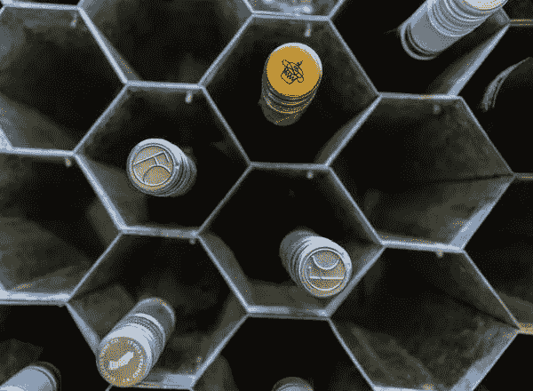

Fig 5b. Example feature from listings dataset: wine cellar

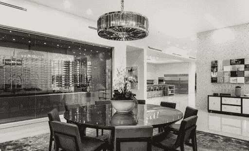

Fig 5c. Example feature from listings dataset: wine cellar

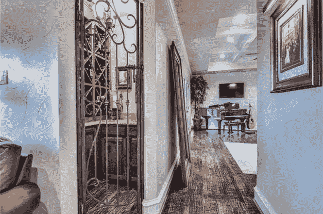

Fig 5d. Example feature from listings dataset: wine cellar

# 预测

我们将我们的模型和来自我们数据集的 20，000 张图像的样本上传到 [platform.ai](http://platform.ai) ，以便将其性能与预先构建的 ImageNet 模型进行比较。我们的模型形成了整齐的集群，很容易用眼睛分开，具有相似的兴趣属性，如壁炉、水池和厨房岛。相比之下，ImageNet 倾向于形成具有不同属性的更宽的集群。

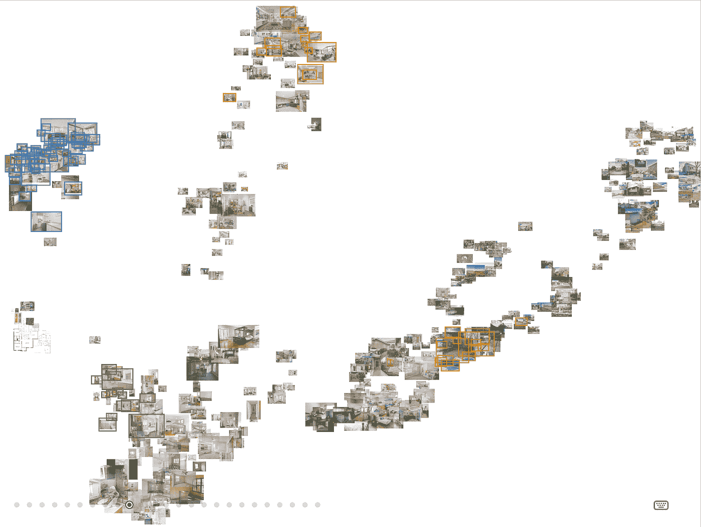

Fig 6\. Pictured: Our Model’s Projection

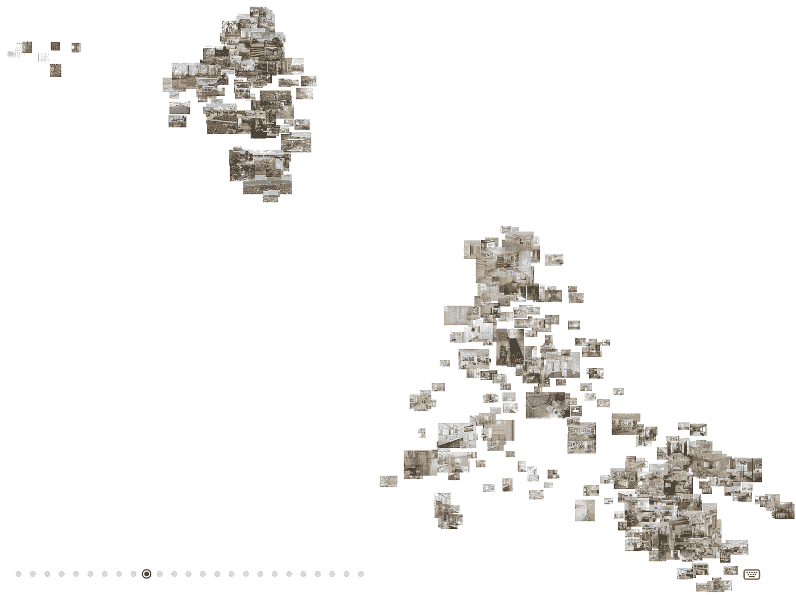

Fig 7\. Pictured: ImageNet Projection

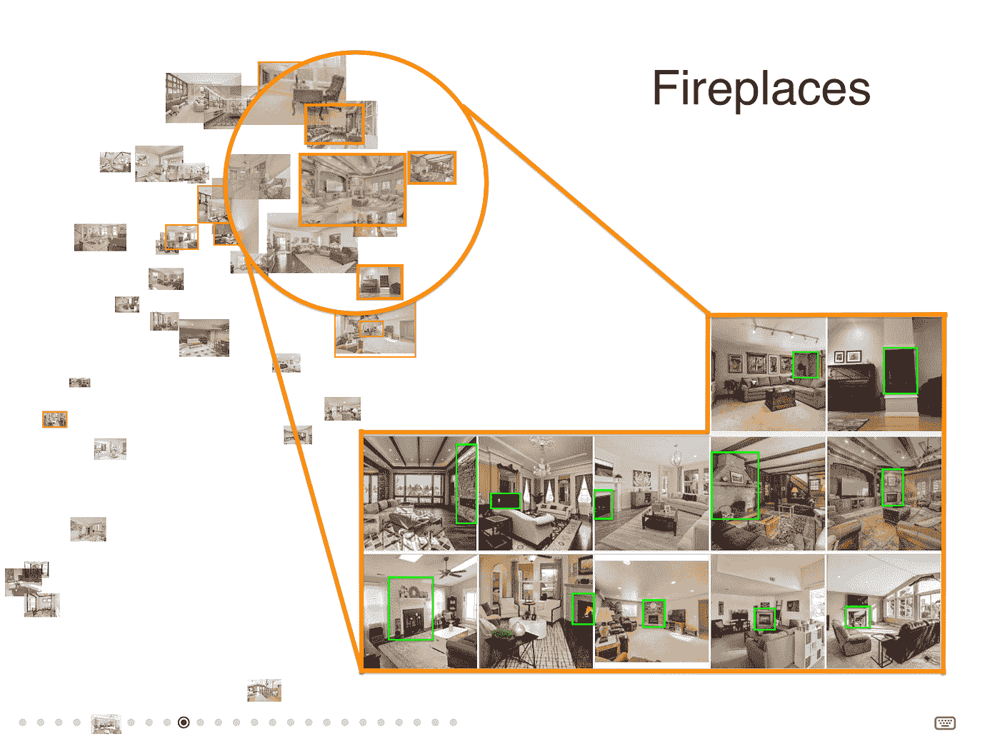

Fig 8\. Zoomed in projections show a fireplace cluster.

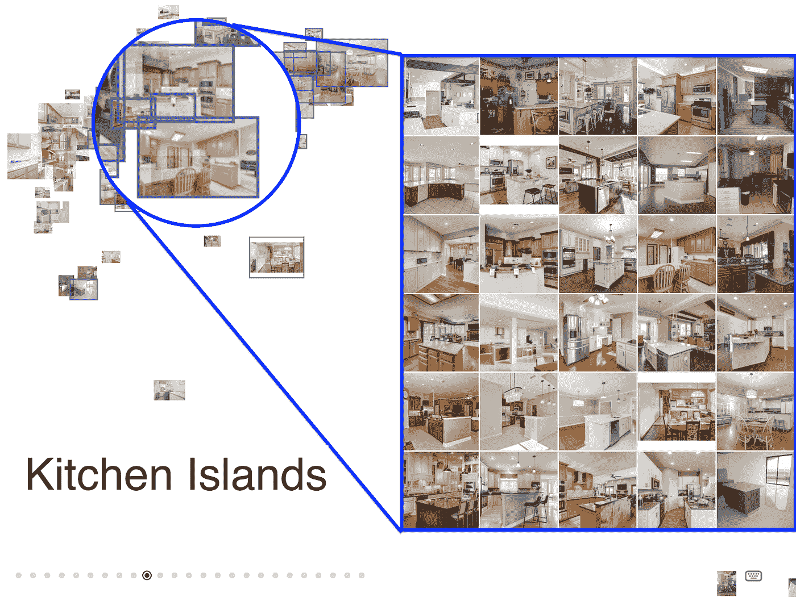

Fig 9\. Zoomed in projections show a kitchen islands cluster.

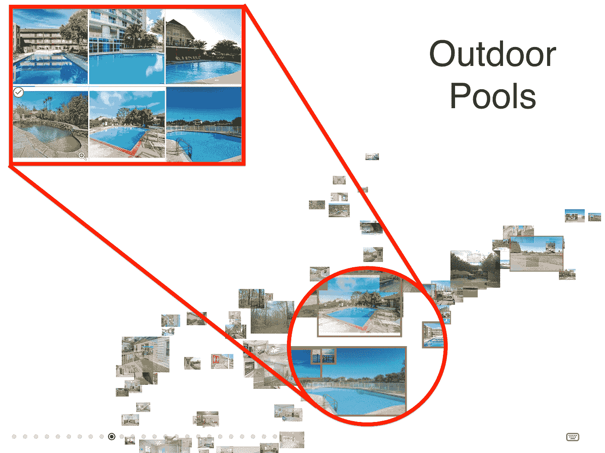

Fig 10\. Zoomed in Projections, and selected images from our model show an outdoor swimming pool cluster.

使用投影作为视觉辅助，感兴趣的集群被突出显示，并使用 platform.ai 选择性地过滤。我们的模型投影的放大视图显示了我们通过模型识别的三个丰富的特征:壁炉、厨房岛和游泳池。与 ImageNet 相比，我们可以看到更多与丰富属性紧密相关的群集，而不是标记的房间类别功能。

# 聚类分析

下载我们的投影后，我们能够评估一个聚类解决方案，将我们的模型的轮廓分数与 ImageNet 进行比较。结果表明，我们的侧影得分明显大于 ImageNet 在 K = 5k-均值聚类侧影得分上的 t-检验结果。因此，我们的模型比 ImageNet-ResNet 更一致地产生相似的聚类。

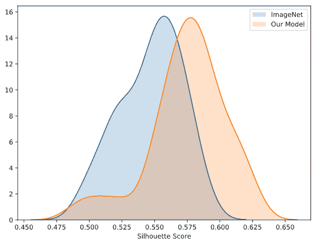

Fig 9\. Similarity “Silhouette” scores for k=5 K-Means clusters.

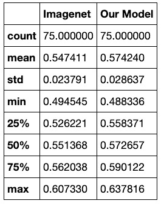

Table I. Silhouette Score summary statistics

# 结论

应用现代机器学习实践，我们开发了一个计算机视觉模型，它不仅可以预测房间类别，还可以预测我们居住的房屋的深层属性。通过将我们的嵌套属性更紧密地聚集在一起，它比 ImageNet 表现得更好，允许视觉上可分离的组被提取和标记。开发一个精确的属性搜索模型可以作为一个重要的搜索工具来找到合适的房屋或出租。

我们计划进一步开发我们的模型，使用来自我们数据集的有限标记数据和关系网络(RN) [2]来分类图像中的多个属性。

## 承认

我们要感谢 Arshak Navruzyan 在这个项目中给予的支持和指导。我们还要感谢 fastai 团队提供了一个方便的深度学习库。

## 参考

1.  Poursaeed，Omid 等[基于视觉的房地产价格估算](https://omidpoursaeed.github.io/publication/vision-based-real-estate-price-estimation/)。机器视觉与应用 29(2018):667–676。
2.  桑托罗、亚当等人[一个用于关系推理的简单神经网络模块](https://arxiv.org/abs/1706.01427)。NIPS (2017 年)。
3.  何，等.【深度残差学习用于图像识别】。2016 年 IEEE 计算机视觉和模式识别大会(CVPR)(2016):770–778。
4.  霍华德、杰瑞米等人[法斯泰](https://docs.fast.ai/)图书馆。2019.
5.  Clarke，Adrian 等人[在 fastai](https://platform.ai/blog/page/1/optimizing-hyperparams-for-image-datasets-in-fastai/) 中优化图像数据集的超参数。2019