# 预测销售额

> 原文：<https://towardsdatascience.com/predicting-sales-611cb5a252de?source=collection_archive---------0----------------------->


## [使用 Python 实现数据驱动的增长](https://towardsdatascience.com/tagged/data-driven-growth)

## 与 LSTM 一起预测月销售额

这一系列文章旨在解释如何以一种简单的方式使用 Python，通过将预测方法应用于您的所有行动来推动您公司的发展。它将是编程、数据分析和机器学习的结合。

我将在以下九篇文章中讨论所有主题:

1- [了解你的衡量标准](/data-driven-growth-with-python-part-1-know-your-metrics-812781e66a5b?source=post_page---------------------------)

2- [客户细分](/data-driven-growth-with-python-part-2-customer-segmentation-5c019d150444?source=post_page---------------------------)

3- [客户终身价值预测](/data-driven-growth-with-python-part-3-customer-lifetime-value-prediction-6017802f2e0f?source=post_page---------------------------)

4- [流失预测](/churn-prediction-3a4a36c2129a?source=post_page---------------------------)

[5-预测下一个购买日](/predicting-next-purchase-day-15fae5548027?source=post_page---------------------------)

6- **预测销售额**

[7-市场反应模型](/market-response-models-baf9f9913298)

[8-隆起建模](/uplift-modeling-e38f96b1ef60)

[9- A/B 测试设计和执行](/a-b-testing-design-execution-6cf9e27c6559)

文章将有自己的代码片段，使您可以轻松地应用它们。如果你是编程的超级新手，你可以在这里很好地介绍一下 [Python](https://www.kaggle.com/learn/python?source=post_page---------------------------) 和 [Pandas](https://www.kaggle.com/learn/pandas?source=post_page---------------------------) (一个我们将在任何事情上使用的著名库)。但是仍然没有编码介绍，您可以学习概念，如何使用您的数据并开始从中产生价值:

> 有时候你得先跑，然后才能走——托尼·斯塔克

作为先决条件，确保你的电脑上安装了 J [upyter Notebook](https://jupyter.readthedocs.io/en/latest/install.html?source=post_page---------------------------) 和 P [ython](https://www.python.org/downloads/?source=post_page---------------------------) 。代码片段只能在 Jupyter 笔记本上运行。

好吧，我们开始吧。

# 第 6 部分:预测销售额

在本节之前，我们几乎所有的预测模型都是基于客户层面的(例如，流失预测、下一个购买日等)。).缩小视野，看看更广阔的图景也是有用的。通过考虑我们在客户方面的所有努力，我们如何影响销售？

时间序列预测是机器学习的主要组成部分之一。文献中有许多方法可以实现这一点，如自回归综合移动平均(ARIMA)、季节自回归综合移动平均(SARIMA)、向量自回归(VAR)等。

在本文中，我们将重点关注长短期记忆(LSTM)方法，如果你想使用深度学习，这是一种非常流行的方法。我们将在我们的项目中使用 [Keras](https://keras.io/) 来实现 LSTM。

**最后，了解未来销售对我们的业务有什么帮助？**

首先，它是一个标杆。如果我们的战略没有任何变化，我们可以将它作为我们将要实现的业务照常水平。此外，我们可以在这个基准之上计算我们新行动的增量价值。

第二，它可以用于规划。我们可以通过查看预测来计划我们的需求和供应行动。这有助于了解在哪些方面投资更多。

最后但同样重要的是，它是一个规划预算和目标的优秀指南。

现在是时候跳入编码，建立我们的第一个深度学习模型了。我们模型的实施将有 3 个步骤:

*   数据争论
*   数据转换，使其稳定并受到监督
*   建立 LSTM 模型和评估

## 数据争论

在这个例子中，我们使用来自 Kaggle 竞赛的数据集[。它表示每个商店和商品的每日销售额。](https://www.kaggle.com/c/demand-forecasting-kernels-only)

像往常一样，我们从导入所需的库和从 CSV 导入数据开始:

我们的数据如下所示:

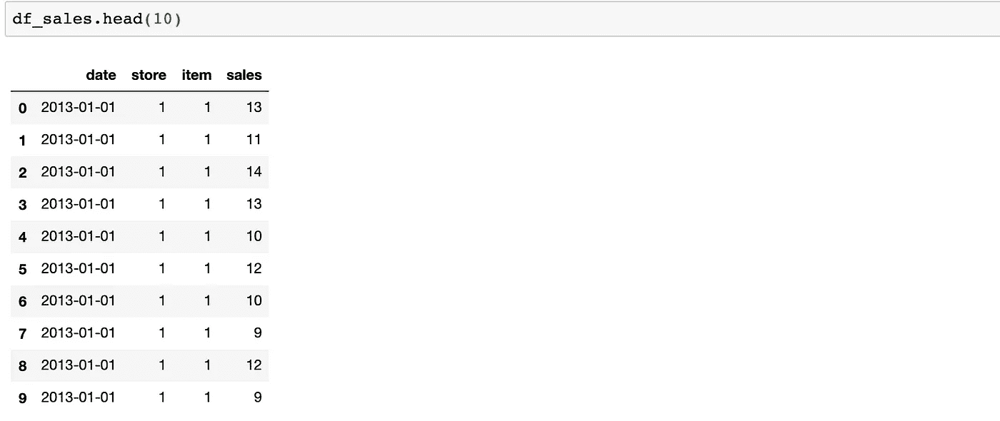

我们的任务是预测每月的总销售额。我们需要按月汇总我们的数据，并对*销售*列求和。

```
#represent month in date field as its first day
df_sales['date'] = df_sales['date'].dt.year.astype('str') + '-' + df_sales['date'].dt.month.astype('str') + '-01'
df_sales['date'] = pd.to_datetime(df_sales['date'])#groupby date and sum the sales
df_sales = df_sales.groupby('date').sales.sum().reset_index()
```

应用上面的代码后， **df_sales** 现在显示了我们需要的总销售额:

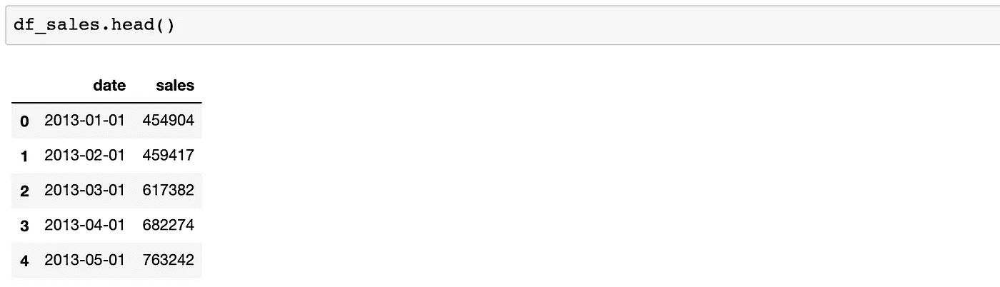

## 数据转换

为了更容易、更准确地模拟我们的预测，我们将进行以下转换:

*   如果不是，我们将把数据转换成静态的
*   从时间序列转换为受监督的，以获得我们的 LSTM 模型的特征集
*   缩放数据

首先，我们如何检查数据是否不稳定？让我们画出来看看:

```
#plot monthly sales
plot_data = [
    go.Scatter(
        x=df_sales['date'],
        y=df_sales['sales'],
    )
]plot_layout = go.Layout(
        title='Montly Sales'
    )
fig = go.Figure(data=plot_data, layout=plot_layout)
pyoff.iplot(fig)
```

月度销售图表:

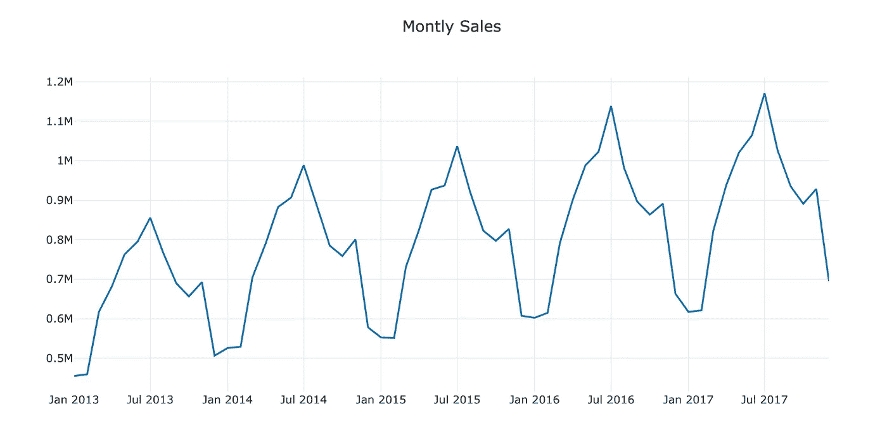

**Monthly Sales** — not stationary

显然，它不是静止不变的，在几个月内有增加的趋势。一种方法是获得与前一个月相比的销售差额，并在此基础上建立模型:

```
#create a new dataframe to model the difference
df_diff = df_sales.copy()#add previous sales to the next row
df_diff['prev_sales'] = df_diff['sales'].shift(1)#drop the null values and calculate the difference
df_diff = df_diff.dropna()
df_diff['diff'] = (df_diff['sales'] - df_diff['prev_sales'])df_diff.head(10)
```

现在我们有了建模差异所需的数据框架:

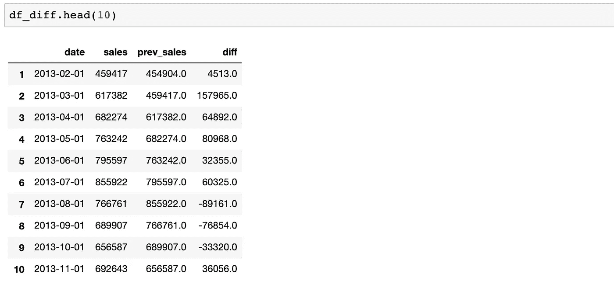

让我们画出它并检查它现在是否是静止的:

```
#plot sales diff
plot_data = [
    go.Scatter(
        x=df_diff['date'],
        y=df_diff['diff'],
    )
]plot_layout = go.Layout(
        title='Montly Sales Diff'
    )
fig = go.Figure(data=plot_data, layout=plot_layout)
pyoff.iplot(fig)
```


**Monthly Sales Difference** — stationary

完美！现在我们可以开始构建我们的特性集了。我们需要用以前的月度销售数据来预测下一个月。每个型号的回顾期可能会有所不同。在这个例子中，我们的将是 12。

所以我们需要做的是创建从 lag_1 到 lag_12 的列，并通过使用 **shift()** 方法赋值:

```
#create dataframe for transformation from time series to supervised
df_supervised = df_diff.drop(['prev_sales'],axis=1)#adding lags
for inc in range(1,13):
    field_name = 'lag_' + str(inc)
    df_supervised[field_name] = df_supervised['diff'].shift(inc)#drop null values
df_supervised = df_supervised.dropna().reset_index(drop=True)
```

查看我们名为 df_supervised 的新数据框架:

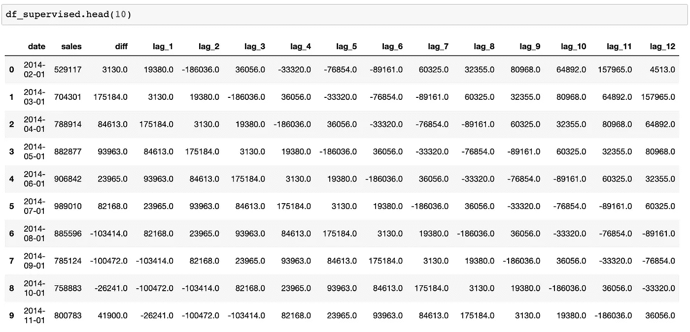

我们现在有了自己的功能集。让我们再好奇一点，问这个问题:

**我们的特征对预测有多大用处？**

*调整后的 R 平方*就是答案。它告诉我们我们的特征如何很好地解释了我们标签中的变化(在我们的例子中，对于 diff，从 lag_1 到 lag_12)。

让我们看一个例子:

```
# Import statsmodels.formula.api
import statsmodels.formula.api as smf# Define the regression formula
model = smf.ols(formula='diff ~ lag_1', data=df_supervised)# Fit the regression
model_fit = model.fit()# Extract the adjusted r-squared
regression_adj_rsq = model_fit.rsquared_adj
print(regression_adj_rsq)
```

那么上面发生了什么？

基本上，我们拟合一个线性回归模型(OLS——普通最小二乘法)，并计算调整后的 R 平方。对于上面的例子，我们只是使用了 **lag_1** 来看看它在多大程度上解释了列 **diff** 中的变化。这个代码块的输出是:

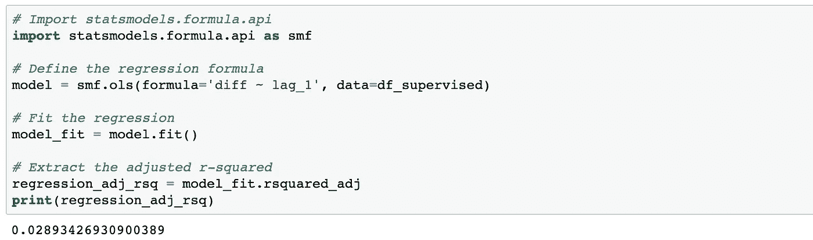

lag_1 解释了 3%的变异。让我们看看其他的:

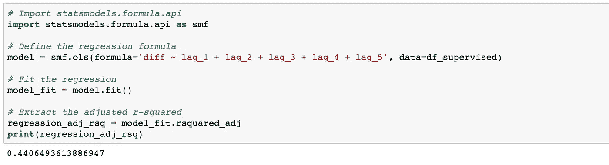

再增加四个功能，得分从 3%增加到 44%。

如果我们使用整个功能集，得分如何:

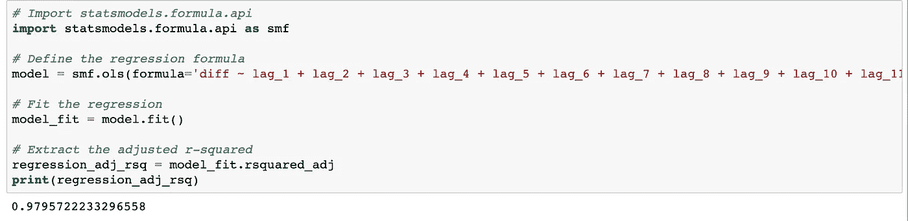

结果令人印象深刻，因为分数是 98%。现在，我们可以在扩展数据后自信地构建我们的模型。但是在缩放之前还有一个步骤。我们应该将数据分成训练集和测试集。作为测试集，我们选择了过去 6 个月的销售额。

```
#import MinMaxScaler and create a new dataframe for LSTM model
from sklearn.preprocessing import MinMaxScaler
df_model = df_supervised.drop(['sales','date'],axis=1)#split train and test set
train_set, test_set = df_model[0:-6].values, df_model[-6:].values
```

作为缩放器，我们将使用 MinMaxScaler，它将在-1 和 1:

```
#apply Min Max Scaler
scaler = MinMaxScaler(feature_range=(-1, 1))
scaler = scaler.fit(train_set)
# reshape training set
train_set = train_set.reshape(train_set.shape[0], train_set.shape[1])
train_set_scaled = scaler.transform(train_set)# reshape test set
test_set = test_set.reshape(test_set.shape[0], test_set.shape[1])
test_set_scaled = scaler.transform(test_set)
```

## 建立 LSTM 模式

一切准备就绪，构建我们的第一个深度学习模型。让我们从缩放数据集创建要素和标注集:

```
X_train, y_train = train_set_scaled[:, 1:], train_set_scaled[:, 0:1]
X_train = X_train.reshape(X_train.shape[0], 1, X_train.shape[1])X_test, y_test = test_set_scaled[:, 1:], test_set_scaled[:, 0:1]
X_test = X_test.reshape(X_test.shape[0], 1, X_test.shape[1])
```

让我们来拟合我们的 LSTM 模型:

```
model = Sequential()
model.add(LSTM(4, batch_input_shape=(1, X_train.shape[1], X_train.shape[2]), stateful=True))
model.add(Dense(1))
model.compile(loss='mean_squared_error', optimizer='adam')
model.fit(X_train, y_train, nb_epoch=100, batch_size=1, verbose=1, shuffle=False)
```

上面的代码块显示了模型如何自我改进并减少每个时期的误差:

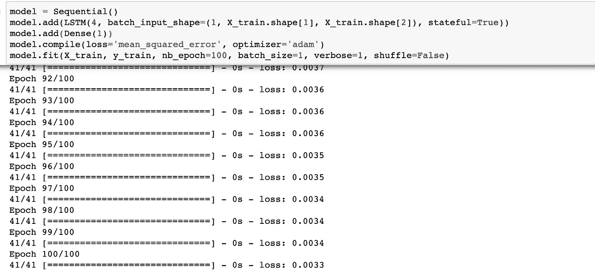

让我们做预测，看看结果是什么样的:

```
y_pred = model.predict(X_test,batch_size=1)#for multistep prediction, you need to replace X_test values with the predictions coming from t-1
```

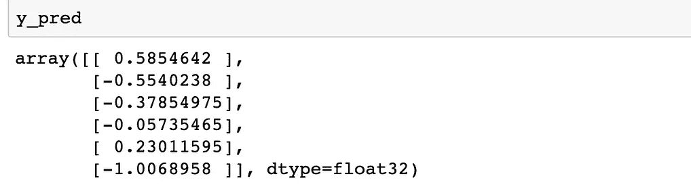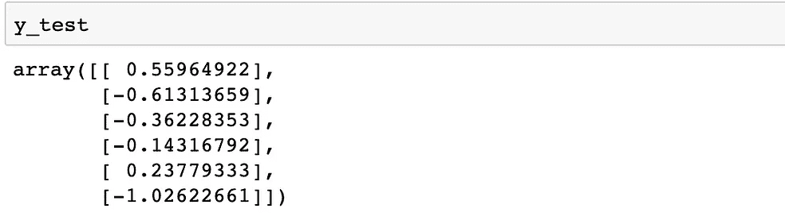

**y_pred** **vs** **y_test**

结果看起来相似，但它并没有告诉我们太多，因为这些是显示差异的缩放数据。我们如何能看到实际的销售预测？

首先，我们需要进行缩放的逆变换:

```
#reshape y_pred
y_pred = y_pred.reshape(y_pred.shape[0], 1, y_pred.shape[1])#rebuild test set for inverse transform
pred_test_set = []
for index in range(0,len(y_pred)):
    print np.concatenate([y_pred[index],X_test[index]],axis=1)
    pred_test_set.append(np.concatenate([y_pred[index],X_test[index]],axis=1))#reshape pred_test_set
pred_test_set = np.array(pred_test_set)
pred_test_set = pred_test_set.reshape(pred_test_set.shape[0], pred_test_set.shape[2])#inverse transform
pred_test_set_inverted = scaler.inverse_transform(pred_test_set)
```

第二，我们需要建立一个有日期和预测的数据框架。转变后的预测显示了不同之处。我们应该计算预测的销售数字:

```
#create dataframe that shows the predicted sales
result_list = []
sales_dates = list(df_sales[-7:].date)
act_sales = list(df_sales[-7:].sales)
for index in range(0,len(pred_test_set_inverted)):
    result_dict = {}
    result_dict['pred_value'] = int(pred_test_set_inverted[index][0] + act_sales[index])
    result_dict['date'] = sales_dates[index+1]
    result_list.append(result_dict)
df_result = pd.DataFrame(result_list)#for multistep prediction, replace act_sales with the predicted sales
```

输出:

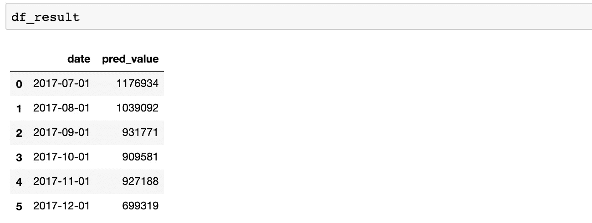

太好了！我们已经预测了未来六个月的销售数字。让我们在图中检查它们，看看我们的模型有多好:

```
#merge with actual sales dataframe
df_sales_pred = pd.merge(df_sales,df_result,on='date',how='left')#plot actual and predicted
plot_data = [
    go.Scatter(
        x=df_sales_pred['date'],
        y=df_sales_pred['sales'],
        name='actual'
    ),
        go.Scatter(
        x=df_sales_pred['date'],
        y=df_sales_pred['pred_value'],
        name='predicted'
    )

]plot_layout = go.Layout(
        title='Sales Prediction'
    )
fig = go.Figure(data=plot_data, layout=plot_layout)
pyoff.iplot(fig)
```

实际与预测:

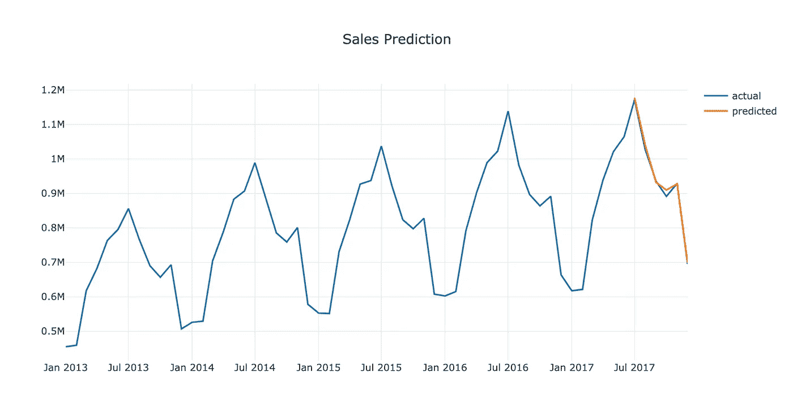

对于一个简单的模型来说看起来相当不错。

我们可以对这个模型做的一个改进是添加假期、休息和其他季节性影响。它们可以简单地作为新功能添加。

通过使用这个模型，我们有了基线销售预测。但是我们如何预测促销对销售的影响呢？我们将在第 7 部分对此进行研究。

你可以在这里找到这篇文章的 Jupyter 笔记本。

需要帮助来发展你的公司吗？点击这里，与我[一起预订免费课程。](https://app.growthmentor.com/mentors/baris-karaman)