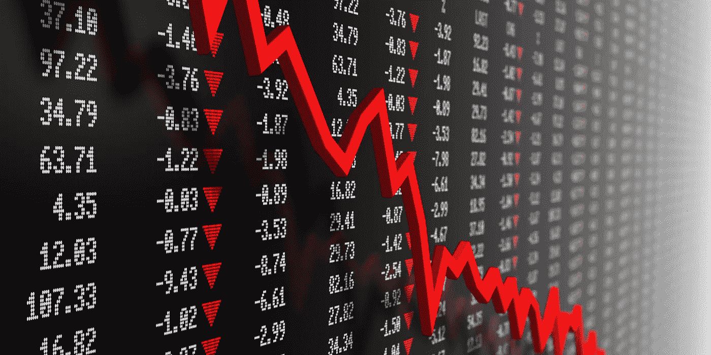
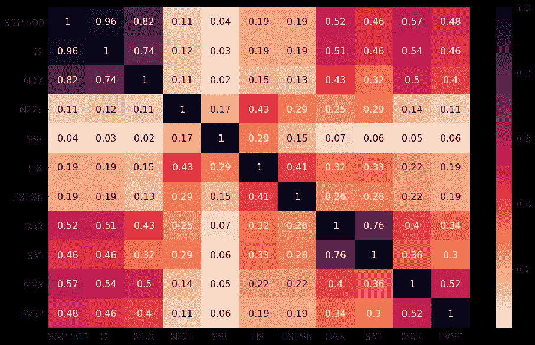
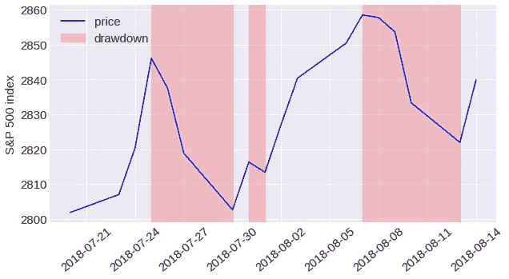
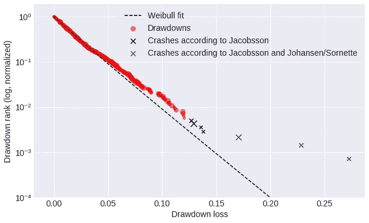
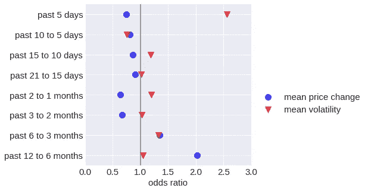
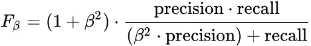
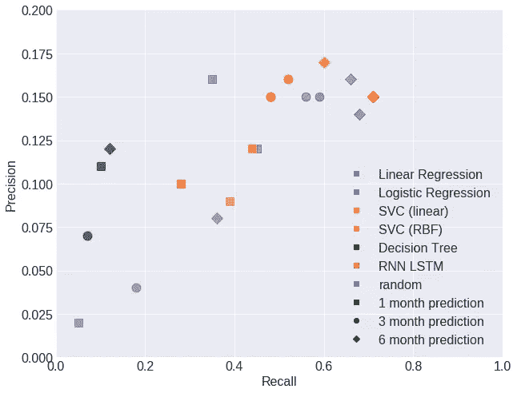
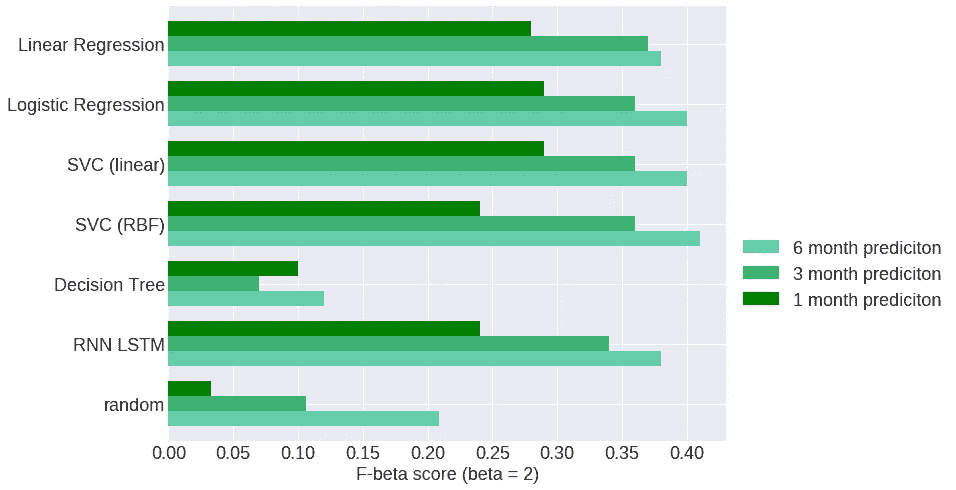
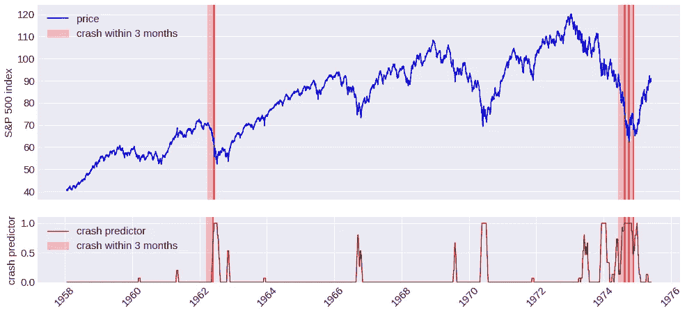

# 预测股市崩盘

> 原文：<https://towardsdatascience.com/predicting-stock-market-crashes-with-statistical-machine-learning-techniques-and-neural-networks-bb66bc3e3ccd?source=collection_archive---------3----------------------->

## 统计机器学习技术和神经网络的尝试

在这篇博文中，我将介绍一种机器学习算法的设计，该算法旨在仅基于过去的价格信息来预测股市崩盘。我从这个问题的背景开始，详细阐述我的方法和发现。所有的代码和数据都可以在 [GitHub](https://github.com/roman807/Predicting-Stock-Market-Crashes) 上找到。

股市崩盘是指市场总价值急剧快速下跌，价格通常在几天内下跌超过 10%。股市大崩盘的著名例子是 1987 年的黑色星期一和 2008 年的房地产泡沫。崩盘通常归因于价格泡沫的破裂，是由于大多数市场参与者试图同时出售其资产时发生的大规模抛售。

价格泡沫的出现意味着市场不是有效的。在低效市场中，价格并不总是反映基本资产价值，而是根据交易者的预期而上涨或下跌。这些预期被交易者随后进一步抬高(或压低)价格的行为所强化。这导致正(或负)价格泡沫最终破裂。这种现象被乔治·索罗斯描述为反身性，是技术分析中预测方法的基本假设。

如今，对于金融市场是否存在泡沫，已经没有太多争论。然而，理解这些低效率并预测价格泡沫何时破裂是一项非常困难的任务。想象一下，你可以识别一个即将形成的泡沫，并预测市场何时崩溃。你不仅可以在价格上涨时获利，还可以在合适的时机卖出以避免损失。

一些数学家和物理学家试图通过研究价格结构背后的数学来解决这个问题。其中一位物理学家是 Didier Sornette 教授，他成功预测了多次金融危机。Sornette 使用对数周期幂定律(LPPLs)来描述价格泡沫是如何形成和破裂的。本质上，LPPL 将导致崩盘的价格运动拟合为一个比指数增长更快的函数，该函数具有对数周期成分(反映价格波动幅度和频率的增加)。

这就是这个项目的灵感来源。如果研究人员发现的循环价格结构存在，那么机器学习算法是否有可能学习这些模式并预测崩溃？这种算法不需要知道潜在的数学规律，而是根据预先识别的崩溃数据进行训练，并自行识别和学习这些模式。

## 数据和崩溃

第一步是收集财务数据和识别崩溃。我在寻找低相关性主要股票市场的每日价格信息。低互相关对于模型的有效交叉验证和测试很重要。下面的矩阵显示了 11 个主要股票市场日收益率的交叉相关性。

**Correlation matrix of daily price returns for 11 major stock market indices**

为了避免任何两个数据集的交叉相关性大于 0.5，我只收集了标准普尔 500(美国)、日经(日本)、恒指(香港)、上交所(上海)、BSESN(印度)、SMI(瑞士)和 BVSP(巴西)的数据。

为了识别每个数据集中的崩溃，我首先计算了价格下降。跌价是指连续几天内价格从上一个最高价到下一个最低价的持续下降。下面的例子显示了 2018 年 7 月底至 8 月中旬期间标准普尔 500 的三次提款。

Example of three drawdowns. The first one shown lasted from July 25th to July 30th 2018 and has a total loss of approximately (2846–2803)/2846 = 1.5%

我考虑了两种不同的方法来识别崩溃。第一个是根据 Emilie Jacobsson [2]的建议，他将每个市场的崩溃定义为 99.5%分位数的下降。用这种方法，我找到了划分崩盘的提款阈值，从波动性较小的市场(如标准普尔 500)的 10%左右，到波动性较大的市场(如巴西)的 20%以上。第二种方法遵循 Johansen 和 Sornette [3]的建议，他们将崩溃确定为异常值，即当绘制数据集中压降等级的对数与压降幅度时，压降远离拟合的威布尔分布。

**Distribution of drawdowns by rank as an example for the Shanghai index since 1996.**

我用两种碰撞识别方法测试了我的算法，并得出结论，第一种方法(雅各布森)是有利的，原因有二。首先，Sornette 没有明确说明偏离威布尔分布的程度如何才能将压降归类为崩溃，因此需要人工判断。第二，他的方法导致识别更少的碰撞，这导致严重不平衡的数据集。这使得为机器学习算法收集足够多的数据进行训练变得更加困难。

通过收集上面提到的七个数据集，我总共收集了 59，738 行每日股票价格，并确定了总共 76 次崩盘。

## 问题陈述和功能选择

我制定了一个分类问题，目标是预测每个时间点(例如每个交易日)在未来 1 个月、3 个月或 6 个月内是否会发生崩盘。

如果过去的价格模式是未来价格事件的指示，则在某一天做出预测的相关信息包含在该天之前所有天的每日价格变化中。因此，为了预测在第 *t* 天的崩溃，从第 *t* 天之前的每天的每日价格变化可以被用作特征。然而，由于模型提供了太多的特征，确实会变得更慢、更不准确(“维数灾难”)，因此提取一些特征来捕捉任何时间点上过去价格运动的本质是有意义的。因此，我定义了 8 个不同的时间窗口来衡量过去一年(252 个交易日)每天的平均价格变化。我使用了从 5 天(直到第 *t* 天)到 126 天(对于 *t-₁₂₆* 到 *t-₂₅₂* )的递增窗口大小来获得最近时间价格变化的更高分辨率。因为在对多日价格变化进行平均时，没有捕捉到价格波动，所以我为相同时间窗口内的平均价格波动添加了 8 个特征。对于每个数据集，我将平均价格变化和波动性标准化。

为了评估特征选择，我进行了逻辑回归并分析了回归系数。逻辑回归系数对应于相关特征的对数概率的变化，意味着当所有其他特征保持不变时，概率(碰撞概率与非碰撞概率的比率)如何随着该特征的变化而变化的对数。对于下图，我将对数赔率转换为赔率。赔率大于 1 表示碰撞概率随着相应特征的增加而增加。

Logistic regression coefficients indicating the influence of the features on the predictive variable

系数分析显示，过去几天的波动性是即将发生崩盘的最强指标。然而，最近的价格上涨似乎并不意味着崩盘。乍一看这很令人惊讶，因为泡沫的典型特征是价格的指数增长。然而，许多发现的崩盘并不是在价格见顶后立即发生的，相反，价格在一段时间内下降导致崩盘。过去 6 至 12 个月的高价格增长增加了预测崩盘的可能性，这表明长期价格的普遍上涨使崩盘的可能性更大，更长时期的价格变动包含了对崩盘预测有价值的信息。

## 培训、验证和测试集

我选择了标准普尔 500 数据集进行测试，剩下的 6 个数据集用于训练和验证。我选择标准普尔 500 进行测试，因为它是最大的数据集(自 1950 年以来的每日价格信息)并且包含最大数量的崩溃(20)。对于培训，我进行了 6 重交叉验证。这意味着每个模型运行六次，使用五个数据集进行训练，剩下的一个用于验证。

## 得分

为了评估每个模型的性能，我使用了 F-beta 分数。F-beta 分数是精确度和召回率的加权调和平均值。beta 参数决定了精确度和召回率的权重。大于 1 的β优先考虑召回，小于 1 的β优先考虑精确度。

我选择的β值为 2，它更强调回忆，这意味着未被发现的碰撞比预测的未发生的碰撞受到更严厉的惩罚。在风险厌恶方法下，这是有意义的，假设不预测发生的崩溃比预期不发生的崩溃(错过潜在利润)有更严重的后果(金钱损失)。

## 回归模型、支持向量机和决策树

我从线性和逻辑回归模型开始。回归模型通过最小化所有训练样本上的预测和实际目标变量的差异来寻找函数的最佳系数。线性回归估计连续的目标变量，而逻辑回归估计概率，因此通常更适合于分类问题。然而，当我比较两种模型的预测结果时，逻辑回归仅在某些情况下优于线性回归。虽然这令人惊讶，但重要的是要注意，即使逻辑回归可能为估计碰撞概率提供更好的拟合，如果选择的阈值有效地分离二元预测，线性回归的次优拟合在实践中不一定是缺点。该阈值被优化以最大化训练集上的 F-beta 分数。

接下来，我测试了支持向量机。支持向量机使用核函数将输入特征投影到多维空间中，并确定一个超平面来分离正样本和负样本。要考虑的重要参数是惩罚参数 C(应避免多少误分类的度量)、核函数(多项式或径向基函数)、核系数γ(确定核函数的维数)和类权重(确定如何平衡正面预测和负面预测)。最好的 SVM 模型获得了与回归模型相似的分数。这使得回归模型更受欢迎，因为它们的训练速度更快。决策树无法与任何其他测试模型在同一水平上运行。

## 递归神经网络

下一步是实现递归神经网络(RNNs)。与传统的机器学习算法和传统的人工神经网络相反，递归神经网络能够考虑它们接收输入数据序列的顺序，从而允许信息持续存在。这似乎是处理时间序列数据(如每日股票回报)的算法的一个重要特征。这是通过连接单元的循环来实现的，以便在时间步长 *t* 时，输入不仅是特征 *xₜ* 而且是来自先前时间步长 *hₜ-₁* 的输出。下图说明了这个概念。

**Recurrent Neural Network**

然而，常规 rnn 的一个主要问题是它们在学习长期依赖性方面存在问题。如果在 *xₜ-ₙ* 和 *hₜ* 、 *hₜ* 之间有太多的步骤，可能从 *xₜ-ₙ* 那里学不到任何东西。为了帮助解决这个问题，长短期记忆网络(LSTMs)已经被引入。基本上，lstms 不仅将来自前一个单元 hₜ-₁的输出，而且将“单元状态” *cₜ-₁* 传递到下一个单元。单元状态基于输入( *xₜ* 和 *hₜ-₁* )在每一步得到更新，并且反过来更新输出 *hₜ* 。在每个 LSTM 单元中，四个神经网络层负责输入 *xₜ* 、 *hₜ-₁* 、 *cₜ-₁* 和输出 *hₜ和 cₜ* 之间的交互。有关 LSTM 单元架构的详细描述，请参考 colah 的博客【4】。

**Recurrent Neural Network with Long Short Term Memory (LSTM)**

具有 LSTM 的 rnn 具有检测简单回归模型不能发现的关系和模式的能力。因此，如果 RNN LSTM 能够学习崩溃前的复杂价格结构，这样的模型难道不能胜过之前测试过的模型吗？

为了回答这个问题，我用 Python 库 Keras 和 LSTM 实现了两个不同的 rnn，并进行了严格的超参数调整。第一个决定是每层输入序列的长度。每个时间步 *t* 的输入序列由从 *t* 开始的一系列日子的每日价格变化组成。必须小心选择这个数字，因为较长的输入序列需要更多的内存，并且会降低计算速度。理论上，RNN LSTM 应该能够找到长期依赖关系，然而，在 Keras 的 LSTM 实现中，如果参数 *stateful* 设置为真，则单元状态仅从一个序列传递到下一个序列。实际上，这种实现很麻烦。为了避免网络在训练期间识别不同数据集和时期的长期依赖性，每当训练数据切换数据集时，我实现了状态的手动重置。这种算法没有提供很好的结果，所以我将 *stateful* 设置为 *false* ，但是将序列长度从 5 个时间步长增加到 10 个时间步长，并为网络提供了从 10 天之前的时间窗口到 252 个交易日之前的平均价格变化和平均波动率的附加序列(类似于为之前测试的模型选择的特征)。最后，我调整了超参数，并尝试了不同的损失函数，层数，每层神经元的数量以及辍学与不辍学。性能最好的 RNN LSTM 具有顺序层，其后是两个 LSTM 层，每个层具有 50 个神经元，使用 adam 优化器、二元交叉熵损失函数和用于最后一层的 sigmoid 激活函数。

## 估价

虽然超参数调整和增加序列长度以及添加长期特征导致更快的训练(大约 10 个时期后验证集的最佳结果)，但没有一个 RNN LSTM 模型能够胜过之前测试的模型。

Recall vs precision for all models

上图显示了不同模型的精度和召回性能。不同的颜色表示不同的模型，不同的形状表示不同的预测变量(1 个月、3 个月或 6 个月的崩盘)。下面的柱状图展示了所有模型在 1 个月、3 个月和 6 个月的碰撞预测中的 F-beta 分数。 *Random* 代表没有预测能力的模型的预期性能，该模型预测崩溃的频率与测试模型一样高。

F-Beta score for all models

最好的结果显示，预测 6 个月、3 个月和 1 个月内发生崩溃的 F-beta 值分别为 41、37 和 29。准确率在 12-16%之间，召回率在 45-71%之间。这意味着，虽然大约 50%的碰撞被检测到，但大约 85%的碰撞信号是“假警报”。

## 结论

首先是坏消息。RNN LSTM 似乎无法学习复杂的价格模式，而复杂的价格模式能让它超越简单的回归模型。这表明，没有任何复杂的价格模式会在所有(或几乎所有)崩盘之前出现，但不会在其它时候出现。这并不意味着 Sornette 的假设，崩溃之前的某些价格模式符合对数周期幂定律是无效的。然而，这意味着，如果这样的模式存在，(1)这些模式也发生在没有跟随它们的碰撞的情况下，(2)有许多碰撞没有跟随这些模式，或者(3)没有足够的数据供 RNN 学习这些模式。虽然更多的数据肯定会提供更多的清晰度，部分问题可能是(1)和(2)的组合。Sornette 将对数周期幂律拟合到某些被识别为异常值的崩溃，但并不是对所有下降幅度相似的崩溃都是如此。为了提供一个找到 Sornette 所描述的崩溃的算法，训练数据将需要被特别地标记为仅符合这些模式的崩溃。这可能会提高对这些碰撞的识别，但对(2)没有帮助，因为不同类型的碰撞不会被检测到。然而，如果有足够的数据和足够多的已识别事故清单，重新运行 RNN LSTM 模型肯定是值得的。

好消息是，简单的价格模式，通过价格的长期变化和波动性的变化来定义，似乎在崩溃前定期发生。最好的模型能够学习这些模式，并比可比较的随机模型更好地预测崩盘。例如，对于 3 个月内的崩溃预测，最佳回归模型在测试集上实现了 0.15 的精度和 0.59 的召回率，而不具有预测能力的可比较随机模型预期将实现 0.04 的精度和 0.16 的召回率。对于 1 个月和 6 个月的崩溃预测，结果看起来相似，F-beta 分数对于 6 个月的预测最好，对于 1 个月的预测最差。这些结果是否足以优化投资策略仍有争议。然而，如果讨论的回归崩溃指标持续警告即将到来的崩溃，风险厌恶型投资者肯定会更加保守地分配他们的投资组合头寸。

**Prediction for a crash in 3 months by the logistic regression model for the S&P 500 from 1958 to 1976**

查看碰撞时的测试数据价格指数图表和碰撞预测指标表明，虽然一些碰撞被检测得非常好，但其他碰撞发生时没有或几乎没有来自碰撞预测的警告。上图显示了一个没有预测到的崩溃(在 1962 年)和连续三次预测很好的崩溃(在 1974 年)的例子。一些崩盘比其他崩盘被更好地检测出来，这与以下假设是一致的:某些典型的价格模式确实先于一些崩盘，但不是所有崩盘。不同的算法大部分都与相同的崩溃作斗争，这就是为什么我没有试图结合不同的模型。

通过对过去 21 天的二元崩溃预测进行加权平均，(最近的预测加权更强)，逻辑回归模型预测截至 2018 年 11 月 5 日标准普尔 500 在 6 个月内崩溃的可能性为 98.5%，3 个月内为 97%，一个月内为 23%。读完这项研究后，我让你来决定如何处理这些信息。

***注来自《走向数据科学》的编辑:*** *虽然我们允许独立作者根据我们的* [*规则和指导方针*](/questions-96667b06af5) *发表文章，但我们不认可每个作者的贡献。你不应该在没有寻求专业建议的情况下依赖一个作者的作品。详见我们的* [*读者术语*](/readers-terms-b5d780a700a4) *。*

## 参考

[1]为什么股票市场崩溃，迪迪埃·索尔内特。此处有书可用[。](https://www.amazon.com/Why-Stock-Markets-Crash-Financial/dp/0691175950)

[2]如何用对数周期幂定律预测金融市场的崩溃，Emilie Jacobsson。在这里找到论文[。](https://www2.math.su.se/matstat/reports/serieb/2009/rep7/report.pdf)

[3]股票市场价格大幅下跌是异常值，(2001) Anders Johansen 和 Didier Sornette。在这里找到论文。

[4]理解 LSTM 网络，colah 的博客。链接[此处](http://colah.github.io/posts/2015-08-Understanding-LSTMs/)。