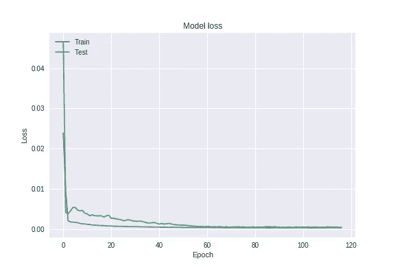

# 用 LSTM 预测股票价格

> 原文：<https://towardsdatascience.com/predicting-stock-price-with-lstm-13af86a74944?source=collection_archive---------2----------------------->


Photo by [Rick Tap](https://unsplash.com/@ricktap?utm_source=medium&utm_medium=referral) on [Unsplash](https://unsplash.com?utm_source=medium&utm_medium=referral)

近年来，机器学习在许多有趣的领域得到了应用。驯服股市就是其中之一。很长一段时间以来，我一直想试一试。主要是为了巩固我对 LSTMs 的工作知识。最后，我完成了这个项目，非常兴奋地分享我的经验。

## 动机和目标受众

我将在一系列博客上写下我的经历。本系列的目的不是解释 LSTM 或机器学习概念的基础。因此，我会假设读者已经开始了他/她的机器学习之旅，并具备 Python 等基础知识，熟悉 SkLearn、Keras、LSTM 等。原因是已经有关于“LSTMs 如何工作？”更有资格解释其背后的数学原理的人。但是我会分享这些文章的链接，只要我觉得缺少背景知识。虽然有很多文章告诉你如何在给定数据集的情况下预测股票价格，但大多数作者都没有揭示/解释他们如何达到神经网络的特定配置，或者他们如何选择特定的超参数集。所以这篇文章的真正目的是分享这样的步骤，我的错误和一些我觉得很有帮助的步骤。因此，本文不限于股票价格预测问题。

以下是我们将关注的内容:

1.  读取和分析数据。(熊猫)
2.  标准化数据。(SkLearn)
3.  将数据转换为时间序列和监督学习问题。
4.  创建模型(Keras)
5.  [微调模型](https://medium.com/@asutoshnayak/finding-the-right-architecture-for-neural-network-b0439efa4587)(在下一篇文章中)
6.  训练、预测和可视化结果。
7.  我发现非常有用的提示和工具([系列的最后一篇文章](https://medium.com/@asutoshnayak/tools-tips-critical-to-any-machine-learning-project-f01b59ad01e6)

请注意，第一篇文章讨论的是 LSTM 的预处理步骤和术语。如果你对这些步骤相当有信心，你可以跳到下一篇文章。

我们开始吧！

## 读取和分析数据

在这篇文章中，我将使用通用电气的历史股价数据。你可以在我的网站[这里](https://www.kaggle.com/darkknight91/ge-stock)找到数据。我不记得数据的来源了，因为我很久以前就下载了。我们可以将数据读入如下所示的帧:

```
df_ge = pd.read_csv(os.path.join(INPUT_PATH, "us.ge.txt"), engine='python')
df_ge.tail()
```


如您所见，大约有 14060 个项目，每个项目代表该公司一天的股票市场属性。让我们看看它在图上的样子:

```
from matplotlib import pyplot as pltplt.figure()
plt.plot(df_ge["Open"])
plt.plot(df_ge["High"])
plt.plot(df_ge["Low"])
plt.plot(df_ge["Close"])
plt.title('GE stock price history')
plt.ylabel('Price (USD)')
plt.xlabel('Days')
plt.legend(['Open','High','Low','Close'], loc='upper left')
plt.show()
```


看起来价格——开盘价、收盘价、最低价、最高价——彼此之间没有太大的差异，除了偶尔的小幅低价下跌。

现在让我们来看看体积图:

```
plt.figure()
plt.plot(df_ge["Volume"])
plt.title('GE stock volume history')
plt.ylabel('Volume')
plt.xlabel('Days')
plt.show()
```


哼。你看到有趣的东西了吗？时间线上 12000 天左右交易数量出现相当大的激增，恰好与股价的突然下跌相吻合。也许我们可以回到那个特定的日期，翻出旧的新闻文章，找出是什么原因造成的。

现在让我们看看是否有任何 null/Nan 值需要担心。事实证明，我们没有任何空值。太好了！

```
print("checking if any null values are present\n", df_ge.isna().sum())
```


## 标准化数据

数据没有标准化，每一列的范围各不相同，尤其是数量。标准化数据有助于算法收敛，即有效地找到局部/全局最小值。我将使用 Sci-kit Learn 中的 MinMaxScaler。但在此之前，我们必须将数据集分为训练数据集和测试数据集。在这个过程中，我还会将 DataFrame 转换为 ndarray。

## 将数据转换为时间序列和监督学习问题

这很重要，也有点棘手。这就是知识 LSTM 需要的地方。我将简要描述这里需要的关键概念，但我强烈建议阅读 Andre karpathy 的博客[这里](http://karpathy.github.io/2015/05/21/rnn-effectiveness/)，它被认为是关于 LSTM 和[这个](http://colah.github.io/posts/2015-08-Understanding-LSTMs/)的最佳资源之一。或者你也可以看看吴恩达的视频(顺便提一下，其中也提到了安德烈的博客)。

LSTMs 以格式[ batch_size，time_steps，Features ]消耗输入；三维数组。

*   **批量大小**表示在更新权重之前，您希望您的神经网络看到多少个输入样本。假设您有 100 个样本(输入数据集),并且您想在每次 NN 看到输入时更新权重。在这种情况下，批量大小为 1，总批量为 100。就像 wise 一样，如果您希望您的网络在看到所有样本后更新权重，批次大小将为 100，批次数量将为 1。事实证明，使用非常小的批量会降低训练速度，另一方面，使用太大的批量(如整个数据集)会降低模型归纳不同数据的能力，并且还会消耗更多的内存。但是找到目标函数的最小值需要更少的步骤。所以你必须在你的数据上尝试不同的值，并找到最佳点。这是一个相当大的话题。我们将在下一篇文章中看到如何更智能地搜索这些内容。
*   **时间步长**定义你想让你的网络看到多少时间单位。例如，如果您正在处理一个字符预测问题，您有一个文本语料库要训练，您决定一次向您的网络输入 6 个字符。那么你的时间步长就是 6。在我们的例子中，我们将使用 60 作为时间步长，即我们将研究 2 个月的数据来预测第二天的价格。稍后将详细介绍。
*   **特征**是用来表示每个时间步的属性数。考虑上面的字符预测示例，并假设您使用大小为 100 的独热编码向量来表示每个字符。那么这里的特征尺寸是 100。

现在我们已经弄清楚了一些术语，让我们将股票数据转换成合适的格式。为简单起见，假设我们选择 3 作为时间步长(我们希望我们的网络回顾 3 天的数据来预测第 4 天的价格)，然后我们将像这样形成数据集:


样本 0 到 2 将是我们的第一个输入，样本 3 的收盘价将是其相应的输出值；两者都被绿色矩形包围。类似地，样本 1 到 3 将是我们的第二个输入，样本 4 的收盘价将是输出值；用蓝色矩形表示。诸如此类。所以到目前为止，我们有一个形状矩阵(3，5)，3 是时间步长，5 是特征的数量。现在想想上图中有多少这样的输入输出对？4.

也把批量和这个混在一起。假设我们选择批量为 2。那么输入输出对 1(绿色矩形)和对 2(蓝色矩形)将构成第一批。诸如此类。下面是实现这一点的 python 代码片段:

“y_col_index”是输出列的索引。现在，假设在将数据转换为监督学习格式后，如上所示，您的训练数据集中有 41 个样本，但您的批量大小为 20，那么您将必须调整您的训练集，以删除遗漏的奇数样本。我会寻找一个更好的方法来解决这个问题，但现在我已经这样做了:

现在使用上述函数，让我们形成我们的训练，验证和测试数据集

```
x_t, y_t = build_timeseries(x_train, 3)
x_t = trim_dataset(x_t, BATCH_SIZE)
y_t = trim_dataset(y_t, BATCH_SIZE)
x_temp, y_temp = build_timeseries(x_test, 3)
x_val, x_test_t = np.split(trim_dataset(x_temp, BATCH_SIZE),2)
y_val, y_test_t = np.split(trim_dataset(y_temp, BATCH_SIZE),2)
```

现在我们的数据已经准备好了，我们可以专注于构建模型。

## 创建模型

我们将使用 LSTM 来完成这项任务，它是递归神经网络的一种变体。创建 LSTM 模型就像这样简单:

既然您已经编译了模型并准备好进行训练，就像下面这样训练它。如果您想知道使用什么值作为参数，如时期、批量大小等。别急，我们将在[的下一篇](/finding-the-right-architecture-for-neural-network-b0439efa4587)文章中看到如何解决这些问题。

训练该模型(具有微调的超参数)给出了 3.27e-4 的最佳误差和 3.7e-4 的最佳验证误差。以下是培训损失与验证损失的对比情况:



Training error vs Validation error

这是上述模型的预测结果:


prediction vs real data

我发现 LSTM 的这种配置是我尝试过的所有组合中最好的(对于这个数据集)，*和*我已经尝试了 100 多种！所以问题是你如何为你的神经网络找到完美的(或者在大多数情况下，接近完美的)架构？这将引导我们进入下一个重要的部分，在[的下一篇文章](https://medium.com/@asutoshnayak/finding-the-right-architecture-for-neural-network-b0439efa4587)中继续。

你可以在我的 Github 简介[这里](https://github.com/paranoiac-coder/Stock-Price-Prediction)找到所有完整的程序。

**注意:**向读者提出一个小小的请求——欢迎你们在 LinkedIn 或 Twitter 上与我联系，但是如果你们对我的博客有任何疑问，请在各自博客的评论区而不是个人信息区发表，这样，如果其他人有同样的疑问，他们也可以在这里找到，我就不必单独解释了。然而，仍然欢迎你向我个人发送与博客或一般技术问题无关的问题。谢谢:-)

**2019 年 13 月 4 日更新**

1.  据我所知，自从我写了这篇文章，我的博客使用的模型可能已经过度拟合了。虽然我还没有确认，但很有可能。所以在你的项目中实现时请小心。你可以尝试更少的时代，更小的网络，更多的辍学等等。
2.  我对最后一层使用了 Sigmoid 激活，这可能会受到无法预测数据集中高于“最高”价格的价格的限制。你可以尝试“线性”激活最后一层来解决这个问题。
3.  修复了“将数据转换为时间序列”部分的一个拼写错误。

感谢读者让我注意到这些。

**2020 年 1 月 21 日更新**

正如在一些评论中提到的，我正在探索解决股票预测问题的其他方法。我终于让它工作了。感兴趣的读者可以在这里阅读。