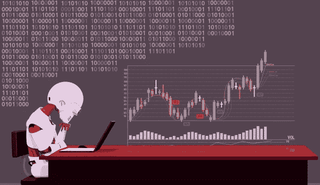
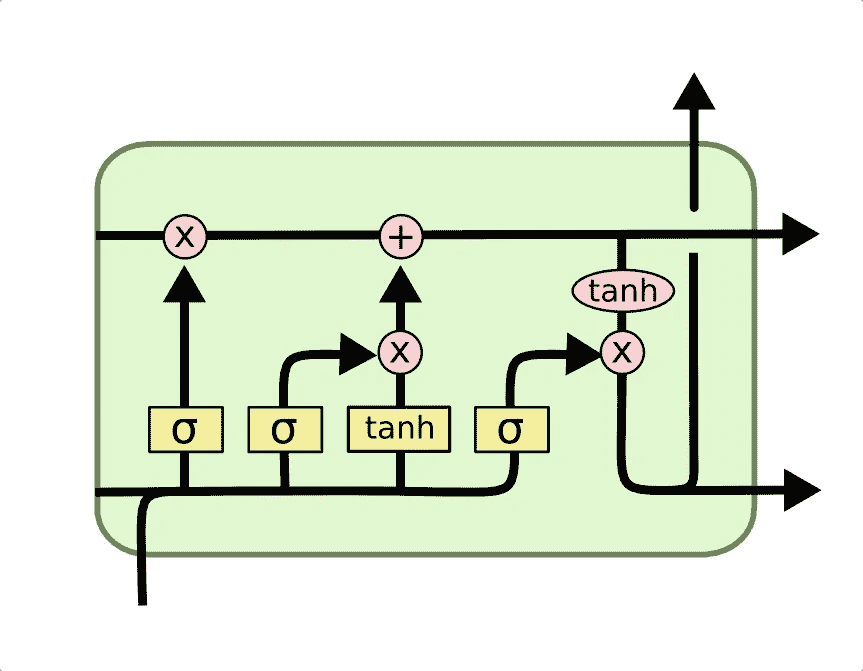
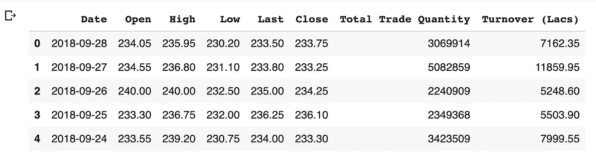
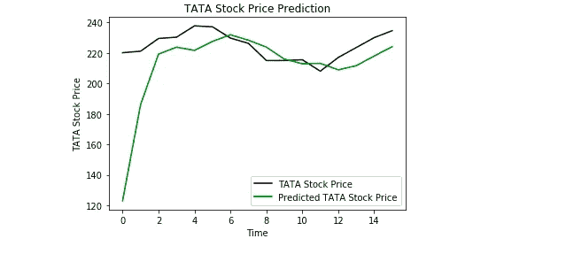

# 机器学习预测股票价格

> 原文：<https://towardsdatascience.com/predicting-stock-prices-using-a-keras-lstm-model-4225457f0233?source=collection_archive---------2----------------------->

## 金融中的人工智能

## 利用 LSTM 模型预测股票趋势



随着金融机构开始接受人工智能，机器学习越来越多地被用来帮助做出交易决策。虽然有大量的股票数据供机器学习模型训练，但高信噪比和影响股票价格的众多因素是预测市场困难的几个原因之一。同时，这些模型不需要达到很高的精确度，因为即使 60%的精确度也能带来稳定的回报。预测股票价格的一种方法是使用长短期记忆神经网络(LSTM)进行时间序列预测。

# LSTM:简要说明



LSTM diagram ([source](https://colah.github.io/posts/2015-08-Understanding-LSTMs/))

LSTMs 是递归神经网络(RNNs)的改进版本。rnn 类似于人类的学习。当人类思考时，我们并不是每秒钟都从零开始思考。例如，在句子“鲍勃打篮球”中，我们知道鲍勃是打篮球的人，因为我们在阅读句子时保留了过去单词的信息。类似地，rnn 是具有环路的网络，这允许它们在到达最终输出之前使用过去的信息。然而，随着时间间隔的增长，RNNs 只能连接最近的先前信息，而不能连接信息。这就是 LSTMs 发挥作用的地方；LSTMs 是一种 RNN，可以长时间记忆信息，这使它们更适合预测股票价格。有关 LSTMs 的技术解释，请点击[此处](/illustrated-guide-to-lstms-and-gru-s-a-step-by-step-explanation-44e9eb85bf21)。

# 导入/初始数据

为了开始我们的项目，我们导入 numpy 来进行科学计算，导入 pandas 来加载和修改数据集，导入 matplotlib 来绘制图形。

```
import numpy as npimport matplotlib.pyplot as pltimport pandas as pd
```

在进行必要的导入后，我们加载 Tata Global Beverage 过去股价的数据。从数据中，我们选择第一列和第二列的值(分别为“Open”和“High”)作为我们的训练数据集。“开盘价”栏代表当天股票的开盘价,“高价”栏代表当天股票的最高价格。

```
url = 'https://raw.githubusercontent.com/mwitiderrick/stockprice/master/NSE-TATAGLOBAL.csv'dataset_train = pd.read_csv(url)training_set = dataset_train.iloc[:, 1:2].values
```

为了查看我们正在使用的数据集，我们可以检查头部，它向我们显示了数据集的前五行。

```
dataset_train.head()
```



“低”代表当天的最低股价，“最后”代表股票最后一次交易的价格。“收盘”代表股票当天的收盘价。

# 数据标准化

规范化是将数据集中的数值列的值更改为通用的比例，这有助于提高模型的性能。为了缩放训练数据集，我们使用 Scikit-Learn 的 MinMaxScaler，其数字介于 0 和 1 之间。

```
from sklearn.preprocessing import MinMaxScalersc = MinMaxScaler(feature_range=(0,1))training_set_scaled = sc.fit_transform(training_set)
```

# 将时间步长并入数据

我们应该将数据以 3D 数组的形式输入到 LSTM 模型中。首先，在使用 numpy 将数据转换成数组之前，我们用 60 个时间步长创建数据。最后，我们将数据转换成一个 3D 数组，其中包含 X_train 样本、60 个时间戳以及每步一个特征。

```
X_train = []y_train = []for i in range(60, 2035):X_train.append(training_set_scaled[i-60:i, 0])y_train.append(training_set_scaled[i, 0])X_train, y_train = np.array(X_train), np.array(y_train)X_train = np.reshape(X_train, (X_train.shape[0], X_train.shape[1], 1))
```

# 创造 LSTM 模式

在开发 LSTM 之前，我们必须从 Keras 进行一些导入:Sequential 用于初始化神经网络，LSTM 用于添加 LSTM 层，dropout 用于防止与 Dropout 层过度拟合，Dense 用于添加密集连接的神经网络层。

```
from keras.models import Sequentialfrom keras.layers import LSTMfrom keras.layers import Dropoutfrom keras.layers import Dense
```

添加 LSTM 图层时使用了以下参数:50 个单位是输出空间的维度，return_sequences=True 是堆叠 LSTM 图层所必需的，因此后续的 LSTM 图层具有三维序列输入，input_shape 是训练数据集的形状。

在 Dropout 层中指定 0.2 意味着 20%的层将被丢弃。在 LSTM 和下降图层之后，我们添加了指定一个单位输出的密集图层。为了编译我们的模型，我们使用 Adam 优化器，并将损失设置为均方误差。之后，我们将模型拟合为运行 100 个时期(时期是学习算法将通过整个训练集工作的次数)，批次大小为 32。

```
model = Sequential()model.add(LSTM(units=50,return_sequences=True,input_shape=(X_train.shape[1], 1)))model.add(Dropout(0.2))model.add(LSTM(units=50,return_sequences=True))model.add(Dropout(0.2))model.add(LSTM(units=50,return_sequences=True))model.add(Dropout(0.2))model.add(LSTM(units=50))model.add(Dropout(0.2))model.add(Dense(units=1))model.compile(optimizer='adam',loss='mean_squared_error')model.fit(X_train,y_train,epochs=100,batch_size=32)
```

# 对测试集进行预测

我们从导入测试集开始

```
url = 'https://raw.githubusercontent.com/mwitiderrick/stockprice/master/tatatest.csv'dataset_test = pd.read_csv(url)real_stock_price = dataset_test.iloc[:, 1:2].values
```

在预测未来的股票价格之前，我们必须修改测试集(注意我们对训练集所做的编辑的相似之处):合并 0 轴上的训练集和测试集，再次将 60 设置为时间步长，使用 MinMaxScaler，并重塑数据。然后，inverse_transform 将股票价格转换成正常可读的格式。

```
dataset_total = pd.concat((dataset_train['Open'], dataset_test['Open']), axis = 0)inputs = dataset_total[len(dataset_total) - len(dataset_test) - 60:].valuesinputs = inputs.reshape(-1,1)inputs = sc.transform(inputs)X_test = []for i in range(60, 76):X_test.append(inputs[i-60:i, 0])X_test = np.array(X_test)X_test = np.reshape(X_test, (X_test.shape[0], X_test.shape[1], 1))predicted_stock_price = model.predict(X_test)predicted_stock_price = sc.inverse_transform(predicted_stock_price)
```

# 绘制结果

完成所有这些步骤后，我们可以使用 matplotlib 来可视化我们预测的股价和实际股价的结果。

```
plt.plot(real_stock_price, color = 'black', label = 'TATA Stock Price')plt.plot(predicted_stock_price, color = 'green', label = 'Predicted TATA Stock Price')plt.title('TATA Stock Price Prediction')plt.xlabel('Time')plt.ylabel('TATA Stock Price')plt.legend()plt.show()
```



虽然我们的预测价格的准确价格点并不总是接近实际价格，但我们的模型仍然表明了整体趋势，如上涨或下跌。这个项目告诉我们 LSTMs 在时间序列预测中可以有些效果。

点击[此处](https://colab.research.google.com/drive/18WiSw1K0BW3jOKO56vxn11Fo9IyOuRjh)查看完整代码

# 参考

[1]德里克·姆维蒂，[股票价格预测数据与笔记本教程](https://github.com/mwitiderrick/stockprice) (2018)，Github

**先别走**！

我是 Roshan，16 岁，对人工智能和金融的交叉领域充满热情。关于人工智能在金融中的广泛观点，请查看这篇文章:[https://becoming human . AI/artificial-intelligence-and-its-application-in-finance-9f1e 0588 e 777](https://becominghuman.ai/artificial-intelligence-and-its-application-in-finance-9f1e0588e777)。

在 Linkedin 上联系我:[https://www.linkedin.com/in/roshan-adusumilli-96b104194/](https://www.linkedin.com/in/roshan-adusumilli-96b104194/)