# 用回声状态网络预测股票价格

> 原文：<https://towardsdatascience.com/predicting-stock-prices-with-echo-state-networks-f910809d23d4?source=collection_archive---------7----------------------->

## 几十年来，人们一直试图可靠地预测股市看似混乱的本质，但都失败了。神经网络是关键吗？

“在看似完全混乱的事物中，有秩序，甚至是伟大的美。如果我们足够仔细地观察我们周围的随机性，模式就会开始出现。” ― **阿伦·索尔金**

**编辑:**由于对本文中概述的方法的怀疑和批评，本教程中使用的所有代码和数据以及结果都在相关的 GitHub 资源库中提供，可以在这里找到。

**时间序列预测的动机**

股票市场通常被视为一个混沌的时间序列，公司经常应用先进的随机方法来尝试并做出合理准确的预测，以便他们能够占上风并赚钱。这本质上是所有投资银行背后的想法，尤其是那些市场交易者。

我并不自称对股票市场了解很多(毕竟，我是科学家，不是投资银行家)，但我确实对机器学习和随机方法有一定的了解。这一领域最大的问题之一是试图以可靠的方式准确预测混沌时间序列。预测混沌系统动态的想法有点违反直觉，因为根据定义，混沌的东西不会以可预测的方式表现。

对时间序列的研究在股票市场出现之前就有了，但随着个人试图利用股票市场来“击败系统”并变得富有，时间序列的研究变得越来越受欢迎。为了做到这一点，人们不得不开发可靠的方法，根据先前的信息来估计市场趋势。

首先，让我们谈谈时间序列的一些属性，这些属性使时间序列易于分析，这样我们就可以理解为什么当我们观察股票市场时，时间序列分析会变得相当困难。

所有相关代码都可以在我的 GitHub 资源库中找到:

 [## GitHub-mpstewart 1/EchoStateNetworks:与媒体文章“预测股票…

### 此时您不能执行该操作。您已使用另一个标签页或窗口登录。您已在另一个选项卡中注销，或者…

github.com](https://github.com/mpstewart1/EchoStateNetworks) 

# 时间序列属性

时间序列最重要的属性之一就是它是平稳的。如果一个时间序列的**统计属性**如均值和方差**随时间**保持不变，则称该时间序列为平稳。但是为什么重要呢？

大多数模型都假设时间序列是平稳的。直观上，我们可以说，如果一个时间序列在一段时间内具有特定的行为，那么它很有可能在未来也会遵循相同的行为。与非平稳序列相比，平稳序列的相关理论更加成熟，也更容易实现。

使用非常严格的标准来定义平稳性。然而，出于实际目的，如果该序列在一段时间内具有恒定的统计特性，即以下特性，我们可以假设该序列是平稳的:

1.  恒定平均值。这应该是直观的，因为如果均值在变化；那么时间序列可以被看作是移动的，通过对比下面两个图可以看出。

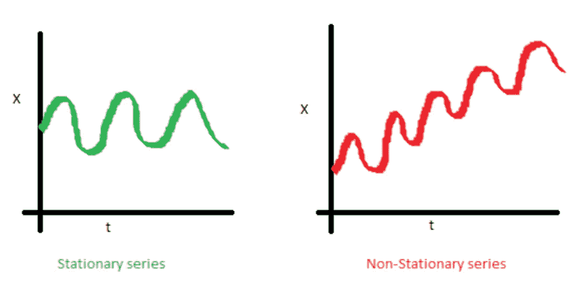

2.恒定方差。这种性质称为同质性。下图描述了违反此属性的静态与非静态示例。

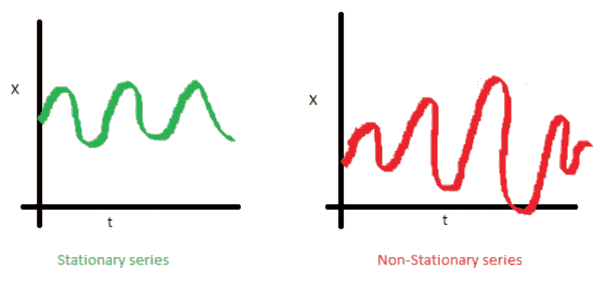

3.不依赖于时间的自相关。在下图中，你会注意到随着时间的增加，传播变得越来越近。因此，对于非平稳情况，协方差不随时间恒定。

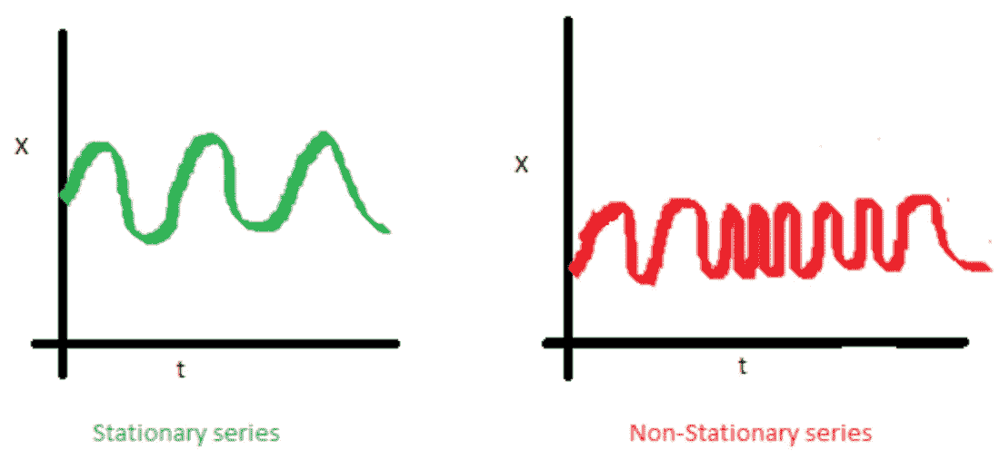

## 为什么我关心一个时间序列的平稳性？

我首先讨论这一部分的原因是，您需要您的时间序列是平稳的，以便构建一个时间序列模型。如果违反了平稳时间序列的标准，首先要做的是转换时间序列，使其平稳，然后尝试随机模型来预测该时间序列。有多种方法可以实现这种稳定性。其中一些是去趋势、差分等。

对于不熟悉时间序列分析的人来说，这可能有点愚蠢。然而，它比第一次出现时要复杂一点(不总是这样吗..).事实证明，**处理时间序列的最佳**方式是首先将其“固定化”,并将其解耦为几个不同的特征，如线性趋势，分离出具有不同季节性的时间序列，然后在最后将它们重新加在一起。

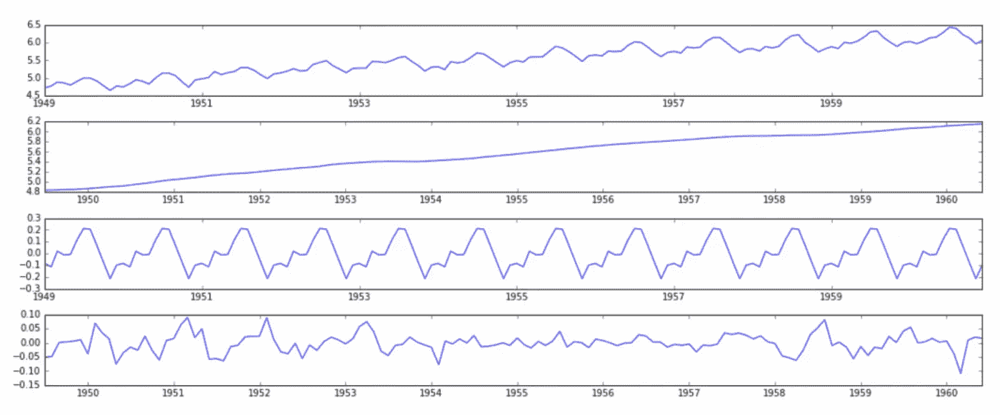

An example of decoupling a time series into multiple series with desirable properties.

对于任何熟悉傅立叶变换的人来说，这是一个非常相似的类比。傅立叶变换的作用是分离出时间序列中的不同频率特性，并将它们转换到频域，以便更简单地表示。然后，在将这些信号转换回时域之前，可以更容易地对其进行处理或分析。

**我如何测试平稳性？**

从视觉观察来看，时间序列是否平稳并不总是显而易见的。因此，更正式地说，我们可以使用下面的方法来检查平稳性:

1.  **绘制滚动统计:**我们可以绘制移动平均线或移动方差，看它是否随时间变化。移动平均值/方差是指在任何时刻' *t* '，我们将取去年的平均值/方差，即过去 12 个月。但是这更多的是一种视觉技术。
2.  **Dickey-Fuller 检验:**这是检验平稳性的统计检验之一。这里的零假设是 TS 是非平稳的。测试结果包括一个**测试统计**和一些**临界值**用于不同的置信水平。如果“检验统计量”小于“临界值”，我们可以拒绝零假设，说序列是平稳的。详见[本文](https://www.analyticsvidhya.com/blog/2015/12/complete-tutorial-time-series-modeling/)。

现在我们对时间序列有了更多的了解，我们可以看看人们研究时间序列的传统方式，他们如何开发他们的模型，以及为什么他们不适合研究股票市场。

# 时间序列预测的基本方法

最基本的方法非常简单，我认为大多数人不用上时间序列分析课就能想出这些方法。有些用处的最简单的模型是**移动平均线**。本质上，移动平均采用最后的 *t* 值，并将这些值的平均值作为下一点的预测值。

移动平均惊人地准确，对异常值和短期波动的稳健性可以通过改变平均过程中使用的先前点的数量来控制。

更复杂的程序自然地从这里开始，例如指数平滑。这类似于移动平均，只是它是一个加权过程，对最近的数据点给予更高的重要性。指数平滑中使用的特定加权函数(不奇怪)是一个指数函数，但是可以使用不同的方法对该过程进行加权。

这些方法适用于相对一致和周期性的时间序列，但那些表现出季节性和持续线性趋势或任何显著随机性或混沌性质的方法很难用于此。例如，如果我有一个周振荡，并且我使用的是移动平均模型，该模型对上周的数据进行平均，那么我的模型将完全忽略这种振荡行为。

一种用于分析具有不同自相关水平的时间序列(例如，每周趋势与每月和每年趋势相结合)的非常流行的方法被称为霍尔茨线性模型。Holt 扩展了简单的指数平滑法，允许用趋势预测数据。它只不过是应用于水平(系列中的平均值)和趋势的指数平滑。为了用数学符号来表达这一点，我们现在需要三个等式:一个用于水平，一个用于趋势，一个用于结合水平和趋势来获得预期的预测 ŷ。

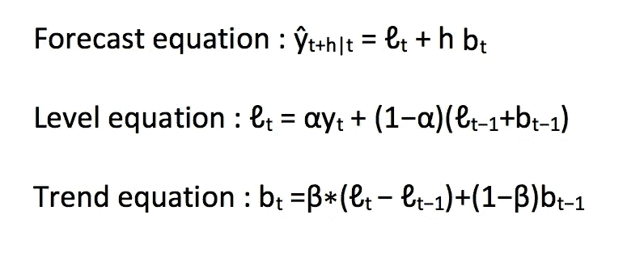

另一种最流行的技术是使用 ARIMA。这代表自回归综合移动平均线。正如你可能猜到的，它结合了移动平均值和自回归特性(查看后续时间步长之间的相关性)。ARIMA 模型遵循一种特定的方法。

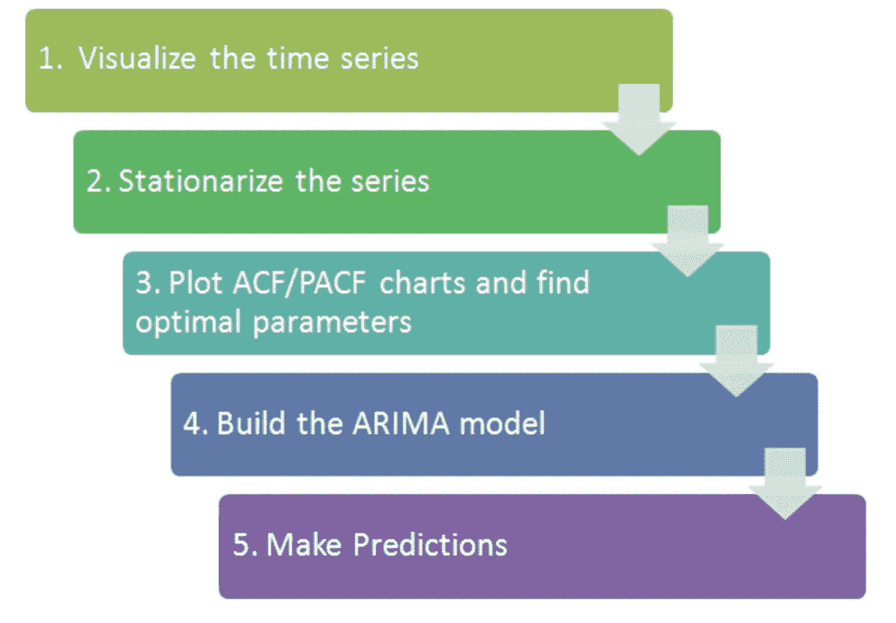

本质上，我们获取原始数据，对时间序列进行解耦，使其成为平稳和非平稳的组成部分。然后，我们可以研究被称为自相关或部分自相关图的图表，这些图表查看特定值与其前身相比的相关性有多强。由此，我们可以确定如何建立 ARIMA 模型来进行预测。

所有这些方法都依赖于具有某种自相关和/或周期性的平稳时间序列。这是股票市场固有的特征。股票市场确实有波动的时候，这些在大学的任何经济学课上都有详细的研究。它们是[基钦周期](https://en.wikipedia.org/wiki/Kitchin_cycle)(3-5 年的周期)[朱格拉周期](https://en.wikipedia.org/wiki/Juglar_cycle)(7-11 年的周期)[库兹涅茨摆动](https://en.wikipedia.org/wiki/Kuznets_swing)(15-25 年的周期)和康德拉季耶夫波(45-60 年的周期——尽管这个周期经济学家还在争论)。但是，个别公司的股票一般不会遵循这种趋势，有些人赢了，有些人输得比别人多。从时间序列模型的角度来看，它们受政治、社会经济和社会因素的影响，这些因素本质上是随机和混乱的。此外，人们对这些波动的理解还不够准确，无法根据它们的存在对经济市场的未来做出有用的预测——这是有道理的，因为否则的话，每个人都会这么做。

神经网络怎么样？

神经网络似乎适用于任何涉及非线性特征空间的事物。事实上，递归神经网络可以并且已经被用于预测股票市场。然而，在预测股票价格方面，递归神经网络(RNNs)面临着几个挑战，最明显的是与 RNNs 相关的消失梯度问题，以及非常嘈杂的预测。点击[这里](https://lilianweng.github.io/lil-log/2017/07/08/predict-stock-prices-using-RNN-part-1.html)可以找到一个全面的演示，展示如何实现一个叫做 LSTM 的基本类型的 RNN 来预测股票价格。

到目前为止，RNNs 最重要的问题是消失梯度问题。这个问题源于这样一个事实，即通过称为反向传播的程序优化的非常深的神经网络使用每层之间的导数来“学习”。这些导数可以相对较小，也可以相对较大。如果我的网络有 100 个隐藏层，我将一个小数字乘以 100 次，这个值基本上就消失了。这是一个问题，如果我所有的梯度都是零，我的网络什么也学不到，所以我能做什么？

对此有 3 种解决方案:

1.  剪切梯度法
2.  具有漏单元的特殊 RNN，如长短期记忆(LSTM)和门控循环单元(GRU)
3.  回声状态 RNNs

渐变裁剪阻止我们的渐变变得太大或太小，但是这样做我们仍然会丢失信息，所以这不是一个理想的方法。具有泄漏单元的 rnn 是好的，并且是大多数将 rnn 用于商业目的的个人和公司使用的标准技术。这些算法通过某种形式的梯度下降来适应所有连接(输入、循环、输出)。这使得这些算法很慢，更麻烦的是，这使得学习过程容易被[分叉](http://www.scholarpedia.org/article/Bifurcation)打断；不能保证收敛。因此，rnn 很少在实际工程应用中使用。

这就是回声状态网络的用武之地。回声状态网络是一个相对较新的发明，它本质上是一个递归神经网络，具有一个松散连接的隐藏层，称为“水库”，在存在混沌时间序列的情况下工作得非常好。在回声状态网络中，我们只需训练网络的输出权重，这样可以加快神经网络的训练速度，通常可以提供更好的预测，并解决我们之前用时间序列分析讨论过的所有问题。与其他方法相比，ESN 训练速度快，不会出现分叉，并且易于实现。在一些基准任务上，ESNs 明显优于所有其他非线性动力学建模方法。

回声状态网络是被称为水库计算的计算科学类别的一部分，我们将在下一节更详细地研究它。

**回声状态网络**

因此，我们已经证明，没有任何方法可以处理混乱的时间序列，不幸的是，这恰好是我们对股票市场建模的方式。避免这种困难的一种方法是固定递归和输入权重，并且只学习输出权重:回声状态网络(ESN)。隐藏单元形成了从历史输入中捕获不同方面的时间特征的“库”。

ESN 背后的数学论证相当复杂，因此为了本文的缘故，我将尽量避免它。相反，我们将讨论 ESN 背后的概念，并看看如何使用 Python 相对简单地实现它。

原始论文中概述为什么它被称为“回声”网络的描述是

*贯穿所有这些变化的统一主题是使用固定的 RNN 作为随机非线性可激发介质，其对驱动输入(和/或输出反馈)的高维动态“回声”响应被用作非正交信号基础，以通过线性组合重建期望的输出，从而最小化一些误差标准*

ESN 取任意长度的序列输入向量( *u* )并且(1)将其映射到高维特征空间(即，递归的储层状态 *h* )，并且应用线性预测器(线性回归)来找到 *ŷ.*

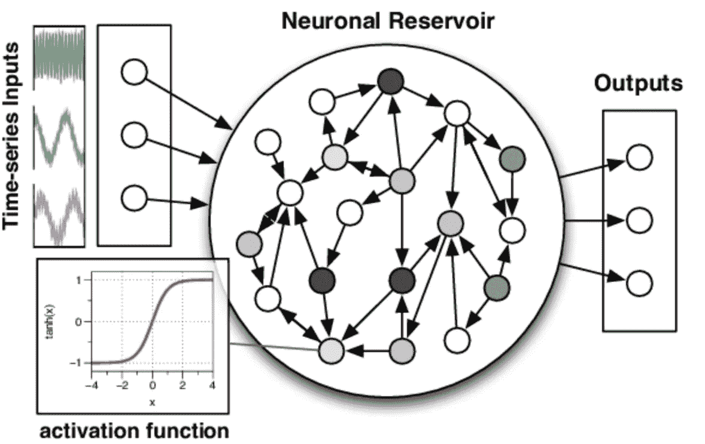

Schematic diagram of an echo state network.

我们基本上只训练输出权重，这大大加快了训练的速度。这就是油藏计算的巨大优势。通过设置和固定输入和循环权重来表示丰富的历史，我们获得:

*   作为接近稳定性的动力系统的循环状态——稳定性意味着雅可比矩阵都接近 1(没有消失或爆炸梯度)
*   部分记忆先前状态的泄漏隐藏单元——它们避免爆炸/消失梯度，同时不需要训练。

**回声状态属性**

为了使 ESN 原理工作，储层必须具有*回波状态属性* (ESP)，这将受激储层动态的渐近属性与驱动信号相关联。直观地说，电潜泵表明储层将从初始条件中逐渐洗去任何信息。如果储层权重矩阵(和泄漏率)在奇异值方面满足某些代数条件，则对于附加 sigmoid 神经元储层，ESP 是有保证的。

**培训**

所以你可能想知道，首先我们如何选择隐藏状态的值？输入和递归权重被随机初始化，然后被固定。所以，我们没有训练他们。我们应该如何修正它们以优化预测？

训练非常容易和快速，但是存在超参数，例如控制权重的随机生成、储层节点的程度、储层节点的稀疏性、谱半径的超参数。不幸的是，不存在优化超参数的系统方法，因此这通常是使用验证集来完成的。由于特征空间中存在固有的自相关，交叉验证对于时间序列数据是不可行的。

概括一下:

*   每个网络节点都有不同的动态行为
*   信号的时间延迟可能沿着网络链路出现
*   网络隐藏部分具有循环连接
*   输入和内部权重是固定的，并且是随机选择的
*   在训练期间，仅调整输出权重。

# 编码回声状态网络

现在到了你们期待已久的时刻，你们实际上是如何对这些神秘的网络进行编码的？我们使用一个 Python 库，它可以从这个 [GitHub 库](https://github.com/cknd/pyESN)中获得。这个库叫做 **PyESN** 。为了安装这个库，您必须克隆这个库并将`pyESN.py`文件放在您当前的 Jupyter 笔记本文件夹中。然后，当你在 Python 3 笔记本中时，你可以简单地称之为`import pyESN`。

你称 RC 为:

有关参数的简要说明:

`n_inputs:`输入维数

`n_outputs:`输出尺寸的数量

`n_reservoir:`水库神经元的数量

`ranodom_state:`种子为随机发生器

`sparsity:`将经常性权重的比例设置为零

`spectral_radius:`递归权重矩阵的谱半径

`noise:`添加到每个神经元的噪声(正则化)

**预测亚马逊股票价格**

现在，我将介绍一个使用 echo state networks 预测未来亚马逊股票价格的示例。首先，我们导入所有必要的库，并导出数据(在本例中，数据是从互联网上搜集来的)。

然后，我们使用 pyESN 库中的 ESN 来部署 RC 网络。这里的任务是通过使用之前的 1500 点预测未来两天，并对未来的 100 点进行预测(查看下图)。所以，最后你会有一个 100 时间步的预测，预测窗口= 2。我们将使用它作为验证集。

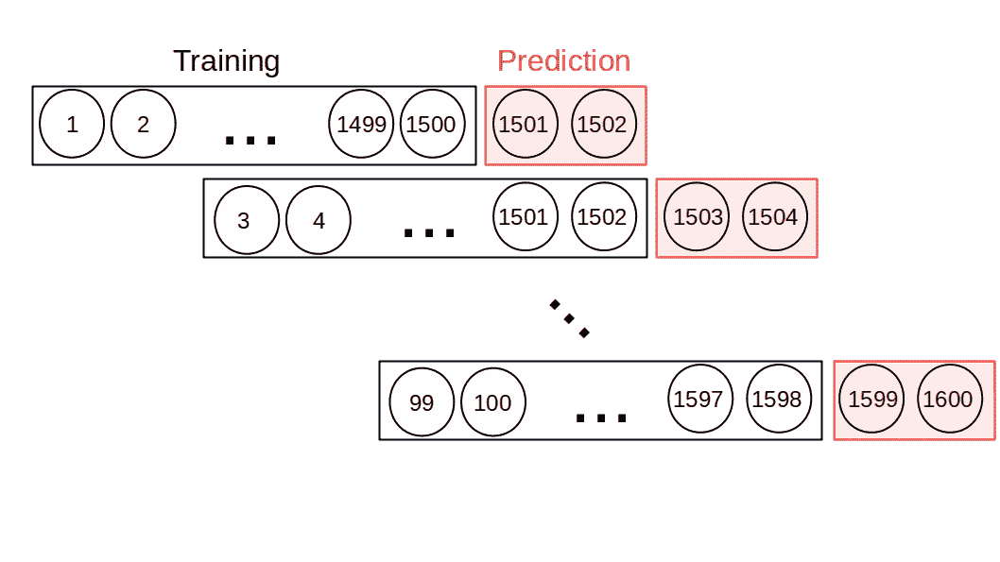

首先，我们使用一些合理的值创建我们的回声状态网络实现，并指定我们的训练和验证长度。然后，我们创建函数来计算均方误差，并针对频谱半径、噪声和窗口长度的特定输入参数运行回声状态网络。

现在，我们可以简单地运行一个函数，获得我们的预测，然后我们可以绘制这个图，看看我们做得有多好。

上面的代码产生了下面的情节。

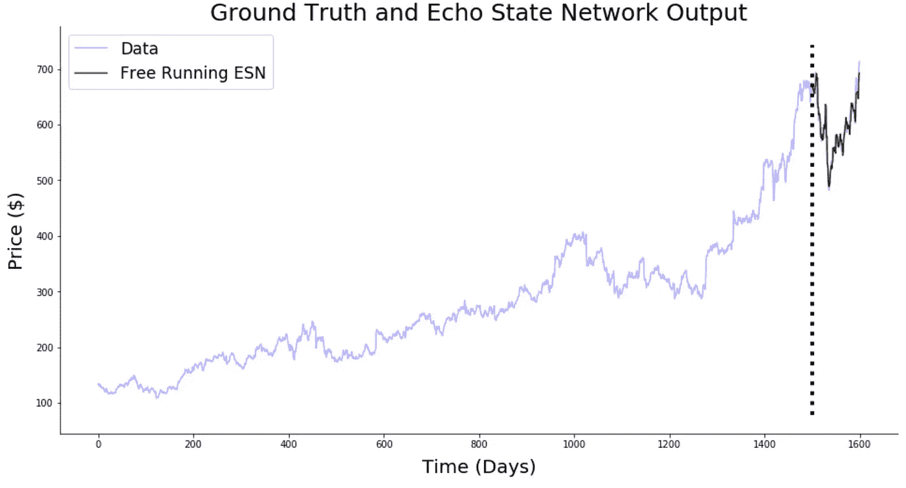

如果我们放大这个图，我们可以看到这个预测实际上是多么令人印象深刻。

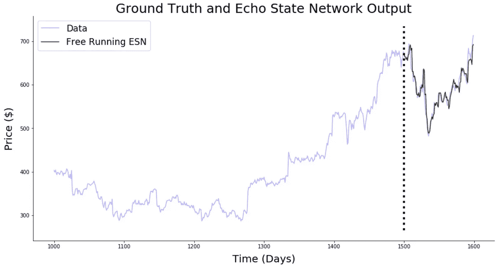

不错吧？唯一的警告是，它似乎在短时间内(大约 1 或 2 天)工作得很好，具有合理的准确性，但随着估计值的进一步外推，误差会变得越来越大。上面的模型是用两天的预测窗口制作的，这意味着我们在任何给定的时间只能预测未来的两天。

我们可以通过增加窗口长度来说明这一点。对于 10 天的窗口长度，预测仍然惊人地准确，尽管它明显比两天的预测窗口差。

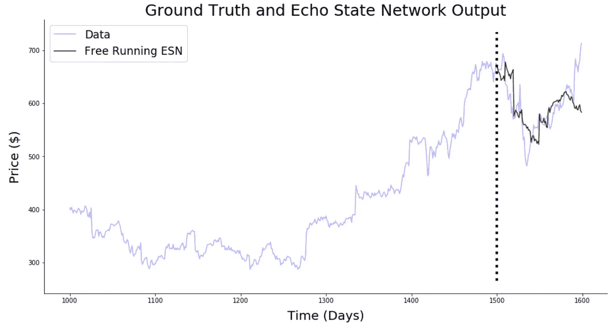

为了获得这么好的结果，我们必须进行大量的超参数优化；以下是获得上述结果中使用的超参数的步骤。

上面的代码需要一段时间来优化，这只是针对两个参数。当在热图上绘制 MSE 时，我们得到以下结果。

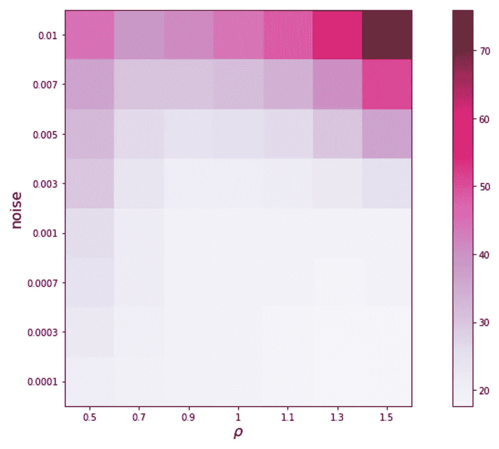

然而，当窗口函数很小时，它在我们的验证集上给了我们一个相当好的结果。这使得 ESN 有利于股票价格的短期预测，但如果你试图推断结果，事情会变得更加不确定和有风险。

在未来预测中，误差随时间传播，因此它随时间增加。这就是当窗口长度增加时精度降低的原因。我们可以在下图中看到这种行为，其中 MSE 是预测窗口的单调递增函数，因此预测越长意味着 MSE 越大。

**最后一句话**

回声状态网络分析混沌时间序列的能力使其成为数据高度非线性和混沌的金融预测的有趣工具。但是，除了预测股票市场，我们还可以利用这些网络做更多的事情。我们还可以:

*   预报天气
*   控制复杂动力系统
*   执行模式识别

预计未来会听到更多关于这类网络的信息，尤其是随着人们进入 DeepESN 模型的开发阶段，这些模型能够在更高维度的潜在空间中工作，具有时间特征，能够处理一些最困难的时间序列问题。

如果你对这些网络感兴趣，有更多讨论这些的文章和研究论文可以免费获取。

 [## 回声状态网络——scholar pedia

### 回声状态网络(ESN)为递归神经网络提供了架构和监督学习原理

www.scholarpedia.org](http://www.scholarpedia.org/article/Echo_state_network)  [## 深度回声状态网络(DeepESN):简要综述

### 深层递归神经网络(RNNs)的研究，特别是深层油藏计算(RC)的研究，正在获得越来越多的关注

arxiv.org](https://arxiv.org/abs/1712.04323) 

所有上述工作都在我的 GitHub 资源库中列出，可以在这里找到。

机器学习快乐！