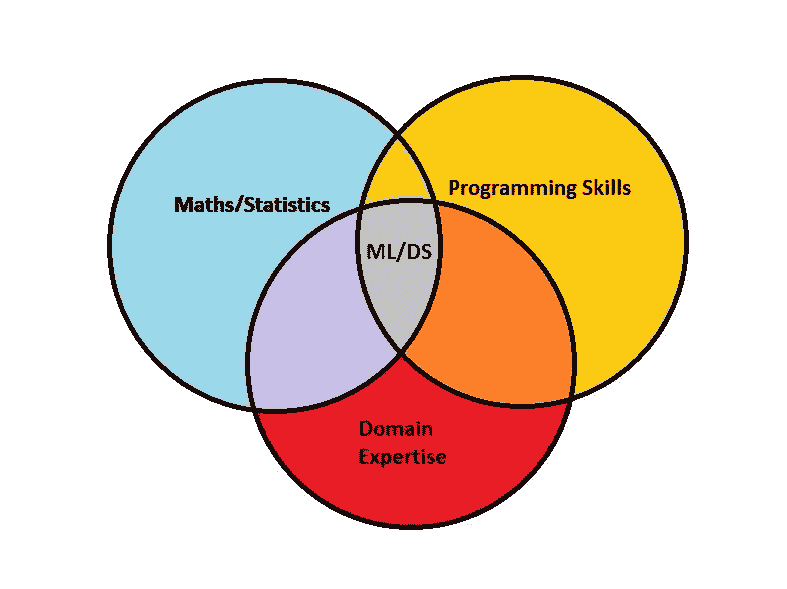
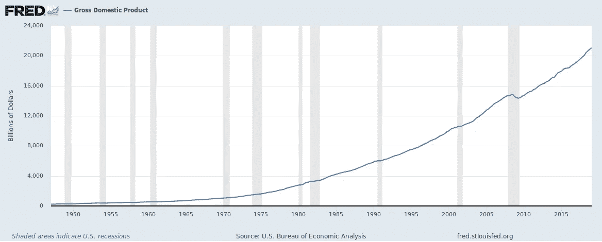
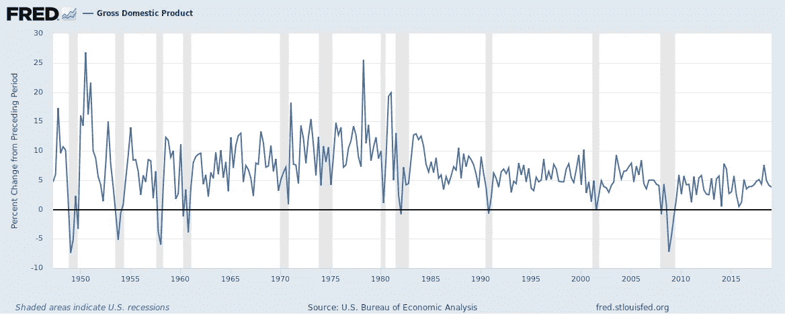

# 用机器学习预测股票

> 原文：<https://towardsdatascience.com/predicting-stocks-with-machine-learning-1f8c53faaca3?source=collection_archive---------5----------------------->

## 需要注意的 3 件重要事情

Photo by [Aron Visuals](https://unsplash.com/@aronvisuals?utm_source=medium&utm_medium=referral) on [Unsplash](https://unsplash.com?utm_source=medium&utm_medium=referral)

机器学习的激增是前所未有的。需要基于数据的决策制定的领域很少没有得到广泛应用。投资领域也不例外。人们只需在谷歌上联合搜索[**“ML”和“股票预测**”](https://www.google.com/search?q=machine+learning+stocks&rlz=1C1SQJL_enAU774AU774&oq=machine+learning+stocks&aqs=chrome..69i57j0l5.5101j0j8&sourceid=chrome&ie=UTF-8)，就会看到大量的时间序列预测和递归神经网络相关内容。尽管股票价格数据可能看起来是这些类型算法的完美候选，但我们应该谨慎从事，小心处理这项任务(尤其是如果涉及到您辛苦赚来的现金)。

那些开始接触机器学习的神秘预测艺术的人会回忆起他们在这个主题中的第一堂课，是下面维恩图的一些迭代:

这一点很清楚。机器学习(或数据科学)跨越了技术技能(如编程和数学)与领域专业知识形式的主题知识的融合。如果没有这三种形式，我们只是简单地回归到各自领域中更纯粹的形式之一。

这种描述对于金融机器学习尤其适用。时间序列金融数据极其微妙，将现成的算法应用于未处理的价格数据是错误发现或更糟的资本损失的完美方法。因此，使用这些数据需要一些特殊的考虑，最重要的是应用领域知识。因此，这篇文章旨在传授一些直觉，这些直觉经常被该领域的新手所忽视。我们将主要关注问题的讨论方面，因为相关的数学和编码资源已经非常丰富。

***来自《走向数据科学》编辑的提示:*** *虽然我们允许独立作者根据我们的* [*规则和指导方针*](/questions-96667b06af5) *发表文章，但我们并不认可每个作者的贡献。你不应该在没有寻求专业建议的情况下依赖一个作者的作品。详见我们的* [*读者术语*](/readers-terms-b5d780a700a4) *。*

# **1。数据，数据，数据**

Photo by [Markus Spiske](https://unsplash.com/@markusspiske?utm_source=medium&utm_medium=referral) on [Unsplash](https://unsplash.com?utm_source=medium&utm_medium=referral)

这可能不足为奇，因为数据是任何 ML 模型的关键因素，股票预测也不例外。为了理解我们的谨慎，我们需要首先理解数据生成过程。用于股票预测的常用分析领域数据集，如宏观经济、基本面和价格数据，都是时间序列数据的例子。这类数据有一种现象叫做****。**简单来说，每次观测的值锚定到前一个时间间隔观测的值。**

**为了在实践中说明这一点，让我们以价格为例。如果我们观察任何一只股票，并每天跟踪它的价格变动，我们会发现每只股票的收盘价都与前一天的收盘价紧密相连，只有一些“微小的”偏差，但这是为什么呢？最简单的形式是，股票是基础公司的所有权份额，其价值由永恒的会计等式决定， [**资产减去负债等于权益**](https://en.wikipedia.org/wiki/Equity_(finance)?source=post_page---------------------------) 。股权是公司的基本价值，占股价的大部分，投资者情绪、交易行为和噪音驱动着每日偏离。公司资产即机器、土地、建筑物和存货的价值不会在一夜之间发生重大变化，其负债也不会发生重大变化(并不总是如此)，因此，除了重大会计丑闻之外，公司的基本价值每天都应该相对稳定**。****

****这对机器学习意味着什么？这意味着一个模型可以通过“博弈”其损失函数并选择前一天的价格作为当天价格的预测来表现得相当好。当许多“表现良好的预测模型”的预测输出非常类似于实际股票价格的滞后移动平均值时，可以清楚地观察到这一点。任何这样的模型都会不断追逐真实价格。****

****类似的，是平稳性的问题。许多最大似然模型和预处理技术的基础是假设生成数据的分布参数是恒定的。或者，这可以解释为特征的均值和标准差不随时间变化，并且数据中没有趋势。随着时间的推移，看看常用的美国季度 GDP 数据就会很快打消这种想法。这些数据中显然有一个趋势，也应该有，如果一个经济体在增长，你会预期它的产出(以及这些产出的价格)会随着时间的推移而增长。****

********

******Source: BEA, US Nominal GDP over time******

******资料来源:BEA，美国一段时间的名义 GDP******

****该数据中的平均值和标准偏差是时变的，并且在盲目应用诸如回归的算法和诸如标准化和主成分分析的普通预处理技术时造成一些不便。****

****在(投资)文献和实践中，应对时间序列数据异常的一种常用技术是采用两个时期之间的股票价格回报(或其他数据的变化率),而不是绝对值。这背后的直觉类似于**时间序列预测中的去趋势或差分，旨在使数据平稳。如果我们将此应用于美国 GDP 数据，我们会得到一些开始类似于正常 iid 变量的东西。******

************

********Source: BEA, GDP % change from prior period********

******这种方法并不完美，并且会引入各种其他问题，但是它是被广泛接受的方法。******

******尽管用户需要了解财务数据的许多其他方面，但为了简洁起见，我将在以后的帖子中更全面地讨论这些方面。******

# ********2。任意误差项-现实世界的后果********

************

******Photo by [Emily Morter](https://unsplash.com/@emilymorter?utm_source=medium&utm_medium=referral) on [Unsplash](https://unsplash.com?utm_source=medium&utm_medium=referral)******

******大多数有监督的机器学习方法是通过估计或优化一组权重来拟合的，这些权重使一些目标函数最小化。在回归问题中这个函数常常是 [**【均方根误差】【RMSE】**](https://en.wikipedia.org/wiki/Root-mean-square_deviation?source=post_page---------------------------)和在分类中的 [**【交叉熵】**](https://en.wikipedia.org/wiki/Cross_entropy?source=post_page---------------------------) 。对于许多经典的基准数据集，如 ImageNet 大规模视觉识别挑战赛**(**[**【ils vrc】**](http://image-net.org/challenges/LSVRC/?source=post_page---------------------------)**)**，这已经成为一场“逐底竞赛”，高素质的团队成功地(并成功地)年复一年地大幅降低错误率。虽然这对于推进研究的目的来说可能是合适的，但是 ML 对强制减少一些任意误差项的关注鼓励了对现实世界问题的抽象。******

****在投资中，找到一个能够以 95%的准确率对何时买入或卖出股票进行分类的模型似乎是一个很好的结果，但通常这个模型不会模仿真实的投资组合行为，最重要的是不会考虑错误的成本。市场变化无常，尽管看似有利的投资环境可能持续数年，但调整或“ [**黑天鹅**](https://www.investopedia.com/terms/b/blackswan.asp?source=post_page---------------------------) ”事件(由 [**纳西姆·塔勒布**](https://en.wikipedia.org/wiki/Nassim_Nicholas_Taleb?source=post_page---------------------------) 杜撰)可能在几分钟内展开。****

****如果表征你 5%错误率的实例之一与这些罕见但灾难性的事件之一同时发生，几乎可以肯定的是，你的投资组合将遭受损失，可能会达到 95%的正确率(假设没有泛化错误)所带来的累积回报完全消失的程度。对于专业投资经理来说，这个问题更加严重，因为 10%的提款就足以引发投资者大规模撤离他们的基金。由收益和痛苦的不对称产生的后果在经验丰富的从业者心中根深蒂固。这就是为什么该行业既关注创造回报，也关注管理风险。****

****对于机器学习者/数据科学家来说，这里的课程是理解他们的模型的含义，不要只知道错误率和损失函数，执行 [**向前走测试**](https://en.wikipedia.org/wiki/Walk_forward_optimization?source=post_page---------------------------) ，就好像你一直持有你预测的交易，并引入成本敏感的措施，这些措施是**惩罚**你的模型是错误的。****

# ******3。战胜市场——比你想象的要难******

********

****Photo by [Inactive.](https://unsplash.com/@o1234567890?utm_source=medium&utm_medium=referral) on [Unsplash](https://unsplash.com?utm_source=medium&utm_medium=referral)****

****要理解为什么我们需要引入机会成本的概念，仅仅有一个能获得正回报的好的 ML 模型是不够的。这个关键的经济原则说明了放弃下一个最佳机会的代价。如果我们不使用提议的 ML 模型投资我们的钱，下一个最好的机会和一个需要很少技巧的机会是购买市场，大概是通过购买 ETF。这些产品以相对较低的成本给你带来类似标准普尔 500 指数的回报。因此，我们必须问一个问题，如果你的模型的表现，在调整交易成本后，没有明显超过标准普尔 500 指数的 18.74%[**&**](https://money.cnn.com/data/markets/sandp/?source=post_page---------------------------)**【你真的把钱用好了吗？专业投资经理几乎总是被某种基准所束缚，他们的技能是通过超越基准的能力来衡量的，这与机器学习者/数据科学家形成了对比，他们通常会孤立地评估自己的财务预测。******

# ********结论********

******虽然这个列表既不完整也不全面，但我希望我已经给了你一些直觉，告诉你在构建股票预测的 ML 模型时需要考虑的关键问题。与任何其他与数据相关的任务一样，ML 可能会给你一套工具来利用，但是找到解决方案仍然需要对问题有深入的了解。******

********免责声明**:本帖纯属个人观点和看法的表达。它不代表任何建议，也不反映我的雇主的观点。******