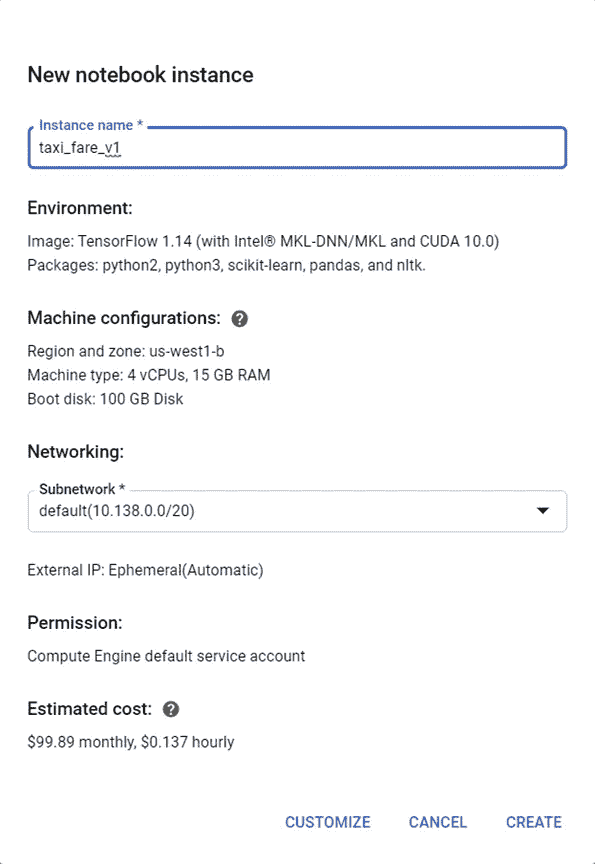
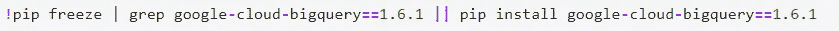
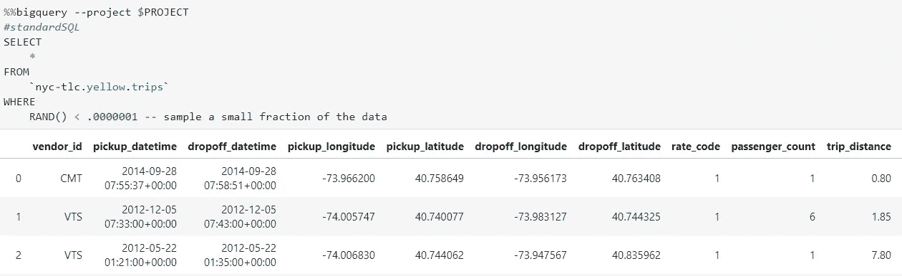
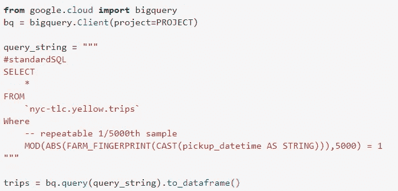
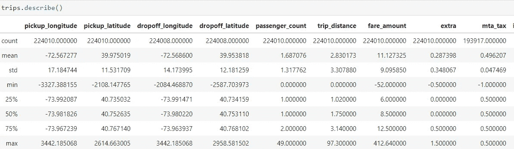
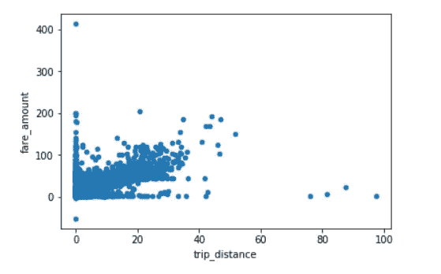
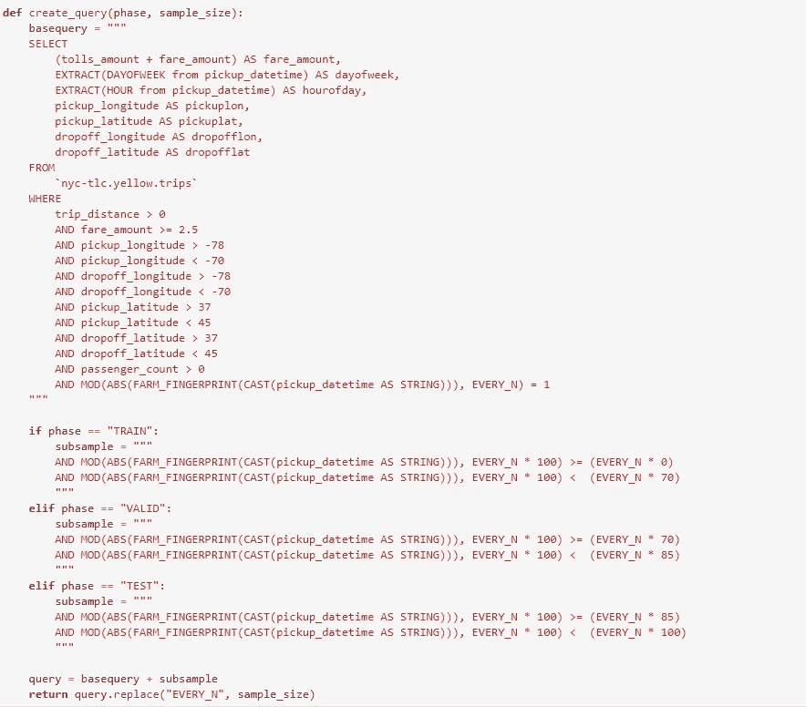
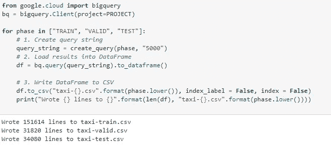

# 使用谷歌云人工智能平台预测纽约市的出租车价格(十亿多行)第 1 部分

> 原文：<https://towardsdatascience.com/predicting-taxi-fares-in-nyc-using-google-cloud-ai-platform-billion-rows-part-1-ac121832babf?source=collection_archive---------18----------------------->


Taxis | Photo by Francesco Ungaro on pexels.com

该项目旨在创建一个机器学习模型，使用 BigQuery 中托管的出租车乘坐数据集来估计纽约市的出租车费用。有超过 a **十亿**行的大小为 130 GB。你可以在这里找到[。这篇文章是基于我在谷歌云平台](https://console.cloud.google.com/bigquery?project=bigquery-public-data&p=nyc-tlc&d=yellow&t=trips&page=table)[专业化](https://www.coursera.org/specializations/machine-learning-tensorflow-gcp)上使用 TensorFlow 进行机器学习的经验。

首先，我们必须在 Google 云平台上建立一个项目，并启动一个笔记本实例。



这个实例将花费我们大约每小时**0.14 美元**。我们还需要启用计算引擎 API 并创建一个存储桶。


## **数据准备**

**安装 BigQuery 库并预览数据**



我们使用 **RAND()** 函数从这个庞大的数据集中抽取一个**小样本**。

缺点是我们每次运行这个查询都会得到不同的样本。因此，我们将使用散列函数。

```
MOD(ABS(FARM_FINGERPRINT(CAST(pickup_datetime AS STRING))), 5000)= 1
```

此功能使我们能够获得原始数据的 **0.02%** 的恒定样本。利用整个数据集进行探索需要巨大的计算能力。我计划将来使用整个数据集建立一个模型。

**将数据加载到熊猫数据框架中**



我们肯定需要清理我们的数据。比如经纬度值关(纬度应该在-90°到 90°之间；经度应该在-180 到 180 之间)。有些行程的票价为负数，有些行程的乘客数为零。

让我们画出**行程 _ 距离** vs **车费 _ 金额**



一些坏数据被编码为零。此外，我们不打算在预测中包括小费，因为他们往往是不可预测的。我们的目标变量将是**票价 _ 金额+通行费 _ 金额**

**我们的预测值是:**

> 拾取日期时间
> 
> 收件人 _ 经度
> 
> 皮卡 _ 纬度
> 
> 经度下降
> 
> 下降纬度

我们选择这些是因为它们最符合我们的目标。有人可能会争辩说, **trip_distance** 可以帮助我们确定费用，但是我们排除了它，因为它并不总是可以提前知道的。我们的项目可能会应用于打车行业，我们可以提前预测出行成本，为了准确起见，应该选择源/目的地的位置坐标而不是 trip_distance。

**数据清理**

我们遵循以下原则来过滤不合理的数据:

*   票价金额应大于 **$2.5**
*   出发地/目的地位置坐标应在纽约市限制范围内
*   乘客数量不能为零
*   行程距离不能为零

```
SELECT
  (tolls_amount + fare_amount) AS fare_amount, -- label
  pickup_datetime,
  pickup_longitude, 
  pickup_latitude, 
  dropoff_longitude, 
  dropoff_latitude
FROM
  `nyc-tlc.yellow.trips`
WHERE
  -- Clean Data
  trip_distance > 0
  AND passenger_count > 0
  AND fare_amount >= 2.5
  AND pickup_longitude > -78
  AND pickup_longitude < -70
  AND dropoff_longitude > -78
  AND dropoff_longitude < -70
  AND pickup_latitude > 37
  AND pickup_latitude < 45
  AND dropoff_latitude > 37
  AND dropoff_latitude < 45
  -- repeatable 1/5000th sample
  AND MOD(ABS(FARM_FINGERPRINT(CAST(pickup_datetime AS STRING))),5000) = 1
```

让我们通过从 **pickup _datetime** 中获取 **dayofweek** 和 **hourofday** 来创建一些分类特征

```
SELECT
  (tolls_amount + fare_amount) AS fare_amount, -- label
  EXTRACT(DAYOFWEEK from pickup_datetime) AS dayofweek,
  EXTRACT(HOUR from pickup_datetime) AS hourofday,
  ------------------
  ------------------
```

**将数据分为训练集、验证集和测试集**

我们将我们的**1/5000**样本**分成 70–15–15**



**将数据写入 CSV**

在接下来的步骤中，我们将使用 **TensorFlow** 创建一个机器学习模型，它直接从 BigQuery 读取文件很慢。因此，我们将数据写成**。csv** 文件



假设我们只使用了总数据的一个样本(0.02%)，我们还有 151k 行可以训练，这已经很不错了。

我们讨论模型创建的下一篇文章可以在[这里](https://medium.com/@tejanirla4/predicting-taxi-fares-in-nyc-using-google-cloud-ai-platform-billion-rows-part-2-f0191a70dea8)找到。

在 [LinkedIn](http://www.linkedin.com/in/tejan-irla) 上和我联系。你可以在这里找到完整的代码。

干杯！！