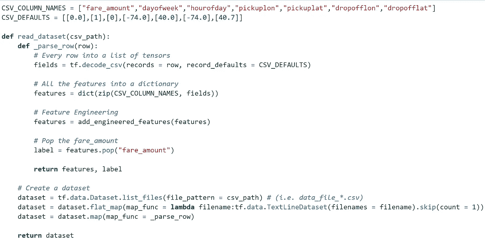
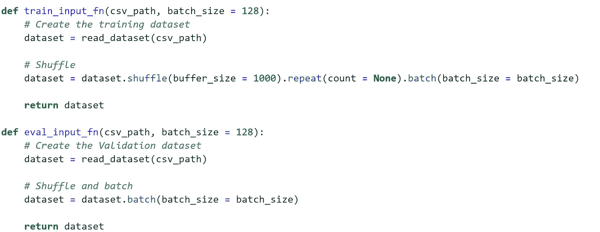
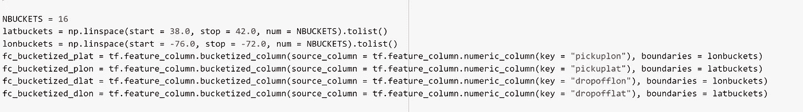
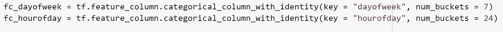
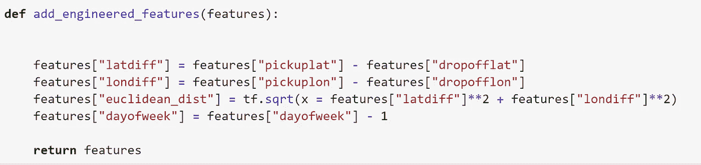
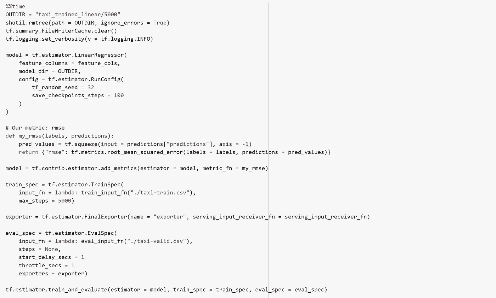
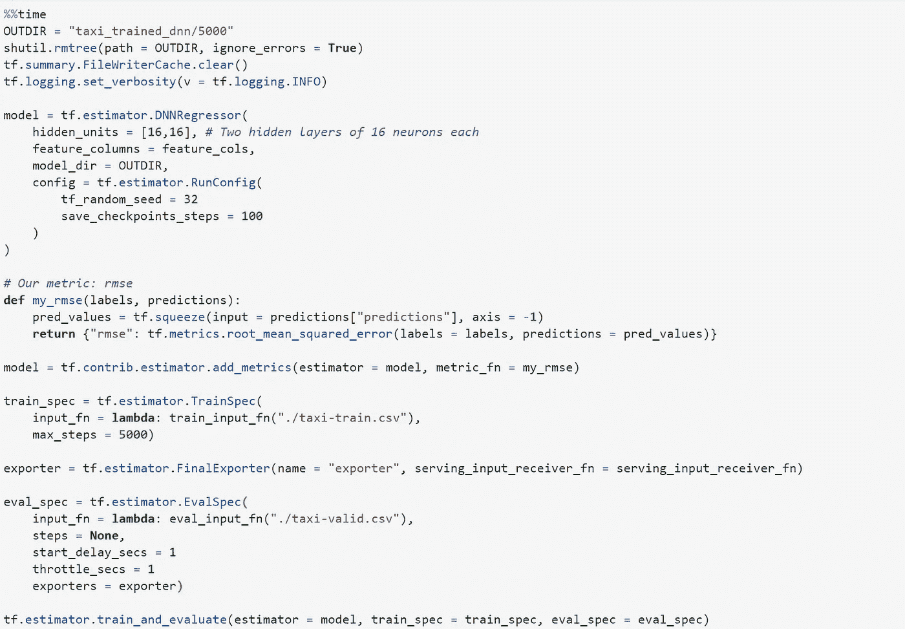
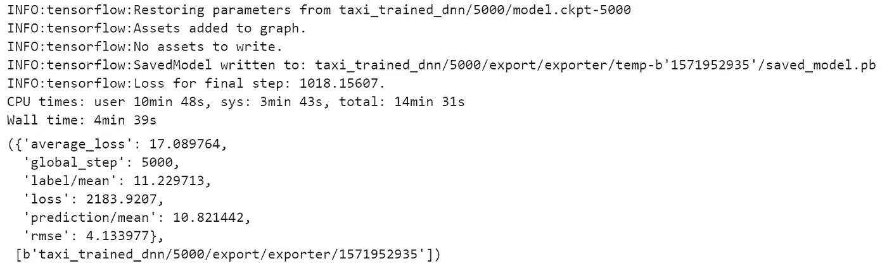

# 使用谷歌云人工智能平台预测纽约市的出租车价格(十亿多行)第 2 部分

> 原文：<https://towardsdatascience.com/predicting-taxi-fares-in-nyc-using-google-cloud-ai-platform-billion-rows-part-2-f0191a70dea8?source=collection_archive---------32----------------------->


Taxis | Photo by Life of Pix on [pexels.com](https://www.pexels.com/photo/new-york-street-cabs-taxis-8247/)

在这一系列文章中，我们正在处理一个真实世界的纽约出租车乘坐数据集，该数据集托管在 BigQuery 中，以便能够估计车费金额。

在[上一篇](/predicting-taxi-fares-in-nyc-using-google-cloud-ai-platform-billion-rows-part-1-ac121832babf)中，我们在 Google 云平台上建立了一个项目，启动了一个预装 TensorFlow 的 AI 笔记本实例，并准备/清理/采样了数据。现在到了我们建立一个模型来预测目标变量的部分。

我们将使用 **tf.estimator** ，一个高级 TensorFlow API 来构建我们的模型。详细信息可以在这里[找到。](http://www.tensorflow.org)

使用这个 API 有四个主要步骤。

*   创建一个函数来导入数据集
*   定义特征列
*   实例化评估者
*   培训/评估

## **创建一个函数来导入数据集**



另一种方法是使用`tf.data.experimental.make_csv_dataset` 函数来读取数据集。

对于较小的数据集，我们可以将它们加载到 pandas 数据帧中，因为它们适合内存。我们可以使用`tf.data.Dataset.from_tensor_slices`读取这些数据帧

**导入训练和验证集的函数**



## 定义特征列

任何预测分析项目中最重要的步骤之一是特征工程。有了一些经验、领域专业知识和良好的老式尝试和错误，您可以设计出显著改善最终结果的特性。

**存储纬度和经度**



**一个热编码**



**TF . feature _ column . crossed _ column**

使用 TF . feature _ column . crossed _ column 创建一个为我们提供时间和星期组合信息的要素。例如，周五晚上和周日晚上的票价可能会有很大不同。

```
fc_crossed_day_hr = tf.feature_column.crossed_column(keys = [fc_dayofweek, fc_hourofday], hash_bucket_size = 24 * 7)
```

创建一个函数，以便我们可以在读取数据的同时创建新的功能。



我们创建坐标之间的欧几里德距离作为一个特征，以及单独的纬度差和经度差，这将为我们提供关于行驶方向的信息。

最后，创建我们决定用来训练模型的特征列的列表，并创建服务输入接收器函数

## 培训/评估

线性模型



> RMSE 是 **7.4**

现在，让我们使用 DNN 回归器来训练我们的模型，这将更好地理解非线性关系。



> 我们得到的均方根误差为 4.13

在下一篇文章中，我们将调整**超参数**来改进这个结果，并对包含 10 亿次以上乘坐的整个数据进行训练。正如你所猜测的，我们不能在我们的笔记本电脑上这样做。是时候转向云计算了。

资源:[Google 云平台上 TensorFlow 的机器学习](https://www.coursera.org/specializations/machine-learning-tensorflow-gcp)

在 [LinkedIn](http://www.linkedin.com/in/tejan-irla) 上与我联系。你可以在这里找到完整的代码。

干杯！！