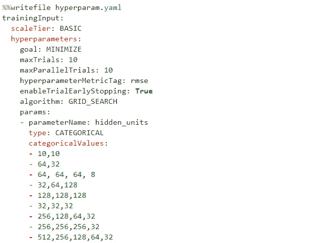
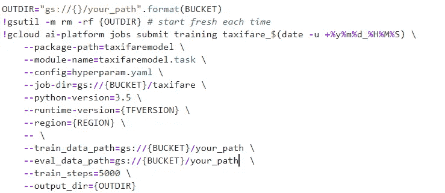

# 使用谷歌云人工智能平台预测纽约市的出租车价格(十亿多行)第 3 部分

> 原文：<https://towardsdatascience.com/predicting-taxi-fares-in-nyc-using-google-cloud-ai-platform-billion-rows-part-3-3c6a6b5cd1e2?source=collection_archive---------37----------------------->


Taxis | Photo by Nout Gons on [pexels.com](https://www.pexels.com/photo/action-america-architecture-avenue-378570/)

这一系列文章的目标是创建一个机器学习模型，能够在乘坐开始之前估计纽约市的出租车费用。这种模式的一个版本已经应用于拼车行业，用户喜欢在选择目的地后立即知道乘车的费用。

在前两篇帖子中，我们在谷歌云平台上创建了一个项目，清理了数据，创建了功能，并最终在本地这个庞大数据集的一个小样本上训练了一个模型。我们能够达到 4.13 的 RMSE。

[](/predicting-taxi-fares-in-nyc-using-google-cloud-ai-platform-billion-rows-part-1-ac121832babf) [## 使用谷歌云人工智能平台预测纽约市的出租车价格(十亿多行)第 1 部分

### 这个项目旨在创建一个机器学习模型，使用数据集来估计纽约市的出租车费用…

towardsdatascience.com](/predicting-taxi-fares-in-nyc-using-google-cloud-ai-platform-billion-rows-part-1-ac121832babf) [](/predicting-taxi-fares-in-nyc-using-google-cloud-ai-platform-billion-rows-part-2-f0191a70dea8) [## 使用谷歌云人工智能平台预测纽约市的出租车价格(十亿多行)第 2 部分

### 在这一系列文章中，我们正在处理一个真实世界的纽约出租车乘坐数据集，该数据集由 BigQuery 托管，以…

towardsdatascience.com](/predicting-taxi-fares-in-nyc-using-google-cloud-ai-platform-billion-rows-part-2-f0191a70dea8) 

在这篇文章中，我们对整个数据集进行训练，并执行超参数调整。我们开始吧。

我已经将来自 Bigquery 的整个 130 GB 数据集作为分片 CSV 文件存储到我在 GCP 的存储桶中。TensorFlow 可以直接从 BigQuery 中读取，但这个过程非常慢，而且最好是使用 CSV 文件，就像我在之前的[帖子](/predicting-taxi-fares-in-nyc-using-google-cloud-ai-platform-billion-rows-part-2-f0191a70dea8)中使用示例所做的那样。

## 云人工智能平台

在云上训练有两个主要步骤:

*   把代码做成 Python 包(创建 **__init__)。py、task.py、**和 **model.py** 文件)
*   将使用 gcloud 的 Python 包提交到云 AI 平台

**创建 task.py**

```
%%writefile your_path/task.py
import argparse
import json
import osfrom . import modelif __name__ == "__main__":
    parser = argparse.ArgumentParser()
    parser.add_argument(
        "--hidden_units",
        help = "Hidden layer sizes,
        type = str,
        default = "16,16"
    )
    parser.add_argument(
        "--train_data_path",
        help = "Path to training data",
        required = True
    )
    parser.add_argument(
        "--train_steps",
        help = "Training steps",
        type = int,
        default = 1000
    )
    parser.add_argument(
        "--eval_data_path",
        help = "Path to evaluation data",
        required = True
    )
    parser.add_argument(
        "--output_dir",
        help = "Output Directory",
        required = True
    )
    parser.add_argument(
        "--job-dir",
        help="Required by gcloud",
    )
    args = parser.parse_args().__dict__

    # Append trial_id r
    args["output_dir"] = os.path.join(
        args["output_dir"],
        json.loads(
            os.environ.get("TF_CONFIG", "{}")
        ).get("task", {}).get("trial", "")
    ) 
    # Run
    model.train_and_evaluate(args)
```

**创建 model.py**

需要优化的超参数需要作为命令行参数传入

```
%%writefile your_path/model.py
import tensorflow as tf
import numpy as np
import shutil
print(tf.__version__)CSV_COLUMN_NAMES = ["fare_amount","dayofweek","hourofday","pickuplon","pickuplat","dropofflon","dropofflat"]
CSV_DEFAULTS = [[0.0],[1],[0],[-74.0],[40.0],[-74.0],[40.7]]def read_dataset(csv_path):
    def _parse_row(row):
        # Every row into a list of tensors
        fields = tf.decode_csv(records = row, record_defaults = CSV_DEFAULTS)# All the features into a dictionary
        features = dict(zip(CSV_COLUMN_NAMES, fields))

        # Feature Engineering
        features = add_engineered_features(features)

        # Pop the fare_amount 
        label = features.pop("fare_amount")return features, label

    # Create a dataset
    dataset = tf.data.Dataset.list_files(file_pattern = csv_path) # (i.e. data_file_*.csv)
    dataset = dataset.flat_map(map_func = lambda filename:tf.data.TextLineDataset(filenames = filename).skip(count = 1))
    dataset = dataset.map(map_func = _parse_row)

    return datasetdef train_input_fn(csv_path, batch_size = 128):
    # Create the training dataset
    dataset = read_dataset(csv_path)

    # Shuffle
    dataset = dataset.shuffle(buffer_size = 1000).repeat(count = None).batch(batch_size = batch_size)

    return datasetdef eval_input_fn(csv_path, batch_size = 128):
    # Create the Validation dataset
    dataset = read_dataset(csv_path)# Shuffle and batch 
    dataset = dataset.batch(batch_size = batch_size)

    return dataset

# One Hot Encoding
fc_dayofweek = tf.feature_column.categorical_column_with_identity(key = "dayofweek", num_buckets = 7)
fc_hourofday = tf.feature_column.categorical_column_with_identity(key = "hourofday", num_buckets = 24)# Bucketize latitudes and longitudes
NBUCKETS = 16
latbuckets = np.linspace(start = 38.0, stop = 42.0, num = NBUCKETS).tolist()
lonbuckets = np.linspace(start = -76.0, stop = -72.0, num = NBUCKETS).tolist()
fc_bucketized_plat = tf.feature_column.bucketized_column(source_column = tf.feature_column.numeric_column(key = "pickuplon"), boundaries = lonbuckets)
fc_bucketized_plon = tf.feature_column.bucketized_column(source_column = tf.feature_column.numeric_column(key = "pickuplat"), boundaries = latbuckets)
fc_bucketized_dlat = tf.feature_column.bucketized_column(source_column = tf.feature_column.numeric_column(key = "dropofflon"), boundaries = lonbuckets)
fc_bucketized_dlon = tf.feature_column.bucketized_column(source_column = tf.feature_column.numeric_column(key = "dropofflat"), boundaries = latbuckets)# Crossed Column
fc_crossed_day_hr = tf.feature_column.crossed_column(keys = [fc_dayofweek, fc_hourofday], hash_bucket_size = 24 * 7)def add_engineered_features(features):

    features["latdiff"] = features["pickuplat"] - features["dropofflat"] 
    features["londiff"] = features["pickuplon"] - features["dropofflon"] 
    features["euclidean_dist"] = tf.sqrt(x = features["latdiff"]**2 + features["londiff"]**2)
    features["dayofweek"] = features["dayofweek"] - 1return features#1\. Created using tf.feature_column module
    tf.feature_column.indicator_column(categorical_column = fc_crossed_day_hr),
    fc_bucketized_plat,
    fc_bucketized_plon,
    fc_bucketized_dlat,
    fc_bucketized_dlon,
    #2\. Created in the input functions
    tf.feature_column.numeric_column(key = "latdiff"),
    tf.feature_column.numeric_column(key = "londiff"),
    tf.feature_column.numeric_column(key = "euclidean_dist") 
]def serving_input_receiver_fn():
    receiver_tensors = {
        'dayofweek' : tf.placeholder(dtype = tf.int32, shape = [None]), # shape is vector to allow batch of requests
        'hourofday' : tf.placeholder(dtype = tf.int32, shape = [None]),
        'pickuplon' : tf.placeholder(dtype = tf.float32, shape = [None]), 
        'pickuplat' : tf.placeholder(dtype = tf.float32, shape = [None]),
        'dropofflat' : tf.placeholder(dtype = tf.float32, shape = [None]),
        'dropofflon' : tf.placeholder(dtype = tf.float32, shape = [None]),
    }

    features = add_engineered_features(receiver_tensors) # 'features' is what is passed on to the model

    return tf.estimator.export.ServingInputReceiver(features = features, receiver_tensors = receiver_tensors)

def train_and_evaluate(params):
    OUTDIR = params["output_dir"]model = tf.estimator.DNNRegressor(
        hidden_units = params["hidden_units"].split(","), 
        feature_columns = feature_cols, 
        model_dir = OUTDIR,
        config = tf.estimator.RunConfig(
            tf_random_seed = 1, # for reproducibility
            save_checkpoints_steps = max(100, params["train_steps"] // 10)
        ) 
    )def my_rmse(labels, predictions):
        pred_values = tf.squeeze(input = predictions["predictions"], axis = -1)
        return {"rmse": tf.metrics.root_mean_squared_error(labels = labels, predictions = pred_values)}

    model = tf.contrib.estimator.add_metrics(model, my_rmse)train_spec = tf.estimator.TrainSpec(
        input_fn = lambda: train_input_fn(params["train_data_path"]),
        max_steps = params["train_steps"])exporter = tf.estimator.FinalExporter(name = "exporter", serving_input_receiver_fn = serving_input_receiver_fn)eval_spec = tf.estimator.EvalSpec(
        input_fn = lambda: eval_input_fn(params["eval_data_path"]),
        steps = None,
        start_delay_secs = 1, 
        throttle_secs = 1, 
        exporters = exporter)tf.logging.set_verbosity(v = tf.logging.INFO) # so loss is printed during training
    shutil.rmtree(path = OUTDIR, ignore_errors = True) # start fresh each timetf.estimator.train_and_evaluate(model, train_spec, eval_spec)
```

**创建超参数调整配置**

云 AI 平台默认使用**贝叶斯优化**。当只调整几个参数时，我们也可以使用**网格搜索**或随机搜索。

这里我们只调整一个参数，即隐藏单元的数量。所有试验都是平行进行的。



**启用 AI 平台 API**


**运行培训作业**



我们可以在数据集的一部分上运行这个来获得更好的想法，然后在整个数据上尝试最佳组合。

我发现隐藏单元的最佳配置是“ **64，64，64，8** ”，RMSE 为 **3.98。**

我们的三部分系列到此结束。通过采用不同的方法，如设计新功能、选择不同的模型、调整更多的超参数等，可以实现许多改进。创造最好的模型需要耐心和大量的尝试和错误。

资源:[Google 云平台上 TensorFlow 的机器学习](https://www.coursera.org/specializations/machine-learning-tensorflow-gcp)

在 [LinkedIn](http://www.linkedin.com/in/tejan-irla) 上与我联系。你可以在这里找到完整的代码。

干杯！！