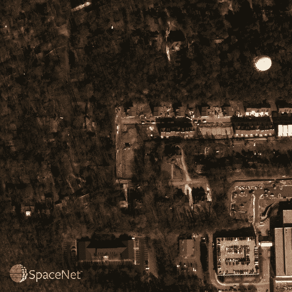
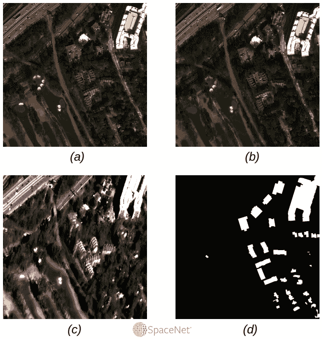
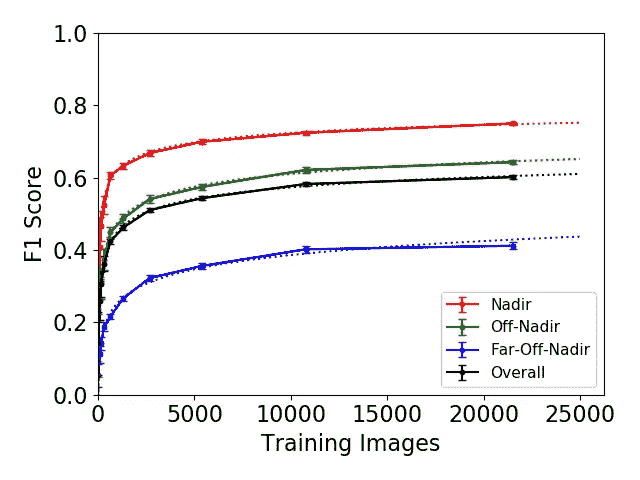
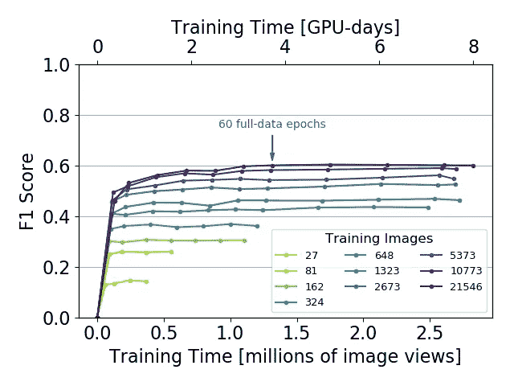
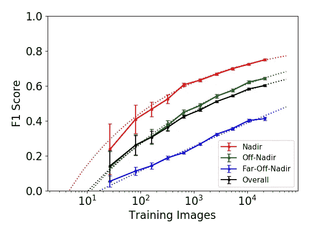
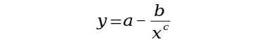
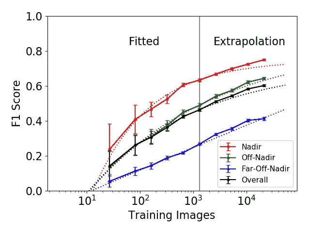
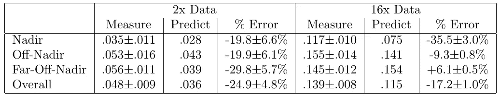

# 使用更少的数据预测更多训练数据的效果

> 原文：<https://towardsdatascience.com/predicting-the-effect-of-more-training-data-by-using-less-c3dde2f9ae48?source=collection_archive---------25----------------------->

## 使用地理空间深度学习的案例研究，一步一步地估计增加的训练数据的价值

A satellite image and its building footprint ground truth mask from our geospatial case study.

场景是这样的:你付出了巨大的困难和代价来收集一些训练数据，并使用这些数据来训练一个深度神经网络。然而，你发现自己在想，“我有足够的钱吗？”更多的训练数据会带来有意义的性能提升吗，或者只是为了无关紧要的收益而浪费时间和金钱？起初，这看起来几乎是矛盾的:如果不知道收集更多数据会有多大帮助，你就无法做出明智的决定，但除非你已经做出决定并获得了额外的数据，否则你无法衡量它会有多大帮助。

然而，有一个解决办法。通过用现有的不同大小的训练数据子集重复训练深度神经网络，有可能将性能外推至超出目前可用的训练数据量。

我们将使用计算机视觉领域的一个重要的[测试案例](https://medium.com/the-downlinq/robustness-of-limited-training-data-for-building-footprint-identification-part-1-8c55810b5ef9)来完成这个过程:在卫星照片中描绘出建筑物的轮廓。自动绘制建筑物地图的能力，而不是每次事情发生变化都依赖大量的人工劳动，其应用范围从救灾到城市规划。

# 我们的案例研究:在卫星图像中构建足迹

## 数据

要对卫星图像进行研究，我们需要从获取一些图像开始！为此，我们求助于 [SpaceNet](https://registry.opendata.aws/spacenet/) ，它维护着一个免费、开源、随时可用的数据存储库，存储了数千平方公里的带标签的高分辨率卫星图像。

我们将使用 SpaceNet 的最新(截至本文撰写时)数据发布:Maxar 的 WorldView-2 卫星在佐治亚州亚特兰大上空采集的一系列数据。影像中包含高质量的建筑物覆盖区(轮廓)标注。这个数据集是现在已经完成的 [SpaceNet4 挑战](https://medium.com/the-downlinq/the-spacenet-challenge-off-nadir-buildings-introducing-the-winners-b60f2b700266)的基础。这些影像从 27 个不同的视角显示了同一区域，这使得它非常适合研究视角如何影响地理空间深度学习算法的性能。为了简单起见，我们将我们的结果分为三类:“天底”，视角在天底 25 度以内(垂直向下)，“离天底”，视角从天底 26 度到 40 度，以及“远离天底”，视角超过天底 40 度。我们还将“总体”绩效定义为三个类别绩效的简单平均值。图 1 示出了从不同角度成像的例子。

Fig. 1: Different viewing angles for the same physical location, including (a) an on-nadir view, (b) an off-nadir view from the north, and © a far-off-nadir view from the south. Image (d) shows the corresponding building footprint mask, used in training to tell the model what is or isn’t a building.

## 模型

我们将训练的寻找建筑物的模型也来自 SpaceNet。我们将使用[第五名提交的 SpaceNet4 挑战赛](https://github.com/SpaceNetChallenge/SpaceNet_Off_Nadir_Solutions/tree/master/XD_XD)。虽然其他一些提交稍微优于这个模型，但这个模型由于其快速的推理时间和简单的架构而更受欢迎。该模型的推理速度比顶级 SpaceNet4 获胜者快十倍以上。它使用带有 VGG-16 编码器的 U-Net 进行像素分割，然后根据像素图生成建筑物覆盖区多边形。为了加快训练，最初提交的三个神经网络的集合被削减为一个网络，仅导致适度的性能下降，这在别处[讨论过](https://medium.com/the-downlinq/robustness-of-limited-training-data-part-2-f51eb783823f)。

为了[量化](https://medium.com/the-downlinq/the-spacenet-metric-612183cc2ddb)模型性能，为模型识别的建筑足迹计算 [F1 分数](https://en.wikipedia.org/wiki/F1_score)。出于计算目的，如果一个占地面积与地面真实建筑占地面积的 [IoU](https://en.wikipedia.org/wiki/Jaccard_index) (交集/并集)至少为 0.5，则认为该占地面积是正确的。

## 结果呢

若要了解模型性能如何依赖于训练数据量，请使用不同的数据量对同一模型进行训练。

数据被切割成 900 像素的方块，每个方块显示 450 米的面积。平均每个瓦片有 63 个建筑。在训练数据中有 1064 个独特的图块位置，每个位置有 27 个视图。由于我们的算法留出了四分之一的数据用于验证，因此对完整数据集的训练给了我们 1064 * 27 * (3/4) = 21546 幅图像。图 2 显示了如果我们用更少的数据训练会发生什么。训练和评估过程重复十次。但是每一次，我们从零开始，使用的数据只有上次的一半。当数据不足时，性能会随着新数据的增加而迅速提高，但当数据充足时，回报会逐渐减少。

Fig. 2: Model performance, as measured by F1 score, versus number of training images. Images are 900x900 pixel regions of satellite photos with 0.5m resolution.

既然我们都同意我们的案例研究，是时候把它作为解决我们主要问题的环境了:在数据可用之前，我们如何用大量数据对模型性能做出有根据的猜测？要做到这一点，有几个步骤。

# 第一步:知道何时停止训练

对于这个过程，我们将需要使用不同数量的数据从头开始多次训练模型。如果模型是硬编码的，以训练一定数量的时期或一定数量的时间(无论是使用该时期后的最终权重还是最佳中间权重)，则值得努力研究所有这些时间是否真的有必要。图 3 示出了对于不同数量的数据，作为训练时间的函数的模型性能。最上面的一行使用完整的数据集，随后的每一行使用其上一行的大约一半的训练数据。

Fig. 3: Model performance, as measured by F1 score, versus amount of training time. Training time is expressed as number of image views and also approximate GPU-days on Nvidia Titan Xp GPUs.

回想一下，当训练数据集大小减半时，训练时期的数量必须加倍，以获得相同的图像视图总数。但是，达到最高性能所需的图像视图数量可能会随着数据的减少而减少。对于我们的地理空间案例研究，使用 21546 幅图像的完整训练数据集，需要大约 60 个历元才能达到最佳性能。但是当只使用了几百个图像时，必要的图像视图的数量下降到低于全部训练数据集的 5 个时期的当量。使用完整的数据集进行训练大约需要四个 GPU 日(在 Nvidia Titan Xp 上)。虽然这是不可避免的，但知道我们至少可以在减少数据的情况下进行较少的培训，这带来了一些值得欢迎的时间节省。

一旦我们用不同数量的数据进行了训练，并评估了模型的每个版本，我们就可以在图 2 中绘出这些点。但是我们还没有准备好去拟合一条曲线。

# 步骤 2:生成误差线

许多深度学习论文引用性能数据时没有误差线。然而，在没有误差线的情况下，不清楚观察到的性能改进是否具有统计意义，或者结果是否可重复。对于我们的外推任务，误差线是必要的。在案例研究中，我们有十个数据点，每个数据点代表不同数量的训练数据。为了节省时间，我们将只计算其中四个的误差线，并对其余的进行对数插值。为了计算误差线，我们只需用给定数量的数据多次重复模型训练/测试过程，并取结果的标准偏差。图 4 示出了与图 2 相同的信息，但是具有对数 x 轴以更好地显示少量数据的误差条。

Fig. 4: Identical to Fig. 2, but with a logarithmic x-axis.

我将在后续研究中使用的一种更好的方法是，针对所考虑的每个训练数据量重复训练模型，然后绘制一个不是单个结果而是每个训练数据量的结果平均值的图。

# 第三步:拟合曲线

接下来，为了理解 F1 分数对训练数据量的依赖性，我们希望能够对这些变量的关系进行建模，最好是用一条简单的曲线。

为了获得灵感，我们求助于文献。关于我们特定类型的案例研究(地理空间环境中语义分割的 F1 分数的数据大小依赖性)还没有太多的著述。但是深度学习分类问题已经有了很多工作[ [1](https://journals.aps.org/pra/abstract/10.1103/PhysRevA.45.6056) 、 [2](http://papers.nips.cc/paper/803-learning-curves-asymptotic-values-and-rate-of-convergence.pdf) 、 [3](https://www.liebertpub.com/doi/10.1089/106652703321825928) 、 [4](https://arxiv.org/abs/1511.06348) ]。对于这些，发现精度的数据集大小依赖性与常数减去逆幂律项成比例(图 5)。令人高兴的是，相同的函数形式非常适合我们的测试用例，尽管这不是一个分类问题。事实上，图 2 和图 4 中虚线所示的拟合曲线是使用这种函数形式生成的。

Fig. 5: A constant minus an inverse power law. The variable x is the amount of training data; y is the estimated F1 score; and a, b, and c are positive free parameters.

一旦我们有了一条拟合曲线，我们就可以用它来推断给定的大量数据的性能。总结一下这个过程:用不同数量的数据训练同一个模型，估计每个数量的误差线，并使用加权回归来生成一个简单的模型，说明性能如何随训练数据的数量而变化。现在是时候尝试这个过程了，看看在训练数据量有限的情况下它的表现如何。

# 对方法进行测试

假设我们没有完整的训练数据集，只有它的十六分之一。只有 1，323 张图像需要训练，而不是 21，546 张，我们希望通过获取 16 倍的训练数据来评估改进。图 6 显示了当我们遵循上面的三个步骤时会发生什么。这里，我们在拟合曲线时简单地忽略了超过 1，323 个图像的点。这种测试有些人为，因为低训练数据样本并不局限于从全部数据集的十六分之一中抽取。然而，预计这不会实质性地改变结果。

Fig. 6: F1 score vs. amount of training data (solid lines), along with fitted curves (dotted lines) that are based on only the points with 1,323 training images or fewer.

从 1，323 幅图像开始，表 1 显示了将训练数据增加一倍和将其增加 16 倍后的实际和预测性能提高。在每一种情况下，预测都是正确的，误差在 2 倍以内，在大多数情况下，误差在 25%以内。这些数字指的是 F1 分数中的估计*改进*，而估计 F1 分数本身的百分比误差要低得多。随着训练数据的增加，测量和预测的结果往往会逐渐偏离。然而，F1 分数随着更多的数据而增加，这限制了百分比误差的增长。因此，在这个案例研究中，该方法给出了训练数据增长 16 倍的估计值，这与其仅增长 2 倍的估计值相当。作为比较，用简单的对数曲线拟合数据，而不是常数减去幂律，会产生最大百分比误差，几乎是这里看到的两倍。

Table 1: Comparison of measured and estimated improvement with a 2-fold data increase and a 16-fold data increase. “Measure” is the actual increase in F1 score, “predict” is the increase predicted by the model, and “% Error” is the percentage error between them.

# 结论和警告

在这个建筑物占地面积案例研究中，我们可以预测训练数据从 16 倍增长到 2 倍以内的性能改善。虽然在数据科学中没有放之四海而皆准的解决方案，但这种方法可以帮助您在下一次发现自己不知道是否要获取更多训练数据时做出决定。

有几个警告值得一提。在这种外推方法中隐含了一种假设，即我们已经拥有的训练数据和我们可能获得的新训练数据来自同一分布。例如，如果我们试图获取的新的训练数据来自不同的城市，或者来自同一城市的不同部分，它们在整体外观上与我们已经可用的数据源不同，那么这就不成立。即使假设成立，也不能保证 F1 分数对训练数据集大小的依赖性与本案例研究中看到的一样。没有一种方法可以取代深思熟虑的判断和对数据独特性的深刻理解。然而，这可能是为您的数据科学项目做出最佳决策的建设性起点。