# 用泊松过程预测小行星撞击的频率

> 原文：<https://towardsdatascience.com/predicting-the-frequency-of-asteroid-impacts-with-a-poisson-processes-98d483efa61d?source=collection_archive---------18----------------------->


[(Source)](https://kval.com/outdoors/forecast-calls-for-shooting-stars-as-meteor-shower-hits-peak-this-weekend)

## 泊松过程和泊松分布在模拟地球小行星撞击中的应用

这里有一些好消息:如果你花了几个小时通过阅读理论书籍和课堂笔记来研究一个概念，但你似乎无法理解，有一种更好的学习方法。从理论开始总是困难和令人沮丧的，因为你看不到一个概念最重要的部分:如何用它来解决问题。相比之下，[边做边学——解决问题——更有效](https://www.sciencedirect.com/science/article/abs/pii/S0364021302000617),因为它给你背景，让你把技巧融入你现有的思维框架。此外，对于那些被解决问题的内在愿望所驱动的[来说，通过应用程序学习更令人愉快。](http://beginningofinfinity.com/interview)

在本文中，我们将应用泊松过程和泊松分布的概念来模拟地球小行星撞击。我们将在[中介绍的原则基础上构建泊松过程和泊松分布解释](/the-poisson-distribution-and-poisson-process-explained-4e2cb17d459)，用真实世界的数据将想法付诸实践。通过这个项目，我们将了解如何使用统计概念来解决问题，以及如何将观察到的结果与理论上的预期结果进行比较。

本文的完整代码(包括交互式应用)可以通过点击图片在 mybinder.org 上运行。Jupyter 笔记本在 GitHub 上[。](https://github.com/WillKoehrsen/Data-Analysis/blob/master/poisson/asteroid-impacts-poisson.ipynb)

[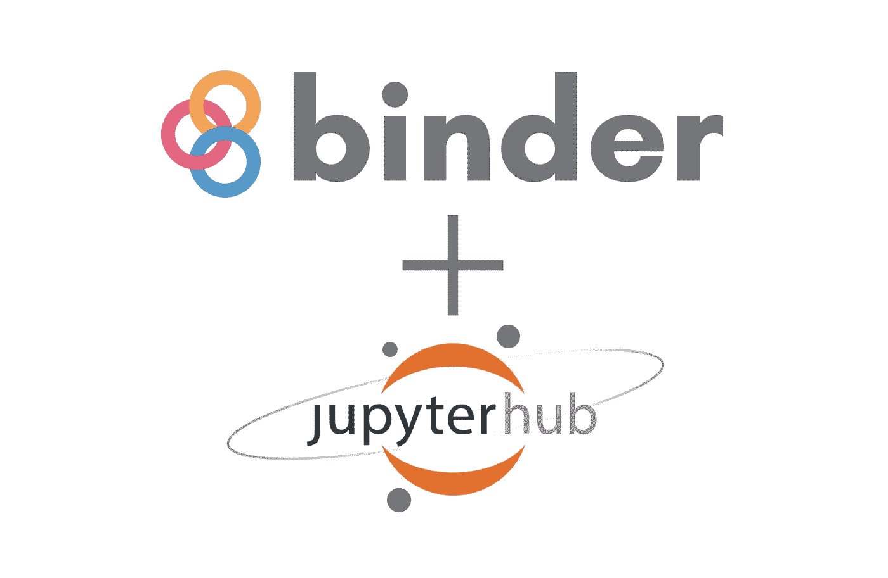](https://mybinder.org/v2/gh/WillKoehrsen/Data-Analysis/asteroids-poisson-stable?filepath=poisson%2Fasteroid-impacts-poisson.ipynb)

Click to launch a Jupyter Notebook on mybinder.org for this article.

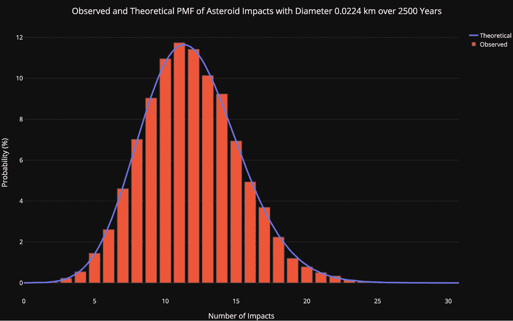

Probability Mass Function of Number of Asteroid Impacts

## 泊松过程和泊松分布基础

我们不会涵盖全部细节([见此处](/the-poisson-distribution-and-poisson-process-explained-4e2cb17d459))，但这些是我们需要的基本信息:泊松过程是一个罕见事件的模型——比如小行星撞击——其中我们知道事件之间的*平均时间*，但任意两个事件之间的*实际时间是随机分布的*(随机)。每个事件都是独立于所有其他事件的，这意味着我们不能使用自上一个事件以来的时间来预测下一个事件将在何时发生。泊松模型是二项式模型的扩展，适用于预期成功次数远少于试验次数的情况。

泊松过程中的每个子区间都是伯努利试验，事件要么发生(成功)，要么不发生。在我们的小行星例子中，事件是小行星撞击，子间隔是一年，所以每年，撞击要么发生，要么不发生(我们假设每年最多一次撞击，并且撞击是独立的)。幸运的是，小行星撞击很少发生，所以与我们将要考虑的年数(试验)相比，成功的总数很低。此外，我们知道撞击的平均间隔时间(我们从数据中获得)，但不知道撞击发生的确切时间。

为了计算在一个时间间隔内发生的大量泊松过程生成事件的概率，我们使用[泊松分布](https://en.wikipedia.org/wiki/Poisson_distribution)和概率质量函数(PMF):

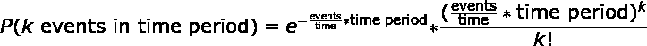

Poisson Probability Mass Function (PMF) Distribution

其中事件/时间是频率，如影响/年。这个公式有些复杂，所以我们将(事件/时间)*时间简化为一个参数， **λ。** Lambda 是分布的速率参数，也是我们定义泊松所需的唯一参数:


Poisson PMF

Lambda 是时间段内事件的预期(最有可能)数量。当我们改变λ时，不同数量的事件的概率改变:

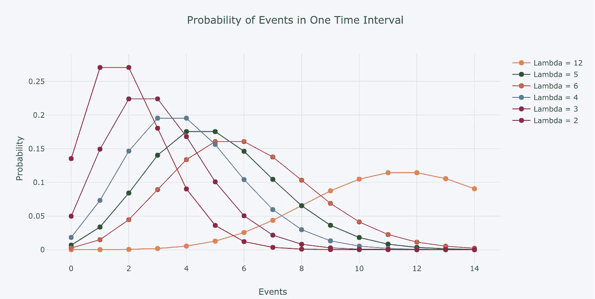

Poisson PMF Distribution with differing values of lambda (rate parameter)

最后，事件之间的时间分布(等待时间)是一个指数衰减。事件之间等待时间超过 t 的概率为:

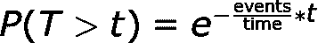

Probability of waiting longer than t in a Poisson process

泊松过程中的等待时间是*无记忆的，*意味着它们彼此不依赖。事件之间的平均等待时间为 1 /频率。泊松分布很容易理解，因为它只需要一个参数，即频率参数，即间隔内事件的预期数量，或频率*时间。

# 小行星撞击数据

为了使用泊松过程和小行星撞击的分布，我们需要的是小行星撞击的平均频率。坏消息是没有足够的数据来精确地确定利率。好消息是，科学家们已经根据我们现有的数据(如近地小行星的数量)和稳健的模拟得出了一些估计。我们将使用近地天体科学定义小组的 [NASA 2017 年报告中的数据，在大量有趣的信息中，这些数据提供了对不同大小的小行星撞击频率的估计。](https://cneos.jpl.nasa.gov/doc/2017_neo_sdt_final_e-version.pdf)

一旦我们加载了数据并清理了列，我们就有了这些数据:

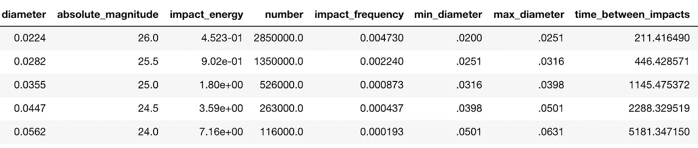

Data from [NASA 2017 NEO SDT](https://cneos.jpl.nasa.gov/doc/2017_neo_sdt_final_e-version.pdf) (5 of the 27 rows)

每一行都是不同大小的小行星(平均`diameter`公里)，关键列是`impact_frequency`。这给出了每年撞击的平均次数，我们可以通过取倒数将其转换成`time_between_impacts`。`impact_frequency`随着体积的增大而减小，因为大的小行星较少(由`number`指定)。

虽然这不是必须的，但我喜欢从数据分析开始，比如按直径查看撞击能量或按直径查看撞击间隔时间:

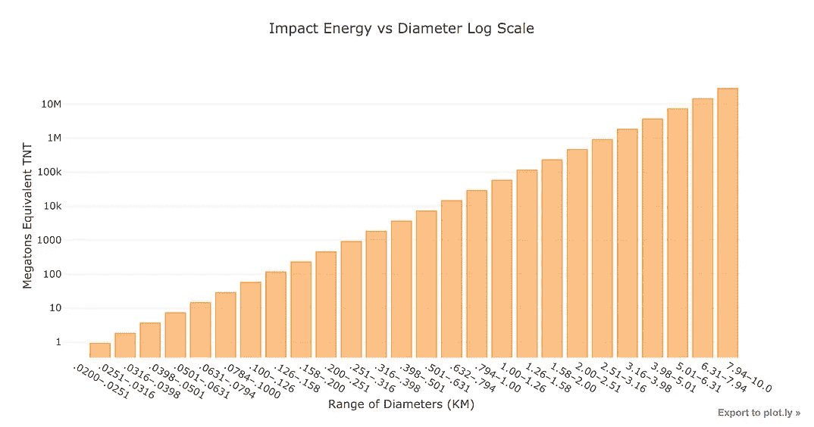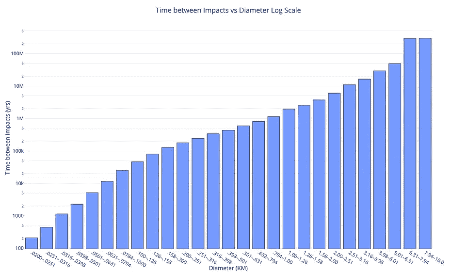

请注意，这两个图都是对数标度，撞击能量以百万吨当量 TNT 表示。作为比较，最大的人体炸弹大约是 100 兆吨，而最大的小行星是 1000 万兆吨(在地球附近只有两个)。从撞击间隔时间图来看，随着小行星的大小增加到撞击间隔超过 1 亿年，撞击的频率迅速降低。

为了探索数据，笔记本中有一个交互式探索工具。

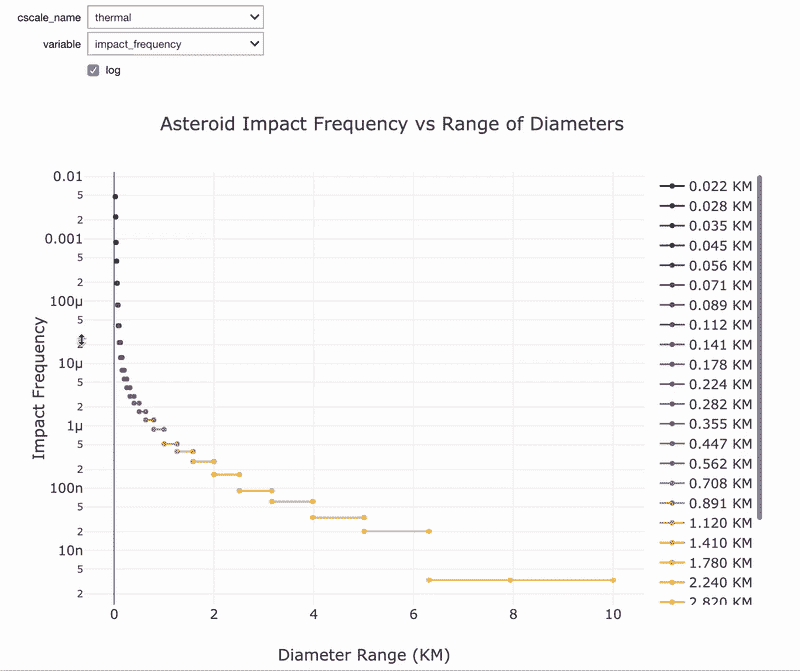

Interactive data exploration tool in notebook.

根据数据探索，我们应该预计来自较大小行星的撞击较少，因为它们的撞击频率较低。如果我们的建模结果与这个结论不一致，那么很可能有问题！

# 模拟小行星撞击

我们的目标是确定每个大小类别中预期影响数量的概率分布，这意味着我们需要一个时间范围。为了保持客观，我们从 100 岁开始，大约是一个人的寿命。这意味着我们的分布将显示人类一生中撞击次数的概率。因为我们使用的是概率模型，所以我们进行了多次试验，然后得出结果的分布，而不是使用一个数字。对于一个大样本，我们将对一个人的一生模拟 10，000 次。

在 Python 中使用`np.random.poisson`函数模拟泊松分布很简单，该函数根据给定速率参数`lam`的泊松分布生成大量事件。为了运行 10，000 次试验，我们将其设置为`size`。下面是运行最小小行星类别撞击频率模拟的代码。

```
# Simulate 1 lifetime 10,000 times
years = 100
trials = 10_000# Extract the first frequency and calculate rate parameter
freq = df['impact_frequency'].iloc[0]
lam = freq * years# Run simulation
impacts = np.random.poisson(lam, size=trials)
```

结果在直方图中最直观:

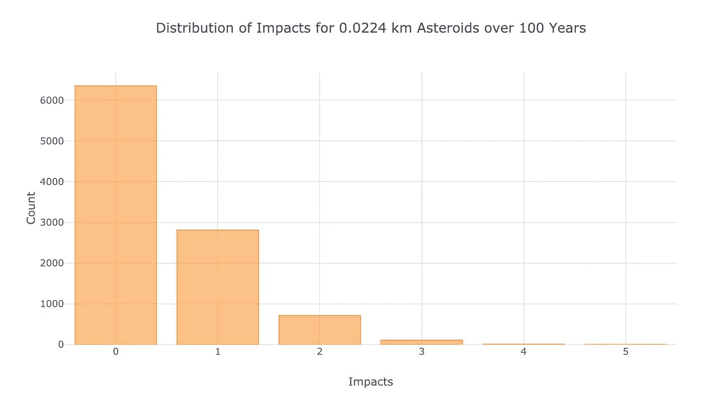

Simulation results showing frequency of each number of impacts

我们看到，在 10，000 次模拟寿命中，最常见的撞击次数是 0。鉴于 rate 参数的值(这是最有可能的结果)，这是意料之中的:

```
print(f'The most likely number of impacts is {lam:.2f}.')**The most likely number of impacts is 0.47.**
```

(由于泊松分布仅在离散数量的事件中定义，我们应该将其四舍五入为最接近的整数)。

为了将模拟结果与理论预期结果进行比较，我们使用泊松概率质量函数和速率参数计算了每次撞击的理论概率:

```
from scipy.special import factorial# Possible number of impacts
n_impacts = np.arange(0, 10, 0.25)# Theoretical probability of each number of impacts
theoretical = np.exp(-lam) * (
               np.power(lam * n_impacts) / factorial(n_impacts))
```

(我们使用分数事件来获得平滑曲线。)

然后，我们将它绘制在条形的顶部(在归一化以获得概率之后):

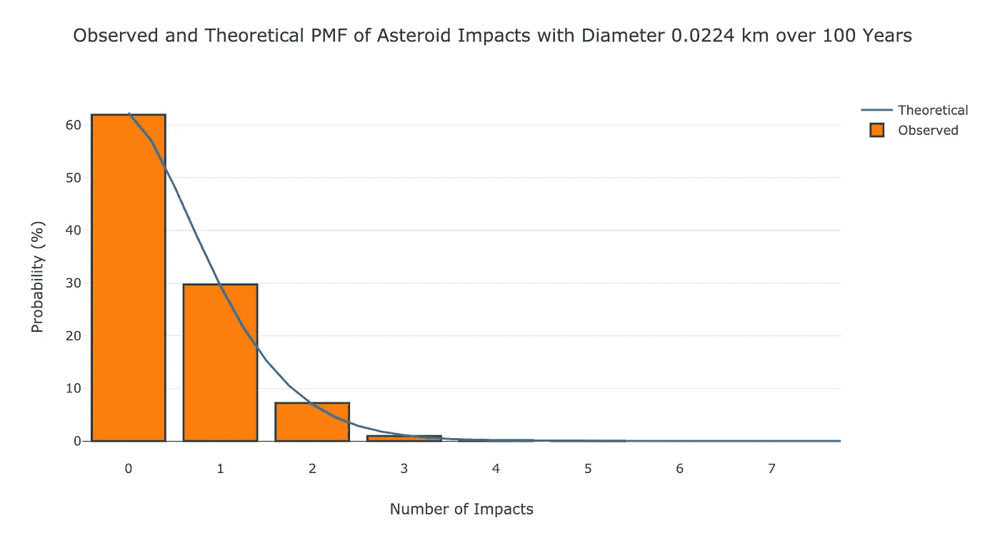

Observed and theoretical number of impacts over 100 years for the smallest asteroids.

当观察到的(在这种情况下是模拟的)结果与理论相符时，感觉真好！我们可以使用相同的`poisson`函数和矢量化`numpy`运算将我们的分析扩展到所有大小的小行星:

```
# Each trial is a human lifetime
trials = 10000
years = 100# Use all sizes of asteroids
lambdas = years * df['impact_frequency'].values
impacts = np.random.poisson(lambdas, size=(10000, len(lambdas)))
impacts.shape**(10000, 27)**
```

这给了我们 27 种大小的小行星中每一种的一万次生命模拟。为了直观显示这些数据，我们将绘制每个尺寸范围的平均冲击次数以及预期冲击次数(速率参数)。

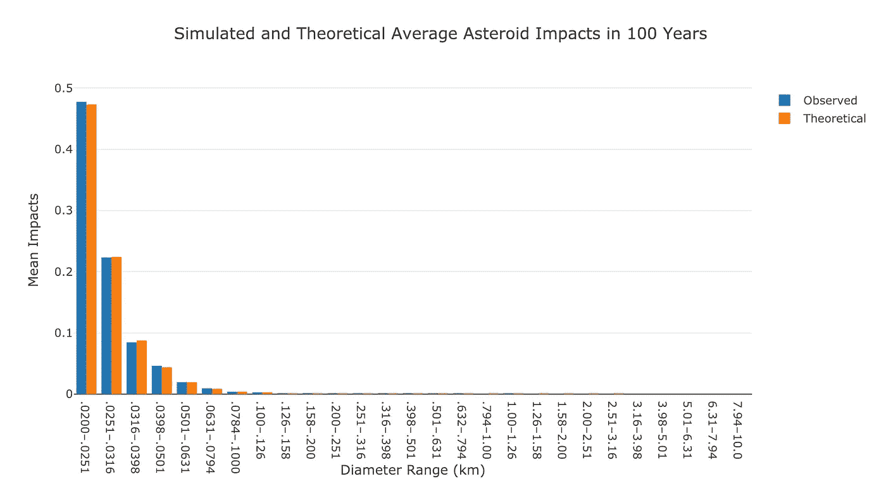

Average observed and theoretical number of impacts for all asteroid sizes.

同样，结果与理论相符。对于大多数小行星来说，一生中观察到一次撞击的机会微乎其微。

对于另一个可视化，我们可以绘制所有小行星大小的泊松 PMF:

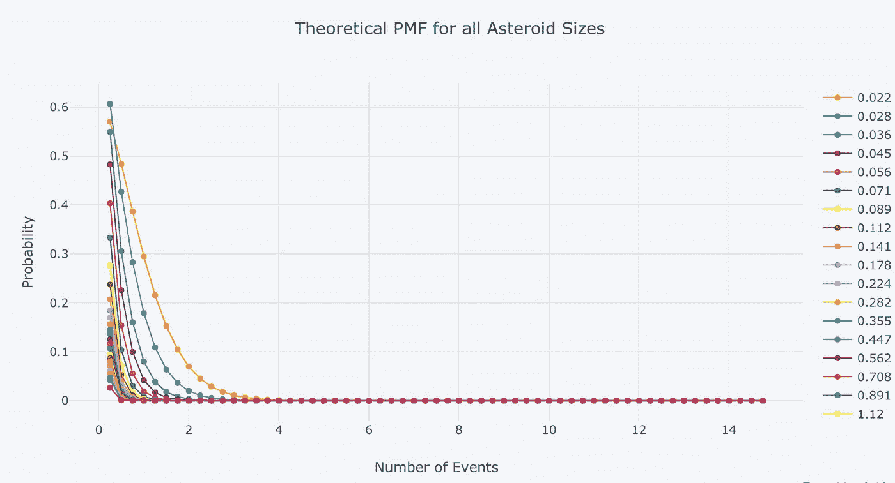

Poisson PMF for all asteroids

在超过 100 年的时间里，最有可能的影响次数是 0。对于我们这些生活在 2013 年的人来说，我们已经经历了一次小行星事件(尽管不是撞击)，当时一颗直径 20 米(0.02 公里，此处使用的单位)的近地小行星[在车里雅宾斯克州上空爆炸](https://en.wikipedia.org/wiki/Chelyabinsk_Oblast)。然而，因为泊松过程的等待时间是无记忆的，所以得出现在看到另一次小行星撞击的可能性较低的结论是错误的，因为最近就有一次。

## 增加模拟长度以获得更多影响

为了看到更多的影响，我们可以在更长的时间内运行模拟。由于[属人(我们的属)](https://en.wikipedia.org/wiki/Homo)已经存在了 200 万年，让我们运行 200 万年的 10000 次模拟，看看小行星撞击的预期次数。我们所要做的就是改变年数，这反过来会影响速率参数。

```
# Simulate 2 million years 10,000 times
years = 2_000_000
trials = 10_000# Run simulation for all asteroid sizes
lambdas = years * df['impact_frequency'].values
impacts = np.random.poisson(lambdas, size=(10000, len(lambdas)))
```

绘制模拟的和理论的平均撞击次数，这次是以对数标度，我们得到以下结果:

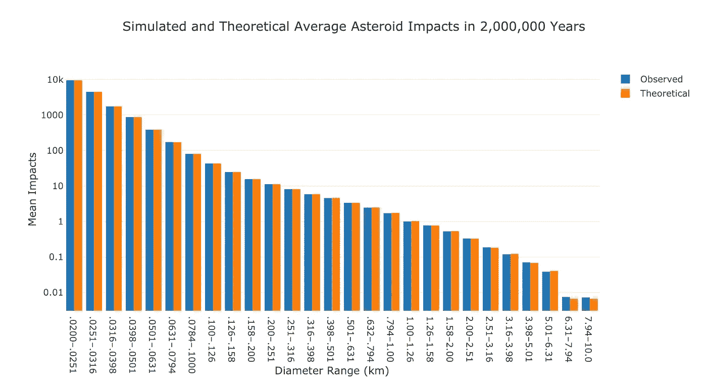

Observed and theoretical asteroid impacts over 2 million years.

现在我们观察到更多的影响，这是有意义的，因为我们正在考虑一个更长的时间段。

超过 200 万年的所有小行星的泊松 PMF 是:

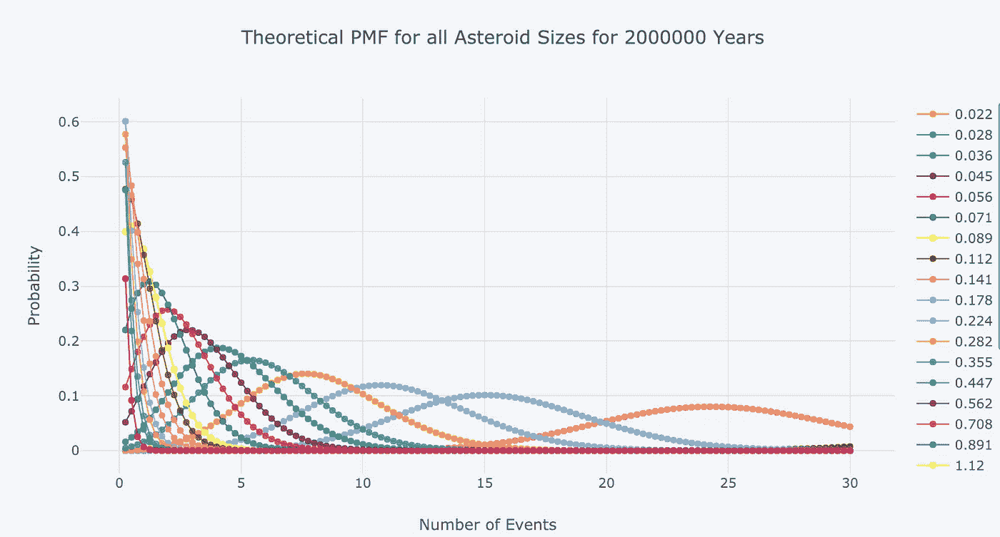

Poisson PMF for all asteroid sizes over 2 million years.

同样，预期(平均)撞击次数将是每个小行星大小的速率参数 **λ** 。

对于长期的模拟，我们确实观察到了较大小行星的撞击。

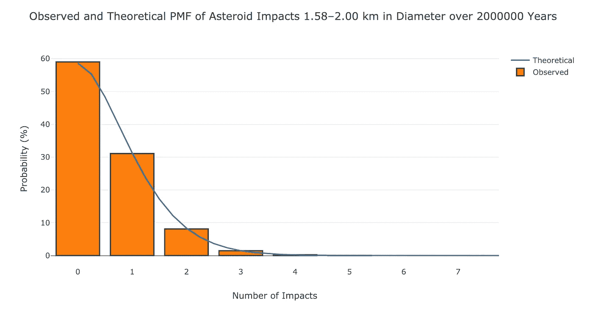

Observed and theoretical impacts for larger asteroids over longer time period

记住，[在俄罗斯上空爆炸的车里雅宾斯克流星直径是 20 米](https://en.wikipedia.org/wiki/Chelyabinsk_meteor)(0.020 公里)。我们正在谈论这张图表中的一些大质量小行星。

# 撞击间隔时间

我们可以使用泊松过程模型的另一种方法是计算事件之间的时间。事件之间的时间超过 t 的概率由以下等式给出:


计算理论值非常简单:

```
# Frequency for smallest asteroids
freq = df['impact_frequency'].iloc[0]# Possible waiting times
waiting_times = np.arange(0, 2500)
p_waiting_times = np.exp(-freq * waiting_times)
```

这种关系遵循指数衰减规律:

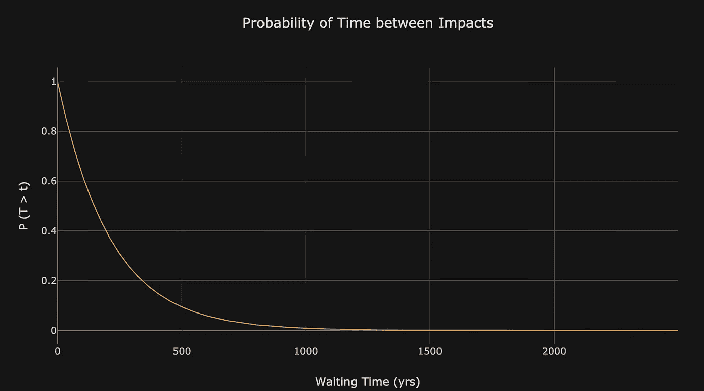

Probability distribution for waiting time between asteroid impacts.

为了使用实际数据模拟等待时间，我们可以将 1 亿年建模为单独的伯努利试验(影响或不影响)。每一年成功的概率只是频率。等待时间就是两次撞击之间的年差(对最小的小行星进行研究):

```
years = 100_000_000# Simulate Bernoulli trials
impacts = np.random.choice([0, 1], size=years, p=[1-freq, freq])# Find time between impacts
wait_times = np.diff(np.where(impacts == 1)[0])
```

将其绘制成直方图，得出以下结果:

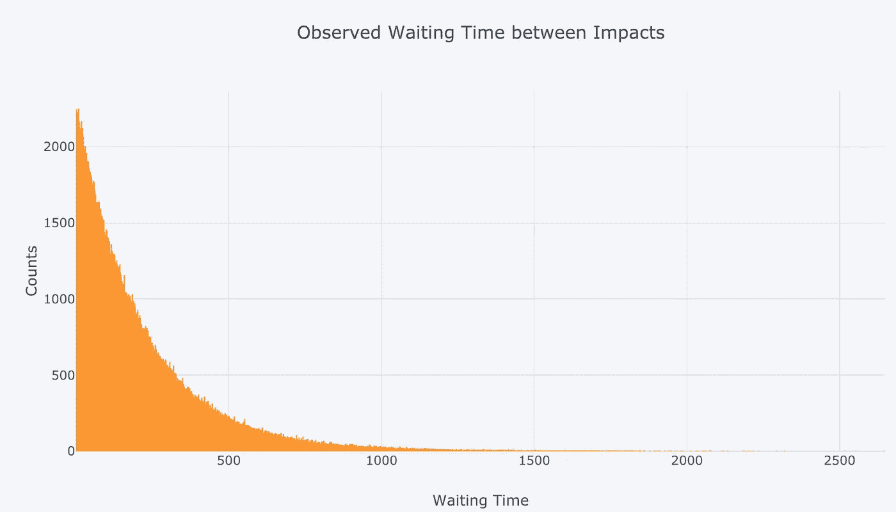

Observed waiting time between asteroid impacts for smallest asteroids.

为了确保观察到的数据与理论相符，我们可以将这两者绘制在彼此之上(归一化和宁滨后):

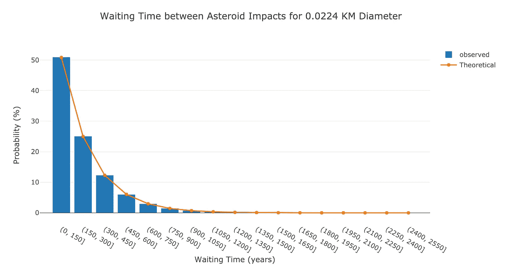

Waiting time observed and theoretical for smallest size of asteroids.

作为最后一幅图，我们可以看看所有小行星大小的平均撞击间隔时间，包括观察到的(模拟的)和理论上的:

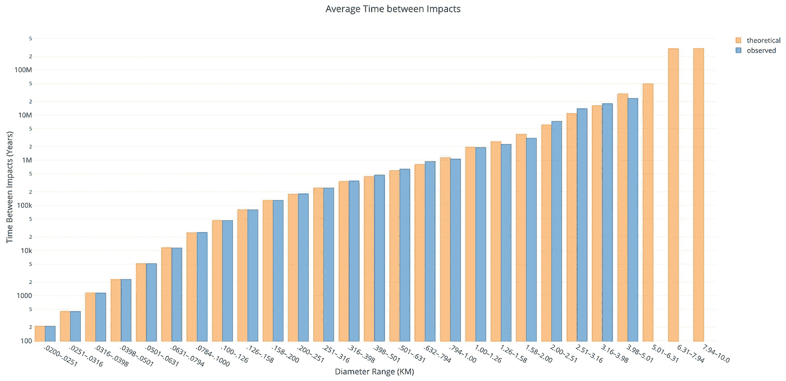

Average observed and theoretical waiting time between impacts for all asteroid sizes.

即使超过 1 亿年，最大的小行星也没有受到撞击(或者只有一颗，这意味着我们无法计算等待时间)。这是有道理的，因为撞击之间的预期时间超过 1 亿年！

## 交互作用分析

笔记本的最后一部分是一个交互式分析，您可以使用参数来观察效果。您可以更改运行模拟的时间长度、要检查的直径以及试验次数。

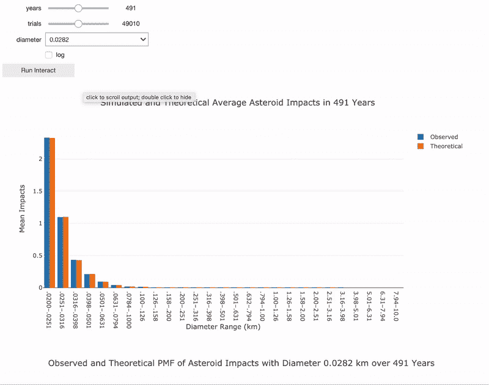

Interactive asteroid impacts analysis in Jupyter Notebook.

我鼓励你亲自进行分析，看看这些参数如何改变结果，方法是到[mybinder.org](https://mybinder.org/v2/gh/WillKoehrsen/Data-Analysis/asteroids-poisson-stable?filepath=poisson%2Fasteroid-impacts-poisson.ipynb)的 Jupyer 笔记本上。

# 结论

在学校的时候，我有过很多次这样的经历:在课堂上，我认为我对一个主题的理解是完整的，但却打开了作业，不知道从哪里开始。这种理论与应用的不匹配在家庭作业中已经够糟糕了，当涉及到现实世界的问题时甚至更糟。直到我大学的最后两年，当我[开始通过](/learn-by-sharing-4461cc93f8c1)做问题来学习时，我应用概念的能力(同样重要的是，我在学习中的快乐)才得到发展。虽然理论仍然很重要(我通常会在看到使用中的概念后再回去研究)，但仅仅通过严格的推导很难掌握一个概念。

> 任何时候你遇到一个你难以理解的话题，寻找真实世界的数据，并开始尝试用这种技术解决问题。在最坏的情况下，你仍然会被卡住(记住寻求帮助是好的)，但在最好的情况下，你会掌握方法，并享受学习过程。

在本文中，我们看到了如何将统计概念(泊松过程模型和泊松分布)应用到现实世界中。虽然小行星可能不会影响我们的日常生活，但这个项目显示了我们可以应用于其他类似问题的方法的潜在用途。由于问题的多样性，数据科学需要不断扩展自己的技能。每当我们学习一项新技术时，我们会变得更有效，如果我们能通过将一个概念应用到新数据中来享受这个过程，那就更好了。

一如既往，我欢迎反馈和建设性的批评。你可以在推特上找到我。