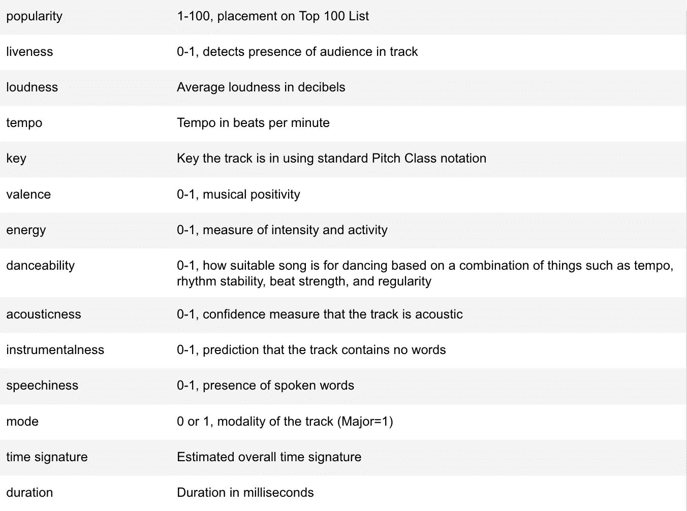
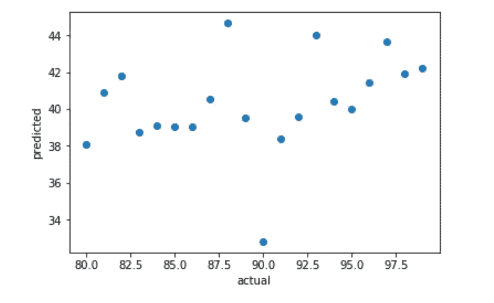
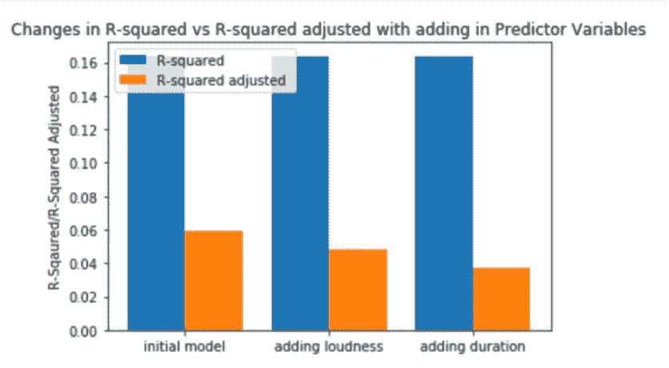
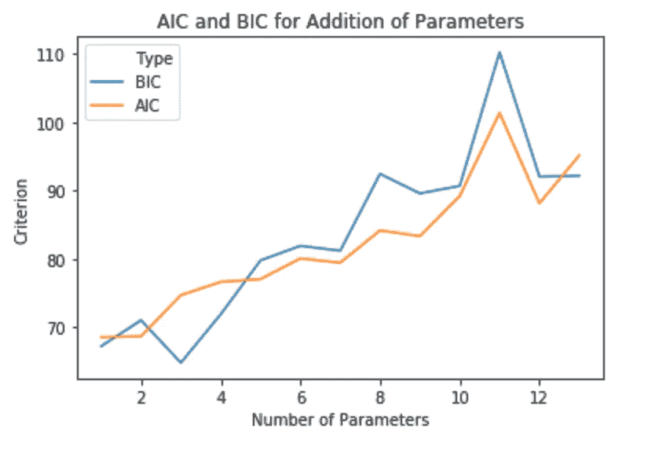
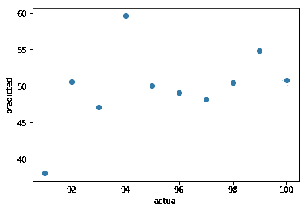
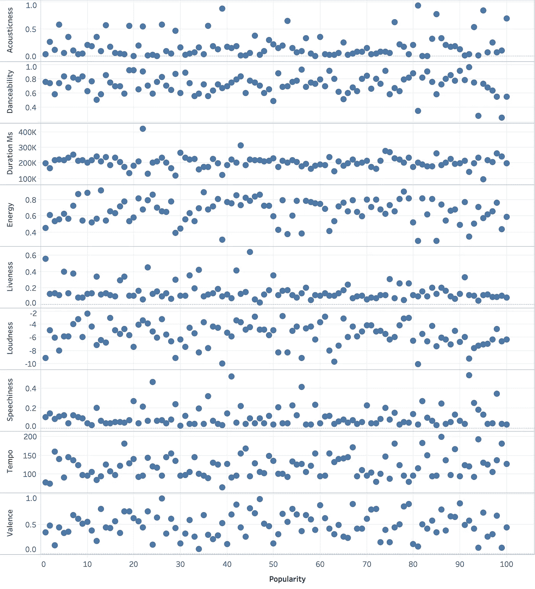

# 预测(音乐的)未来

> 原文：<https://towardsdatascience.com/predicting-the-future-of-music-c2ca274aea9f?source=collection_archive---------23----------------------->

## 利用 Python 和线性回归预测音乐流行度

泰勒·福格蒂，彼得·伍斯特，拉塔·古德尔

在大数据时代，我们在预测方面拥有空前的优势。有了像 Kaggle.com 和 OurWorldinData.org 这样的网站，我们手头有无穷无尽的数据——我们可以用这些数据来预测 2020 年谁会赢得 NCAA 锦标赛，下个月全球会卖出多少鳄梨，或者 10 年后芝加哥的犯罪率。当然这些都还是预测，但是这些预测没有合适的数据是做不出来的。

例如，我们花了一个美丽的夏日进行测试，看看你能否根据一组给定的指标预测一首歌在 Spotify 百强排行榜上的排名。


[https://variety.com/2018/music/news/spotify-reveals-its-top-songs-of-the-summer-1202917332/](https://variety.com/2018/music/news/spotify-reveals-its-top-songs-of-the-summer-1202917332/)

# 目标和数据描述

从 Kaggle.com 的[，我们获得了 2018 年的这份名单，其中包括 13 个变量，如每首歌曲的速度、时长、声学和效价(积极性)以及标识符(艺术家姓名、曲目 id 和艺术家姓名)。出于我们的目的，我们忽略了标识符，以便专注于歌曲的数字质量，因为我们已经知道 Post Malone 发布了这一代最热门的歌曲。**我们的主要目标:找到决定一首歌比另一首歌更受欢迎的最重要因素，这样我们就可以预测一首新歌会有多受欢迎。**为此，我们使用了三种不同的指标来评估不同的线性模型。为了简单起见，我们没有包括高阶项或相互作用项，所以这可能比我们使用的变量更多(剧透:肯定有)。](https://www.kaggle.com/nadintamer/top-spotify-tracks-of-2018/)

**重要提示:**在评估和比较模型时，应该使用所有这 3 个指标。就我们的目的而言，它们被分成“方法”，但是为了最好地评估一个模型的准确性，应该结合使用。



# 方法 1:误差分析

一旦开发出一个模型，下一步就是看它的表现如何。为了衡量模型的成功，数据科学家开发了误差指标来判断预测值和实际值的匹配程度。我们的预期值和预测值之间的差异被称为残差集，本质上是数据与我们用来预测的拟合回归线有多远的度量。虽然我们可以检查每个数据点的残差来衡量模型的有用性，但对于大型数据集来说，这可能特别繁琐。有许多统计数据总结了残差，但我们将坚持使用**均方误差、平均绝对误差、均方根误差和平均绝对百分比误差。**

为了解释这些，让我们来看一下我们的简化模型，它是通过逐步选择过程建立的*:

**人气=响度+活跃度+节奏+关键**

均方差和均方根误差是目前最常用的误差指标。MSE 是残差平方的平均值，通常被称为模型的方差。RMSE 是 MSE 的平方根，或模型的标准差，最适用于比较不同模型之间的差异，因为 RMSE 的单位与目标变量相同。使用 scikit-learn 库可以很容易地找到这两者:

```
mse = mean_squared_error(test_act,predicted)
print(mse) #Mean Square Error
math.sqrt(mse) #Root Mean Square Error
```

该模型的均方误差和 RMSE 分别为 2196.52 和 46.87。这意味着当你记住我们的目标只是从 1 到 100 时，数据是非常分散的。然而，如果你看看下面的残差图，虽然预测的流行度与实际排名相差甚远，但似乎有一个异常值，或者至少是一个意想不到的值。我们应该记住，MSE 和 RMSE 可能会受到异常值的严重影响，因为残差是平方的，并查看其他指标。



我们还可以使用平均绝对误差，它可以更好地解释异常值，因为它采用残差的绝对值，而不是对它们求平方。这也可以通过平均绝对百分比误差来报告，即百分比当量。也可以使用 scikit 找到 MAE 学习起来非常容易:

```
mae = mean_absolute_error(test_act,predicted)
print(mae) #Mean Absolute Error
```

同样，考虑到我们所拥有的数据，这个值 46.42 是很高的，所以我们可以得出结论，在给定这些参数的情况下，该模型很难准确预测一首歌的流行度。然而，我们仍然希望找到一个模型来估计一首歌的受欢迎程度，所以我们将继续使用一些不同的预测方程和一些不同的评估指标。

# 方法二:测定

相反，我们可以通过查看 **R 平方和调整后的 R 平方**值来评估基于确定的模型。前者通常称为决定系数，是模型解释的可变性的百分比，或数据与回归线的拟合程度。目标是使 R 的平方为 1，这意味着模型可以解释 100%的变化，但由于随机误差，这种情况很少发生。大多数统计分析会查看 R 平方值来评估模型的准确性，因此使用 scikit-learn 也很容易找到:

```
model = LinearRegression()
model.fit(X, y)
R = model.score(X, y)
print(R)
```

不幸的是，完整模型的 R 平方并不高，为 0.164。该模型仅解释了 16.4%的变化，这意味着大约 84%的变化来自其他地方，无论是来自我们没有的第 14 个变量，还是来自歌曲的流行程度是随机的。为了更好地理解这个模型有多精确，我们还应该看一下*调整后的* R 平方，它惩罚了一个模型，因为它包含了没有添加到变异解释中的变量。本质上，如果我们有一个非常简化的流行度=节奏的模型，并决定看看是否增加能量，流行度=节奏+能量，并且增加能量并没有使预测更接近，调整后的 R 平方会减少。这一点很重要，因为未调整的 R 平方总是会随着更多参数的增加而增加，但这可能会导致模型过度拟合。我们可以在下面看到这出戏，我们从除了响度和持续时间之外的所有参数的简化模型开始。通过重新加入这些变量，未调整的 R 平方增加很少，但调整后的 R 平方明显减少。



```
model = LinearRegression()
model.fit(X, y)
aR = 1 - (1-model.score(X, y))*(len(y)-1)/(len(y)-X.shape[1]-1)
print(aR)
```

正如你所看到的，调整后的 R 平方比未调整的 T2 低得多，这表明该模型包含了无助于预测的参数。所以，让我们回头看看我们的预测方程:

**人气=速度+基调+活跃度+响度**

```
X = data.iloc[:100,3:16]
y = data.iloc[:100,16:]
X = X[['liveness','loudness','key','tempo']]model = LinearRegression()
model.fit(X, y)
print(str(model.score(X, y))) #R-squared
print(str(1 - (1-model.score(X, y))*(len(y)-1)/(len(y)-X.shape[1]-1))) #adjusted R-squared
```

虽然未调整的 R 平方下降到 13.3%，但调整后的 R 平方增加到 9.6%，这使我们有信心这是一个比完整模型更好的模型。可悲的是，它仍然是一个可怜的模型。我们不能用这个模型准确地做出预测，但这是我们最好的…

# 方法 3:信息标准

现在，假设我们想要比较*这个模型比完整模型好*多少。为此，我们将使用两个指标:**赤池信息标准(AIC)和贝叶斯信息标准(BIC)** 。与误差统计和决定系数相比，这两个评估器的使用频率较低，但在比较模型时非常有用。

AIC 和 BIC 都衡量模型的质量，并解释过度拟合和欠拟合的模型。两者之间的主要区别是 BIC 倾向于简约的模型，惩罚复杂性或添加更多类似于调整后的 R 平方的参数。

```
#function to calculate the Akaike Information Criterion
def AICcalc(X):
  y = X['popularity']
  del X['popularity']
  X_train, X_test, y_train, y_test = train_test_split(X, y, test_size=0.1) #takes training set
  model = LinearRegression()
  model.fit(X_train, y_train) #fits linear regression line to training data
  inter = model.intercept_
  betas = model.coef_
  y_pred = model.predict(X_test) #predicts popularity of test data
  residuals = y_test - y_pred #finds difference between actual popularity and predicted popularity
  K= len(betas)
  n= len(X_test)
  AIC = float(n*math.log(sum(residuals**2)/n) + 2*K) #calculates AIC
  X['popularity'] = popularity
  return AICdef BICcalc(X):
  y = X['popularity']
  del X['popularity']
  X_train, X_test, y_train, y_test = train_test_split(X, y, test_size=0.1)
  model = LinearRegression()
  model.fit(X_train, y_train)
  inter = model.intercept_
  betas = model.coef_
  y_pred = model.predict(X_test)
  residuals = y_test - y_pred
  K= len(betas)
  n= len(X_test)
  BIC = float(K*math.log(n) + n*math.log(sum(residuals**2)/n)) #calculates BIC
  X['popularity'] = popularity
  return BIC
```

对于具有取自数据的随机训练集的完整模型，AIC 和 BIC 分别是 94.446 和 100.373。正如您所猜测的，由于更多参数的惩罚因子，BIC 略高。然而，AIC 和 BIC 经常被报道与*最佳*车型相比较。

为了比较这些模型，我们对每个模型进行了 10，000 次迭代计算，以找出 AIC 和 BIC 的平均值。这一点很重要，因为我们的样本量很小，其值很大程度上取决于为训练集选择的观察值。

```
def find_crit(X):
  rep = 10000
  totalA = 0
  totalB = 0
  for i in range(rep):
    totalA += AICcalc(X)
    totalB += BICcalc(X)
    return [totalA,totalB]
  avgAIC = totalA/rep
  avgBIC = totalB/rep
  return [avgAIC,avgBIC]
```



从图中可以清楚地看到，参数的增加增加了 AIC 和 BIC，但是可能的最佳模型具有 3 个参数(活跃度、响度和速度)。该模型的 AIC 为 78.04，BIC 为 75.97，R 平方为 0.105，调整后的 R 平方为 0.077，平均相对误差为 43.9，均方误差为 1933.7。

```
print(criterion[3:4]) #AIC and BIC for modelX= data.iloc[:100,3:16]
y=data.iloc[:100,16:]
X= X[['liveness','loudness','tempo']]model= LinearRegression()
model.fit(X,y)
print(model.score(X,y)) #R-squared
print(str(1-(1-model.score(X,y))*(len(y)-1)/(len(y)-X.shape[1]-1)))train_exp = X.iloc[:95,:]
train_res = y.iloc[:95,:]
test_exp = X.iloc[95:,:]
test_act = y.iloc[95:,:]matr_exp = MLR(train_exp,train_res, test_exp, test_act)
predicted = matr_exp.fit_pred()mae = mean_absolute_error(test_act,predicted)
print(mae) #Mean Absolute Error
mse = mean_squared_error(test_act,predicted)
print(mse) #Mean Squared Error
```

# 结论

总的来说，我们可以得出结论，使用数据集中的这些变量，我们*无法*准确预测一首歌的受欢迎程度。我们甚至不能真正靠近。即使最好的模型也预测在点 100 的歌曲在点 50 附近上升。



Residual plot for final model



从数据来看，任何变量都没有明显的趋势。这令人惊讶吗？不。音乐流行是一件非常复杂的事情，艺术家的声誉、歌词的含义、流派以及一首歌曲在一年中的发布时间等变量都会影响它的流行程度，而不仅仅是人类对已经在文化上流行的歌曲的快速痴迷。

*逐步选择程序以 0.1 的进入水平和 0.1 的停留水平进行。这些是比大多数程序更高的α水平，但是由于变量通常是弱预测器，标准程序产生了包含零变量的模型，这不是很有帮助。

# 关键词汇:

*   **逐步选择**:特征选择的方法，根据变量在帮助预测响应变量中的重要性来删除和添加变量
*   **残差**:实际响应减去预测响应
*   **参数**:用于预测目标变量的值
*   **过度拟合**:用过多的变量拟合模型，导致模型只适合你训练的数据
*   **欠拟合**:用比所需更少的变量拟合模型，导致模型不适合或预测不佳
*   **均方误差(MSE)** :残差平方的平均值；差异
*   **均方根误差(RMSE)** :以响应变量为单位的 MSE 的平方根，使其在模型之间具有可比性；标准偏差
*   **平均绝对误差(MAE)** :残差绝对值的平均值
*   **平均绝对百分比误差(MAPE)** :以百分比表示的平均误差
*   **R 平方**:又名**决定系数**，模型解释的方差的百分比
*   **调整后的 R 平方**:修改后的 R 平方，对添加无关紧要的参数进行惩罚
*   **赤池信息标准(AIC)** :模型的相对质量，通常报告为与最佳模型的差异
*   **贝叶斯信息标准(BIC)** :修改后的 AIC，对增加参数进行处罚