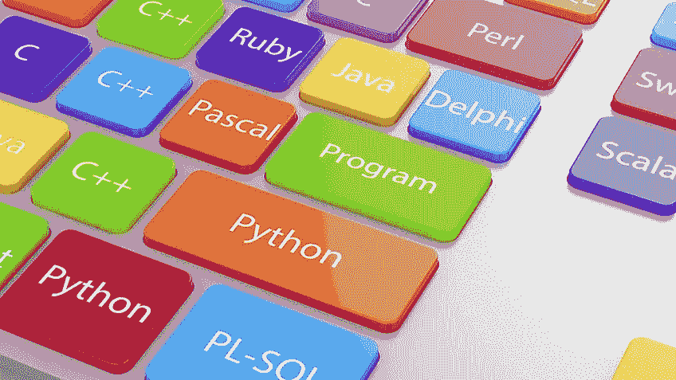
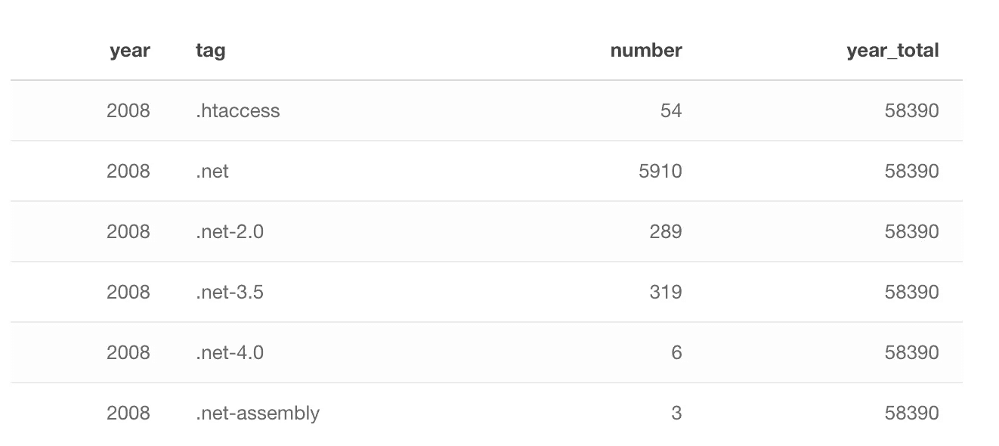
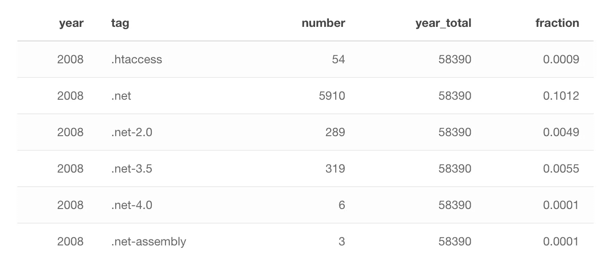
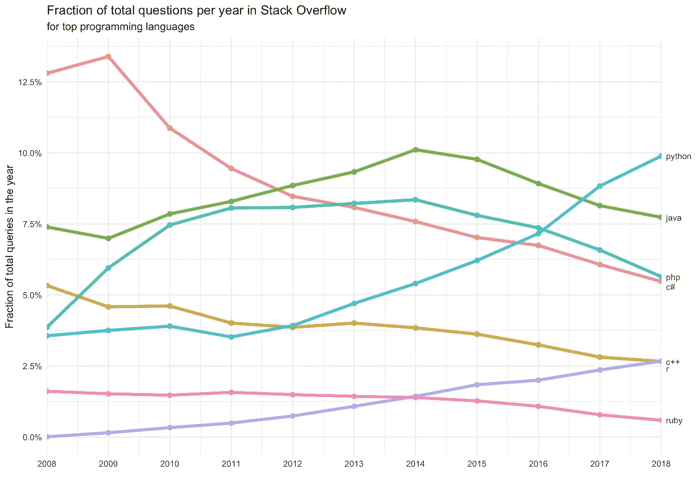
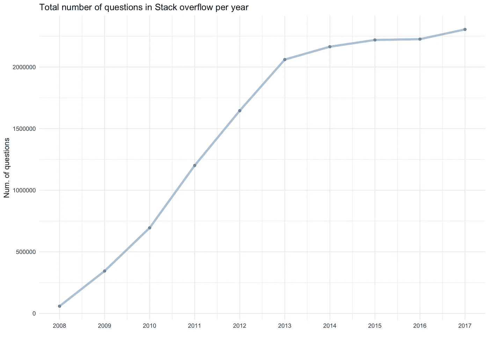
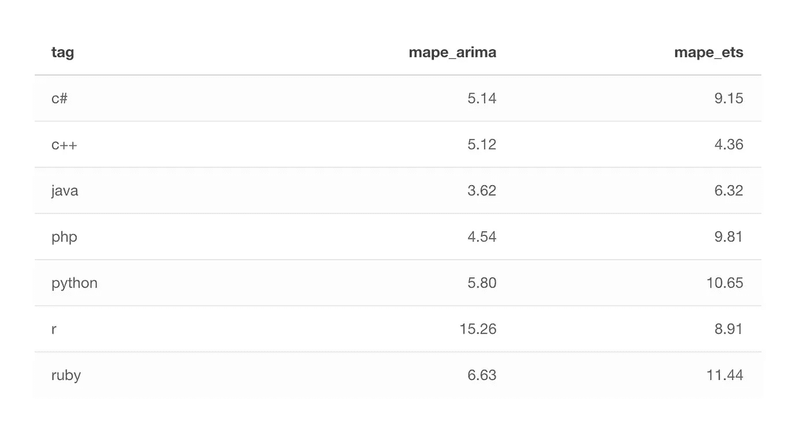
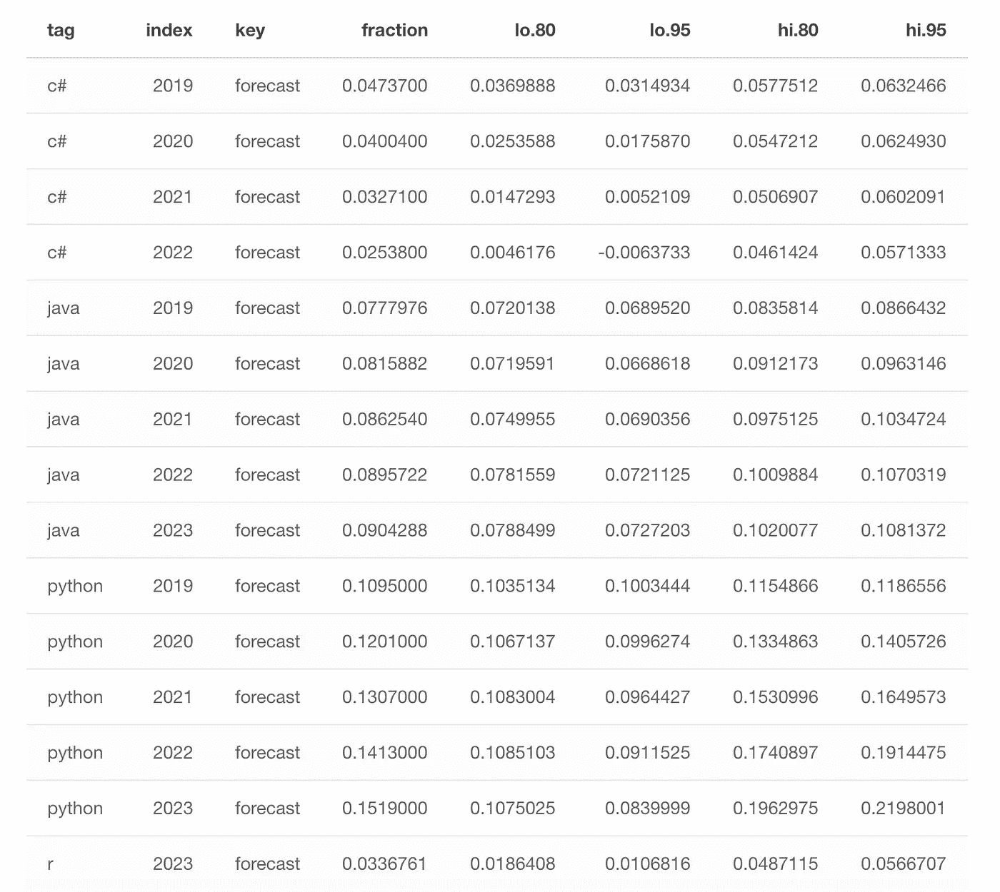
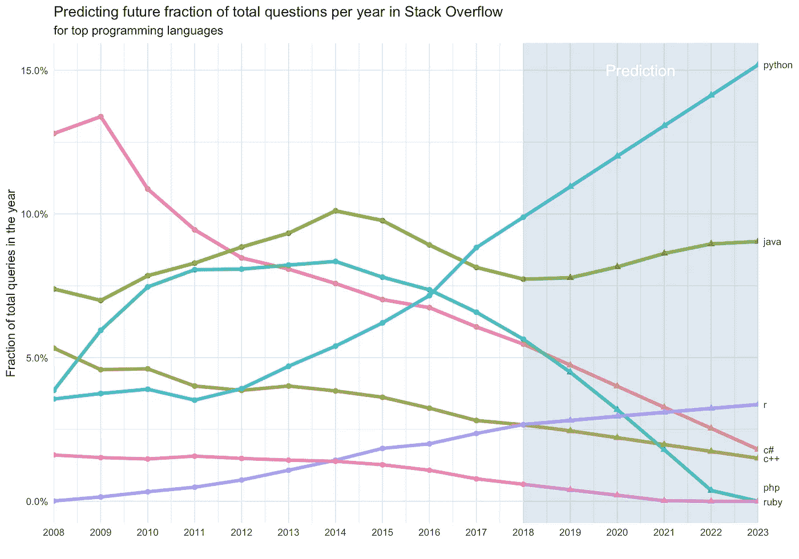

# 预测编程语言的未来流行程度

> 原文：<https://towardsdatascience.com/predicting-the-future-popularity-of-programming-languages-4f28c80bd36f?source=collection_archive---------7----------------------->

堆栈溢出数据用于此分析。数据集是从[堆栈交换数据浏览器](https://data.stackexchange.com/)下载的。处理后的文件也可以在这里下载[。它被](https://gist.github.com/dgrtwo/a30d99baa9b7bfc9f2440b355ddd1f75)[大卫·罗宾逊](https://twitter.com/drob)用于一个[数据营](https://www.datacamp.com/)项目。

每个堆栈溢出问题都有一个标签，标记一个问题来描述它的主题或技术。该数据对每一对标签和年份都有一个观察值，显示了该标签在该年提出的问题数量以及该年提出的问题总数。例如，有 54 个问题是关于。在 2008 年的 58390 个问题中。

我们不使用一年中每个标记问题的数量，而是计算和使用该年中每个标记问题和所有问题的**分数。现在进行比较更方便。**

# 随着时间的推移，流行的编程语言发生了怎样的变化？

看看顶级编程语言的流行程度会很有趣。具体而言，包括以下编程语言:

*   Java 语言（一种计算机语言，尤用于创建网站）
*   Java Script 语言
*   c#
*   c++
*   大蟒
*   服务器端编程语言（Professional Hypertext Preprocessor 的缩写）
*   红宝石
*   r

用于此比较的每个标记问题(在一年的所有问题中)所占的比例。

我们可以看出，一些语言的受欢迎程度在上升，而另一些则在下降。特别是 javaScript、Java、c#、c++、ruby 正在衰落，而 python 和 R(用于分析的语言)正在崛起。虽然这是事实，但我们应该检查问题总数是否在显著增长。

很明显，自 2013 年以来，问题总数没有显著增长。因此，我们可以说，编程语言的趋势可能是显著的，尤其是从 2013 年开始。

# 预测编程语言的未来流行程度

预测编程语言未来的流行程度会很有趣。我将使用[预测包](https://cran.r-project.org/web/packages/forecast/forecast.pdf)来生成预测。特别是，我结合了主要预测方法的力量，**&ARIMA**指数平滑法。特别是对于每个时间序列(每种编程语言)，使用 ARIMA* &指数平滑法**创建 2 个独立的模型，并选择最佳模型进行预测。**选择 MAPE(平均绝对百分误差)**对预测模型进行评估。
— ARIMA(自回归积分移动平均)是一种非常流行的时间序列建模技术。它描述了数据点之间的相关性，并考虑了值的差异。
—指数平滑法包括简单指数平滑法(较大的权重分配给最近的观测值，而不是遥远过去的观测值)、双指数平滑法或霍尔特线性趋势模型(也考虑序列的趋势)和三指数平滑法或 Host 的温特斯法(也考虑时间序列的趋势和季节性)

正如你在上面看到的，应用指数平滑法时，R & C++的预测比 ARIMA 更好。对于其余的编程语言，ARIMA 似乎是最好的方法。

下面是一个表格，其中使用了性能最佳的模型，对未来进行了预测

下面是一个对未来预测的图表

# 摘要

为了比较编程语言的受欢迎程度，我们使用了过去 10 年中每种语言所涉及的全部问题的分数(关于堆栈溢出)。到目前为止，栈溢出是计算机编程中最受欢迎的问题和答案平台。

当然，还有很多其他的指标可以用来衡量受欢迎程度。此外，像所有模型一样，预测模型并不完美，可能会比预测的偏差更大。但是，考虑到所有时间序列的 MAPE 相对较小(不到 9 %)，这些预测应该是编程语言未来受欢迎程度的良好迹象。

总的来说，结果如下:
—分析编程语言 **(Python & R)** 将继续流行
— **Java** 将稍有增长，然后保持持续的流行
— **JavaScript，C# & C++** 将失去显著的流行
— **PHP & Ruby** 可能会失去几乎所有的流行，并在未来 5 年内过时

*最初发表于*[*【https://www.manosantoniou.com】*](https://www.manosantoniou.com/post/predicting-the-future-popularity-of-programming-languages/)*。*