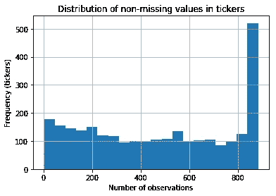
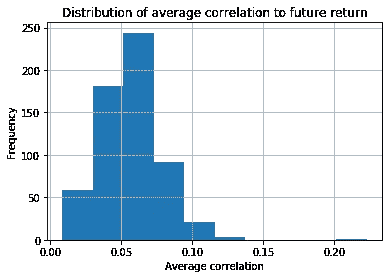
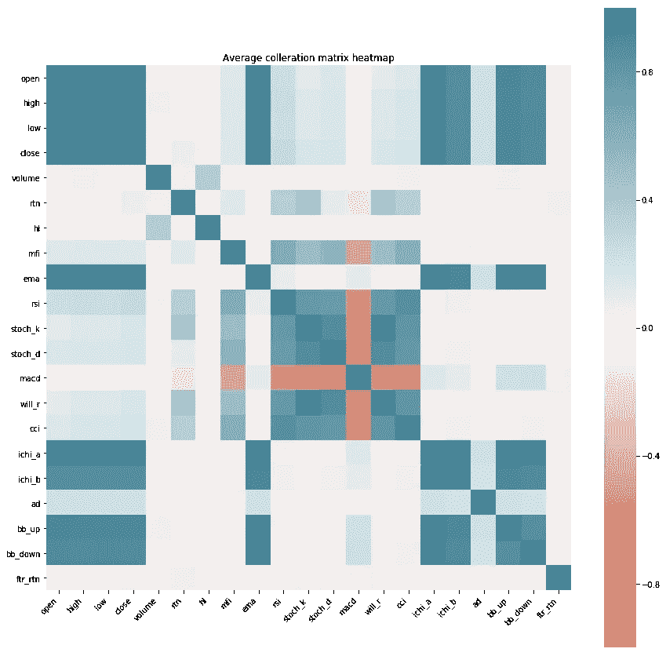
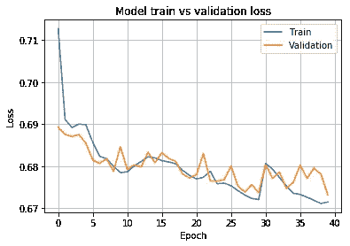
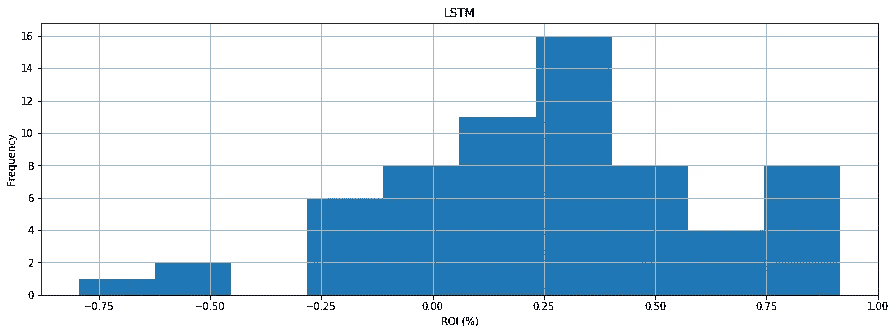

# 使用深度学习对澳大利亚证券交易所(ASX)的股票市场进行预测:使用技术指标和长短期记忆(LSTM)模型

> 原文：<https://towardsdatascience.com/predicting-the-movement-of-stocks-in-the-australian-securities-exchange-asx-fa63b5c059bb?source=collection_archive---------17----------------------->


Photo by [M. B. M.](https://unsplash.com/@m_b_m?utm_source=medium&utm_medium=referral) on [Unsplash](https://unsplash.com?utm_source=medium&utm_medium=referral)

最近，我开始着手建立一个预测模型的任务，该模型预测第二天在*澳大利亚证券交易所* (ASX)的股票价格的变动。我写这篇文章是为了分享我发现一个更可靠的策略的旅程，这个策略基于一个*长期短期记忆* (LSTM)模型，这个模型建立在大约 2.5 年的 ASX*(T7)【EOD】金融市场数据的基础上。Jupyter 笔记本可以从我的资源库[这里](https://github.com/arvindrajan92/asx-financial-time-series-prediction)下载。*

# **1。数据导出**

第一项任务是将 EOD 数据转换成五个独立的时间序列数据帧；o *笔*，h *高*，l *低*，c *输*和*量* (OHLCV)各一个。在每个数据框中，行按日期索引，列按股票代码索引。超过 883 天的观察有 2773 个跑马灯。

接下来，创建了三个额外的数据框架:退货、第二天退货和高/低(这些是在给我的任务中要求的)。这些指标是除 OHLCV 值之外的潜在特征。

# 2.探索性数据分析

## 2.1 假设、动机、方法和策略

截至 2019 年 11 月 22 日，根据 ASX 的网站，目前共有 2195 个独特的报价机上市。然而，数据集有 2773 个独特的跑马灯；这意味着它有已被摘牌公司的股票代码。

在分析覆盖率和质量之前，应该讨论这个任务的假设、范围、动机和策略。

**假设**:

1.  根据研究[1-3]，从特定股票(或公司)的 OHLCV 得出的技术指标模式对其未来走势具有预测能力。
2.  此外，对综合指数有贡献的公司的技术指标，如 ASX 通用指数、S&P/ASX 50 指数等。可以用来预测它们所属的综合指数的走势。

**范围**:这项工作将其范围限制在假设 1，并做了扩展。

**动机**:这项工作扩展了假设 1，使其更加通用:与[1–3]中的假设不同，任何股票价格的未来运动都可以通过技术指标的运动和模式来预测；而同样的从运动和形态的预测可以适用于任何公司的股价。换句话说，机器学习模型可以仅基于技术指标中的内在模式被训练成不可知的。

根据研究[1–4]，数据的时间序列性质建议使用神经网络的 LSTM 范式，该范式已被证明优于集成方法，如随机森林和其他分类技术，如支持向量机。

**策略**:策略是利用过去 60 个(交易)日的 OHLCV 数据和技术指标，建立一个通用的预测模型，从而能够预测任何一家公司的股价走势。请注意，这不包括在 ASX 上市的所有综合指数(因为这属于假设 2)。

为此，将使用训练、验证和测试数据来训练 LSTM 模型，以预测以下指标:*向上*或*向下*第二天股票价格的运动。

## 2.2.覆盖面和质量

现在，让我们首先基于下面的直方图来可视化非缺失值的数量分布。



上面的直方图显示，在收盘价中大约有 196 个报价器没有缺失值。

所有缺失的值都来自当天没有登记的价格。经过与 ASX 官网数据的交叉核对，发现这主要是因为该交易并未在当天发生，公司在 2015-01-02 之后上市，或者公司在 2018-06-29 之前退市。

由于干净的结果是至关重要的，有很多缺失值的 tickers 将被忽略。在这种情况下，只考虑具有超过 800 个非缺失值的报价机。

其次，对于良好的可预测性，重要的是只考虑与标签具有良好相关性的公司，在这种情况下，这是未来的回报运动。此外，由于综合指数不在假设的范围内，它们被删除了——在与 ASX 的网站核对后，它们是没有交易量信息的报价机。



根据上面的直方图，可以观察到很少有与未来回报有相对较好相关性的报价机。为了获得良好的可预测性，只使用具有预测能力的报价机。因此，这里考虑平均相关值大于第 75 百分位的跑马灯；他们有 150 人。

现在，丢失的值被处理。在交易没有发生的当天，有几种方法可以处理缺失值:

1.  将交易量设置为 0，将开盘、盘高、盘低和收盘值设置为前一天的收盘值，并假设当天该股票没有交易。这种方法可能会在体积中引入异常值，从而在数据中引入噪声。
2.  使用前一个和后一个可用值对数据 OHLCV 数据进行插值，以实现平滑过渡。另一种方法是将缺失值填入列的平均值和中值。另一方面，这引入了错误的信息。

这里，采用第一种方法，因为它在理论上更正确。

## 2.3.附加转换

在进行一些可视化和分析之前，先检查一些技术指标。文献中有许多这样的转换[1–3]。Borovkova 等人[1]的工作整合了一些关键技术指标，可用于其他转换。通常，它们可以分为四类:(1)动量；(2)趋势；(3)体积；以及(4)易变性。一些常用的指标是:

1.  资金流动指数
2.  相对强度指数
3.  随机振荡器(%K)
4.  威廉%R
5.  指数移动平均线
6.  移动平均收敛-发散
7.  商品渠道指数
8.  市目指示器
9.  积累/分配指数
10.  布林线

所有的转换都是使用开源 Python 包完成的[5]。

## 2.4.数据分析

在执行一些数据分析之前，数据被分为训练集、验证集和测试集，如下所示:

1.  火车:2015 年 2 月 1 日至 2017 年 6 月 30 日
2.  验证:2017 年 7 月 1 日至 2017 年 12 月 31 日
3.  测试时间:2018 年 1 月 1 日至 2018 年 6 月 29 日

首先，所有数据帧之间的相关性，或者换句话说，特征之间的相关性被可视化。因为在一个数据帧中有许多分笔成交点，所以很难可视化所有分笔成交点的相关矩阵。因此，在这里，取平均相关值，并使用热图可视化相关。



除了相关矩阵热图之外，还绘制了数据的直方图来寻找异常值。在此之前，每个跑马灯的数据都从 0 到 1 进行了规范化，以便可以对它们进行可视化和适当的基准测试。


从上述相关热图和直方图中观察到的情况可总结如下:

1.  开盘价、最高价、最低价和收盘价彼此高度相关。这是意料之中的，因为这些值彼此非常接近。由于技术指标是使用这些值计算的，并且本质上保留了其信息，因此可以从特征列表中删除开盘价、盘高和盘低值。
2.  除了 h/l 和体积之外，上面的大多数分布要么是正态的，要么是均匀的。这表明这两个特征中会有大量的异常值。虽然具有正态分布的其他特征在尾部可能有异常值，但是它们可以被认为是可以忽略的。此外，观察相关矩阵，它们似乎与未来回报的相关性较低，这是我们将要预测的指标。因此，将 h/l 和 volume 从特性列表中删除是合理的。
3.  同样，根据关联矩阵热图，一些值似乎与未来回报没有太大关联。它们是资金流动指数和积累/分配指数。为了保持预测模型简单，这些特征也可以被认为是无用的。
4.  最后，随机振荡指标似乎与 William %R 高度相关。这是意料之中的，因为两个指标的数学表达式是相似的。在这里，威廉%R 将从功能列表中删除。

基于上面的讨论，最终的特征列表将是:收盘，回报，指数移动平均线，相对强度指数，随机振荡器，移动平均线收敛-发散，商品通道指数，Ichimoku 指标，上下布林线。

如前所述，策略是预测股票的涨跌。根据经验，与预测未来回报的(正或负)百分比变化相比，这是一个更好的策略，因为基于标签的业绩指标可能会产生误导。例如，建立了一个模型，使得均方误差最小化，这仍然不意味着运动的方向是正确的。如果实际移动是 0.1%，那么基于 0.5%预测的投资比-0.1%预测更好，尽管前者具有相对更高的误差值。

注册标签的另一个数据帧是用 1 和 0 创建的:1 表示向上，0 表示向下；并且绘制出值的分布。


根据上述分析，下降趋势似乎多于上升趋势。因此，在发送用于机器学习的数据之前，需要进行一些平衡。

# 3.预测

## 3.1.长短期记忆(LSTM)模型

***预处理*** :基于上一节的分析，本节建立 LSTM 神经网络模型，用于次日股价时刻的预测；不管是向上还是向下。

训练集和验证集将在 LSTM 网络训练中使用，而测试集将用于交易策略实施和最终模型的附加测试。

接下来，对数据进行预处理。使用 MinMaxScaler 将数据归一化为 0 到 1 之间的值。注意，最大值和最小值是针对每个列车数据帧中的每个跑马灯的。

然后，对数据进行缩放，使其具有平均值 0 和单位方差。这种缩放是通过使用整个标准化训练数据帧的数据来训练标准缩放器来完成的。这将用于转换训练集、验证集和测试集。

接下来，数据被排序。过去 60 天的数据按顺序用于所有训练、验证和测试数据集的第二天预测。

一旦测序完成，数据就平衡了。这是为了确保 LSTM 模型不偏向于下降趋势，正如之前在数据分析中观察到的那样。

***构建和训练 LSTM 模型*** :使用 64 个批次大小和 40 个历元的 LSTM 模型被编译(使用 Tensorflow 中的 Keras)。该模型的摘要如下:

```
Layer (type)                 Output Shape              Param #   
=================================================================
lstm_3 (LSTM)                (None, 60, 128)           72192     
_________________________________________________________________
dropout_4 (Dropout)          (None, 60, 128)           0         
_________________________________________________________________
batch_normalization_3 (Batch (None, 60, 128)           512       
_________________________________________________________________
lstm_4 (LSTM)                (None, 60, 128)           131584    
_________________________________________________________________
dropout_5 (Dropout)          (None, 60, 128)           0         
_________________________________________________________________
batch_normalization_4 (Batch (None, 60, 128)           512       
_________________________________________________________________
lstm_5 (LSTM)                (None, 128)               131584    
_________________________________________________________________
dropout_6 (Dropout)          (None, 128)               0         
_________________________________________________________________
batch_normalization_5 (Batch (None, 128)               512       
_________________________________________________________________
dense_2 (Dense)              (None, 32)                4128      
_________________________________________________________________
dropout_7 (Dropout)          (None, 32)                0         
_________________________________________________________________
dense_3 (Dense)              (None, 2)                 66        
=================================================================
Total params: 341,090
Trainable params: 340,322
Non-trainable params: 768
_________________________________________________________________
```

本质上，LSTM 模型将具有 3 个 LSTM 层和激活的密集层，最后是具有 softmax 激活函数的密集输出层，因为这是一个分类问题。softmax 激活函数将输出分类的概率。

为了避免过度拟合，增加了漏失层。作为额外的措施，如果认为有必要，也可以添加正则化，使得在训练期间优化的权重不会变得太大。然而，在这种情况下，它们是不必要的。

称为 Adam 的自适应一阶基于梯度的优化用于优化模型。另一个著名的优化器是被称为 SGD 的随机梯度下降。由于这是一个分类问题，使用稀疏分类交叉熵和损失函数计算的准确度被用作性能度量。

上面指定的所有指标都是该模型的超参数。可以使用批次大小、时期、单位值和优化方法的网格进行超参数搜索，但是由于硬件限制，仅使用这些初始超参数。

***分析模型性能*** :优化后的损失函数历史如下图所示。从该图中，我们可以看到来自训练和验证数据的损失函数被最小化，并且它们彼此非常接近。这表明模型没有过度拟合或拟合不足。然而，可以做出的一个改进是调整学习速率，使得跳跃更小。



下面的准确度图还显示了基于训练集和验证集的 LSTM 模型的改进。


还生成了基于测试数据集的精度，以及基于模型在训练期间从未见过的 2018 年数据的分类报告，如下所示。

```
Test loss: 0.6752472768227259
Test accuracy: 0.5605208333333334

Classification report:
             precision    recall  f1-score   support

        0.0       0.72      0.50      0.59      6038
        1.0       0.44      0.66      0.53      3562

avg / total       0.61      0.56      0.57      9600
```

基于测试集的准确度分数显示，结果与研究[4]一致，其中测试集的准确度低于训练和验证集的准确度。与下降趋势相比，上升趋势的预测精度较低，这意味着在预测上升趋势时会有更多的假阳性。通常，召回分数与精确度成反比。因此，最好的衡量标准是 f1 分数，这对于制定交易策略来说是可以接受的。

***交易策略*** :这里定义了一个简单的交易策略。在使用的所有 150 个报价机中，基于 LSTM 网络的预测运动，使用每个报价机 1 澳元建立头寸，并在第二天平仓。这意味着每天投资 150 澳元，第二天平仓。

请注意，由于 LSTM 网络需要过去 60 天的数据，因此交易是从 2018 年 3 月 27 日模拟的。将绘制累计*损益* (PnL)图。


按照简单的策略，基于 64 天的交易和每天 150 澳元的投资，总利润约为 25 澳元。平均而言，这是 0.26%的每日投资回报率(ROI)。下图显示了基于 64 天回溯测试数据的 ROI 值分布。基于直方图，80%的信心，LSTM 模型将提供一个积极的每日投资回报率。



考虑到累积 PnL 的置信区间和线性趋势，这可以认为是一个 ***成功的策略*** 。

# 结论

澳大利亚证券交易所 (ASX)的所有公司的历史数据被给出，用于预测证券第二天的运动，并随后通过仅使用 2773 只股票的 883 天的当天结束信息来提出交易策略。

首先对数据进行提取、分析、清理和特征设计。随后，为具有良好可预测性的证券建立了一个*长短期记忆* (LSTM)网络模型。

结果表明，LSTM 模型为 150 家澳大利亚公司股票价格的成功交易策略提供了合理的准确度，具有良好的预测性。此外，结果显示，在 80%的置信度下，基于测试数据，LSTM 模型提供了正的每日投资回报。

# 未来的改进

基于这种尝试，可以进行一些改进来进一步提高预测或交易性能。它们是:

1.  *更精细的分类*。货币运动的标签可以分为三类。例如，在当前版本中，未来回报率为 0.00 的股票被归类为 0，这是一种向下的变动。也许它们可以被分为-1，0 和 1，并根据这些类别建立交易策略。
2.  *尝试解决假设 2* 。第二个假设是综合指数依赖于它的成分证券。因此，这些证券可以用来预测综合指数的走势。
3.  *使用 LSTM 模型的概率*。来自 LSTM 模型的 softmax 激活函数实际上输出了类别的概率。需要进一步调查以将可能性纳入交易策略。
4.  *使用卷积神经网络*。研究[6–7]和[4]分别表明，使用 CNN 和 CNN-LSTM 混合方法可以提高预测精度。这可能是一个有趣的改进。
5.  *超参数搜索*。随着计算能力的提高，可以部署超参数搜索来找到 LSTM 和模型的最佳参数。
6.  *新闻数据*。其他类型的数据，如与证券相关的新闻，可以作为特征之一添加，如研究所示[2，8]。例如，[2]表明添加新闻信息(例如，情感)可以将预测准确度提高 10% (~58%到~70%)。

# 参考

[1] Borovkova S，Tsiamas I .一个用于高频股票市场分类的 LSTM 神经网络集成。预测杂志。2019;1–20.https://doi.org/10.1002/for.2585

[2]翟 Y，许 A，哈尔格木格 SK .在每日股价趋势预测中结合新闻和技术指标。计算机科学讲义。2007;[https://link . springer . com/chapter/10.1007/978-3-540-72395-0 _ 132](https://link.springer.com/chapter/10.1007/978-3-540-72395-0_132)

[3]赫加齐 O，索利曼 OS，萨拉姆 MA。股票市场预测的机器学习模型。国际计算机科学与电信杂志。2013;17–23.[https://www.ijcst.org/Volume4/Issue12/p4_4_12.pdf](https://www.ijcst.org/Volume4/Issue12/p4_4_12.pdf)

[4]巴尔加斯先生、多斯安茹斯·CEM、比沙拉·GLG、埃夫苏科夫股份公司。使用技术指标和金融新闻文章进行股市预测的深度学习。2018;[https://doi.org/10.1109/IJCNN.2018.8489208](https://doi.org/10.1109/IJCNN.2018.8489208)

[5]帕迪亚尔·DL。Python 中的技术分析库。2019;[https://github.com/bukosabino/ta](https://github.com/bukosabino/ta)

[6]塞尔温 S，维纳雅库马尔 R，戈帕拉克里什南 E.A，梅农 VK，索曼 K.P .利用 LSTM，RNN 和 CNN 的股票价格预测-滑动窗口模型。2017 年国际计算、通信和信息学进展会议(ICACCI)。2017;[https://doi.org/10.1109/ICACCI.2017.8126078](https://doi.org/10.1109/ICACCI.2017.8126078)

[7]陈，何.利用卷积神经网络进行股票预测.IOP 会议系列:材料科学与工程。2018;[https://doi.org/10.1088/1757-899X/435/1/012026](https://doi.org/10.1088/1757-899X/435/1/012026)

[8]翁 B，陆 L，王 X，Megahed FM，Martinez W .使用集合方法和在线数据源预测短期股票价格。专家系统及其应用。2018;[https://doi.org/10.1016/j.eswa.2018.06.016](https://doi.org/10.1016/j.eswa.2018.06.016)