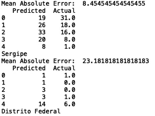

# 使用随机森林预测亚马逊雨林的野火数量

> 原文：<https://towardsdatascience.com/predicting-the-number-of-wildfires-in-the-amazon-rainforest-using-random-forests-6a6680606801?source=collection_archive---------28----------------------->


Photo by [Pixabay](https://www.pexels.com/@pixabay) on [Pexels](https://www.pexels.com/photo/ash-blaze-burn-burning-266487/)

[之前](https://medium.com/@spierre91/analyzing-amazon-wildfire-data-a4f9122a8877)，我们分析了巴西野火数据集。我们查看了数据集的特征，例如每个州野火的平均数量、每个州野火数量的标准偏差以及所有州野火数量的分布。我们还观察了每个州在特定月份的野火数量与全年的对比。

在这篇文章中，我们将建立一个机器学习模型，我们将使用它来预测任何给定年份一个州的野火数量。

构建我们的机器学习模型的工作流程如下:

1.  数据准备和清理
2.  功能选择和工程
3.  型号选择
4.  模型调整和测试

幸运的是，巴西数据集是结构化的，经过清理和标记的，因此我们基本上完成了第一步(在许多情况下，您将不得不处理非结构化和未标记的数据，这印证了一句谚语“数据科学家花费 80%的时间来寻找、清理和结构化数据”)。

现在让我们建立这个模型！

我们需要做的第一件事是导入必要的 python 包:

```
import numpy as np
import pandas as pd
from sklearn.metrics import mean_absolute_error
from sklearn.ensemble import RandomForestRegressor
```

接下来我们可以写一个函数来初始化我们的数据。您可以自由选择如何预处理数据。对于这个例子，我们将保持简单，说我们根据感兴趣的特定状态初始化数据。我们还设计了一个月类别功能，我们将在我们的模型中包括:

```
def initialize_data(state):
    df = pd.read_csv("amazon.csv",  encoding = "ISO-8859-1")
    df['month_cat'] = df['month'].astype('category')
    df['month_cat'] = df['month_cat'].cat.codes    
    df = df[df['state'] == state]
    return df
```

接下来，我们定义一个函数，该函数允许我们分割数据用于训练和测试:

```
def train_test_split(year, df):    
    df_train = df[df['year'] < year]
    df_test = df[df['year'] == year]
    X_train  = np.array(df_train[['year', 'month_cat']])
    y_train  = np.array(df_train['number'])
    X_test  = np.array(df_test[['year', 'month_cat']])
    y_test  = np.array(df_test['number'])    
    return X_train, X_test, y_train, y_test
```

函数“train_test_split”使用“year”来拆分模型训练和测试的数据。例如，如果“year”= 2015，则训练集被定义为 2015 年之前的所有 wildfire 数据，测试集被定义为 2015 年期间的所有 wildfire 数据。接下来，我们定义特征和目标变量，其中特征是年份和月份类别，输出是野火的数量。

我们现在定义一个函数，它指定随机森林算法的模型参数。该函数可用于在测试过程中优化模型参数，从而将误差降至最低。我们通过改变 N_ESTIMATORS 和 MAX_DEPTH 值来做到这一点，直到我们最小化误差度量。这个过程称为超参数调整:

```
def model_tuning(N_ESTIMATORS, MAX_DEPTH):
    model = RandomForestRegressor(n_estimators = N_ESTIMATORS, max_depth = MAX_DEPTH, random_state = 42)
    return model
```

我们接下来要做的是定义一个函数，使模型符合训练数据，并预测野火的数量:

```
def predict_fire(model, X_train, X_test, y_train, y_test):
    model.fit(X_train, y_train)
    y_pred = model.predict(X_test).astype(int)
    mae = mean_absolute_error(y_pred, y_test)
    print("Mean Absolute Error: ", mae)   
    df_results = pd.DataFrame({'Predicted': y_pred, 'Actual': y_test})
    print(df_results.head())
```

最后，我们定义一个“主”函数，用不同的输入值来测试模型。下面，我们对“初始化数据”、“模型调整”和“预测火灾”函数进行了两次调用。我们对 2017 年的“Sergipe”和“Distrito Federal”州进行预测，并计算平均绝对误差(MAE):

```
def main():
    df = initialize_data('Sergipe')
    X_train, X_test, y_train, y_test = train_test_split(2017, df)
    model = model_tuning(50, 50)
    predict_fire(model, X_train, X_test, y_train, y_test)

    df = initialize_data('Distrito Federal')
    X_train, X_test, y_train, y_test = train_test_split(2017, df)
    model = model_tuning(50, 50)
    predict_fire(model, X_train, X_test, y_train, y_test)if __name__ == "__main__":     
    main()
```

输出是:



我们还可以分析模型在所有状态下的性能，如下所示:

```
def main():
    df = pd.read_csv("amazon.csv",  encoding = "ISO-8859-1")
    for i in list(set(df['state'].values)):   
        df = initialize_data(i)
        X_train, X_test, y_train, y_test = train_test_split(2017, df)
        model = model_tuning(50, 50)
        predict_fire(model, X_train, X_test, y_train, y_test)  
        print(i)if __name__ == "__main__":     
    main()
```

这将输出每个状态的预测值、实际值、状态名称和 MAE 值。可以通过超参数调整、尝试其他基于树的方法(XGBoost、lightgbm、catboost)和尝试神经网络时间序列模型( [LSTM](https://machinelearningmastery.com/how-to-develop-lstm-models-for-time-series-forecasting/) 、 [RNN](https://machinelearningmastery.com/how-to-develop-lstm-models-for-time-series-forecasting/) 、 [CNN](https://machinelearningmastery.com/how-to-develop-lstm-models-for-time-series-forecasting/) 、 [WaveNet CNN](https://jeddy92.github.io/JEddy92.github.io/ts_seq2seq_conv/) )来改进模型。我鼓励你尝试一下这个模型，看看随机森林的 MAE 有多低。然后尝试应用我建议的一些其他方法，看看你是否在准确性上有所提高。所有的代码都可以在 GitHub 上找到。祝好运，机器学习快乐！